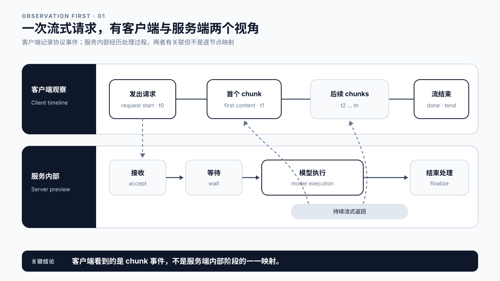
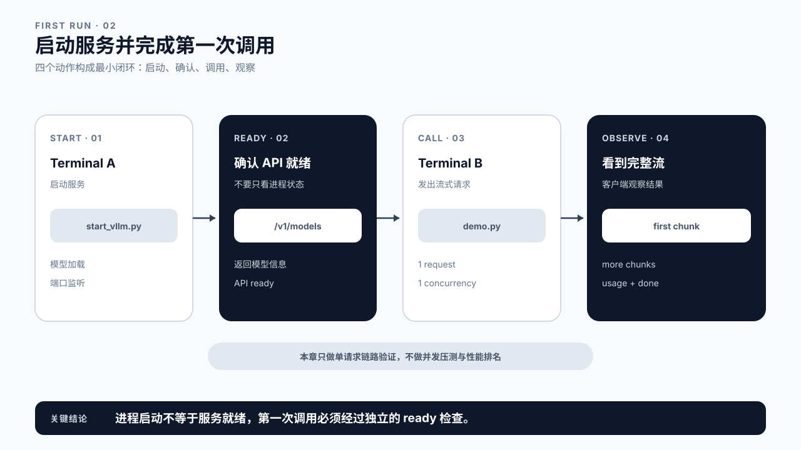
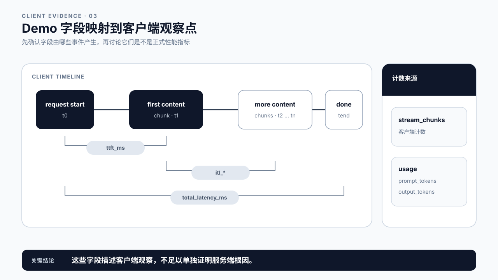
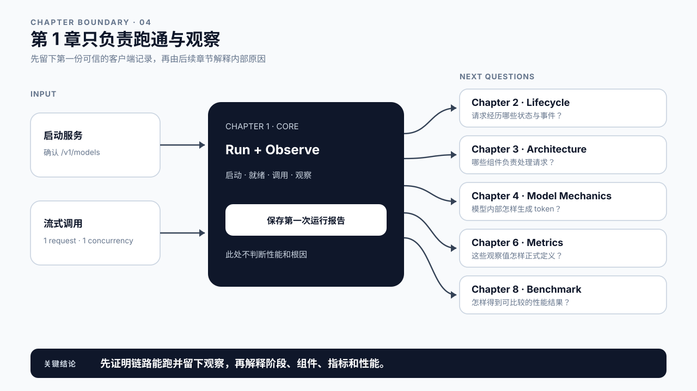

# 第 1 章 第一个 LLM 服务：先跑起来，再观察

## 学习目标

学完本章后，你应该能够：

- 启动一个最小的 OpenAI-compatible LLM 服务，并确认模型已经可以接受请求。
- 发出一次流式 Chat Completions 请求，看到首个内容 chunk、后续 chunks 和结束信号。
- 说清客户端直接观察到了什么，哪些服务端细节还不能从一次请求中判断。
- 保存一次运行报告，为后续生命周期、指标和 Benchmark 章节准备输入。

这是全书的起点，也是一次动手实验。我们暂时不拆 Gateway、Scheduler 和 Worker，不解释 Prefill、Decode 与 KV Cache 的内部机制，也不判断某个毫秒数究竟好不好。第 1 章只完成一件事：把服务跑起来，并把一次真实调用看明白。

## 核心问题

1. 怎样确认一个 LLM 服务已经真正就绪，而不只是进程已经启动？
2. 流式调用时，客户端依次会看到哪些事件？
3. 一次客户端报告能够证明什么，又不能证明什么？

## 1.0 一次请求有两个视角

客户端和服务端看到的不是同一条时间线。

客户端能直接记录四类事件：发出请求、收到首个非空内容 chunk、持续收到后续 chunks、收到结束信号。服务内部则会经历接收、等待、模型执行和收尾等过程。两者有关联，却不能简单地一一对应。

例如，客户端等待首个 chunk 的时间可能包含网络传输、请求等待和模型执行。仅凭客户端的一个数值，不能断言是哪一段造成了等待。正式的状态、事件和时间边界放在第 2 章讨论。

本章不把客户端观察值直接归因到某个服务端阶段。



图1-1：一次流式请求的两个视角。

## 1.1 准备运行环境

本章 Demo 默认使用 Linux 和 NVIDIA GPU 环境。先按照 vLLM 的安装方式准备独立 Python 环境，并确保目标模型可以从本地目录或模型缓存中读取。

开始前记录三项信息：

```bash
python3 --version
vllm --version
nvidia-smi
```

这些版本信息现在看起来只是环境记录，后续做 Benchmark 时却是复现实验的必要条件。不要等到结果出现差异后再回头猜环境。

本章默认模型为：

```text
Qwen/Qwen2.5-0.5B-Instruct
```

它体积较小，并且支持 Chat Completions，适合完成第一次调用。若课程环境已经准备了其他 instruct 模型，可以替换模型路径和服务名，但服务端与客户端必须使用同一个 `served-model-name`。

## 1.2 启动并确认服务就绪

在课程根目录启动服务：

```bash
python3 chapter01/demo/start_vllm.py \
  --model Qwen/Qwen2.5-0.5B-Instruct \
  --served-model-name Qwen/Qwen2.5-0.5B-Instruct \
  --host 0.0.0.0 \
  --port 8000
```

如果模型保存在本地目录，把 `--model` 改成本地路径即可，`--served-model-name` 仍作为客户端请求中的模型名。

进程开始运行不等于服务已经就绪。模型加载和显存分配可能还在进行。等待启动日志稳定后，在另一个终端检查模型列表：

```bash
curl http://127.0.0.1:8000/v1/models
```

能够返回模型信息，才说明 API 已经可以接受后续请求。如果这里只得到连接失败，应先检查服务是否仍在加载、端口是否一致，以及客户端是否能够访问服务所在机器。

## 1.3 发出第一次流式请求

保持服务端终端运行，在第二个终端执行：

```bash
python3 chapter01/demo/demo.py \
  --base-url http://127.0.0.1:8000/v1 \
  --model Qwen/Qwen2.5-0.5B-Instruct \
  --prompt "请用三句话介绍 LLM 在线推理。" \
  --max-tokens 160 \
  --requests 1 \
  --concurrency 1
```

这里特意固定为一个请求、一个并发。目标不是压测，而是排除多请求干扰，先确认最小链路能够工作。

脚本发送的是 OpenAI-compatible Chat Completions 请求，并启用 `stream=true`。服务不会等完整答案生成后再一次性返回，而会通过 SSE 持续发送响应片段。客户端忽略不含正文的事件，把第一个非空内容片段记为首个内容 chunk，然后继续收集后续片段，直到流结束。

需要特别区分 token 和 chunk：token 是模型处理的离散单位，chunk 是协议传给客户端的数据片段。一个 chunk 可能不只包含一个 token，也可能只携带角色、usage 等元数据。第 1 章观察的是 chunk，不把它冒充模型内部的逐 token 时间线。



图1-2：启动服务并完成第一次调用。

## 1.4 读懂客户端报告

脚本结束后会输出 JSON 报告。先检查 `summary.successes` 是否为 `1`，再看单次请求结果。

| 字段 | 本章中的解释 |
|---|---|
| `success` | 请求是否成功走到客户端收尾 |
| `prompt_tokens` | 服务端 usage 返回的输入 token 数；未返回时可能为空 |
| `output_tokens` | 服务端 usage 返回的输出 token 数；未返回时可能为空 |
| `stream_chunks` | 客户端收到的非空内容 chunk 数，不等同于输出 token 数 |
| `ttft_ms` | 从客户端开始请求到收到首个非空内容 chunk 的墙钟时间 |
| `itl_avg_ms` / `itl_p95_ms` | 相邻非空内容 chunks 的客户端到达间隔 |
| `total_latency_ms` | 从客户端开始请求到流结束的总墙钟时间 |
| `tokens_per_second` | 本脚本按输出 token 数除以总墙钟时间得到的单请求观察值 |

这些字段可以帮助我们描述现象，但现在还不能拿来评价系统。`ttft_ms` 不是 Prefill 单独耗时，chunk 间隔也不是引擎内部每个 token 的执行时间，单请求 `tokens_per_second` 更不等于服务吞吐。第 6 章会定义指标，第 8 章再建立可重复的 Benchmark。



图1-3：Demo 字段映射到客户端观察点。

## 1.5 先记住名字，不在这里解释机制

服务内部通常能粗略看到“请求入口、等待、模型执行、流式返回和结束”几段。后面的课程会给它们更精确的名字：Queue、Prefill、Decode、Response，以及负责这些工作的组件。

第 1 章只把这些词当作路标：

- 第 2 章定义请求状态、关键事件、取消和失败路径。
- 第 3 章解释 API 入口、Gateway、Scheduler、Worker 和 Runtime 的职责。
- 第 4 章解释 Transformer 为什么分为 Prefill、Decode 与 Sampling。
- 第 6 章定义 TTFT、ITL / TPOT、TPS、尾延迟和成本指标。
- 第 8 章说明怎样设计可比较、可复现的 Benchmark。

这样安排有一个直接好处：你不会因为客户端看到首包慢，就过早认定 Prefill 有问题；也不会因为一次调用很快，就宣布服务已经具备生产性能。



图1-4：第 1 章只负责跑通与观察。

## 1.6 Demo 验收：留下第一份可复核记录

一次合格的本章实验至少留下以下记录：

```text
环境：Python / vLLM / Driver / GPU / Model
服务：base_url / served_model_name
输入：prompt / max_tokens / requests=1 / concurrency=1
结果：success / stream_chunks / ttft_ms / total_latency_ms / usage
结论：链路是否跑通，响应是否流式到达
```

如果需要保存完整报告，可以使用脚本的 `--output` 参数：

```bash
python3 chapter01/demo/demo.py \
  --base-url http://127.0.0.1:8000/v1 \
  --model Qwen/Qwen2.5-0.5B-Instruct \
  --prompt "请用三句话介绍 LLM 在线推理。" \
  --max-tokens 160 \
  --requests 1 \
  --concurrency 1 \
  --output chapter01-first-run.json
```

本章允许的结论只有两类：调用是否成功，以及响应是否以多个内容片段到达。不要根据这一次运行给出快慢排名、容量结论或优化建议。

## 1.7 课堂案例：先把现象说准确

某个客服机器人收到两条反馈：

- 用户 A 发出问题后，过了很久才看到第一个字。
- 用户 B 很快看到第一个字，但后续内容断断续续。

现在还不能判断根因。可以确定的是，两条反馈发生在不同的客户端观察区间：A 的问题出现在“发出请求到首个内容 chunk”之间，B 的问题出现在“首个内容 chunk 到流结束”之间。

课堂讨论只回答两个问题：应该保留哪些客户端时间戳？还需要哪些服务端证据才能继续判断？不要在缺少服务端事件时直接把 A 归因于 Prefill，也不要把 B 直接归因于 Decode。

### 补充案例 A：非流式接口没有首个 chunk

同一个 Prompt 改成非流式请求后，客户端只能记录发出请求和收到完整响应。模型未必算得更慢，但用户失去了“已经开始回答”的反馈。讨论时只比较可观察事件，不比较性能优劣。

### 补充案例 B：Agent 任务可能包含多次 LLM 调用

一次 Agent 任务可能经历规划、工具调用和最终回答。第 1 章的脚本测量的是其中一次 LLM 调用，不代表整个 Agent 任务的端到端延迟。后续第 24 章会把多次调用、工具等待和上下文增长放到同一条 Agent 时间线上。

## 1.8 常见误区

误区一：终端里出现服务进程，就表示模型已经可用。

模型加载可能仍在继续。应以 `/v1/models` 可访问和真实请求成功作为就绪证据。

误区二：把首个内容 chunk 叫作服务端首 token。

前者是客户端协议观测，后者是服务端生成事件。中间还有编码、缓冲和网络传输。

误区三：把 `stream_chunks` 当成 `output_tokens`。

两者经常不同。token 属于模型和 tokenizer，chunk 属于传输协议与服务实现。

误区四：用一次请求判断服务性能。

第一次调用可能包含冷启动、缓存和环境抖动。单次结果适合验证链路，不适合建立性能结论。

## 本章总结

第 1 章完成了全书的第一个闭环：启动服务、确认就绪、发出一个流式请求、读取客户端报告并保存结果。

这一章最重要的不是记住某个延迟数值，而是分清观察与解释。客户端能看到请求发出、首个内容 chunk、后续 chunks 和流结束；服务内部为什么在这些位置花时间，要在后续章节结合生命周期事件、组件职责和模型机制继续分析。

### 本章 Checklist

- [ ] 能独立启动课程提供的最小 vLLM 服务。
- [ ] 能用 `/v1/models` 确认服务已经就绪。
- [ ] 能完成一次 `stream=true` 的 Chat Completions 调用。
- [ ] 能区分 token、内容 chunk 和结束信号。
- [ ] 能说明 `ttft_ms` 是客户端观察值，不是 Prefill 单独耗时。
- [ ] 能保存环境、输入和运行结果。
- [ ] 不用一次请求结果做 Benchmark 或根因判断。

## 课后练习

1. 完成本章 Demo，并保存一份 JSON 报告。
2. 在报告中找出 `stream_chunks` 与 `output_tokens`，解释它们为什么可能不同。
3. 分别记录流式请求的发出时间、首个非空内容 chunk 到达时间和结束时间。
4. 把请求改成更长的 Prompt，只描述客户端观察到了什么，不推断服务端根因。
5. 写下进入第 2 章前最想获得的一条服务端证据。
