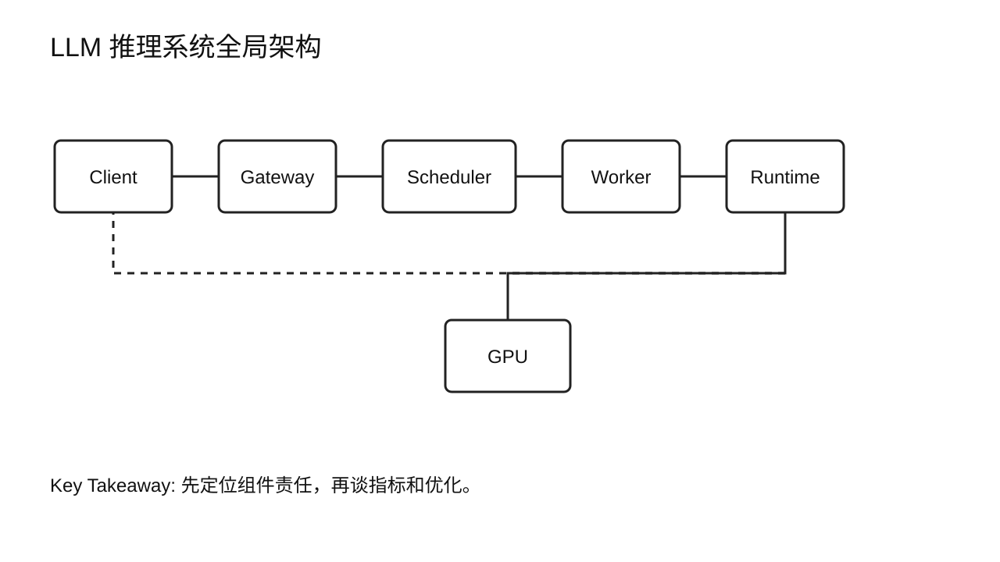
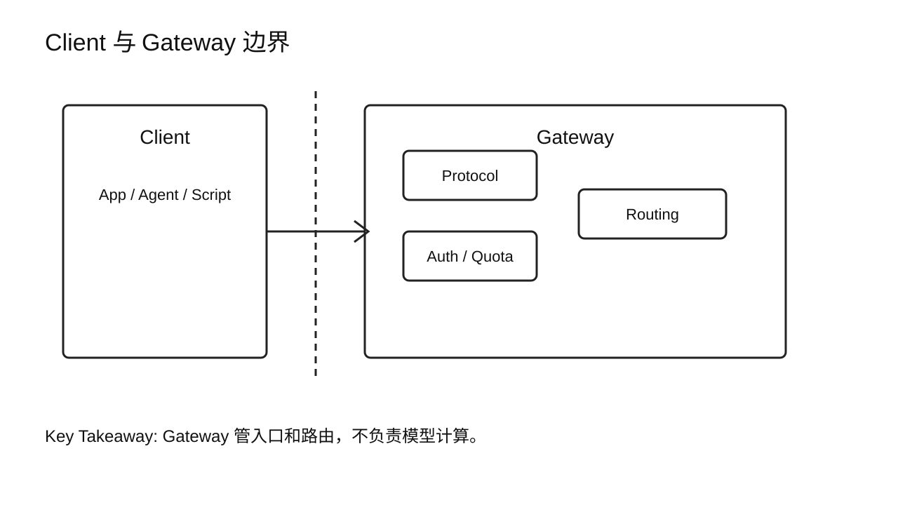
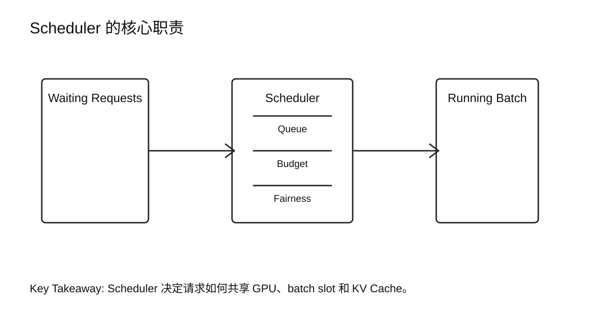
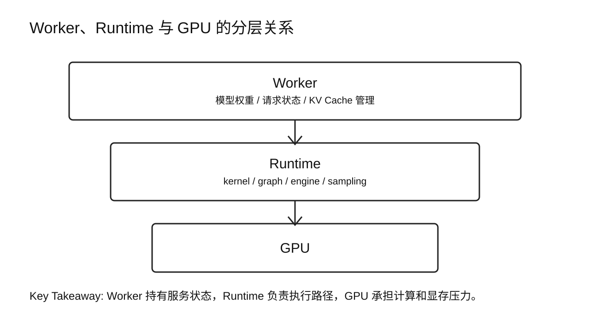
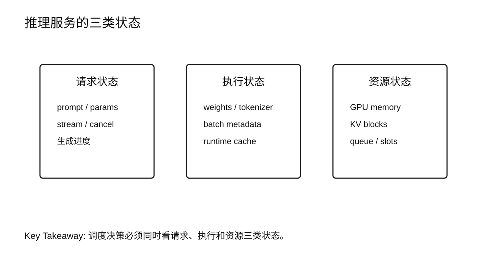
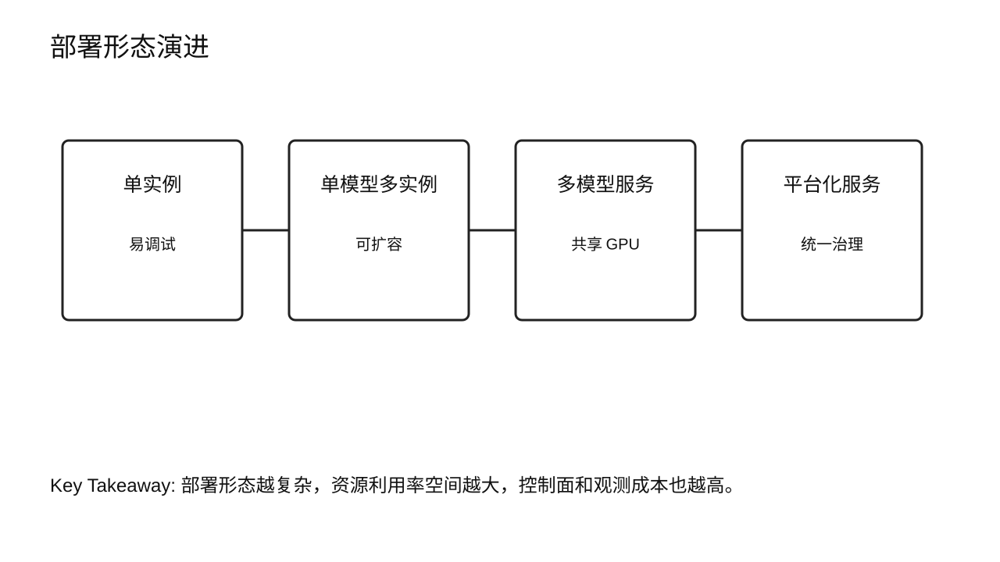
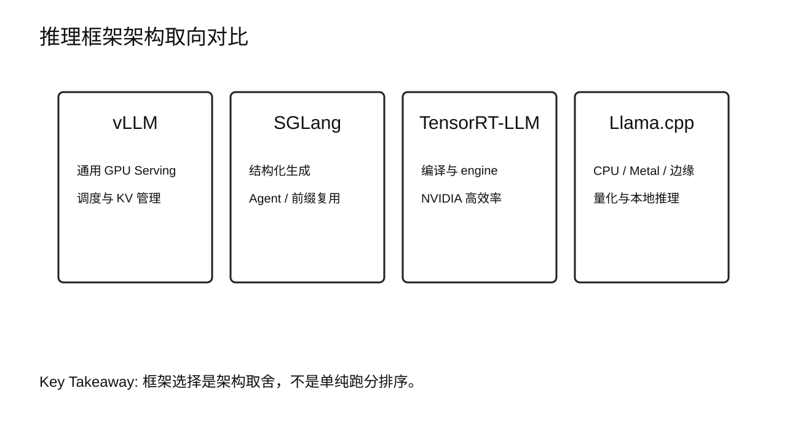
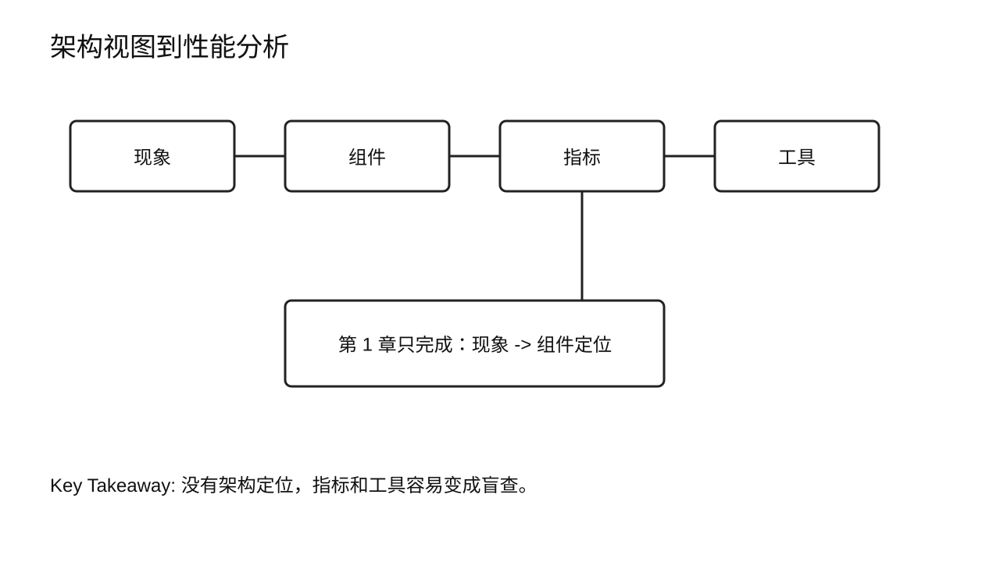
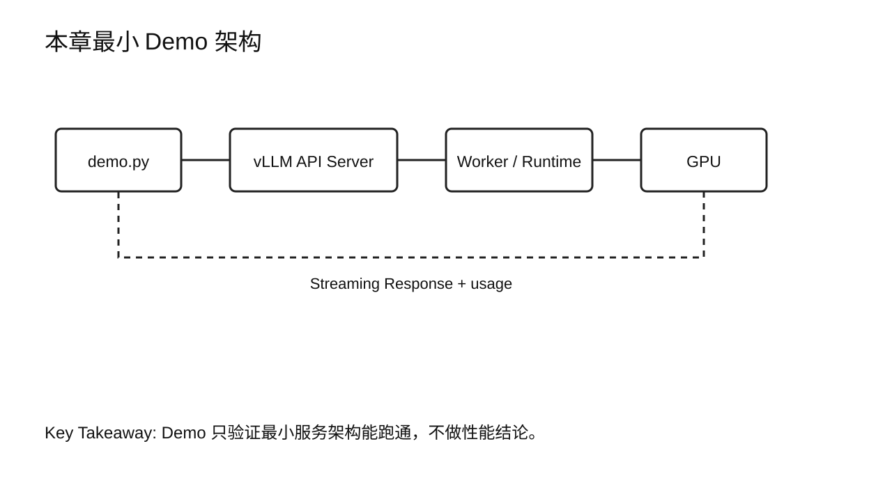
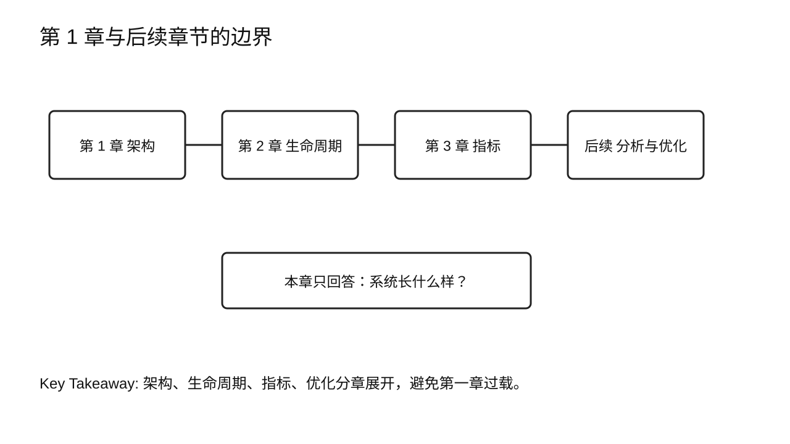

# 第 2 章 LLM Inference Architecture

## 学习目标

学完本章后，你应该能够：

- 画出一个在线 LLM 推理系统的基本架构。
- 解释 Client、Gateway、Router、Admission / Queue、Engine Scheduler、Worker、Runtime 与 GPU 的职责边界。
- 说清楚 Client、Gateway、Router、Admission / Queue、Engine Scheduler、Worker、Runtime、GPU 和 Response 各自接收什么、产出什么。
- 把本书抽象组件映射到 Ray Serve、KServe、Triton、Dynamo、vLLM 等成熟系统。
- 说明为什么 LLM 推理服务不能只看模型本身，还要看队列、调度、运行时和硬件资源。
- 比较 vLLM、SGLang、TensorRT-LLM 与 Llama.cpp 在架构取向上的差异。
- 用一次最小 Demo 观察“客户端请求是否成功进入推理服务，并由哪个模型后端返回结果”。

第 1 章已经带你跟着一个请求走了一遍生命周期，Gateway、Queue、Scheduler 这些词当时只按字面意思使用。本章往回退一步，把这些组件拆解成更精确的架构分层，只建立架构视图，不重复讲一遍生命周期；TTFT、TPOT、TPS、P95/P99 等指标会在第 4 章系统定义；Benchmark、Profiling 和优化技术放在后续章节。

## 核心问题

本章围绕六个问题展开：

1. LLM 推理系统长什么样？
2. 一个在线请求进入服务后，会经过哪些系统组件？
3. Router、Admission / Queue、Engine Scheduler、Worker、Runtime、GPU 分别管什么？
4. 每个组件的输入和输出分别是什么？
5. 成熟开源系统和商业化系统如何体现这些分层？
6. 为什么不同推理框架的架构取向会影响性能优化方式？



图2-1：LLM 推理系统全局架构。

## 2.1 先看系统，不先看模型

很多人第一次做 LLM 推理优化，会从模型文件、显存占用或某个框架参数开始看。这些当然重要，但它们不是完整系统。

一个在线推理请求至少要经过几层东西：客户端发起请求，服务入口做协议处理和鉴权，路由层选择模型版本或服务实例，队列和调度层决定请求什么时候进入执行，Worker 调用推理运行时，Runtime 再把模型计算提交给 GPU。请求返回时，还要把生成结果按普通响应或流式响应送回客户端。

可以把它先看成一条系统链路：

```text
Client
  -> Gateway
  -> Router
  -> Admission / Queue
  -> Engine Scheduler
  -> Worker
  -> Runtime
  -> GPU
  -> Response
```

这条链路不是为了背名词，而是为了定位责任。用户觉得慢，可能是 Gateway 前面的限流或鉴权，可能是 Router 选错了实例，可能是 Admission / Queue 把请求排住了，可能是 Engine Scheduler 没有形成有效 batch，可能是 Worker 被 KV Cache 容量卡住，也可能是 Runtime 的 kernel 执行效率低。只看模型 forward 时间，容易漏掉服务系统里的等待和资源竞争。

本课程后面的所有性能分析，都会回到这个架构视图上：先判断性能现象发生在哪个组件，再决定该采集什么指标、用什么工具、改哪个参数或哪段实现。

## 2.2 Client 与 Gateway：请求真正进入系统的地方

Client 可以是聊天界面、业务服务、Agent 工作流、评测脚本，也可以是另一个后端系统。它关心的是 API 是否稳定、首包是否及时、输出是否连续、失败时能不能重试。

Gateway 是推理系统的入口层。它通常处理这些事情：

- 协议适配，例如 OpenAI-compatible HTTP API、gRPC 或内部 RPC。
- 鉴权、租户识别、限流和配额。
- 请求参数校验，例如模型名、max tokens、temperature、stream。
- 路由到合适的模型服务实例。
- 记录请求日志和基础观测数据。

Gateway 不应该承担模型计算，但它会影响请求进入计算层之前的等待时间。生产系统里，一个模型服务“GPU 还没满但用户仍然慢”，常常不是 GPU 算不动，而是入口、路由或队列策略没有设计好。



图2-2：Client 与 Gateway 边界。

## 2.3 Router、Queue 与 Scheduler：推理系统的交通控制器

从全局系统看，“调度”不是一个单点组件，而是分布在 Router、Admission / Queue 和 Engine Scheduler 几层。

Router 决定请求去哪里。它可能根据模型名、版本、租户、负载、灰度策略、地域或 KV Cache 命中可能性，把请求发到不同的实例、worker group 或后端引擎。

Admission / Queue 决定请求能不能进入执行队列。它关心配额、优先级、SLO、队列长度、超时、并发上限和拒绝策略。

Engine Scheduler 决定进入某个推理实例后的下一轮执行。它是 LLM Serving 和普通 Web 服务差别最大的地方之一。

普通 Web 服务里，请求通常可以被线程池或进程池相对独立地处理。LLM 推理不同：多个请求会共享 GPU、模型权重、KV Cache 空间和 batch 执行机会。调度器必须在吞吐、单请求延迟、显存容量和公平性之间做取舍。

Engine Scheduler 常见职责包括：

- 维护等待队列和运行中请求集合。
- 决定本轮 batch 包含哪些请求。
- 控制 prompt token、output token、并发数和 KV Cache block 的资源预算。
- 在长请求和短请求之间做公平性处理。
- 在内存不足或优先级变化时触发抢占、延迟或拒绝。

本章不展开 Dynamic Batching、Continuous Batching 和 Chunked Prefill 的算法细节。这些属于 Serving Optimization，会在第 17 到第 21 章系统讲。这里先记住一句话：Engine Scheduler 是请求能否高效共享 GPU 的核心组件；Gateway、Router 和 Admission / Queue 则决定请求能否以正确优先级进入这个执行层。



图2-3：Scheduler 的核心职责。

## 2.4 Worker、Runtime 与 GPU：真正执行模型的地方

Worker 是服务进程中负责模型执行的单元。一个 Worker 可能绑定一张 GPU，也可能和其他 Worker 共同使用多张 GPU。它通常持有模型权重、运行时上下文、KV Cache 管理器，以及和调度器交互的执行循环。

Runtime 是 Worker 里面真正调用底层执行能力的部分。它负责把模型计算变成 GPU 可以运行的 kernel、graph、engine 或算子调用。不同框架在 Runtime 层的设计差异很大：

- 有的优先保持 Python 和 Hugging Face 生态兼容。
- 有的把模型编译成高度优化的 engine。
- 有的针对结构化生成和多轮对话做前缀复用。
- 有的优先支持 CPU、Metal、量化和边缘设备。

GPU 是计算资源，但不是孤立资源。推理系统里同时占用 GPU 的内容包括模型权重、KV Cache、临时工作区、通信缓冲区和运行时预留内存。GPU 忙不忙，只是一个结果；为什么忙、忙在哪一段、是不是有效地忙，第 3 章会先建立 GPU 内部的硬件模型，第 7 章 Profiling Toolchain 才能严肃回答"如何用证据判断"。



图2-4：Worker、Runtime 与 GPU 的分层关系。

### 2.4.1 组件输入与输出

把组件职责说清楚以后，还要继续问一个更工程化的问题：这个组件接收什么，产出什么。输入和输出不是为了画更复杂的图，而是为了在排障时知道应该看哪类日志、状态和指标。

下表给出第 2 章需要掌握的架构级输入输出。Prefill、Decode、KV Cache 的完整生命周期第 1 章已经跟着请求走过一遍，这里从组件职责的角度再对应一次。

| 组件 | 主要输入 | 主要输出 | 边界说明 |
|---|---|---|---|
| Client | 用户问题、业务上下文、请求参数、会话状态 | HTTP/gRPC/RPC 请求，或接收到的普通/流式响应 | Client 负责发起和消费结果，不负责服务端调度和模型执行 |
| Gateway | 外部请求、模型名、租户身份、鉴权信息、限流和入口配置 | 校验后的内部请求、拒绝/限流响应、入口日志 | Gateway 决定请求能否进入系统，不负责 token batch |
| Router | 校验后的内部请求、模型版本、实例状态、负载、路由策略 | 目标 replica、worker group 或后端 engine | Router 决定请求去哪里，不负责模型执行 |
| Admission / Queue | 路由后的请求、租户配额、优先级、SLO、队列长度、并发上限 | 接收、等待、拒绝或降级决策 | Admission 管全局流量预算和排队策略 |
| Engine Scheduler | 待执行请求队列、运行中请求状态、Worker 可用状态、GPU/KV Cache 资源状态、调度策略 | batch plan、dispatch plan、等待/抢占/拒绝决策 | Engine Scheduler 输出的是执行计划，不是模型结果 |
| Worker | Engine Scheduler 下发的执行计划、batch metadata、模型权重、请求执行状态 | Runtime 调用、token 结果、请求状态更新、资源占用更新 | Worker 是执行单元，负责把调度计划转成实际模型执行 |
| Runtime | Worker 传入的模型输入、batch metadata、KV Cache 句柄、采样参数、执行配置 | GPU kernel/graph/engine 调用、logits、采样 token、运行时状态 | Runtime 是框架执行层，例如 vLLM、SGLang、TensorRT-LLM 的底层执行路径 |
| GPU | Runtime 提交的 kernel、模型权重、activation、KV Cache、临时工作区 | 计算结果、显存状态变化、kernel timeline、硬件计数器 | GPU 提供计算和显存资源，但不理解业务请求 |
| Response | Worker/Runtime 产出的 token、结束原因、usage 信息、错误状态 | 返回给 Client 的普通响应或 streaming chunks | Response 是服务结果的封装和传输，不等于模型内部计算 |

以 Engine Scheduler 和 Worker 为例，两者最容易混在一起。Engine Scheduler 的输入是“队列、运行中请求、资源状态和策略”，输出是“下一轮让谁执行、组成什么 batch、分配给哪个 Worker”。Worker 的输入是这个执行计划和模型执行所需状态，输出才是 token、状态更新和 Runtime 调用结果。

所以，当一个请求变慢时，问题可以按输入输出拆开看：

- Gateway 已经输出内部请求了吗？如果没有，先看鉴权、限流、路由和入口日志。
- Router 已经选出目标实例了吗？如果没有，先看模型版本、实例健康状态、负载和路由规则。
- Admission / Queue 已经允许请求进入执行队列了吗？如果没有，先看租户配额、优先级、SLO 和全局并发预算。
- Engine Scheduler 已经输出 dispatch plan 了吗？如果没有，先看 token batch 预算、KV Cache 预算和可用 Worker。
- Worker 已经开始执行了吗？如果没有，先看 Worker 是否空闲、模型是否加载、KV Cache 是否够用。
- Runtime / GPU 已经返回计算结果了吗？如果没有，才继续看 kernel、显存、硬件利用率和框架执行路径。

## 2.5 模型服务内部的三类状态

架构图不只是组件框。推理系统之所以难优化，是因为它同时管理三类状态。

第一类是请求状态。包括用户输入、生成参数、当前生成到哪里、是否 stream、是否取消、是否超时。

第二类是模型执行状态。包括模型权重、tokenizer、采样器、batch metadata、CUDA stream、通信上下文和运行时缓存。

第三类是资源状态。包括 GPU 显存、KV Cache block、队列长度、batch slot、并发上限和实例健康状态。

一个调度决策如果只看请求，不看资源，会把 GPU 或显存打爆；只看资源，不看请求，会牺牲交互体验；只看平均吞吐，不看尾部延迟，会让生产系统在高峰期不可控。



图2-5：推理服务的三类状态。

## 2.6 单实例、多实例与平台化服务

最小的 LLM 推理服务可以只有一个实例：一个 Gateway 接一个 Worker，Worker 加载一个模型，后面连一张 GPU。这种结构最容易调试，也适合课程 Demo。

生产系统通常会更复杂：

- 单模型多实例：同一个模型部署多个副本，通过负载均衡分摊流量。
- 多模型服务：多个模型共享一组 GPU，根据请求动态路由或加载。
- 平台化服务：统一管理模型版本、租户、配额、监控、发布、回滚和成本。

这些形态没有绝对优劣。单模型服务隔离性好，排障直接；多模型服务提高资源利用率，但路由、缓存和冷启动更复杂；平台化服务适合组织内多个团队共享能力，但控制面和观测体系要更扎实。

第 2 章只建立这几种形态的架构差别。容量模型、多 GPU 和 scale-out 会在第 21 到第 25 章展开。



图2-6：部署形态演进。

## 2.7 四类推理框架的架构取向

不同框架不是同一个系统的简单替代品。它们对“什么最重要”的判断不同。

vLLM 的重点是高吞吐在线服务和成熟生态。它围绕请求调度、PagedAttention、KV Cache block 管理、OpenAI-compatible API 和多 GPU 执行构建，适合作为通用 GPU Serving 的起点。

SGLang 更强调结构化生成、多轮对话和 Agent 工作流。它在前缀复用、结构化约束、服务端编排等场景里有自己的设计重点。

TensorRT-LLM 的取向是 NVIDIA GPU 上的高性能推理。它更依赖编译、engine、算子融合和硬件相关优化，适合模型与硬件相对稳定、团队能投入构建和调试成本的场景。

Llama.cpp 走的是另一条路：让模型在 CPU、Metal、消费级 GPU 和边缘设备上可用。它通常不是大型 GPU 在线服务的第一选择，但对本地开发、边缘部署和低成本试验很有价值。

这里不做“谁最好”的结论。框架选择本质上是在生态、性能、硬件、可维护性和业务场景之间取舍。



图2-7：推理框架架构取向对比。

## 2.8 成熟系统中的对应关系

本章的组件划分不是凭空抽象出来的。真实系统的命名不同，覆盖层级也不同，但它们都会把入口、路由、排队/调度、执行实例和底层运行时分开。

| 本书分层 | 负责什么 | Ray Serve | KServe | Triton | Dynamo / LLM Serving | vLLM / SGLang / TensorRT-LLM |
|---|---|---|---|---|---|---|
| Gateway / API Frontend | 协议接入、鉴权、限流、入口日志 | HTTP Proxy | Ingress / Gateway | HTTP/gRPC Frontend | Frontend | OpenAI-compatible API Server |
| Router | 模型版本、实例、副本、worker group 选择 | Request Router / DeploymentHandle | KServe / Knative routing | Model routing | Router，按负载和 KV overlap 选 worker | API server 或外部 router |
| Admission / Queue | 配额、优先级、排队、拒绝、扩缩容信号 | Proxy / replica queue，autoscaling | Queue / autoscaling path | Per-model scheduler queue | Request plane queue / planner | Engine waiting queue |
| Inference Server | 承载模型服务进程 | Replica 内的用户代码或模型服务 | Predictor container / pod | Triton server | 后端 engine 服务 | vLLM Server / SGLang Server / TensorRT-LLM Serve |
| Engine Scheduler / Batch Manager | token batch、Prefill/Decode、KV Cache、显存预算 | 通常由底层 engine 负责 | Predictor 内部 runtime 负责 | Per-model scheduler / dynamic batcher | 后端 engine scheduler | vLLM Scheduler、SGLang Scheduler、TensorRT-LLM Executor / Batch Manager |
| Worker / Replica / Model Instance | 持有模型并执行请求 | Replica | Predictor | Model instance | Prefill Worker / Decode Worker | Worker / model runner |
| Runtime / Kernel / GPU | engine、kernel、硬件执行 | PyTorch / vLLM / custom runtime | Triton / vLLM / custom runtime | Backend runtime | vLLM / SGLang / TensorRT-LLM backend | CUDA、TensorRT engine、attention kernel |

这张表有两个用法。

第一，不要把所有系统都叫“全套 LLM 推理系统”。Ray Serve 更偏通用在线 serving 框架，KServe 更偏 Kubernetes 模型服务平台，Triton 更偏推理服务器，vLLM / SGLang / TensorRT-LLM 更偏 LLM engine 与 serving engine。Dynamo 这类系统更接近大规模 LLM serving runtime，它把 Frontend、Router、Prefill Worker、Decode Worker 和后端 engine 编排起来。

第二，不要把所有预算都放进 Scheduler。Gateway 管入口预算，Router 管实例选择，Admission / Queue 管全局流量预算，Engine Scheduler 才管进入推理实例后的 token batch、KV Cache、Prefill/Decode 执行预算。Worker 负责执行已经分配好的计划。

典型资料可以从这些系统入手：

- Ray Serve Architecture：HTTP Proxy 接收请求并转发到 Replica，Replica 执行代码。
- KServe Transformer / Predictor：Ingress、Transformer、Predictor 形成平台级 serving 分层。
- Triton Inference Server：请求进入后路由到 per-model scheduler，支持 dynamic batching。
- NVIDIA Dynamo Overall Architecture：Frontend、Router、Prefill Workers、Decode Workers 和后端 engine 共同组成分布式推理运行时。
- vLLM / SGLang / TensorRT-LLM：说明 LLM engine 内部的 Scheduler、Batch Manager、Worker、KV Cache 和 Runtime 边界。

## 2.9 架构视图如何服务性能分析

本课程的统一方法是：

```text
理解系统
  -> 理解瓶颈
  -> 定位瓶颈
  -> 优化方案
  -> 验证收益
```

第 2 章只做第一步：理解系统。

理解系统不是画一张漂亮图，而是能把性能问题放回具体组件：

| 现象 | 优先查看的架构位置 | 本章只给定位方向 |
|---|---|---|
| 请求根本进不来 | Client / Gateway | 检查协议、路由、鉴权、限流 |
| 并发上来后等待变长 | Gateway / Router / Admission / Queue | 检查入口限流、路由、队列和全局并发预算 |
| GPU 有空洞 | Engine Scheduler / Worker | 检查 batch 形成和 worker 执行节奏 |
| 显存很快吃满 | Worker / Runtime / GPU | 检查模型权重、KV Cache、并发预算 |
| 框架迁移成本高 | Runtime / API 层 | 检查接口抽象和框架绑定 |

这些还不是正式诊断。第 4 章会定义指标，第 6 章会讲 Benchmark，第 7 章会讲 Profiling 工具。现在要做的是先知道“去哪里看”。



图2-8：架构视图到性能分析。

## 2.10 Demo：确认一个最小推理服务架构

本章 Demo 不做性能 benchmark，只确认一个最小架构能跑通：

```text
demo.py
  -> OpenAI-compatible API
  -> vLLM API Server
  -> Worker / Runtime
  -> GPU
  -> Streaming Response
```

配套代码位于：

```text
chapter01/demo/
```

### 2.10.1 启动 vLLM 服务

如果模型可以通过 Hugging Face id 解析：

```bash
python3 chapter01/demo/start_vllm.py \
  --model Qwen/Qwen2.5-0.5B-Instruct \
  --served-model-name Qwen/Qwen2.5-0.5B-Instruct \
  --host 0.0.0.0 \
  --port 8000
```

如果模型已经在本地目录，例如 `/home/admin/models/Qwen2.5-0.5B-Instruct`：

```bash
python3 chapter01/demo/start_vllm.py \
  --model /home/admin/models/Qwen2.5-0.5B-Instruct \
  --served-model-name Qwen/Qwen2.5-0.5B-Instruct \
  --host 0.0.0.0 \
  --port 8000
```

### 2.10.2 发送一次请求

从课程根目录运行：

```bash
python3 chapter01/demo/demo.py \
  --base-url http://127.0.0.1:8000/v1 \
  --model Qwen/Qwen2.5-0.5B-Instruct \
  --prompt "请用一句话说明这个服务由哪些组件组成。" \
  --max-tokens 128 \
  --requests 1 \
  --concurrency 1
```

本章只观察：

- 客户端是否能访问 OpenAI-compatible API。
- 请求是否由指定模型名处理。
- 服务是否返回 stream chunks 和 usage。
- 如果有 `nvidia-smi`，是否能看到 GPU 快照。

脚本会输出 TTFT、ITL、tokens/s 等字段，但这里不解释指标优劣，也不做结论。第 4 章会系统讲指标，第 6 章再讲可信 Benchmark。



图2-9：本章最小 Demo 架构。

## 2.11 课堂案例：企业问答服务应该画成什么架构

假设一家企业要做内部知识库问答。用户在网页里提问，系统会带上员工身份、部门权限和问题文本，请求部署在公司 GPU 集群上的 LLM 服务。模型服务使用 vLLM，前面有 API Gateway，后面有多张 GPU。

第一版架构如果只画成：

```text
Web App -> LLM
```

几乎没法排查问题。试运行后，业务方很快会遇到几类反馈：

- 有些用户能访问不该看的文档。
- 晚上批量任务一跑，白天聊天请求也变慢。
- GPU 利用率看起来不低，但部分请求仍然等很久。
- 运维同学很难判断失败请求卡在业务系统、Gateway 还是模型服务。

更合理的架构图至少要拆成：

```text
Web App
  -> Enterprise Gateway
  -> Auth / Policy Check
  -> LLM Gateway
  -> Router
  -> Admission / Queue
  -> Engine Scheduler
  -> Worker Pool
  -> Runtime
  -> GPU
```

这样画以后，问题有了落点。权限问题在 Enterprise Gateway 或 Auth / Policy Check；白天请求被晚上任务拖慢，可能是 Gateway 路由、Admission / Queue 或 Engine Scheduler 共享资源策略；GPU 忙但请求等待，可能是队列、batch 形成或 Worker 资源预算；失败请求排查，则要沿着链路逐层看日志。

这个案例的重点不是设计完整企业平台，而是训练架构意识：先把组件边界画出来，性能和可靠性问题才有位置可放。

课堂讨论：

1. 如果要支持多个模型版本，架构图里应该增加哪个组件？
2. 如果要区分交互式请求和离线批处理请求，Router、Admission / Queue 和 Engine Scheduler 应该分别怎么标注？

### 补充案例 A：代码补全服务为什么更在意 Gateway 和路由

代码补全服务和企业问答服务都调用 LLM，但架构优先级不同。代码补全通常发生在 IDE 里，用户输入停顿很短，补全建议要很快返回。这里 Client 不再是普通网页，而是 IDE 插件；Gateway 需要识别项目、语言、文件上下文和用户权限；路由层可能要把短补全请求和长代码解释请求分开。

可以让学员画两条链路：

```text
IDE Plugin -> Gateway -> Router -> Low-latency Queue -> Small Completion Model
IDE Plugin -> Gateway -> Router -> Standard Queue -> Larger Chat Model
```

讨论重点：同样是 LLM 服务，为什么代码补全更怕入口排队和路由错误？这个问题只需要从架构职责回答，不需要进入指标和优化参数。

### 补充案例 B：多租户 API 平台为什么不能只有一个队列

另一个场景是对外提供 LLM API。免费用户、付费用户、企业用户共用一组模型服务。如果所有请求进同一个队列，免费用户的大批量测试可能拖慢企业用户的生产请求。

架构图里应该显式画出租户识别、配额、优先级和队列隔离：

```text
API Gateway
  -> Tenant / Quota
  -> Priority Queues
  -> Engine Scheduler
  -> Worker Pool
```

课堂讨论：优先级队列应该放在 Gateway、Admission / Queue，还是 Engine Scheduler 里？答案不必唯一，但必须说清楚组件职责。

## 2.12 常见误区

误区一：把模型推理等同于模型 forward。

forward 只是 Worker/Runtime/GPU 这一段。在线服务还包括 Gateway、Router、Admission / Queue、Engine Scheduler、流式返回、资源预算和观测系统。性能问题常常出现在模型 forward 之外。

误区二：认为 GPU 利用率高就代表架构健康。

GPU 利用率高只能说明 GPU 忙。它不能说明请求是否排队过久、是否牺牲了尾部延迟，也不能说明 Worker 是否在有效处理目标 workload。

误区三：一开始就比较框架跑分。

框架跑分要放在 workload 和架构约束里看。Agent 工作流、本地推理、高流量单模型 API、多租户平台，适合的框架取向不一样。

误区四：把第 2 章就写成优化技术清单。

本章只回答“系统长什么样”。Prefill、Decode、KV Cache、Batching、PagedAttention、Speculative Decoding 都会在后续章节展开。提前把细节塞进来，反而会让架构主线变乱。



图2-10：第 2 章与后续章节的边界。

## 本章总结

本章建立了 LLM 推理系统的第一张地图。

一个在线推理系统至少包含 Client、Gateway、Router、Admission / Queue、Engine Scheduler、Worker、Runtime 和 GPU。Client 提出请求，Gateway 管入口，Router 管目标实例选择，Admission / Queue 管全局流量预算，Engine Scheduler 管进入推理实例后的 batch 和执行计划，Worker 持有模型和执行状态，Runtime 把计算提交给硬件，GPU 承担模型权重、KV Cache 和 kernel 执行压力。

架构视图的价值在于定位责任。用户觉得慢，不一定是 GPU 算得慢；吞吐上不去，也不一定是模型不够小。你要先判断问题落在哪一层，再进入指标、Benchmark、Profiling 和优化。

下一章会转向硬件本身：GPU 内部的 SM、Warp 调度、显存层级和 Tensor Core，是本章 Worker/Runtime/GPU 这一层，也是后续所有性能分析的硬件前提。

### 本章 Checklist

- [ ] 能画出 Client -> Gateway -> Router -> Admission / Queue -> Engine Scheduler -> Worker -> Runtime -> GPU 的链路。
- [ ] 能说明 Gateway 不负责模型计算，但会影响入口等待。
- [ ] 能区分 Router、Admission / Queue 和 Engine Scheduler 各自管什么预算。
- [ ] 能说出每个核心组件的输入和输出。
- [ ] 能把 Ray Serve、KServe、Triton、Dynamo、vLLM 等系统映射到本章分层。
- [ ] 能区分 Worker、Runtime 和 GPU 的职责。
- [ ] 能比较 vLLM、SGLang、TensorRT-LLM、Llama.cpp 的架构取向。
- [ ] 能说明本章 Demo 只验证最小服务架构，不做性能结论。

## 课后练习

1. 画出你正在使用的一个 LLM 应用背后的推理系统架构，至少标出 Client、Gateway、Router、Admission / Queue、Engine Scheduler、Worker、Runtime 和 GPU。
2. 选择 vLLM、SGLang、TensorRT-LLM、Llama.cpp 中两个框架，用 200 字以内比较它们的架构取向。
3. 运行本章 Demo，标注输出中哪些字段来自客户端观察，哪些字段说明请求已经进入模型服务。
4. 假设一个用户反馈“并发一上来就慢”，写出你会先检查的三个架构位置，不需要给出优化方案。
5. 课堂讨论：把“企业问答服务”案例改成“代码补全服务”，哪些组件不变，哪些组件的优先级会变化？
