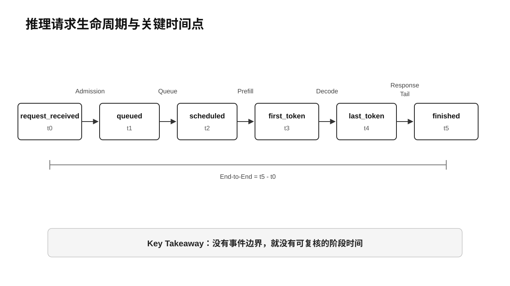
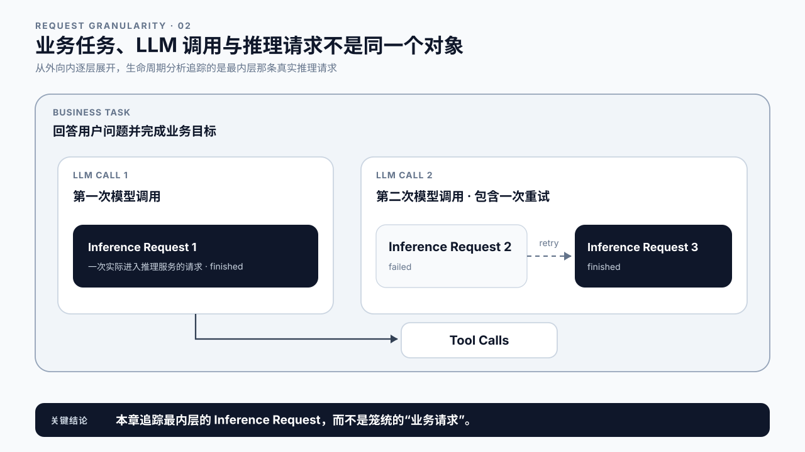
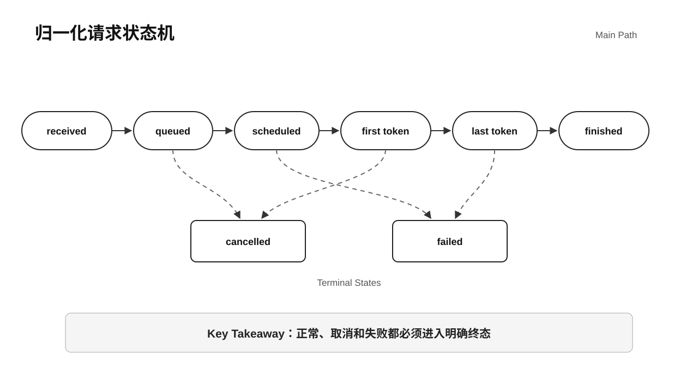
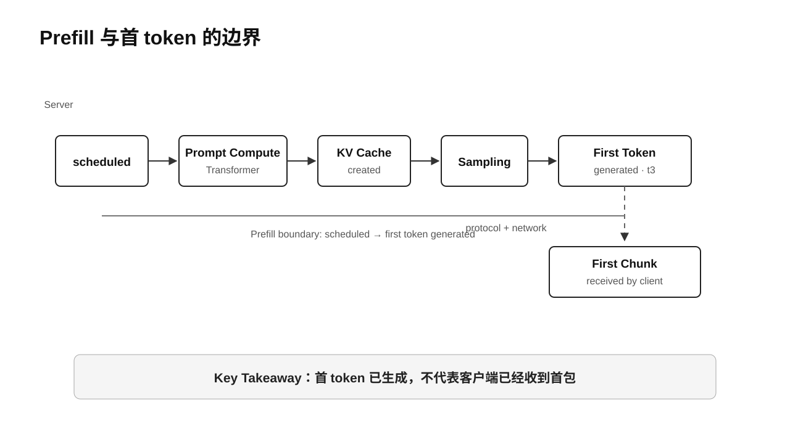
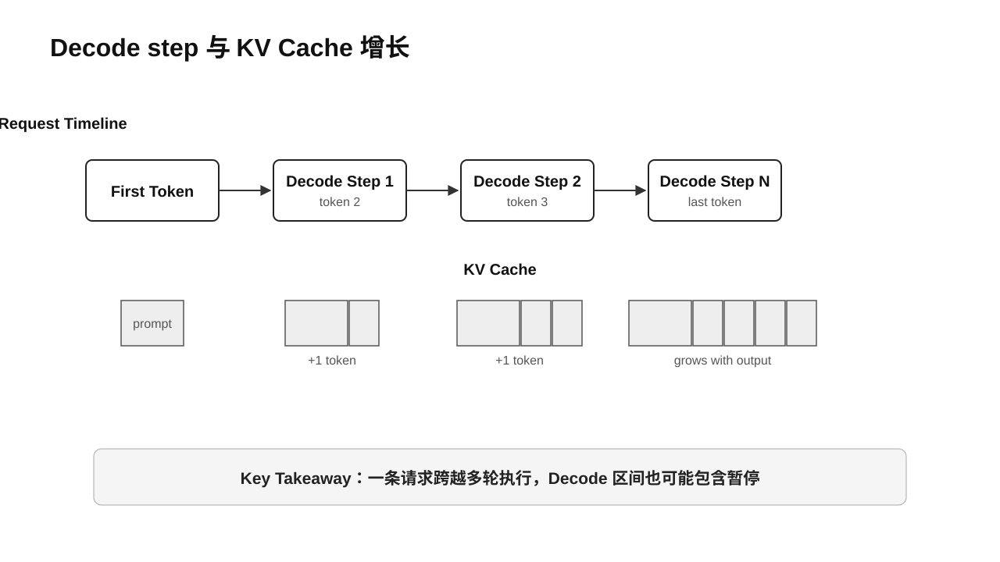
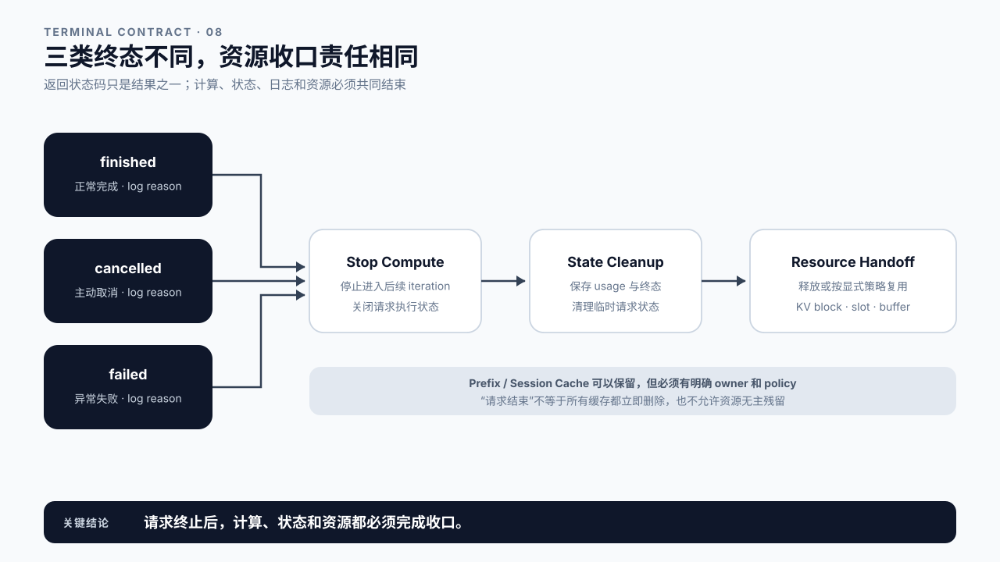
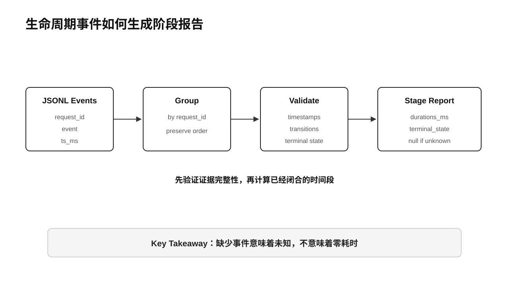

# 第 2 章 Inference Lifecycle：请求在系统里如何流动

## 学习目标

学完本章后，你应该能够：

- 区分一次业务任务、一次 LLM 调用和一条推理请求。
- 用统一事件描述请求从接收、排队、执行到结束的状态变化。
- 标出 Queue、Prefill、Decode、Streaming Response 和资源回收的时间边界。
- 解释服务端生成首 token 与客户端收到首个 chunk 为什么不是同一个时刻。
- 识别 finished、cancelled、failed 三类终态，并说明每类终态都要完成资源清理。
- 运行生命周期追踪 Demo，把 JSONL 事件还原成阶段耗时。

本章属于 Core Track。第 1 章已经让服务跑起来，并从客户端看到了流式响应；现在把那次调用展开成一条可以记录、检查和讨论的正式生命周期。组件由谁实现留到第 3 章，Transformer 为什么会产生 Prefill 和 Decode 留到第 4 章，TTFT、TPOT 和分位数的正式定义留到第 6 章。

Advanced Track 可以继续追踪框架内部的抢占、Chunked Prefill、远程 KV 传输和 Prefill/Decode 分离事件。本章只给这些复杂路径留下位置，不展开调度算法和分布式实现。

## 核心问题

1. 请求生命周期需要记录哪些关键事件？
2. Queue、Prefill、Decode 和 Response 的起止点在哪里？
3. 并发、抢占、取消和失败会怎样改变一条请求的路径？
4. 客户端观测与服务端观测为什么不能直接混算？
5. 如何从一组事件重建请求经历过的阶段？



图2-1：推理请求生命周期与关键时间点。

## 2.1 先分清三种“请求”

业务侧说“一次请求”，推理引擎听到的可能完全不是一回事。

以 Agent 为例，用户只提交了一次“帮我比较三家供应商”的任务。Agent 可能先调用一次 LLM 制订计划，随后并行调用三个工具，再调用一次 LLM 汇总结果。业务系统看到一个 Task，模型服务看到两次或更多 LLM Call；如果中间发生重试，同一个 Call 还可能对应多条 Inference Request。

```text
Business Task
  -> LLM Call 1
       -> Inference Request 1
  -> Tool Calls
  -> LLM Call 2
       -> Inference Request 2
       -> Retry Request 3
```

本章研究的对象是最内层的 Inference Request。它有独立的请求 ID、输入 token、生成参数、队列状态、KV Cache、输出 token 和终态。到了第 24 章，我们再把多条请求拼回 Agent 的端到端任务。



图2-2：业务任务、LLM 调用与推理请求是三个不同层级。

## 2.2 用归一化状态描述生命周期

不同框架给状态起的名字并不一致。课程先使用一套归一化事件，避免把概念绑死在某个版本的内部类上：

```text
request_received
  -> queued
  -> scheduled
  -> first_token
  -> token ...
  -> last_token
  -> finished
```

这条主路径表达的是：服务收到请求；请求完成入口处理并进入等待队列；调度器给它分配执行机会；模型产出首 token；后续 token 持续产生；最后一个 token 生成；响应发送完毕，请求结束。

`cancelled` 和 `failed` 是旁路终态。它们可以发生在排队、Prefill 或 Decode 期间。实际系统还可能出现 waiting for grammar、waiting for remote KV、preempted 等更细状态。例如 vLLM 当前的 RequestStatus 明确区分 WAITING、RUNNING、PREEMPTED 以及若干特殊等待状态；这些都可以映射回本章的归一化模型，而不必照搬名称。[vLLM RequestStatus](https://docs.vllm.ai/en/stable/api/vllm/v1/request/)



图2-3：归一化状态机保留主路径，也允许取消和失败提前结束请求。

## 2.3 给生命周期建立时间坐标

状态说清楚后，再给每个关键事件记一个时间戳：

| 时间点 | 事件 | 说明 |
|---|---|---|
| `t0` | `request_received` | 服务端接收到请求 |
| `t1` | `queued` | 请求进入引擎等待队列 |
| `t2` | `scheduled` | 请求首次获得执行机会 |
| `t3` | `first_token` | 服务端生成第一个输出 token |
| `t4` | `last_token` | 服务端生成最后一个输出 token |
| `t5` | `finished` | 响应发送和收尾工作结束 |

于是可以得到一组阶段时间：

```text
Admission      = t1 - t0
Queue          = t2 - t1
Prefill        = t3 - t2
Decode         = t4 - t3
Response Tail  = t5 - t4
End-to-End     = t5 - t0
```

这组式子是生命周期分段，不是全书最终的指标规范。比如某些引擎把 tokenization 算进 arrival 到 scheduled，某些系统把首 token 的采样放在 Prefill 尾部，还有些监控只能看到客户端 chunk。第 6 章会要求每个指标同时写清名称、时间点、公式和采集位置。

vLLM 的服务端指标也采用相近边界：Queue 从首次排队到首次调度，Prefill 从首次调度到首个新 token，Decode 从首 token 到末 token；抢占造成的等待会被包含在相应区间里。[vLLM Metrics](https://docs.vllm.ai/en/latest/design/metrics/)


图2-4：只有明确 queued 和 scheduled 两个时间点，Queue 才有可复核的边界。

## 2.4 Request Received 与 Queue：计算开始前发生了什么

`request_received` 表示服务边界已经接到请求，但请求还不一定进入引擎队列。协议解析、鉴权、参数校验、tokenization、路由和准入控制都可能发生在这一段。它们是否计入 Admission，取决于观测点放在哪里。

`queued` 表示请求已经进入某个等待执行的队列。排队不是“系统什么都没做”，而是在等待一组条件满足：有可用执行预算、有足够 KV Cache 空间、调度策略允许、请求没有超时或被取消。

`scheduled` 是第一次真正获得引擎执行机会。这里要强调“第一次”：请求后面仍可能经历很多轮调度，甚至被抢占后重新排队。生命周期里的 Queue 通常关注首次排队到首次调度；要研究重复等待，需要额外事件，不能靠一个 queue 时间猜出来。

第 3 章会区分 Gateway、Router、Admission Queue 和 Engine Scheduler。当前只需记住，`request_received -> queued -> scheduled` 发生在模型产出 token 之前，其中任何一段变长，用户都会觉得首包变慢。

## 2.5 Scheduled、Prefill 与 First Token

请求第一次被调度后，模型要先处理输入上下文。对普通文本生成请求来说，这段执行称为 Prefill。它读取 prompt tokens，经过 Transformer 各层，并为历史 token 建立 KV Cache。

Prefill 的结束边界容易说错。完成最后一个 prompt token 的计算，还不等于客户端已经看见结果。服务端通常还要得到 logits、执行采样、形成输出对象，再把首个 chunk 写入网络。本章把 `first_token` 定义为服务端生成首 token；客户端首次收到 chunk 是另一个观测点。

```text
scheduled
  -> prompt compute
  -> KV Cache created
  -> logits
  -> sampling
  -> first_token generated
```

如果启用了 Prefix Cache 或 Chunked Prefill，这条路径会出现缓存命中或多轮 Prefill，但请求仍要经过“输入尚未处理完”到“首 token 已生成”的状态变化。具体计算机制在第 4、12 章讲，优化方法在第 14 章讲。



图2-5：Prefill 连接首次调度与服务端首 token，客户端首 chunk 还要经过返回链路。

## 2.6 Decode 是一串引擎步，不是一段黑盒时间

首 token 之后，请求进入 Decode。每个标准 Decode step 读取当前 token 和已有 KV Cache，计算下一 token，并把新 token 的 K/V 追加到缓存。直到 EOS、stop condition、长度上限、取消或错误出现。

```text
first_token
  -> decode step 1 -> token 2 -> append KV
  -> decode step 2 -> token 3 -> append KV
  -> ...
  -> last_token
```

一条请求会跨越许多 engine iteration。并发时，一个 iteration 又可能同时推进多条请求。因此有两条正交时间线：请求时间线回答“这条请求经历了什么”，引擎时间线回答“这一轮 GPU 推进了哪些请求”。后续分析 GPU 空洞或 Batch Efficiency 时，两条线都要看。

抢占会让 Decode 不再连续。请求可能从 RUNNING 进入 PREEMPTED，释放或转移资源，之后重新等待调度。此时 `first_token -> last_token` 仍然是用户经历的 Decode 区间，但其中包含了暂停。要解释暂停原因，必须再看 Scheduler 和 KV Cache 事件。



图2-6：一条请求跨越多个 Decode step，KV Cache 随生成长度增长。

## 2.7 Streaming：token、输出对象和网络 chunk 不是一一对应

模型生成 token 后，服务端还要解码文本、组装协议对象并发送数据。最简单的实现可能每个 token 发送一个 chunk，但这不是可靠假设。服务端可能缓冲多个 token，网络栈可能合并写入，投机解码也可能一次接受多个 token。

所以需要分开记录：

- `first_token_generated`：引擎第一次产出 token。
- `first_chunk_sent`：服务端第一次写出流式数据。
- `first_chunk_received`：客户端第一次读到流式数据。
- `response_finished`：客户端或服务端认为响应已经结束。

第 1 章 Demo 采集的是客户端时间，能回答“用户等了多久”；本章 Demo 处理的是归一化服务端事件，能回答“请求在哪个阶段”。两组数据使用不同的时钟和边界，未经 Trace ID 对齐不能直接相减。vLLM 的 benchmark 文档也明确说明其 TTFT 和 ITL 在客户端测量，比较工具时应看测量点与公式，而不只看指标名。[vLLM Benchmark CLI](https://docs.vllm.ai/en/stable/benchmarking/cli/)


图2-7：服务端首 token、首个网络 chunk 和客户端首包属于三个观测点。

## 2.8 Finished、Cancelled、Failed 都必须收口

正常结束只是终态之一：

- `finished`：生成满足 EOS、stop condition 或长度上限，响应正常完成。
- `cancelled`：客户端断开、业务主动取消或超时策略终止请求。
- `failed`：参数、模型执行、Worker、网络或其他环节发生错误。

三条路径都必须进入资源清理。服务需要停止后续计算，释放或复用 KV Cache block，清理调度状态，关闭流式响应，并写入 finish reason、错误和 usage。否则一次已取消的请求仍可能继续消耗 GPU；状态泄漏积累后，服务看起来像是“越跑并发越低”。

不要把清理等同于立即释放所有缓存。Prefix Cache、会话缓存或远程 KV 可能按策略保留。生命周期要求的是请求所有权结束后，资源进入明确的新所有者或可回收状态，而不是留成无法解释的占用。



图2-8：成功、取消和失败走不同终态，但都汇入资源与状态清理。

## 2.9 Demo：从事件日志重建生命周期

本章 Demo 位于 `code/chapter02/`，只使用 Python 标准库，可在没有 GPU 的机器上运行。样例事件是合成数据，目的是验证状态与时间边界，不代表任何模型、框架或硬件的真实性能。

从课程目录运行：

```bash
python3 code/chapter02/lifecycle_trace.py \
  --input code/chapter02/sample-events.jsonl
```

样例包含一条正常完成请求、一条取消请求和一条失败请求。分析器会先按 `request_id` 分组，再验证时间戳和状态跳转，最后输出能够闭合的阶段时间。

```json
{
  "requests": 3,
  "finished": 1,
  "cancelled": 1,
  "failed": 1
}
```

正常请求会得到 admission、queue、prefill、decode、response tail 和 end-to-end。取消请求如果没有产生首 token，就不会伪造 prefill 或 decode 时间。这个细节很重要：缺少事件表示“当前证据算不出来”，不是零毫秒。

实验输入、事件规范和测试命令见 [Demo README](../code/chapter02/README.md)。



图2-9：Demo 从 JSONL 事件恢复状态路径和可计算的阶段时间。

## 2.10 课堂案例：两条请求为什么会互相影响

客服系统同时收到两条请求：A 带有 8K token 的历史会话，B 只有一句短问题。A 先进入队列，B 晚 5 毫秒到达。日志显示：

| 请求 | queued | scheduled | first_token | last_token | finished |
|---|---:|---:|---:|---:|---:|
| A | 2 | 10 | 90 | 150 | 154 |
| B | 7 | 95 | 108 | 132 | 136 |

B 的输入更短，但 Queue 明显更长。只看 B 自己的 prompt，解释不了这段等待；把两条请求放到同一条引擎时间线上，才会看到 A 占用了前面的执行预算。

课堂讨论：

1. 哪些数字属于请求事实，哪些“为什么慢”的判断仍然只是猜测？
2. 如果 A 使用 Chunked Prefill，生命周期事件还需要增加什么信息？

本章只负责还原路径和时间边界。调度是否合理，要到第 21 章结合队列、Batch 和 SLO 分析。

### 补充案例 A：长文档总结在首 token 前发生了什么

一条长文档总结请求很久没有返回首包。请把 `request_received -> queued -> scheduled -> first_token` 拆开，并列出每段至少一个可能的观测点。不要直接写“Prefill 太慢”：如果 scheduled 事件都没有出现，问题还没有进入模型计算。

讨论问题：只有客户端 TTFT，没有服务端事件时，能确定哪一段慢吗？

### 补充案例 B：Agent 超时为什么不能只取消 HTTP

Agent 给工具调用设置了超时，业务层停止等待，但对应 LLM 请求仍在 GPU 上继续 Decode。几秒后结果被丢弃，KV Cache 才释放。

讨论问题：这条链路至少需要在哪几层传播 cancellation？怎样用同一个 Trace ID 证明取消已经抵达模型服务？

## 2.11 常见误区

误区一：一个 token 一定对应一个流式 chunk。

协议缓冲、网络写入和投机解码都可能改变 token 与 chunk 的对应关系。做生命周期分析时应记录事件语义，不要拿 chunk 数替代 token 数。

误区二：把客户端首包等待全部算成 Prefill。

客户端等待还包含网络、入口处理、排队和返回链路。没有服务端 scheduled 与 first token 事件，只能观察总等待，不能完成阶段归因。

误区三：认为请求进入 RUNNING 后会连续执行到结束。

在线服务按 engine iteration 推进多条请求。抢占、优先级、KV Cache 压力和 Chunked Prefill 都可能让一条请求暂停后再继续。

误区四：只给成功请求记结束事件。

取消和失败更需要终态与清理记录。没有终态，监控无法区分“仍在运行”和“状态泄漏”。

误区五：把课程状态名当成框架内部 API。

本章事件是跨框架的归一化模型。接入 vLLM、SGLang 或其他引擎时，要显式维护映射，不能假设名称和边界完全相同。


图2-10：本章定义生命周期，架构、指标、分析和优化分别由后续章节展开。

## 本章总结

一条推理请求可以用六个关键时间点描述：接收、入队、首次调度、首 token、末 token 和结束。它们把 Admission、Queue、Prefill、Decode、Response Tail 和 End-to-End 分开，也让取消和失败有明确位置。

请求时间线与引擎时间线不是同一张图。前者追踪单条请求，后者解释多个请求如何共享执行轮次。服务端事件和客户端观测也不能混用：首 token 已生成，不代表首个 chunk 已经到达用户。

下一章转向 LLM Inference Architecture，回答 Gateway、Router、Admission / Queue、Engine Scheduler、Worker 和 Runtime 分别拥有哪一段生命周期，以及日志和 Trace 应该从哪里采集。

### Core Checklist

- [ ] 能区分 Business Task、LLM Call 和 Inference Request。
- [ ] 能画出正常完成、取消和失败三条状态路径。
- [ ] 能用关键时间点计算 admission、queue、prefill、decode 和 end-to-end。
- [ ] 能解释为什么缺失阶段事件应记为未知，而不是零。
- [ ] 能区分请求时间线与引擎 iteration 时间线。
- [ ] 能区分服务端首 token 与客户端首 chunk。
- [ ] 能运行 Demo，并解释三条样例请求的终态和阶段报告。

### Advanced 延伸

- [ ] 为真实推理引擎设计事件到归一化生命周期的适配表。
- [ ] 在 Trace 中表达 preempted、resumed、prefix cache hit 和 remote KV transfer。
- [ ] 设计跨 Gateway、Scheduler、Worker 和客户端的统一 Trace ID。

## 课后练习

1. 为一次正常流式请求画出 `t0` 到 `t5`，并写出每个阶段的计算式。
2. 修改 `sample-events.jsonl`，增加一条在 Queue 中取消的请求，观察哪些阶段仍可计算。
3. 构造一条非法的 `queued -> first_token` 路径，运行 Demo 并解释为什么它缺少关键证据。
4. 为你熟悉的 LLM 框架列出实际状态名，并映射到本章归一化事件。
5. 画出两条并发请求与三个 engine iteration，分别标出请求时间线和引擎时间线。

## 延伸阅读

- [vLLM RequestStatus](https://docs.vllm.ai/en/stable/api/vllm/v1/request/)
- [vLLM Metrics Design](https://docs.vllm.ai/en/latest/design/metrics/)
- [vLLM Benchmark CLI：Latency Metrics](https://docs.vllm.ai/en/stable/benchmarking/cli/)
