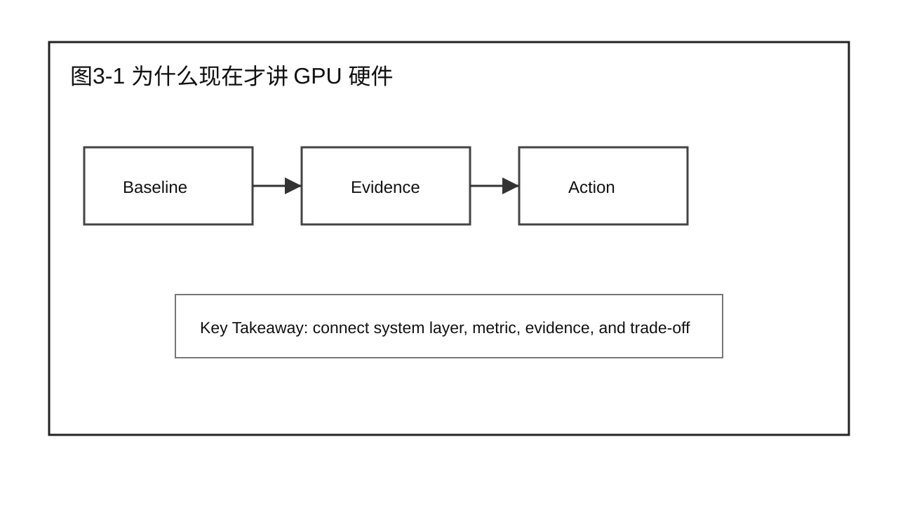
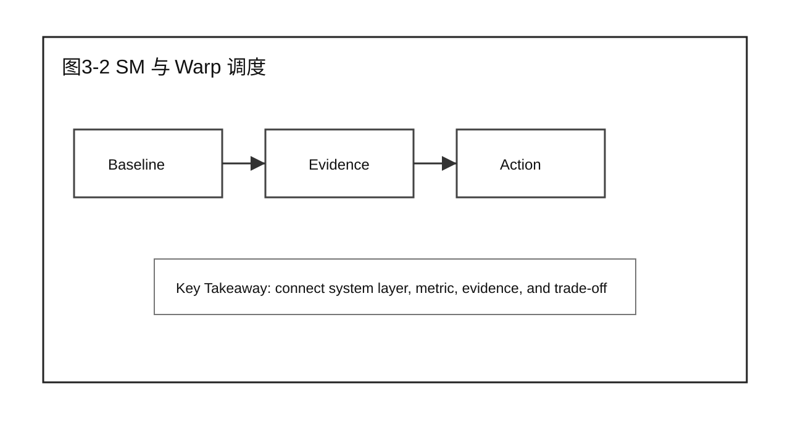
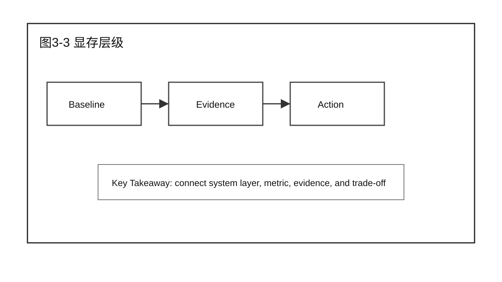
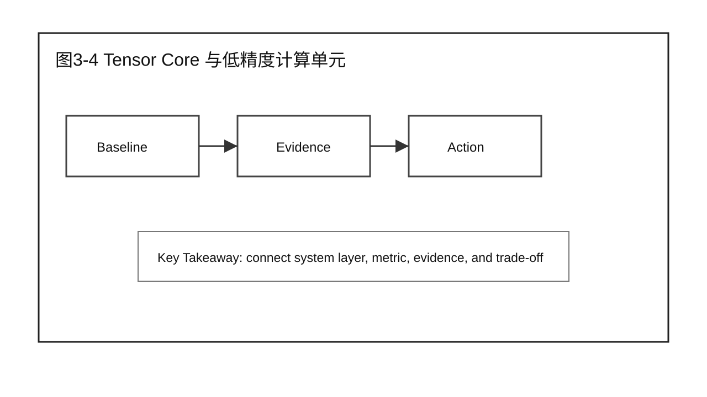
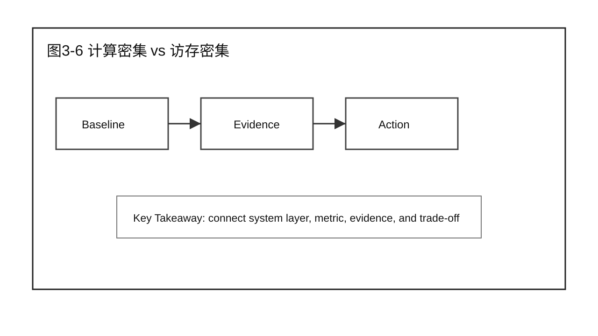
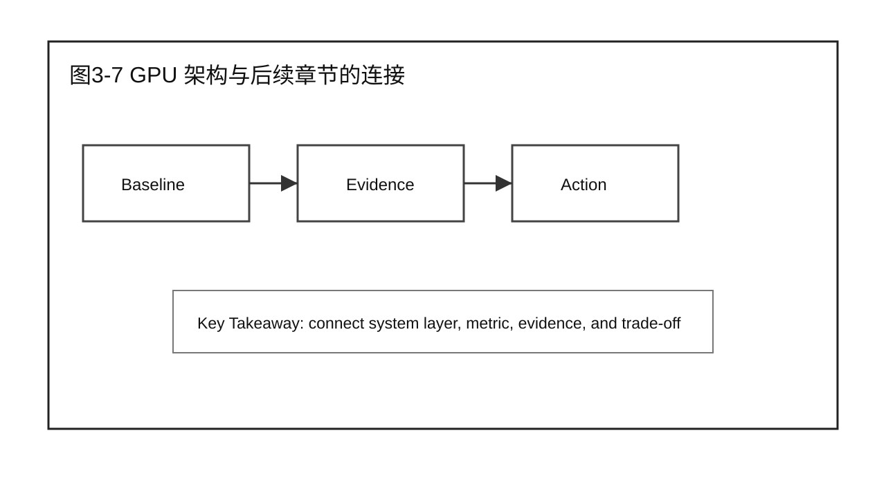
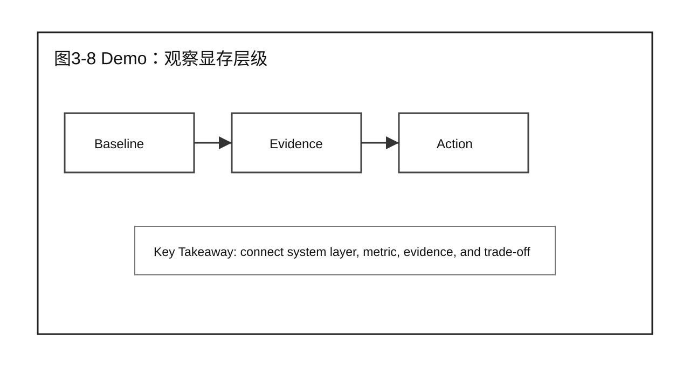
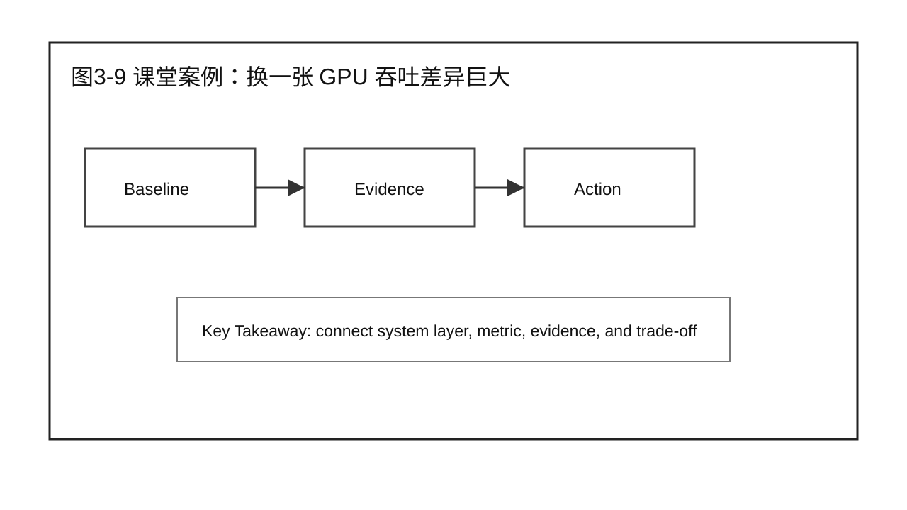
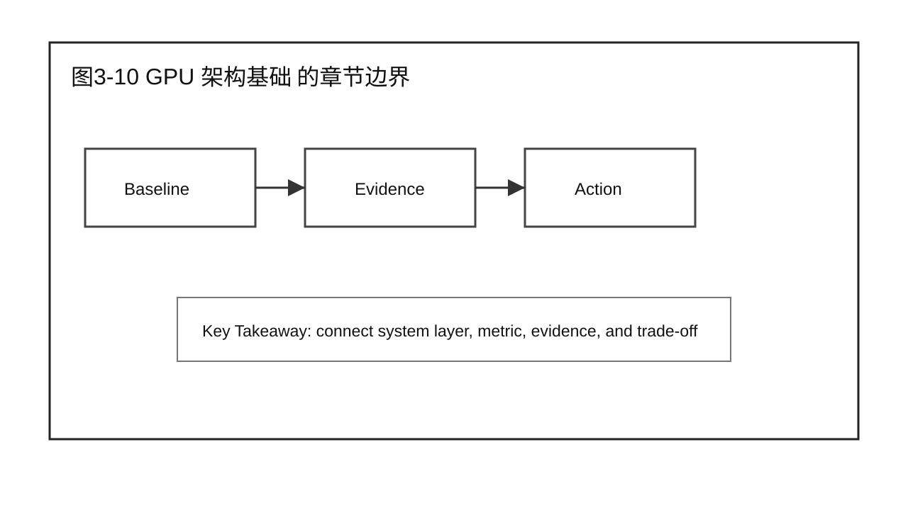

# 第 3 章 GPU 架构基础

## 学习目标

学完本章后，你应该能够：

- 回答本章核心问题：GPU 硬件内部是怎么组织算力和显存的？
- 说明本章内容在 Part 1 Understanding LLM Inference System（理解推理系统） 中的位置：它是后续所有性能分析的硬件前提。
- 为全书建立统一的硬件语言：SM、Warp、显存层级、Tensor Core、Occupancy，后续 Prefill/Decode 性能分析和 Profiling 工具链都要用到这里的概念。
- 区分算力、带宽、并行度三类不同的硬件约束，不把它们混为一谈。
- 用 Demo、课堂案例、补充案例和 Checklist 支撑 20 分钟以上讲授。

本章只建立硬件认知，不展开 Prefill、Decode 或任何优化技术的结论——那些留给后续章节。

## 核心问题

本章围绕四个问题展开：

1. GPU 硬件内部是怎么组织算力和显存的？
2. 这些硬件概念会在后续哪些章节被直接引用？
3. 需要哪些可观测证据（如 Nsight Compute 输出）才能把"硬件认知"落到"性能判断"？
4. 本章结束后，读者应该具备什么样的硬件语言基础？



图3-1：为什么现在才讲 GPU 硬件。

## 3.1 为什么现在才讲 GPU 硬件

第 1 章跟着一个请求走了一遍生命周期，第 2 章把系统拆成了 Gateway、Scheduler、Worker、Runtime 等组件——但这两章都还没回答一个更基础的问题：Worker/Runtime 最终提交给 GPU 的计算，在硬件内部到底是怎么被执行的。LLM 推理系统的所有性能现象——TTFT 高、TPOT 抖动、GPU Utilization 上不去——最终都要落回到一块 GPU 内部到底在做什么。如果不先建立硬件认知，后续讨论 Compute Bound、Memory Bound、Kernel Launch Overhead 时，读者只能记住名词，无法判断证据。本章不涉及 LLM 推理系统本身，只回答一个更基础的问题：一块 GPU 内部由什么组成，各部分各自负责什么。



图3-2：SM 与 Warp 调度。

## 3.2 SM（Streaming Multiprocessor）与 Warp 调度

SM 是 GPU 上执行计算的基本单元，一块 GPU 由多个 SM 组成；每个 SM 内部又以 Warp（通常 32 个线程一组）为调度单位并发执行指令。理解 SM 和 Warp 调度，是理解后续"为什么这段 kernel 没有把 GPU 跑满"的前提——很多看似"GPU 利用率不够"的现象，根因其实是 Warp 调度层面的资源限制或依赖等待，而不是算力不够。



图3-3：显存层级。

## 3.3 显存层级：HBM / L2 Cache / Shared Memory / Register

GPU 显存不是单一均质的资源，而是一套层级：HBM（High Bandwidth Memory，容量大但相对慢）、L2 Cache、每个 SM 私有的 Shared Memory、再到每个线程的 Register（最快但最稀缺）。LLM 推理里反复出现的"KV Cache 占显存"“HBM Bandwidth 是 Decode 的瓶颈"等结论，都建立在这套层级之上。本节要讲清楚：数据在这几层之间怎么移动，为什么"访存"本身就有成本，不是只有"计算"才耗时间。



图3-4：Tensor Core 与低精度计算单元。

## 3.4 Tensor Core 与低精度计算单元

Tensor Core 是专门加速矩阵乘法（GEMM）的硬件单元，是 LLM 推理里 Attention 和 MLP 层能跑快的关键；配合 FP16/BF16/FP8/INT8 等低精度计算路径，同样的硬件能在更短时间内完成更多矩阵运算，但也带来精度和数值稳定性的权衡。本节要说明：Tensor Core 利用率是判断"计算是否高效"的关键证据之一，后续 Chapter 11（Prefill 性能分析）会直接引用这个概念。


图3-5：Occupancy 与并行度。

## 3.5 Occupancy 与并行度

Occupancy 描述的是一个 SM 上实际活跃的 Warp 数量相对理论最大值的比例，受 Register、Shared Memory 用量和线程块配置共同约束。Occupancy 不是越高越好，但过低通常意味着 SM 大量时间在等待而不是计算。Nsight Compute 报告里的 Occupancy 指标，是后续 Profiling 章节判断"这段 kernel 有没有把硬件用满"的直接证据来源。



图3-6：从硬件到 Prefill / Decode：计算密集 vs 访存密集。

## 3.6 从硬件到 Prefill / Decode：计算密集 vs 访存密集

有了前面几节的硬件语言，就可以解释一个后续反复出现的结论：Prefill 通常是 Compute Bound（大批量矩阵乘法，吃满 Tensor Core），Decode 通常是 Memory Bound（逐 token 生成，小 batch 但要反复读取 KV Cache，受 HBM Bandwidth 限制）。这个差异不是经验规则，而是直接来自本章的硬件模型：计算密集型工作负载受 Tensor Core 吞吐限制，访存密集型工作负载受 HBM 带宽限制。Chapter 5（Global Performance Model）会把这个观察正式化。



图3-7：GPU 架构与后续章节的连接。

## 3.7 GPU 架构与后续章节的连接

本节做一次显式的前向索引，避免读者在后续章节看到硬件术语时找不到出处：Chapter 7（Profiling Toolchain）的 Nsight Compute 会直接输出 SM Occupancy、Tensor Core 利用率；Chapter 11（Prefill 性能分析）的 Roofline 模型建立在算力与带宽的比值上；Chapter 15（Decode 性能分析）的 HBM Bandwidth 和 CPU Dispatch / Kernel Launch Overhead 都要回到 SM 调度模型解释；Chapter 16（Decode 优化方法）的 CUDA Graph / Kernel Fusion / Persistent Kernel 本质上都是在减少本章讨论的调度和访存开销。



图3-8：Demo：用 nvidia-smi 和一次简单 kernel 观察显存层级。

## 3.8 Demo：用 nvidia-smi 和一次简单 kernel 观察显存层级

本章 Demo 用 `nvidia-smi` 查看显存占用和 GPU 基本信息，配合一段最小 kernel（或已有 Profiling 工具的示例 trace）观察 SM Occupancy 和显存带宽利用率。目标是让读者在动手环境里对上号：显存层级、SM、Occupancy 这些名词分别对应屏幕上的哪一行数字，而不是替代真正的性能 Benchmark 结论。

## 3.9 课堂案例：同一个模型，为什么换一张 GPU 吞吐差异巨大

同一个 LLM 模型部署在两种不同型号的 GPU 上，吞吐差异远超"算力 TFLOPS 差了多少倍"这个直觉判断。团队一开始把差异归因于框架版本，后来发现根因是两张卡的 HBM Bandwidth 和显存容量差异，直接影响了 KV Cache 能放多少、Decode 阶段能跑多大 batch。课堂讨论要强调：脱离硬件规格谈"哪个更快"是没有意义的，必须先看具体是 Compute Bound 还是 Memory Bound。

课堂讨论：

1. 这个案例最容易被误判成哪个问题？
2. 还缺哪两类证据（硬件规格 + Profiling 输出）才能确认根因？
3. 哪些结论只属于本章边界，不能推广到具体的 Prefill/Decode 优化建议？

### 补充案例 A：显存足够但吞吐上不去

一个团队观察到显存占用远未打满，但吞吐（TPS）依然上不去。讨论重点：显存容量不是唯一约束，SM Occupancy 和 Warp 调度同样可能是瓶颈，不能只看显存这一个维度。

### 补充案例 B：换了低精度之后吞吐没有明显提升

团队把模型从 FP16 切换到 FP8，期望吞吐翻倍，但实际提升有限。讨论重点：如果原本就不是 Compute Bound（比如 Decode 阶段是 Memory Bound），提升算力路径的收益天然有限——这是本章"计算密集 vs 访存密集"划分的直接应用。

### 贯穿案例：为企业问答服务建立硬件基线

后续章节会反复使用一个企业问答服务的案例。本章负责为这个案例建立最基础的硬件基线：

```text
现象：暂无性能问题，处于项目最早期。
目标：在优化任何东西之前，先确认部署硬件的算力、显存容量、显存带宽规格。
产出：一张硬件规格表，作为后续 Chapter 4-30 分析和优化的共同参照系。
边界：本章不判断当前部署是否合理，只建立事实基础。
```



图3-9：课堂案例：同一个模型，为什么换一张 GPU 吞吐差异巨大。

## 3.10 常见误区

误区一：把 GPU 显存占用等同于"够不够用"。

显存容量只是约束之一。SM Occupancy、Warp 调度和 HBM Bandwidth 同样决定实际能跑多快，不能只看显存这一个数字。

误区二：认为算力（TFLOPS）越高，LLM 推理就一定越快。

如果工作负载是 Memory Bound（典型如 Decode 阶段），提升算力的收益有限；必须先判断当前负载属于计算密集还是访存密集，再谈硬件选型或优化方向。

误区三：把本章当成"选购 GPU 指南"。

本章目标是建立分析所需的硬件语言，不是给出选型结论——选型要结合具体 workload、成本模型和后续章节的性能分析方法，属于本章边界之外的问题。



图3-10：GPU 架构基础 的章节边界。

## 本章总结

本章回答了"GPU 硬件内部是怎么组织算力和显存的？"这个问题。它不涉及 LLM 推理系统本身，只建立后续全部章节共用的硬件语言：SM 与 Warp 调度、显存层级、Tensor Core、Occupancy，以及由此推导出的计算密集 vs 访存密集划分。

本章的最低完成标准是：读者能看懂后续章节里"SM Occupancy 低"“HBM Bandwidth 打满"“Compute Bound”这类表述具体指什么，并知道去哪里找对应的 Profiling 证据。

### 本章 Checklist

- [ ] 能说明 SM、Warp、显存层级、Tensor Core、Occupancy 各自的角色。
- [ ] 能解释为什么 Prefill 通常是 Compute Bound、Decode 通常是 Memory Bound。
- [ ] 能说出本章硬件概念分别会在哪些后续章节被直接引用。
- [ ] 能用 `nvidia-smi` 或类似工具读出基本的显存和 GPU 信息。
- [ ] 能说明本章边界：不下选型结论，不展开具体优化技术。

## 课后练习

1. 查一张你熟悉的 GPU 型号的显存容量、显存带宽和算力规格，写一段 100 字以内的硬件画像。
2. 用一句话分别解释 SM Occupancy 和 HBM Bandwidth 各自回答什么问题。
3. 判断一个具体场景（如你熟悉的某个模型 + 某个 batch size）更接近 Compute Bound 还是 Memory Bound，并说明依据。
4. 找出本章提到的一个硬件概念，说明它会在后续哪一章被再次用到。
5. 写一段 200 字以内的摘要，说明本章为什么排在 Lifecycle（第 1 章）和 Architecture（第 2 章）之后，而不是放在全书最开头。
