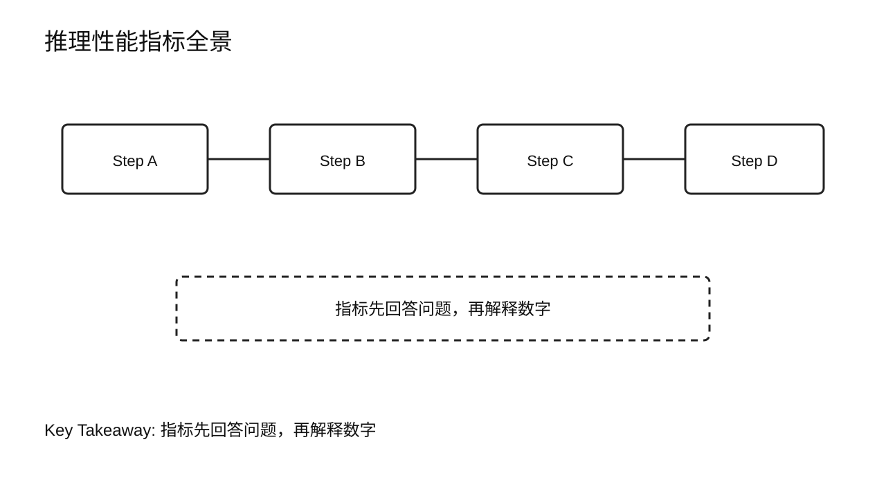
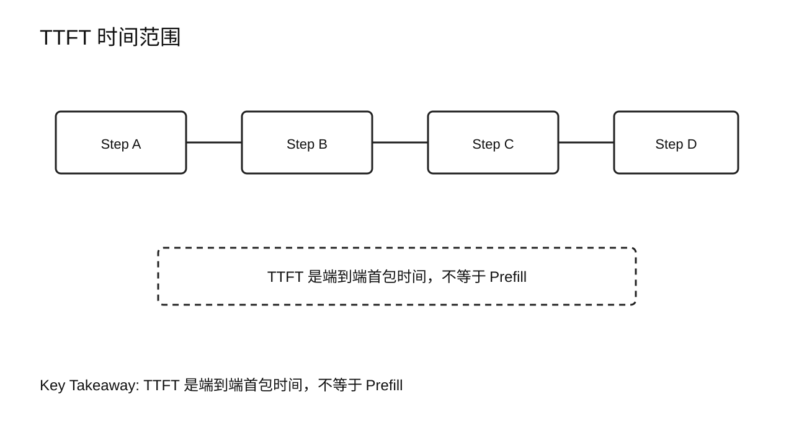
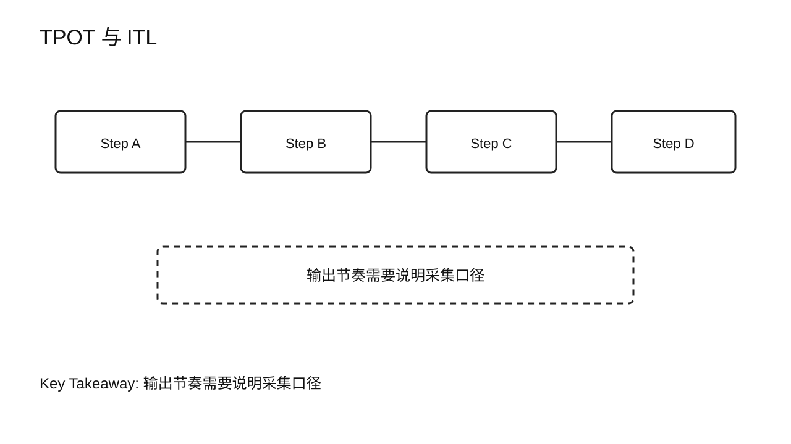
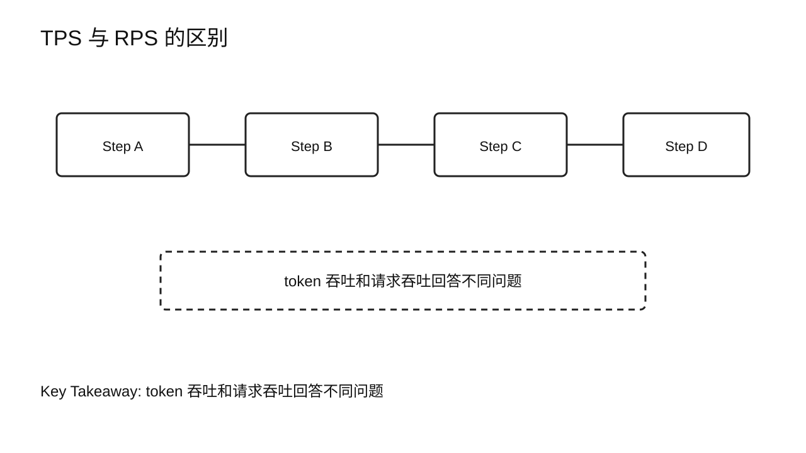
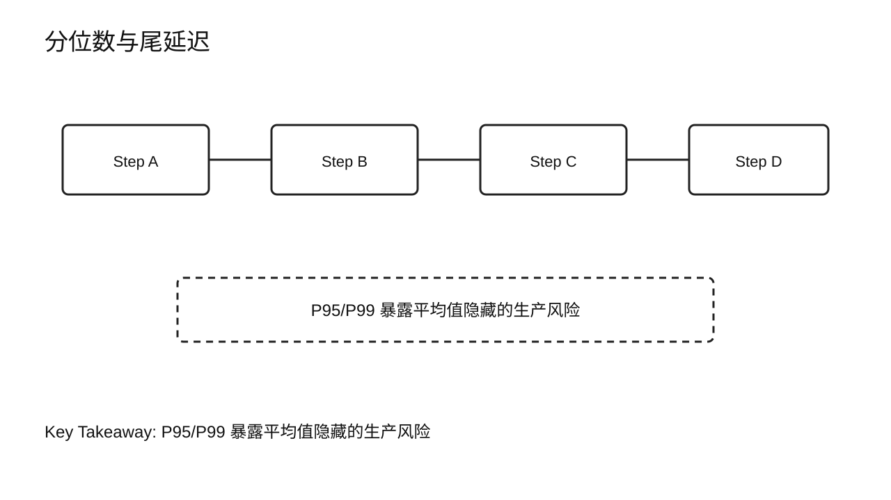
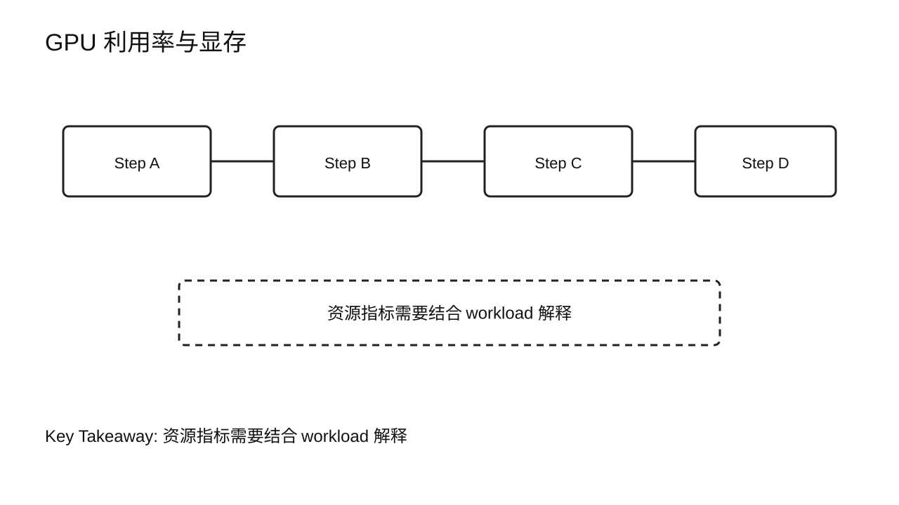
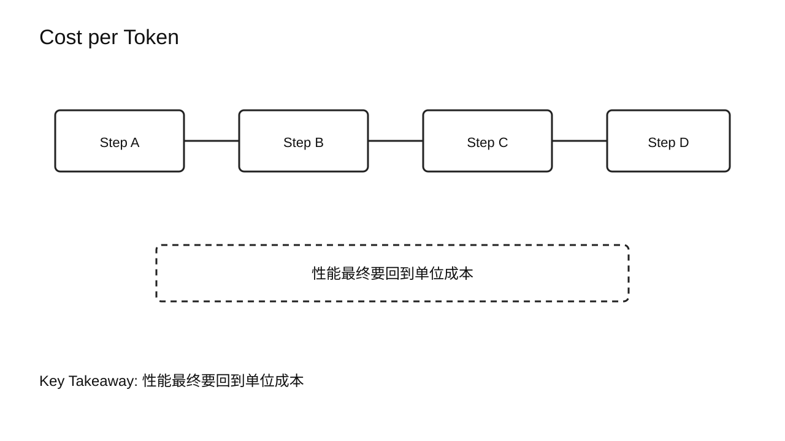
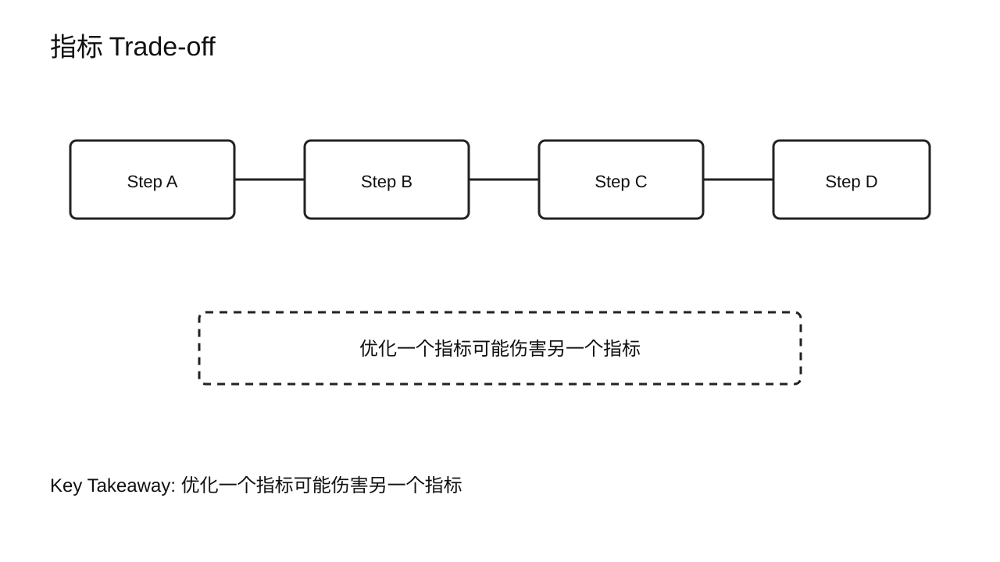
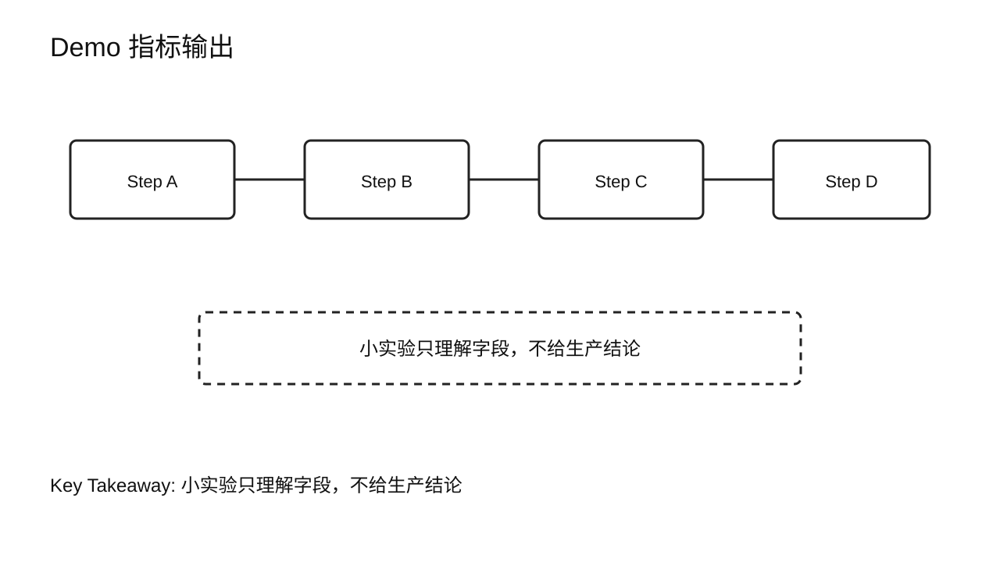
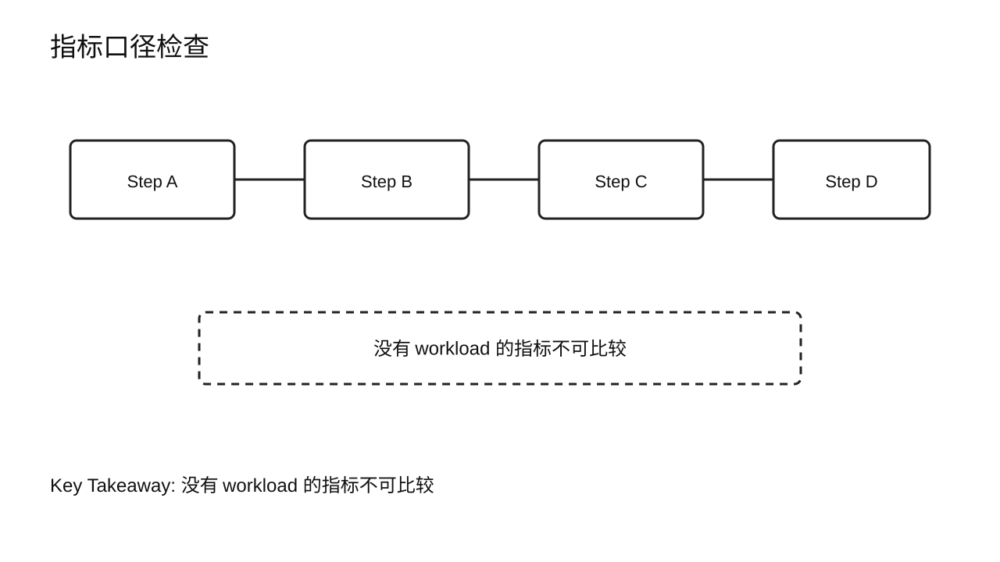

# 第 4 章 Performance Metrics

## 学习目标

学完本章后，你应该能够：

- 定义 TTFT、TPOT / ITL、TPS、RPS、GPU Utilization、GPU Memory、P50 / P95 / P99 和 Cost per Token。
- 判断每个指标回答的是用户体验、系统吞吐、资源利用还是成本问题。
- 区分单次请求指标、聚合指标和尾延迟指标。
- 说明为什么不能用一个平均 tokens/s 判断在线推理系统。
- 用一个小实验采集并解释客户端观察到的基础指标。

第 1 章讲完请求生命周期后，本章把生命周期转成指标语言。指标不是为了做漂亮报表，而是为了把“慢”“卡”“贵”“不稳定”这些模糊反馈变成可比较、可复现的问题。

## 核心问题

1. 如何评价一个推理系统？
2. 哪些指标描述用户体验，哪些指标描述系统吞吐？
3. 为什么 P95 / P99 比平均值更接近生产风险？
4. Cost per Token 如何把性能问题连接到工程决策？



图4-1：推理性能指标全景。

## 4.1 指标先回答问题

指标必须先绑定问题。否则数字越多，判断越乱。

用户问“为什么半天没反应”，优先看 TTFT。用户问“输出怎么一卡一卡”，优先看 TPOT / ITL。平台问“这组 GPU 能支撑多少流量”，要看 TPS、RPS、并发、GPU Utilization 和显存。财务或业务问“每次回答成本是否可控”，就要看 Cost per Token。

本章把常用指标分成四类：

| 类别 | 典型指标 | 关注点 |
|---|---|---|
| 首响体验 | TTFT | 第一个 token 多久出现 |
| 输出节奏 | TPOT / ITL | 后续 token 是否稳定 |
| 系统吞吐 | TPS / RPS / Concurrency | 单位时间处理能力 |
| 资源与成本 | GPU Utilization / GPU Memory / Cost per Token | 资源是否有效转化为服务能力 |

指标之间会互相影响。提高 batch size 可能提升 TPS，但也可能拉长 TTFT 或尾延迟。降低 max tokens 可以减少成本，但可能影响回答质量。性能工程的难点就在这里：不是追求单个数字最大，而是在约束下做取舍。

## 4.2 TTFT：Time To First Token

TTFT 表示从客户端发起请求，到第一个生成 token 被客户端观察到之间的时间。

```text
TTFT = first_token_arrival_time - request_start_time
```

它通常反映首响体验。对于聊天、搜索问答、Copilot、Agent 控制台这类交互式场景，TTFT 很重要。用户可以接受完整答案需要几秒，但很难接受长时间毫无反馈。

TTFT 可能包含：

- Gateway 处理。
- Queue 等待。
- Tokenization。
- Prefill。
- 第一个 token 采样。
- 首个流式 chunk 返回。

所以 TTFT 不是 Prefill 的同义词。它是端到端首包指标。要定位根因，需要结合生命周期和 profiling，而不是只看一个数字。



图4-2：TTFT 时间范围。

## 4.3 TPOT / ITL：输出节奏

TPOT 是 Time Per Output Token，ITL 是 Inter-Token Latency。两者都用来描述生成过程中的输出节奏。

在流式响应中，ITL 可以理解为相邻两个输出 token 或 chunk 到达客户端的间隔：

```text
ITL_i = token_i_time - token_{i-1}_time
```

TPOT 通常描述平均每个输出 token 花费的时间：

```text
TPOT = decode_time / output_tokens
```

实际系统里，客户端可能按 chunk 接收，而不是严格逐 token 接收。所以日志中的 ITL 有时是 chunk 间隔，服务端指标中的 TPOT 更接近模型生成节奏。写报告时要说清楚采集口径。

ITL 或 TPOT 偏高，用户会觉得模型打字慢；波动大，用户会觉得输出卡顿。常见原因可能在 Decode、KV Cache 读取、batch 调度、采样、网络发送或客户端渲染。



图4-3：TPOT 与 ITL。

## 4.4 TPS 与 RPS：吞吐不是一种指标

TPS 是 Tokens Per Second，表示单位时间生成多少 token。RPS 是 Requests Per Second，表示单位时间完成或接收多少请求。

这两个指标回答的问题不同：

- TPS 适合衡量生成 token 的总体产能。
- RPS 适合衡量请求处理能力。

一个系统可能 TPS 很高，但 RPS 不高，因为每个请求都生成很长。另一个系统可能 RPS 很高，但 TPS 一般，因为每个请求输出很短。

所以吞吐指标必须和 workload 一起报告。至少要说明：

- prompt 长度分布。
- output 长度分布。
- concurrency。
- stream 与非 stream。
- 模型和硬件。
- 采样参数。

脱离 workload 的 TPS 数字很容易误导。



图4-4：TPS 与 RPS 的区别。

## 4.5 P50 / P95 / P99：尾延迟

平均值会隐藏生产风险。在线服务更关心分位数。

P50 表示一半请求低于这个延迟。P95 表示 95% 请求低于这个延迟。P99 表示 99% 请求低于这个延迟。

如果平均 TTFT 是 500ms，但 P99 TTFT 是 8s，用户仍然会大量投诉。因为少数慢请求在真实产品中并不少见：长 prompt、队列拥塞、冷启动、调度不公平、网络抖动、GPU 显存紧张，都可能把尾部拉长。

分位数要和样本量一起看。10 个请求算出来的 P99 没有太大意义。做 benchmark 时要有足够请求数、重复运行和稳定 workload。



图4-5：分位数与尾延迟。

## 4.6 GPU Utilization 与 GPU Memory

GPU Utilization 表示 GPU 某段时间是否忙。GPU Memory 表示显存占用情况。

这两个指标很重要，但不能单独下结论。

GPU Utilization 高，可能说明 GPU 被充分使用；也可能说明请求排队严重、batch 太大、尾延迟变差。GPU Utilization 低，可能说明 batch 太小、调度有空洞、CPU 或网络成为瓶颈，也可能说明 workload 本来就很轻。

GPU Memory 也类似。显存占用高不一定坏，如果它主要用于有效的 KV Cache 和 batch 容量，可能提升吞吐。但显存接近上限时，系统可能更容易触发抢占、拒绝请求或 OOM。

本章只讲指标意义。第 7 章会讲如何用工具采集，第 21 到第 25 章会讨论容量和扩展。



图4-6：GPU 利用率与显存。

## 4.7 Cost per Token：性能最终要回到成本

推理系统不是跑得越快越好，还要看成本是否能承受。

Cost per Token 可以粗略理解为单位 token 的资源成本：

```text
Cost per Token = total_serving_cost / generated_tokens
```

实际计算时，可以按小时 GPU 成本、实例成本、运维成本、请求量和 token 量估算。不同团队会有不同口径，但必须保持口径一致。

Cost per Token 适合回答这些问题：

- 当前服务是否有商业可持续性？
- 优化吞吐是否真的降低单位成本？
- 更贵的 GPU 是否因为吞吐提升而更划算？
- 长输出、长上下文、低并发是否推高成本？

成本指标会把技术选择拉回现实。某个优化让 TPS 提升 20%，但显存占用翻倍、P99 延迟恶化、工程复杂度明显上升，就未必值得上线。



图4-7：Cost per Token。

## 4.8 指标之间的 Trade-off

推理性能指标不是独立旋钮。常见 trade-off 包括：

- 提高 batch size：可能提升 TPS，但增加排队和单请求延迟。
- 降低 max tokens：降低总成本，但可能影响回答完整性。
- 增加并发：提升资源利用率，但可能拉高 P95 / P99。
- 使用更激进量化：降低显存和成本，但可能引入精度或质量风险。
- 开启缓存复用：降低重复 Prefill，但需要额外缓存管理和命中率评估。

这就是为什么本课程强调“先分析，后优化”。指标是用来约束优化目标的，不是用来挑一个最好看的数字。



图4-8：指标 Trade-off。

## 4.9 Demo：采集一次客户端指标

本章可以继续使用 `chapter02/demo/demo.py` 做一个小实验。它不是完整 benchmark，只是帮你理解指标字段。

```bash
python3 chapter02/demo/demo.py \
  --base-url http://127.0.0.1:8000/v1 \
  --model Qwen/Qwen2.5-0.5B \
  --prompt "请用中文解释 TTFT、ITL、TPS 的区别。" \
  --max-tokens 160 \
  --requests 3 \
  --concurrency 1
```

观察：

- `ttft_ms`：每个请求的首包时间。
- `itl_avg_ms`、`itl_p50_ms`、`itl_p95_ms`：流式输出间隔。
- `tokens_per_second`：客户端观察到的输出速度。
- `total_latency_ms`：完整请求耗时。

这里的请求数很少，不足以得出生产结论。它只用于理解字段。可信 benchmark 要在第 6 章建立。



图4-9：Demo 指标输出。

## 4.10 课堂案例：同一个系统，为什么两份报告结论相反

假设两个团队同时评估一个 LLM 服务。

平台团队的报告说：

| 指标 | 结果 |
|---|---|
| TPS | 提升 35% |
| GPU Utilization | 从 52% 提升到 78% |
| GPU Memory | 从 42GB 提升到 67GB |

产品团队的报告却说：

| 指标 | 结果 |
|---|---|
| TTFT P95 | 从 1.2s 变成 2.8s |
| ITL P95 | 从 45ms 变成 80ms |
| 用户取消率 | 上升 |

这两份报告不一定矛盾。平台团队可能把 batch size 或并发提高了，GPU 吃得更满，整体 TPS 确实上去了。但产品团队看到的是交互体验：更多请求在队列里等，流式输出间隔变大，尾部用户更难受。

课堂上可以让学员回答三个问题：

1. 如果只看平台团队报告，会做出什么错误判断？
2. 如果只看产品团队报告，又会漏掉什么信息？
3. 如果你要写一份完整性能报告，至少还要补哪些 workload 信息？

一份合格的推理性能报告，应该同时给出 workload、用户体验指标、吞吐指标、资源指标和成本指标。尤其要报告分位数，而不是只报告平均值。

这个案例的重点是：指标不是为了证明某个优化“赢了”，而是为了让不同角色讨论同一个事实。

### 补充案例 A：离线批处理和在线聊天的指标优先级不同

同一个模型可以服务两类任务：

| 场景 | 更关注的指标 | 原因 |
|---|---|---|
| 在线聊天 | TTFT、ITL、P95 / P99 | 用户在等待输出 |
| 离线批处理 | TPS、Cost per Token、失败率 | 用户不盯着每个 token |

如果团队用离线批处理的指标去评价在线聊天，就可能得出错误结论：TPS 很高，但用户觉得慢。反过来，如果用在线聊天的 TTFT 标准去评价夜间离线任务，也可能过度优化首响，忽略单位成本。

课堂讨论：一个“合同批量审阅”任务应该更像在线聊天还是离线批处理？如果用户要求页面实时显示进度，指标优先级会不会变化？

### 补充案例 B：同样的 P95，在不同样本量下意义不同

假设两份测试都报告 `TTFT P95 = 2s`。

| 测试 | 请求数 | 是否可信 |
|---|---:|---|
| A | 20 | 很弱，只能粗看 |
| B | 20,000 | 更适合讨论尾延迟 |

P95 是分位数，不是魔法数字。样本太少时，分位数非常不稳定。课堂上可以让学员思考：如果只跑 20 个请求，应该如何表述结论？比较稳妥的说法是“这组小样本中观察到首包时间最高接近某个范围”，而不是宣称系统 P95 已经稳定。

这个案例帮助学员建立报告口径意识：指标名称、采集口径、样本量和 workload 必须一起出现。

## 4.11 常见误区

误区一：只看平均 tokens/s。

平均 tokens/s 不能代表首响、尾延迟、成本和稳定性。

误区二：把客户端指标和服务端指标混在一起。

客户端看到的是端到端结果，服务端能拆得更细。两者都重要，但口径不同。

误区三：不报告 workload。

没有 prompt 长度、output 长度、并发和采样参数，指标无法比较。

误区四：把一次实验结果当结论。

性能实验需要重复运行、控制变量和报告分布。



图4-10：指标口径检查。

## 本章总结

本章建立了评价 LLM 推理系统的基础指标。

TTFT 描述首包体验，TPOT / ITL 描述输出节奏，TPS 和 RPS 描述吞吐，P50 / P95 / P99 描述延迟分布，GPU Utilization 和 GPU Memory 描述资源状态，Cost per Token 把性能拉回成本。每个指标都有使用边界，不能脱离 workload 和采集口径解释。

下一章会把这些指标放进全局性能模型，讨论 `Latency = Queue + Prefill + Decode`，以及 Compute、Memory、Scheduling 等瓶颈如何影响多个指标。

### 本章 Checklist

- [ ] 能定义 TTFT、TPOT / ITL、TPS、RPS。
- [ ] 能解释 P50 / P95 / P99 的含义。
- [ ] 能说明 GPU Utilization 高不一定代表用户体验好。
- [ ] 能说明 Cost per Token 的基本口径。
- [ ] 能指出一个指标报告缺少 workload 时为什么不可比。

## 课后练习

1. 用 100 字以内解释 TTFT 和 TPOT / ITL 的区别。
2. 设计一个最小指标表，包含用户体验、吞吐、资源和成本四类指标。
3. 运行本章 Demo，记录 3 次请求的 `ttft_ms` 和 `total_latency_ms`。
4. 写出一个可能提升 TPS 但伤害 P99 的调参例子。
5. 课堂讨论：如果老板只要求“把 tokens/s 提高 30%”，你会补问哪些指标和 workload 条件？
