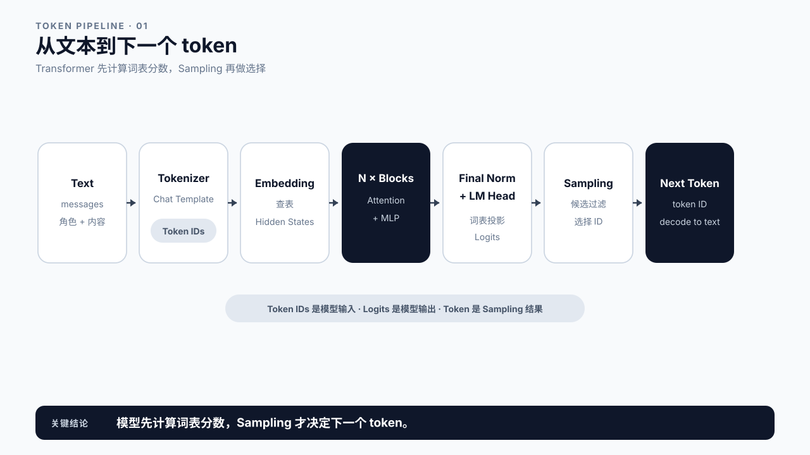
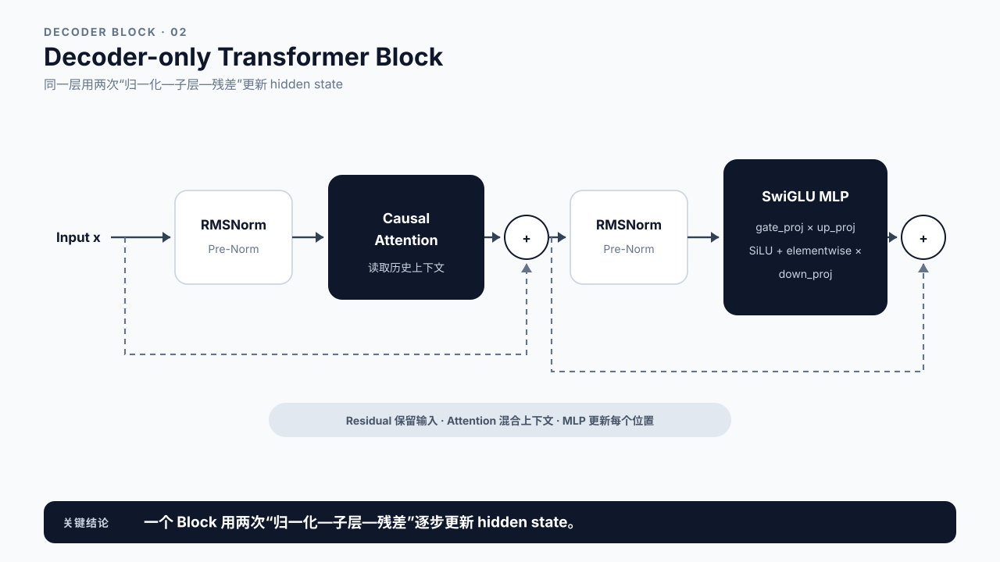
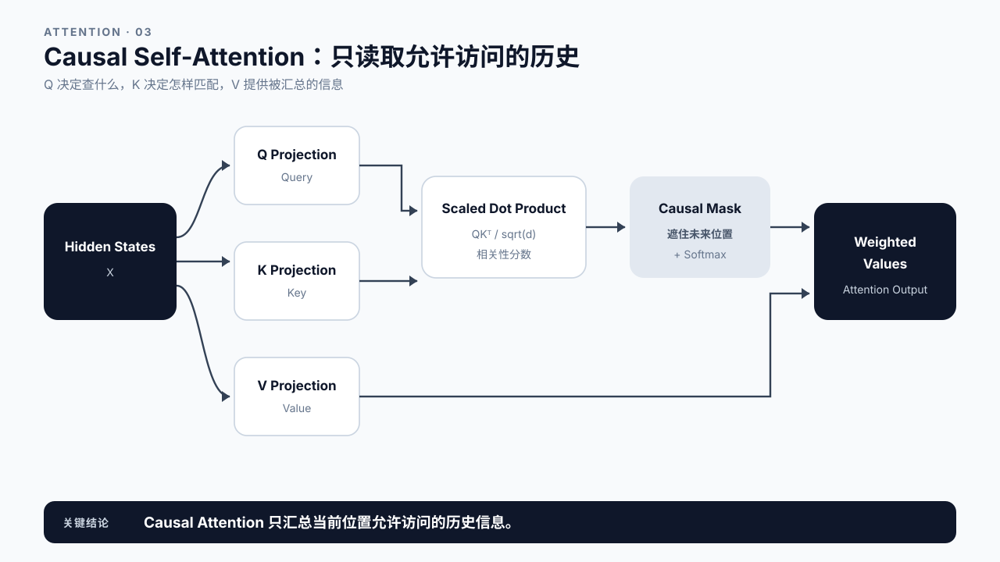
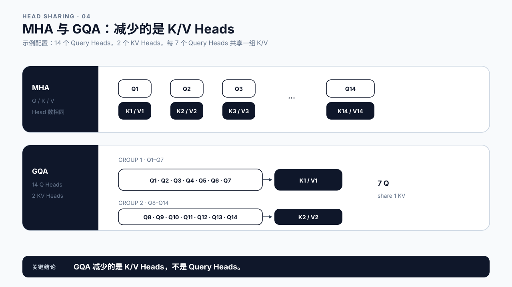
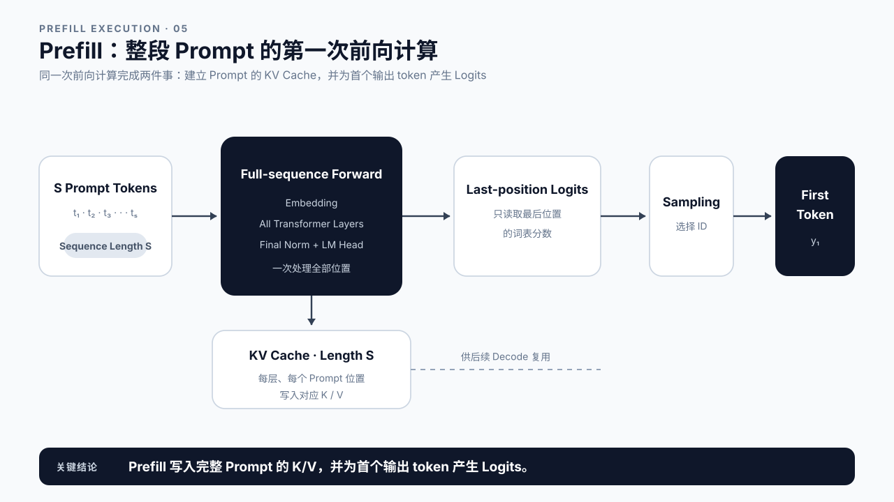
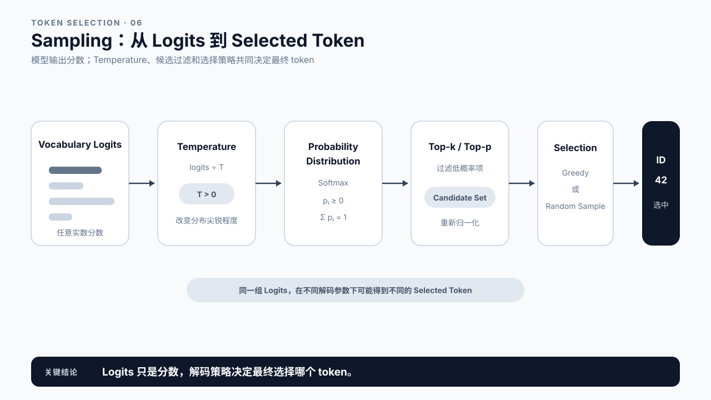
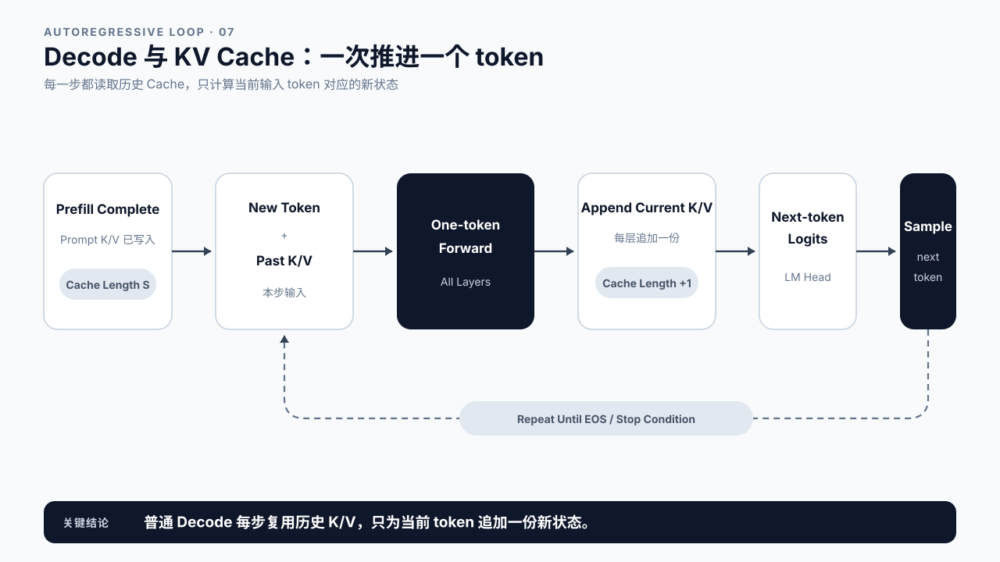
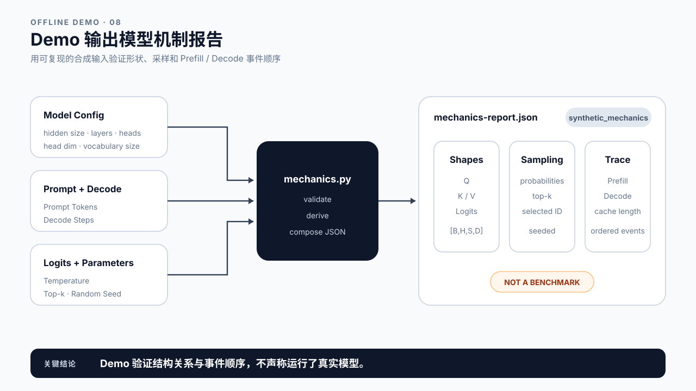

# 第 4 章 Transformer 推理机制：模型怎样生成下一个 token

## 学习目标

学完本章后，你应该能够：

- 从文本输入开始，按顺序解释 Tokenizer、Embedding、Transformer Blocks、LM Head、Logits 和 Sampling。
- 说明 Decoder-only Transformer Block 中 Attention、MLP、归一化和残差连接的关系。
- 用张量形状解释 Multi-Head Attention 与 Grouped Query Attention 的差别。
- 区分 Prefill 和 Decode 两种执行形态，并说明第一个输出 token 在哪里产生。
- 解释 KV Cache 保存什么，以及普通 Decode step 为什么只输入一个新 token。
- 运行合成机制 Demo，核对张量形状、Sampling 候选和 KV Cache 增长事件。

第 2 章从请求视角定义了生命周期，第 3 章从系统视角划分了组件。本章进入 Worker 内部，只回答一个问题：模型拿到 token IDs 后，怎样一步步产生下一个 token？

本章讲机制，不评价速度。GPU 为什么会限制这些计算，放到第 5 章；TTFT、TPOT 和 TPS 怎样定义，放到第 6 章；Prefill 与 Decode 的专项性能分析和优化则在后续 Part 展开。

## 核心问题

1. 文本怎样变成模型能够计算的张量，再变回输出 token？
2. Self-Attention 在一次前向计算中做了什么？
3. Prefill 与 Decode 为什么使用同一个模型，却呈现两种执行形态？
4. Sampling 怎样把 Logits 变成一个具体 token？
5. KV Cache 在两种执行形态之间保存了什么状态？

## 4.0 从文本到下一个 token

一次模型调用可以先压缩成七步：

```text
文本
  -> Tokenizer / Chat Template
  -> Token IDs
  -> Embedding
  -> N 个 Transformer Blocks
  -> Final Norm + LM Head
  -> Logits
  -> Sampling
  -> 下一个 token
```

Tokenizer 把字符串切分并映射成整数 ID。Embedding 根据每个 ID 查表，得到 hidden state。随后，hidden state 依次穿过多层 Transformer Block。最后的 LM Head 把 hidden state 投影到词表维度，为词表中的每个 token 产生一个 Logit。Sampling 再从这组分数中选出一个 token。

模型并不是直接输出“字”。它每次输出 token ID，客户端最后看到的文本来自 Tokenizer 的反向解码。中文字符、英文单词、空格和标点如何组合，取决于模型使用的词表。



图4-1：从文本到下一个 token。

## 4.1 Tokenizer、Chat Template 与 Embedding

聊天模型收到的输入通常是 messages，而不是一段已经拼好的纯文本。Chat Template 会插入角色标记、分隔符和生成起始标记，然后 Tokenizer 才把序列编码成 token IDs。

例如，同样一句“你好”，作为 system、user 或 assistant 内容时，最终输入序列可能不同。服务端看到的 prompt_tokens 因此不只取决于用户可见字符，还包括模板添加的控制 token。

得到 token IDs 后，模型使用 Embedding 矩阵查找向量。若 batch 为 B、序列长度为 S、hidden size 为 H，那么：

```text
token_ids:      [B, S]
hidden_states:  [B, S, H]
```

Embedding 不理解词义，它只是一个可训练查找表。上下文关系要等 hidden states 进入 Transformer Blocks 后才逐层形成。

现代模型还需要位置信息。Qwen2.5 使用 RoPE，把位置信息作用到 Attention 的 Query 和 Key；它不像 GPT-2 那样再查一张绝对位置 Embedding 表并与 Token Embedding 相加。不同模型家族的具体实现可以不同，但后面的主流程仍然是 Attention、MLP 和输出投影。

## 4.2 Decoder-only Transformer Block

在线生成常用 Decoder-only Transformer。以 Qwen2.5 一类现代模型为例，一个 Block 可以写成：

```text
x = x + Attention(RMSNorm(x))
x = x + MLP(RMSNorm(x))
```

两次 RMSNorm 把输入缩放到更稳定的数值范围。Attention 让当前位置读取允许访问的上下文，MLP 则对每个位置的表示做非线性变换。两个子层外面的 Residual Connection 把输入直接加回输出，让信息和梯度能够跨层传播。

Qwen2.5 的 MLP 使用 SwiGLU。简化写法是：

```text
MLP(x) = down_proj(
           silu(gate_proj(x)) * up_proj(x)
         )
```

gate_proj 与 up_proj 并行扩展 hidden dimension，逐元素相乘后，再由 down_proj 投影回 hidden size。本章只需要认出这条数据流，不比较不同激活函数或 Kernel 的性能。

一个模型有 N 层 Block，同样的结构会重复 N 次，但每层使用自己的参数。最后再经过 Final RMSNorm 和 LM Head，得到 Logits。



图4-2：Decoder-only Transformer Block。

## 4.3 Causal Self-Attention

Self-Attention 的输入是当前层 hidden states X。模型使用三组线性投影生成 Query、Key 和 Value：

```text
Q = X Wq
K = X Wk
V = X Wv
```

单个 Attention Head 的核心计算可以写成：

```text
Attention(Q, K, V)
  = softmax(Q Kᵀ / sqrt(d) + causal_mask) V
```

Query 表示当前位置想查什么，Key 表示各位置可以怎样被匹配，Value 是匹配后要汇入当前位置的信息。Q 与 K 的点积产生相关性分数，缩放和掩码处理后经过 Softmax，再对 V 做加权求和。

Decoder-only 模型必须使用 Causal Mask。第 i 个位置只能访问自己和之前的位置，不能偷看未来 token。对 Prompt 做 Prefill 时，所有位置虽然可以并行计算，但每个位置仍受同一个因果约束。

RoPE 通常作用在 Q 和 K 上，使点积带有相对位置信息。它改变的是匹配方式，不改变 Value 中保存的内容。



图4-3：Causal Self-Attention。

## 4.4 Multi-Head Attention 与 GQA

Multi-Head Attention 把 hidden dimension 切成多个 Head。不同 Query Heads 可以关注不同模式，再把各 Head 输出拼接并投影回 hidden size。

在标准 MHA 中，Query、Key、Value 的 Head 数相同：

```text
Q heads = 14
K heads = 14
V heads = 14
```

Grouped Query Attention 保留较多 Query Heads，但让一组 Query Heads 共享一组 K/V Heads。以课程 Demo 的配置为例：

```text
num_attention_heads = 14
num_kv_heads        = 2
query_groups        = 14 / 2 = 7
```

因此，14 个 Query Heads 被分成两组，每 7 个 Query Heads 共享一组 K/V。若 batch 为 B、序列长度为 S、head dimension 为 D，逻辑形状是：

```text
Q: [B, 14, S, D]
K: [B,  2, S, D]
V: [B,  2, S, D]
```

GQA 不代表只有两个 Attention Heads。Query 仍有 14 个 Head，只是需要保存和读取的 K/V Head 更少。它为什么影响显存容量与带宽，第 5 章再解释；这里先把结构关系讲清楚。



图4-4：MHA 与 GQA。

## 4.5 Prefill：一次处理整段 Prompt

模型第一次看到请求时，输入不是一个 token，而是完整 Prompt 的 S 个 tokens。所有 Prompt 位置依次通过 Embedding 和 N 层 Transformer Block，这次前向过程称为 Prefill。

Prefill 做两件关键事情：

1. 为每一层、每个 Prompt 位置计算 Key 和 Value，并写入 KV Cache。
2. 取得最后一个 Prompt 位置的 Logits，用于选择第一个输出 token。

模型实际上会为每个输入位置产生 Logits，但自回归生成只需要最后一个有效位置的 Logits 来继续。经过 Sampling 后得到第一个输出 token。

需要注意顺序：

```text
Prompt tokens
  -> Prefill forward
  -> last-position logits
  -> Sampling
  -> first generated token
```

所以“Prefill 完成”与“第一个 token 已被选出”并不是同一个计算动作。前者产生 Logits，后者由 Sampling 决定具体 token。服务端何时记录 first_token 事件，还会受到框架埋点位置影响，第 2 章已经说明这一点。



图4-5：Prefill。

## 4.6 Sampling：从 Logits 选择 token

Logits 是一组未归一化分数，长度等于词表大小。Sampling Pipeline 通常先做温度缩放，再根据 Top-k、Top-p 等规则缩小候选集合，最后选出一个 token。

Temperature 的简化公式是：

```text
p_i = softmax(logit_i / temperature)
```

温度较低时，较大的 Logit 会获得更集中的概率；温度较高时，概率分布更平。Temperature 等于零通常表示采用 Greedy Decoding，直接选择最大 Logit，而不是执行除零。

Top-k 只保留分数最高的 k 个候选，Top-p 则保留累计概率达到阈值的一组候选。两者可以单独使用，也可以组合。采样规则会影响输出多样性和可复现性，但本章不讨论答案质量评测。

Sampling 每一步都要执行。Prefill 后采样出第一个输出 token；每个 Decode step 又产生新 Logits，再采样下一个 token。直到遇到 EOS、Stop Sequence、最大输出长度或取消信号，生成才结束。



图4-6：Sampling。

## 4.7 Decode：一次消费一个新 token

第一个输出 token 被选出后，它会成为下一次模型前向的输入。此时不需要重新计算整个 Prompt，因为 Prefill 已经把历史位置的 K/V 保存在 KV Cache 中。

普通 Decode step 的数据流是：

```text
new token
  + past_key_values
  -> one-token forward
  -> append this token's K/V
  -> next-token logits
  -> Sampling
  -> next token
```

假设 Prompt 长度为 8：

| 执行 | 本次输入 token 数 | 执行后 KV Cache 长度 | 产生的输出 |
|---|---:|---:|---|
| Prefill | 8 | 8 | 第 1 个输出 token |
| Decode step 1 | 1 | 9 | 第 2 个输出 token |
| Decode step 2 | 1 | 10 | 第 3 个输出 token |
| Decode step 3 | 1 | 11 | 第 4 个输出 token |

KV Cache 保存的是每一层历史 token 的 Key 和 Value，不是完整 hidden states，也不是已经生成的文本。新一步仍然要计算当前 token 的 Q/K/V、Attention、MLP 和 LM Head，只是历史 K/V 可以复用。

这一点也解释了一个容易混淆的计数：如果 Prefill 后已经采样出第一个 token，再执行 3 个 Decode steps，总共会得到 4 个输出 tokens。Decode step 数不总是等于最终输出 token 数。



图4-7：Decode 与 KV Cache。

## 4.8 Demo：生成一份合成机制报告

本章 Demo 位于 code/chapter04，只依赖 Python 标准库。它不会加载真实模型，而是用一组接近 Qwen2.5-0.5B 的教学配置，生成可检查的合成机制报告。

从 Git 仓库根目录运行：

```bash
python3 code/chapter04/mechanics.py \
  --prompt-tokens 8 \
  --decode-steps 4 \
  --temperature 1.0 \
  --top-k 3 \
  --seed 7
```

输出分为三部分：

- shapes：Token IDs、Hidden States、Q/K/V、Attention Output、MLP Intermediate 和 Logits 的形状。
- sampling：Temperature、Top-k、候选概率和被选中的 token ID。
- execution_trace：一次 Prefill 和四次 Decode 的输入长度、Cache 前后长度及输出 token 序号。

报告顶部会明确写出 synthetic_mechanics。它验证的是概念和数据关系，不是模型正确性，也不是性能 Benchmark。



图4-8：Demo 输出模型机制报告。

需要观察真实模型时，可以继续运行 `LLM 推理性能优化实战/workshops/00-model-internals`。该 Workshop 会读取真实模型 config、核对运行时张量形状，并观察 past_key_values 随 Decode 增长。它需要 transformers 与 torch，适合作为本章的扩展实验。

## 4.9 课堂案例：同一个模型为什么会给出不同回答

一个客服系统对同一 Prompt 连续调用三次，返回了三个措辞不同但含义接近的答案。服务端没有换模型，Prompt 也没有变化。

从本章机制看，差异可能出现在 Sampling：Logits 相同不代表每次都选择同一个 token。只要使用非零 Temperature，并从多个候选中随机抽样，某一步选出不同 token，后续上下文就会变化，整段答案也会逐渐分叉。

课堂讨论：

1. 如果把 Temperature 调低，概率分布会怎样变化？
2. 如果使用 Greedy Decoding，同样输入是否一定得到相同输出？还需要检查哪些运行条件？
3. 为什么不能把输出不同解释成 Prefill 或 Decode “算错了”？

### 补充案例 A：长文档总结

长文档总结的 Prompt 可能有数千 tokens，而输出只有几十 tokens。机制上仍是一次 Prefill 加若干 Decode steps：Prefill 一次处理整段输入，Decode 每步消费一个新 token。此时只要求画出两种输入形态，不在本章判断哪个阶段更慢。

### 补充案例 B：Agent 把工具结果放回 Prompt

Agent 完成工具调用后，常把工具结果追加到上下文，再发起下一次 LLM 调用。对新调用来说，这是一段新的 Prompt，需要再次经过 Tokenizer、Prefill、Sampling 和 Decode。前一次调用的业务上下文不会自动变成下一次调用可用的 KV Cache；是否复用由具体 Serving 系统和缓存策略决定，后续章节再讲。

## 4.10 常见误区

误区一：Transformer 一次前向就生成整段回答。

普通自回归生成每次选择一个 token。整段回答来自一次 Prefill 和多次 Decode 循环。

误区二：Prefill 只负责创建 KV Cache，不产生输出。

Prefill 还会产生最后一个 Prompt 位置的 Logits，Sampling 使用它选出第一个输出 token。

误区三：KV Cache 保存所有中间结果。

它保存各层历史 token 的 Key 和 Value。当前 token 的其他计算仍需执行。

误区四：GQA 把 Attention Head 数从 14 降到了 2。

Query Head 仍是 14，只有 K/V Head 数变为 2。每组 Query Heads 共享一组 K/V。

误区五：token 和文本字符一一对应。

Tokenizer 决定 token 边界。一个 token 可能对应一个字符、字符片段、单词片段或特殊控制符。

## 本章总结

一次 Decoder-only LLM 推理从 Tokenizer 开始。Token IDs 经过 Embedding 和多层 Transformer Block，Final Norm 与 LM Head 产生 Logits，Sampling 再选出下一个 token。

Prefill 与 Decode 使用同一组模型参数。Prefill 一次处理完整 Prompt，并把历史 K/V 写入 Cache；Prefill 后的 Sampling 产生第一个输出 token。后续 Decode 每步输入一个新 token，读取历史 KV Cache、追加新 K/V，再采样下一个 token。

本章完成的是“理解系统”中的模型机制。下一章会把这些计算放到 GPU 上，解释算力、显存容量、显存带宽和 Kernel Launch 分别会约束什么。

### 本章 Checklist

- [ ] 能画出 Text 到 next token 的完整数据流。
- [ ] 能说明 Attention、MLP、RMSNorm 和 Residual 的关系。
- [ ] 能写出 Q/K/V 与 Causal Attention 的核心公式。
- [ ] 能根据 Query Heads 和 KV Heads 判断 MHA 或 GQA。
- [ ] 能解释 Prefill 后怎样产生第一个输出 token。
- [ ] 能解释每个普通 Decode step 怎样使用并更新 KV Cache。
- [ ] 能区分 Logits、Probability 和被选中的 token。
- [ ] 能运行 Demo 并解释报告中的 shapes、sampling 和 execution_trace。

## 课后练习

1. 将 batch=2、sequence length=16、hidden size=896 写成 Token IDs 与 Hidden States 的形状。
2. 在 14 个 Query Heads、2 个 KV Heads 的配置下，计算每组有多少个 Query Heads。
3. 画出长度为 5 的 Prompt 经过 Prefill 和 3 个 Decode steps 后，KV Cache 长度的变化。
4. 使用本章 Demo 比较 Temperature 0.5 与 1.5 的候选概率，不把结果解释成性能差异。
5. 把 Top-k 从 2 改成 4，观察哪些 token 获得非零概率。
6. 运行 `LLM 推理性能优化实战/workshops/00-model-internals`，核对真实模型的 Query 与 K/V Head 形状。
