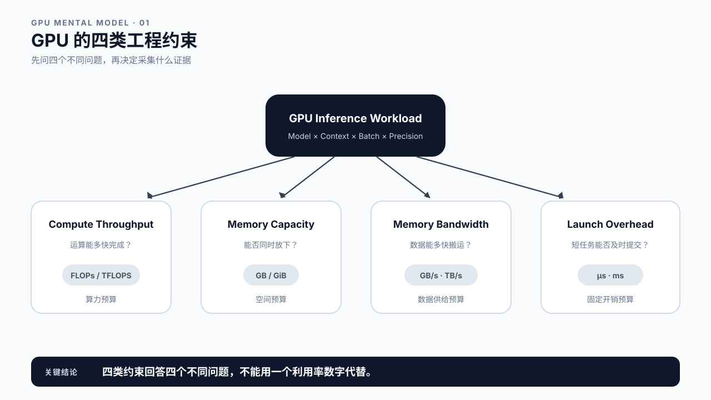
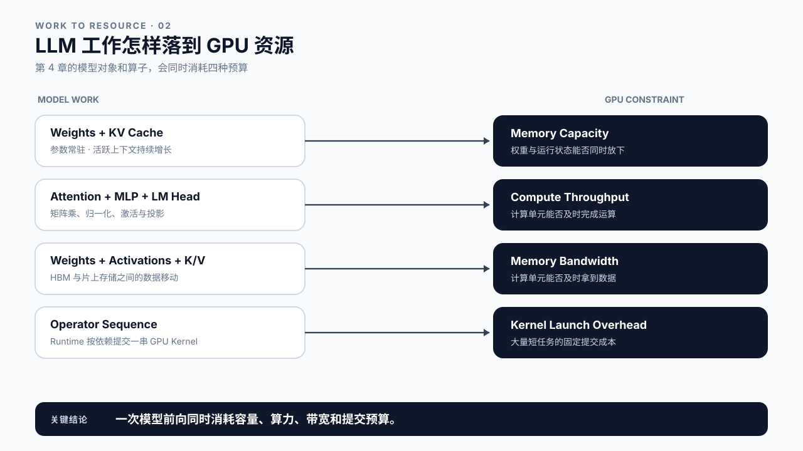
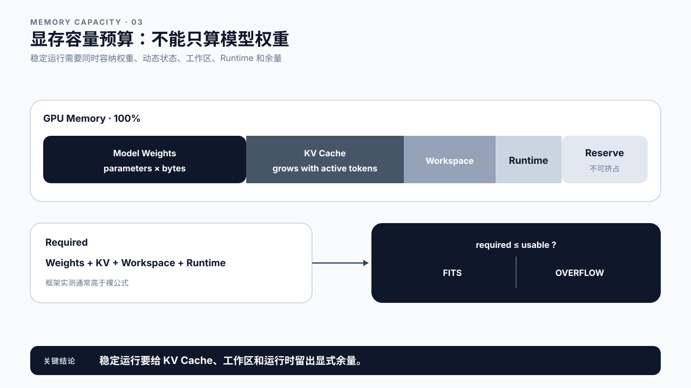
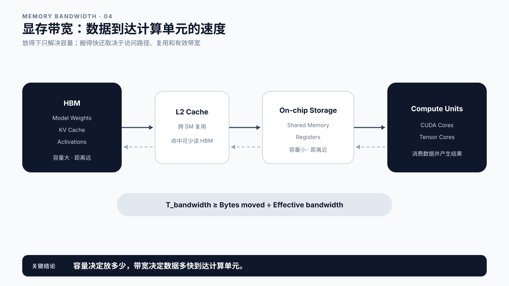
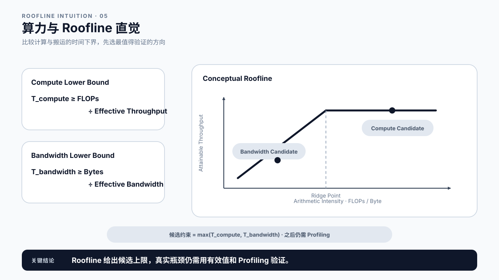
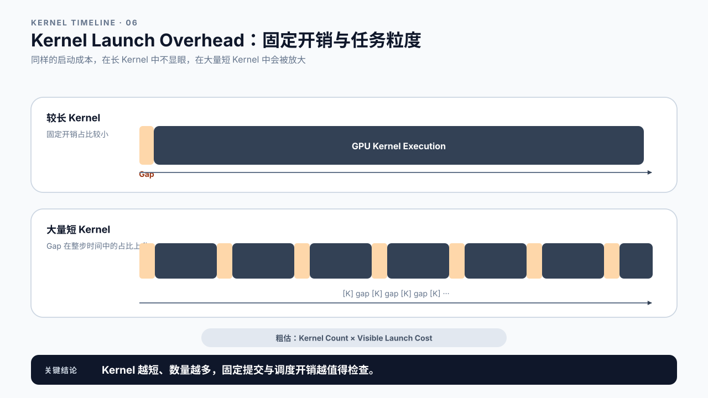
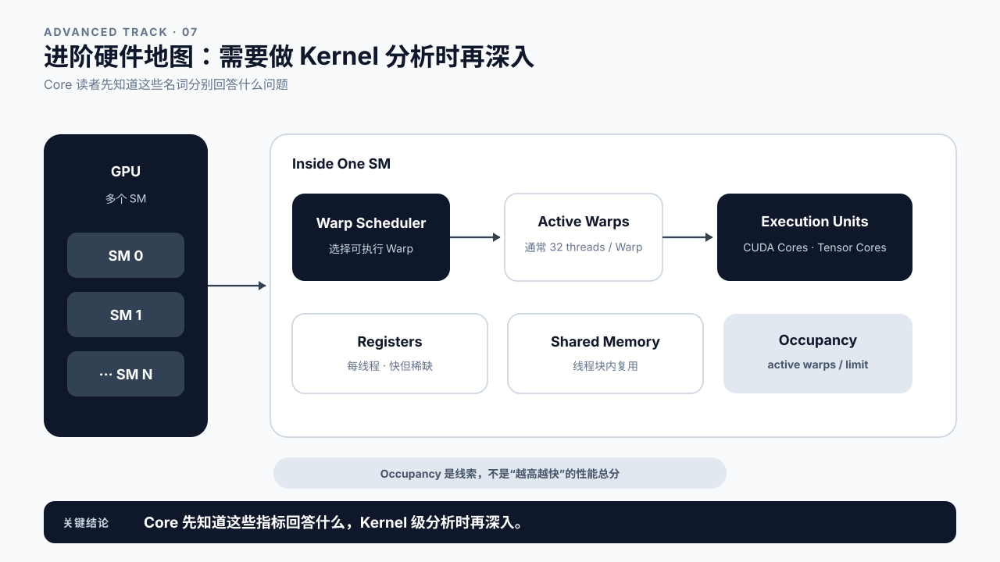
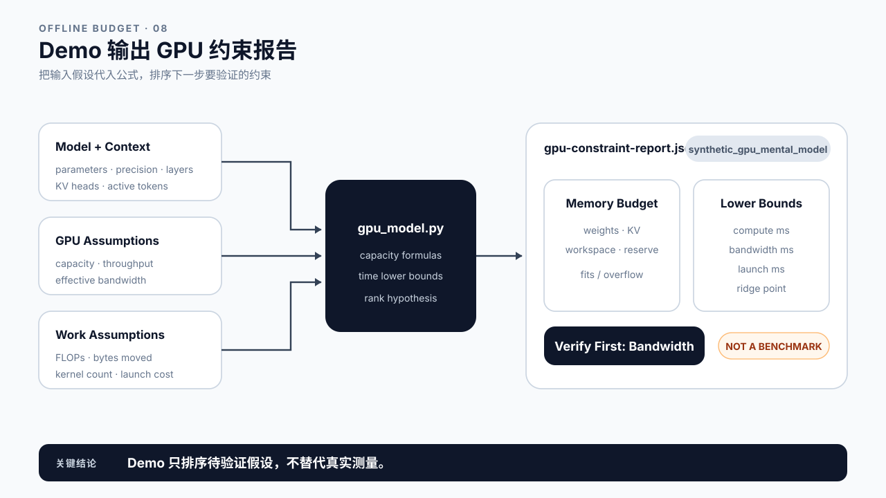

# 第 5 章 GPU 性能心智模型：先看四类约束

## 学习目标

学完本章后，你应该能够：

- 用算力、显存容量、显存带宽和 Kernel Launch Overhead 四类约束描述 GPU 推理问题。
- 估算模型权重与 KV Cache 的显存需求，并为工作区和运行时保留余量。
- 分清“放不下”和“搬不动”：容量决定能否运行，带宽影响数据能多快送到计算单元。
- 使用算术强度和 Roofline 直觉提出 Compute Bound 或 Memory Bandwidth Bound 假设。
- 识别大量短 Kernel 带来的提交与调度开销。
- 运行离线预算 Demo，读懂其结论和适用边界。

本章的定位是 **Bridge**：它把第 4 章的模型计算翻译成硬件资源问题，又不要求后端或 Agent 工程师先学完 CUDA。主线只保留四个工程问题：算得过来吗、放得下吗、搬得够快吗、提交开销大吗？SM、Warp、Tensor Core 和 Occupancy 放在进阶选修小节，需要做 GPU Kernel 级分析时再深入。

本章不会根据一张规格表宣布某块 GPU 更快，也不会把理论峰值当成实测结果。第 8 章以后会用 Benchmark 与 Profiling 验证这里提出的假设。

## 核心问题

1. 第 4 章中的权重、KV Cache 和矩阵计算分别占用哪些 GPU 资源？
2. 显存还有空余，为什么生成仍可能很慢？
3. 峰值 TFLOPS 很高，为什么实际推理不一定同比变快？
4. 什么时候应怀疑 Kernel 太碎，而不是算力或带宽不足？
5. 如何用几条公式筛选假设，又不把估算冒充 Benchmark？

## 5.0 把 GPU 看成四种预算

面对一块 GPU，先问四个问题：

| 约束 | 工程问题 | 常用单位 | 先看什么输入 |
|---|---|---|---|
| Compute Throughput | 运算能多快完成？ | TFLOPS、TOPS | FLOPs、数据类型、有效吞吐 |
| Memory Capacity | 权重与运行状态能否同时放下？ | GB / GiB | 参数量、精度、活跃 token、工作区 |
| Memory Bandwidth | 数据能多快搬到计算单元？ | GB/s、TB/s | 读写字节数、复用程度、有效带宽 |
| Launch Overhead | 一连串 Kernel 能否及时提交？ | μs、ms | Kernel 数量、单个 Kernel 时长、空隙 |

这四类约束回答的不是同一件事。显存容量很大，只能说明更容易“放得下”；它不保证带宽更高。峰值算力更高，也不保证数据供给得上。单个 Kernel 很快，但一次 Decode step 里有大量短 Kernel，固定提交开销仍可能显眼。



图5-1：GPU 的四类工程约束。

## 5.1 第 4 章的模型工作怎样落到 GPU 资源

第 4 章讲过一次 token 生成：Embedding、N 个 Transformer Blocks、LM Head 和 Sampling。把这条路径放到 GPU 上，可以看到四类工作：

- 模型权重需要常驻或分批进入显存，KV Cache 会随活跃上下文增长。这先消耗容量。
- Attention、MLP 和 LM Head 包含大量矩阵运算，需要计算单元执行。
- 权重、激活和 KV Cache 要在 HBM、Cache 与片上存储之间移动，需要带宽。
- 每个算子最终由一个或多个 Kernel 执行，Runtime 需要按依赖顺序提交这些 Kernel。

GPU 并不是只“做计算”。一段推理时间里，可能在计算，也可能在等数据、等依赖或等下一次 Kernel 提交。仅凭 `GPU Utilization` 一个汇总值，无法区分这些情况。

同一模型的工作形态也会变化。长 Prompt 的 Prefill 往往能形成尺寸更大的矩阵计算；普通 Decode 每次只推进一个 token，矩阵形状、批量和历史数据读取都不同。因此，“这个模型是 Compute Bound”不是永久标签，结论必须带上 Prompt 长度、Batch、并发、精度和硬件。



图5-2：LLM 工作怎样落到 GPU 资源。

## 5.2 显存容量：先判断能不能放下

一块 GPU 的显存不能全部分给模型权重。实用预算至少包含：

```text
M_total
  = M_weights
  + M_KV_cache
  + M_activations_and_workspace
  + M_runtime
  + M_reserve
```

### 权重估算

最粗的权重估算是：

```text
M_weights ≈ parameter_count × bytes_per_parameter
```

例如，5 亿参数以 2 Byte 保存，裸权重约为 10 亿 Byte。这个值还不包含量化元数据、对齐、临时转换、图编译缓存或框架管理开销。

### KV Cache 估算

对采用普通 K/V 存储的 Decoder-only 模型，可以先用：

```text
KV_bytes_per_token
  ≈ 2 × num_layers × num_kv_heads × head_dim × bytes_per_element
```

最前面的 2 代表 Key 和 Value。总 KV Cache 还要乘以所有活跃请求实际占用的 token 数：

```text
M_KV_cache
  ≈ KV_bytes_per_token × active_tokens
```

`active_tokens` 不是配置文件中的 `max_model_len`，也不是单个请求的 Prompt 长度。它应反映当前所有活跃序列已占用的 Cache token 总数。分页布局、块内碎片、并行切分和特定框架实现会让实测值偏离这个简式。

第 4 章的示例有 14 个 Query Heads、2 个 KV Heads。KV 公式使用 `num_kv_heads=2`，而不是 Query Head 数。若其他条件相同，标准 14-head MHA 的 K/V 元素数是该 GQA 配置的 7 倍。

### 为什么必须留余量

工作区、临时激活、通信缓冲区、CUDA Context、内存池和碎片都会占显存。把裸公式算到 100% 才算“能放下”，上线时很容易 OOM。正确做法是显式保留余量，并在目标引擎上实测可用水位。



图5-3：显存容量预算。

## 5.3 显存带宽：放得下，不等于搬得快

容量回答“最多能存多少”，带宽回答“单位时间最多能搬多少”。两者都与显存有关，却不能互换。

若某段计算至少要搬运 `Bytes_moved` 字节，有效带宽为 `BW_effective`，最简单的下界是：

```text
T_bandwidth ≥ Bytes_moved / BW_effective
```

这里必须使用有效带宽，而不是规格表上的峰值带宽。访问模式、Cache 命中、并发、数据布局和其他 Kernel 的竞争都会影响有效值。

GPU 内部有多层存储：容量较大的 HBM 位于片外，往上有 L2 Cache，SM 内还有 Shared Memory 与 Register。离计算单元越近，通常越快但越稀缺。Core 学习阶段不必背每层延迟，只需记住一条：如果数据能在近处复用，就不必反复从 HBM 搬运。

LLM Decode 中需要反复读取模型权重，也会读取不断增长的历史 K/V。哪一部分占主导取决于模型、Batch、上下文长度、Cache 命中和 Kernel 实现，不能把所有 Decode 带宽问题都归因于 KV Cache。



图5-4：显存带宽与数据路径。

## 5.4 算力：有多少运算，能获得多少有效吞吐

对一段包含 `FLOPs` 次浮点运算的工作，计算侧下界可以写成：

```text
T_compute ≥ FLOPs / Throughput_effective
```

同样，`Throughput_effective` 不是峰值 TFLOPS。矩阵形状、Batch、数据类型、算子实现和硬件利用率会决定实际吞吐。硬件支持某种低精度，也不代表任意模型、任意 Kernel 都能达到对应峰值。

把计算量和数据搬运量放在一起，可以得到算术强度：

```text
Arithmetic Intensity = FLOPs / Bytes_moved
Ridge Point          = Peak FLOPs / Peak Bandwidth
```

当算术强度远低于 Ridge Point，带宽更可能先成为上限；远高于 Ridge Point，计算吞吐更值得关注。这就是 Roofline 的核心直觉。真实判断还要看有效值和 Profiling 证据，不能只用静态公式盖章。

Prefill 通常有更大的矩阵，较容易提高数据复用和 Tensor Core 利用；小 Batch Decode 的算术强度往往较低，更容易暴露带宽上限。但 Continuous Batching、长上下文、量化和具体 Kernel 都可能改变边界，所以这里使用“倾向”，不用“必然”。



图5-5：算力与 Roofline 直觉。

## 5.5 Kernel Launch Overhead：短任务多了，固定开销就会显眼

模型前向不是一个巨大 Kernel。归一化、矩阵乘、Attention、激活、采样等工作会形成一串 Kernel。CPU、Runtime 和 Driver 负责提交，GPU 再按依赖执行。

若一轮包含 N 个 Kernel，每次提交和调度的可见开销粗略记为 `T_launch`，可以先看：

```text
Launch overhead ≈ N × T_launch
```

这是用来建立数量级的简式，不代表所有开销都串行相加。异步提交、并发 Stream、CUDA Graph 和 Runtime 实现会改变实际表现。

当单个 Kernel 本身运行很久，几微秒的启动开销不显眼；当 Decode step 由大量几十微秒甚至更短的 Kernel 组成，Kernel 之间的空隙可能占据可观比例。Timeline 上常见的证据不是“GPU 算得慢”，而是一段段短 Kernel 之间出现空洞。

这也是为什么不能只看单个算子速度。一个 Kernel 快 10%，若端到端时间主要消耗在数据搬运或 Kernel Gap，整体收益可能很小。



图5-6：Kernel Launch Overhead。

## 5.6 四类约束怎样形成诊断起点

四类约束可以按下面的顺序使用：

1. **先查容量。** 如果权重、KV Cache 和工作区放不下，当前配置不能稳定运行，先不要讨论速度。
2. **再估算三个时间下界。** 分别计算 FLOPs / Throughput、Bytes / Bandwidth 和 Kernel Count × Launch Time。
3. **选择最值得验证的约束。** 最大的估算项是候选瓶颈，不是最终根因。
4. **补真实证据。** 用固定 workload 的 Benchmark、GPU Timeline、Kernel 指标和服务指标验证。

| 预算现象 | 初步假设 | 后续需要的证据 |
|---|---|---|
| required memory 超过可用容量 | Memory Capacity | 实际显存水位、分配失败、Cache block 使用 |
| compute lower bound 最大 | Compute Throughput | Kernel 时间、Tensor Core / SM 吞吐、矩阵形状 |
| bandwidth lower bound 最大 | Memory Bandwidth | HBM 吞吐、读写量、Cache 命中、算术强度 |
| launch lower bound 最大 | Launch Overhead | CPU/GPU Timeline、Kernel 数量、Kernel Gap |

估算的价值在于排除明显错误方向。例如容量已经超限时，再讨论更高峰值算力没有意义；数据搬运下界明显高于计算下界时，只提高 TFLOPS 也不构成完整方案。

## 5.7 进阶选修：SM、Warp、Tensor Core 与 Occupancy 放在哪里

这一节是给平台、基础设施和 Kernel 工程师的入口。Core 读者知道它们分别回答什么问题即可。

- **SM（Streaming Multiprocessor）** 是 GPU 执行线程块和指令的主要计算单元。一块 GPU 有多个 SM。
- **Warp** 是 NVIDIA GPU 的线程调度单位，通常由 32 个线程组成。分支、依赖和访存等待会影响 Warp 是否能继续执行。
- **Tensor Core** 加速特定数据类型和形状的矩阵乘累加。LLM 的 GEMM 是否走上高效路径，要看硬件、精度、形状和 Kernel。
- **Occupancy** 描述一个 SM 上活跃 Warp 相对硬件上限的比例，受 Register、Shared Memory 和线程块配置约束。

Occupancy 不是越高越快。足够多的活跃 Warp 可以帮助隐藏等待，但更高 Occupancy 不会自动修复低效访存、指令依赖或不合适的算法。后续用 Nsight Compute 分析单个 Kernel 时，再把这些概念展开。



图5-7：进阶硬件地图。

## 5.8 Demo：生成一份 GPU 约束预算报告

本章 Demo 位于 `code/chapter05`，只依赖 Python 标准库。它不会调用 `nvidia-smi`，也不会探测当前机器，而是把你提供的模型和硬件假设代入本章公式。

从课程根目录运行默认场景：

```bash
python3 code/chapter05/gpu_model.py
```

报告包含：

- `memory_budget`：权重、KV Cache、工作区、安全余量和剩余容量。
- `execution_lower_bounds`：Compute、Bandwidth 和 Launch 三个理论时间项，以及算术强度与 Ridge Point。
- `dominant_constraint`：当前输入假设下最值得先验证的约束。
- `constraints`：四类约束各自回答的问题和对应结果。

默认场景使用 5 亿参数、24 层、2 个 KV Heads、4096 个活跃 tokens。你可以把 `--num-kv-heads` 从 2 改为 14，观察 GQA 与 MHA 的 KV Cache 预算差异；也可以增加 `--kernel-count`，观察 Launch 项何时超过其他下界。

报告中的 `synthetic_gpu_mental_model` 和“不是 Benchmark”不能删除。它只是在给定假设下做算术，不知道真实 Kernel、有效带宽、框架内存池和并发调度。它输出的是验证顺序，不是性能结论。



图5-8：Demo 输出 GPU 约束报告。

## 5.9 课堂案例：同一个模型换 GPU，先比较哪四件事

一个团队准备在两类 GPU 之间迁移同一个模型。GPU A 的显存更大，GPU B 的带宽更高；两者的低精度峰值算力也不同。有人直接问：“哪一张更快？”

这个问题缺少 workload。课堂上先补四组事实：

1. 模型权重、KV Cache、工作区加安全余量后，两张卡是否都放得下？
2. 请求是长 Prompt Prefill 为主，还是长输出 Decode 为主？
3. 目标并发和实际 Batch 多大，矩阵形状能否利用计算单元？
4. Timeline 中是长 Kernel、带宽饱和，还是大量短 Kernel 与空洞？

如果 GPU B 放不下目标并发，它的高带宽暂时没有用；如果两张卡都能放下，而目标 workload 明显受数据搬运限制，带宽差异可能比峰值算力更重要；如果 Timeline 主要是 Launch Gap，换卡也未必解决调度问题。

课堂产出不是选出 A 或 B，而是写出一张验证表：每个候选约束需要什么 workload 和证据。硬件选型属于容量、性能与成本的联合决策，第 26 章再完成。

### 补充案例 A：RAG 把 Prompt 从 1K 拉到 16K

RAG 增加检索文档后，模型和精度都没有变化，但每个请求的 Prompt 变长。容量侧，活跃 token 增加使 KV Cache 预算上升；执行侧，Prefill 工作量和数据移动也会变化。不能只看模型权重是否仍能放下。

练习：分别写出容量公式中变化的项，以及需要在真实请求上重新测量的时间阶段。不要在本章直接给出裁剪上下文或更换模型的优化结论。

### 补充案例 B：Agent 每步很短，GPU Timeline 却有很多空洞

一个 Agent 每次只让模型生成少量结构化 token，但要连续调用多轮。单次矩阵计算很短，Timeline 中 Kernel 数量多、空隙明显。此时“峰值算力没吃满”只是现象，Launch Overhead、同步点和上层串行编排都值得检查。

练习：把 GPU 内部 Kernel Gap 与 Agent 多轮调用之间的业务等待分开。前者需要 GPU Timeline，后者需要端到端 Trace；两者不能用同一张利用率图判断。

## 5.10 常见误区

误区一：显存利用率低，所以 GPU 还有很多性能空间。

显存占用是容量信息。计算单元或显存带宽可能已经接近上限，反过来也可能只是负载很低。

误区二：峰值 TFLOPS 高一倍，模型就会快一倍。

只有工作确实受计算吞吐限制，并且 Kernel 能利用对应精度与形状时，峰值算力才可能转化为收益。

误区三：Decode 慢一定是 KV Cache 太大。

Decode 还会读取权重并执行多类 Kernel。KV Cache、权重带宽、Batch 形状、Launch Gap 和调度都可能参与，需用证据区分。

误区四：Occupancy 越高越好。

Occupancy 是并行活跃度指标，不是性能总分。过低值得调查，达到 100% 也不保证 Kernel 高效。

误区五：预算器算出的最大项就是根因。

静态估算忽略了大量运行时细节。最大项只决定先验证什么，根因必须由真实测量支持。

## 本章总结

GPU 推理可以先压缩成四类工程约束：算力决定运算吞吐上限，显存容量决定权重与运行状态能否同时放下，显存带宽决定数据搬运下限，Kernel Launch Overhead 在大量短任务中变得显眼。

这套心智模型的用途不是替代 Benchmark，而是帮助你提出更精确的问题。先做容量预算，再比较 Compute、Bandwidth 和 Launch 的数量级，最后回到目标 workload 收集证据。

下一章会定义 TTFT、TPOT、TPS、P99 和成本等正式指标。届时要把“GPU 在做什么”和“用户与系统看到了什么”分开，避免用硬件现象代替业务指标。

### 本章 Checklist

- [ ] 能说出 GPU 推理的四类约束及其单位。
- [ ] 能估算权重显存，并说明为什么实测会高于裸权重。
- [ ] 能根据层数、KV Heads、Head Dimension 和活跃 token 估算 KV Cache。
- [ ] 能区分 Memory Capacity 与 Memory Bandwidth。
- [ ] 能写出 Compute、Bandwidth 和 Launch 的简化时间公式。
- [ ] 能用算术强度和 Ridge Point 提出候选瓶颈。
- [ ] 知道 SM、Warp、Tensor Core、Occupancy 分别回答什么问题。
- [ ] 能解释 Demo 为什么不是 Benchmark。

## 课后练习

1. 估算一个 70 亿参数模型分别以 2 Byte 和 1 Byte 存储时的裸权重大小，并写出公式没有覆盖的三类开销。
2. 对 32 层、8 个 KV Heads、Head Dimension 128、每元素 2 Byte 的模型，计算单 token KV Cache 大小。
3. 解释“80 GB 容量”和“2 TB/s 带宽”为什么不能互相比较。
4. 给定 1 TFLOP 运算、10 GB 数据搬运、100 TFLOPS 有效吞吐和 1 TB/s 有效带宽，分别计算两个理论下界。
5. 使用 Demo 构造 Compute、Bandwidth、Launch、Capacity 四种主导场景，并为每种场景写出一个后续证据。
6. 为“Agent 响应慢但 GPU 利用率不高”写出两个位于 GPU 内部、两个位于 Agent 编排层的竞争假设。
