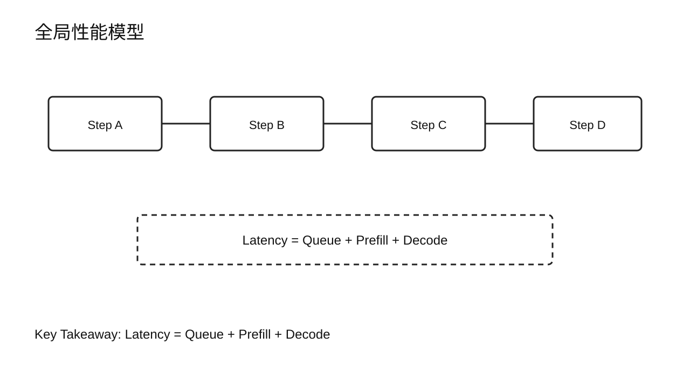
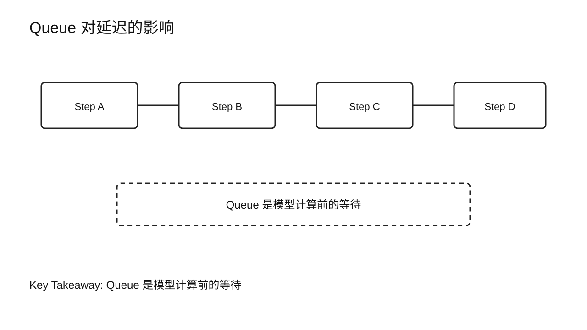
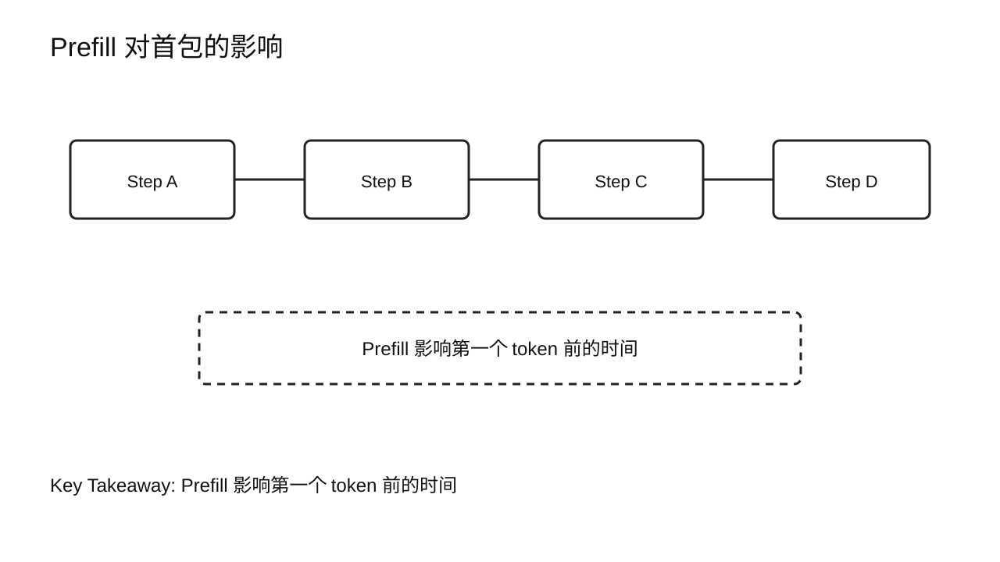
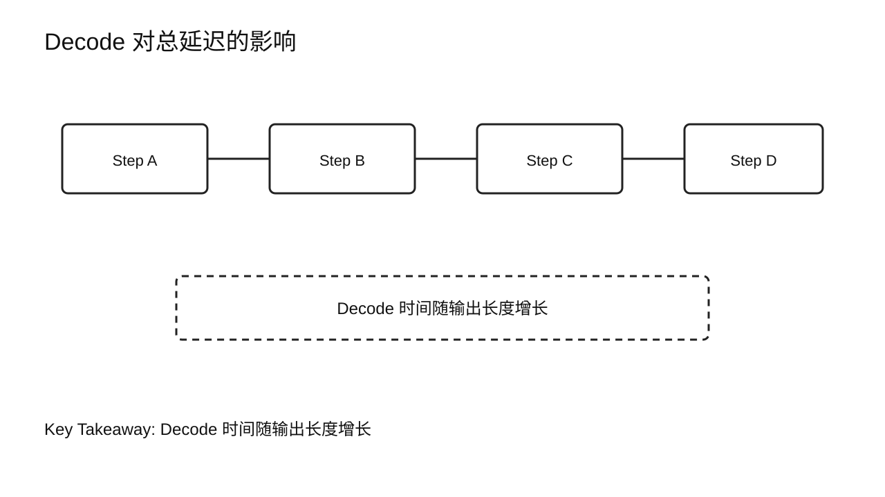
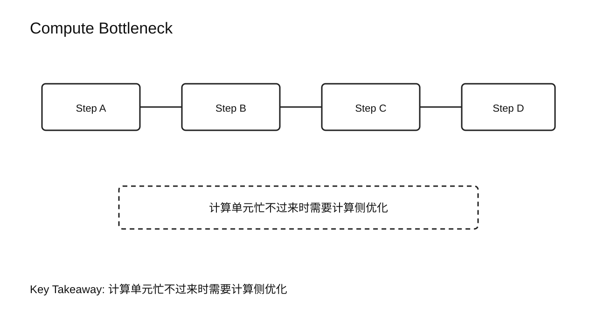
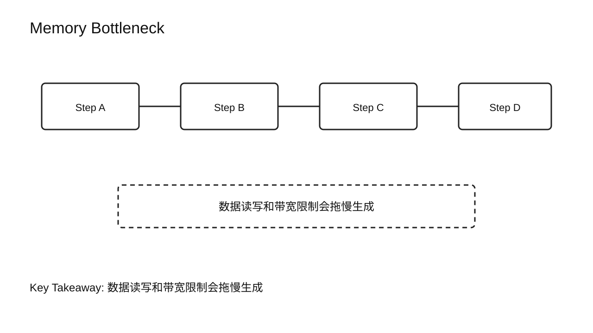
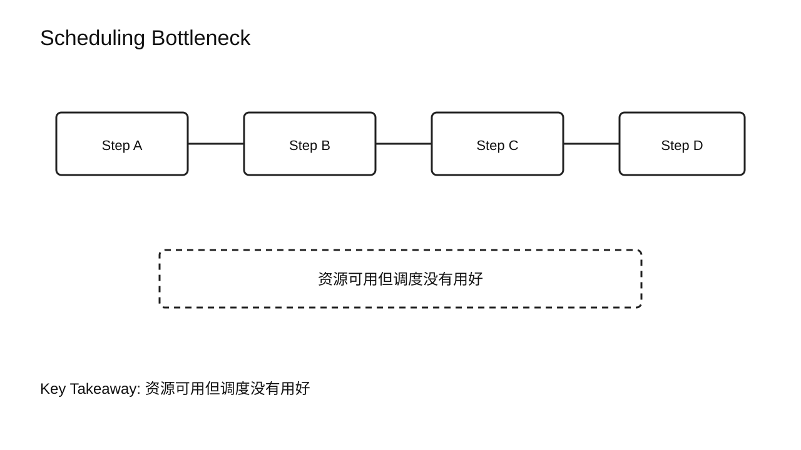
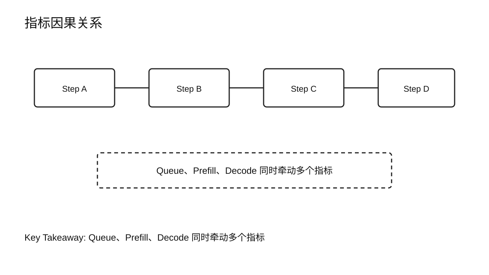
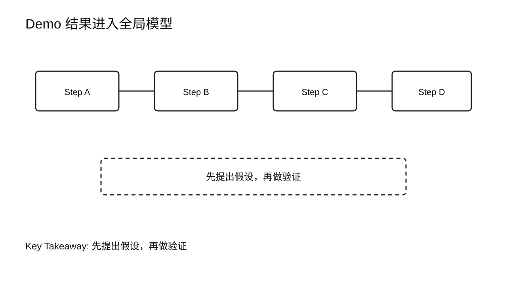
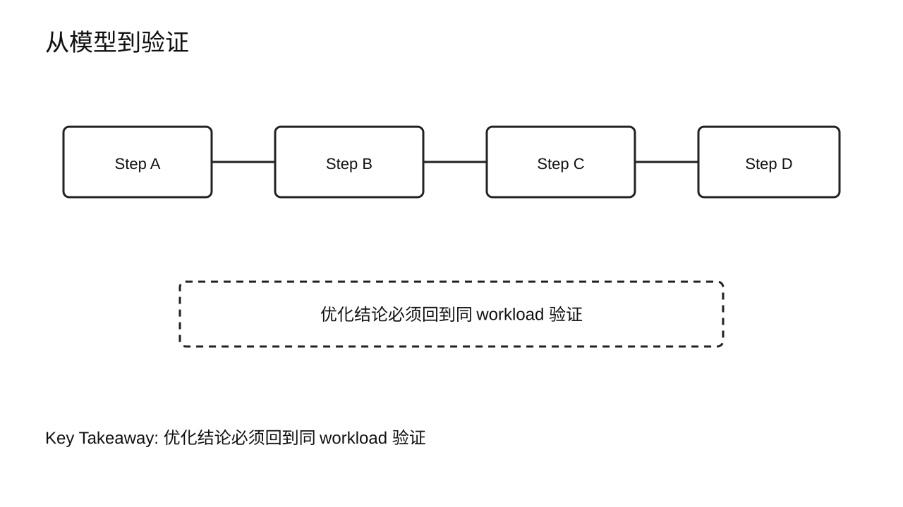

# 第 5 章 Global Performance Model

## 学习目标

学完本章后，你应该能够：

- 用 `Latency = Queue + Prefill + Decode` 描述一次请求的主要时间来源。
- 区分 Compute Bottleneck、Memory Bottleneck 和 Scheduling Bottleneck。
- 解释为什么同一个优化可能改善一个指标，同时伤害另一个指标。
- 把架构、生命周期和指标组合成一个初步性能分析模型。
- 面对一个性能现象，提出可验证的瓶颈假设，而不是直接跳到优化手段。

前三章分别建立了架构、生命周期和指标。本章把它们合在一起，形成 Part 1 的收束：性能瓶颈来自哪里？

## 核心问题

1. 如何把一次请求的延迟拆成几个主要部分？
2. Compute、Memory、Scheduling 三类瓶颈有什么不同？
3. 为什么指标之间会互相牵制？
4. 如何从现象提出下一步可验证假设？



图5-1：全局性能模型。

## 5.1 为什么需要全局模型

没有全局模型，性能优化很容易变成试参数。看到慢，就开 FlashAttention；看到显存高，就做量化；看到吞吐低，就加 batch。这样偶尔能撞对，但更多时候会把系统变得更复杂。

全局模型的作用，是把性能问题先放进一个简单框架：

```text
Latency = Queue + Prefill + Decode + Response overhead
```

为了便于分析，本章先用更简化的版本：

```text
Latency = Queue + Prefill + Decode
```

这里不是说 Response、采样、网络和后处理不重要，而是先抓住主干。等主干清楚了，再逐步把其他开销加进来。

## 5.2 Queue：请求还没开始算

Queue 时间表示请求进入系统后，等待被调度执行的时间。

Queue 变长，常见原因包括：

- 并发超过服务容量。
- Scheduler 为了形成更大 batch 而等待。
- KV Cache 或显存预算不足。
- 长请求占据资源，短请求排队。
- 实例数量不足或负载不均。

Queue 主要影响 TTFT 和尾延迟。用户看到的是“发出去以后没反应”，但根因可能根本不在模型计算。

降低 Queue 时间的手段通常属于 Serving 或 Scalability 范围，例如调度策略、Admission Control、增加副本、负载均衡和容量规划。本章只建立模型，不展开方案。



图5-2：Queue 对延迟的影响。

## 5.3 Prefill：首包前的大块计算

Prefill 时间表示模型处理输入 prompt，并准备第一个输出 token 前的计算时间。

Prefill 受 prompt 长度影响明显。输入越长，attention、MLP 和 KV Cache 写入的工作越多。对于长上下文请求，Prefill 可能成为 TTFT 的主要来源。

Prefill 常与 Compute Bottleneck 相关，但不能机械判断。是否 compute bound，需要看 GPU timeline、SM / Tensor Core 利用率、HBM 带宽和 kernel 结构。第 11 章会专门分析 Prefill 性能。

在全局模型里，Prefill 主要回答：

- 第一个 token 前，模型到底花了多少时间处理输入？
- 输入长度变化时，首包时间如何变化？
- Prefill 时间是否被 Queue 时间掩盖？



图5-3：Prefill 对首包的影响。

## 5.4 Decode：输出长度驱动的循环

Decode 时间表示第一个 token 之后，模型逐 token 生成后续输出所花的时间。

Decode 总时间可以粗略看成：

```text
Decode time ~= output_tokens x time_per_output_token
```

这个公式很粗，但有用。输出越长，Decode 循环越多；每一步越慢，总响应时间越长。

Decode 常与 Memory Bottleneck 相关，因为每一步都要读取历史 KV Cache。但真实系统还可能受调度、kernel launch、采样和网络发送影响。第 14 到第 17 章会深入 Decode 分析和验证。

在全局模型里，Decode 主要影响：

- TPOT / ITL。
- 总响应时间。
- 长输出请求的资源占用时间。
- 并发下的 batch 调度节奏。



图5-4：Decode 对总延迟的影响。

## 5.5 Compute Bottleneck

Compute Bottleneck 表示主要受计算能力限制。GPU 的计算单元忙不过来，更多算力或更高效 kernel 可能带来收益。

典型线索包括：

- 矩阵乘或 attention kernel 占据主要时间。
- SM / Tensor Core 利用率较高。
- HBM 带宽不是最明显上限。
- 增加计算量后延迟明显增长。

Prefill 更容易出现这种形态，因为它一次处理完整 prompt，计算规模较大。但“更容易”不是结论，必须用 profiling 证明。

常见优化方向包括更高效 attention、kernel fusion、CUDA Graph、engine 编译和算子调优。这些会在 Prefill Optimization 和 Kernel Optimization 章节展开。



图5-5：Compute Bottleneck。

## 5.6 Memory Bottleneck

Memory Bottleneck 表示主要受数据读写和带宽限制。计算单元可能没有完全忙起来，但数据来不及喂给它。

典型线索包括：

- HBM Bandwidth 压力高。
- SM 利用率不高但延迟仍然高。
- 上下文变长后 TPOT / ITL 变差。
- KV Cache 读写成为主要开销。

Decode 更容易出现这种形态，因为每一步新增计算少，却要读取历史 KV Cache。长上下文、多并发和大模型都会放大这个问题。

常见优化方向包括 KV Cache 布局管理、PagedAttention、KV Quantization、Prefix Cache 和更好的 batch 调度。具体技术放在后续章节。



图5-6：Memory Bottleneck。

## 5.7 Scheduling Bottleneck

Scheduling Bottleneck 表示资源不是完全没有，但调度方式没有把资源用好。

典型现象包括：

- GPU timeline 中出现空洞。
- 并发增加后 Queue 快速变长。
- batch 形成效率低。
- 长短请求混合导致等待不公平。
- GPU Utilization 不稳定。

Scheduling Bottleneck 往往出现在服务层，而不是模型算子层。它需要观察队列、请求状态、batch 形成、Worker 利用率和资源预算。

Serving Optimization 的核心，就是处理这类问题。Dynamic Batching、Continuous Batching、Chunked Prefill 和 Admission Control 都会在后续章节展开。



图5-7：Scheduling Bottleneck。

## 5.8 指标之间的因果关系

全局模型让我们看到指标之间的关系。

Queue 增加，TTFT 和 P95 / P99 往往变差。Prefill 增加，TTFT 更容易变差。Decode 单步变慢，TPOT / ITL 和总延迟会变差。Batch 变大，TPS 可能提升，但单请求等待可能增加。并发提高，GPU Utilization 可能上升，但显存和尾延迟风险也会上升。

因此，优化不能只报一个指标。至少要同时看：

- 用户体验：TTFT、TPOT / ITL、P95 / P99。
- 系统吞吐：TPS、RPS、Concurrency。
- 资源状态：GPU Utilization、GPU Memory。
- 成本：Cost per Token。



图5-8：指标因果关系。

## 5.9 Demo：把一次结果放入全局模型

使用前面章节的 demo 输出，做一次手工拆解。假设你得到类似字段：

```text
ttft_ms = 820
itl_avg_ms = 38
output_tokens = 120
total_latency_ms = 5400
```

本章不要求判断好坏，只做结构化描述：

- TTFT 是首包前的端到端等待，可能包含 Queue 和 Prefill。
- ITL 平均 38ms，描述流式输出节奏。
- output_tokens 为 120，说明 Decode 循环持续了较多步。
- total_latency_ms 包含首包前等待和全部生成时间。

下一步如果要定位根因，应提出假设，而不是直接调参：

```text
假设 A：Queue 时间高，导致 TTFT 高。
假设 B：Prompt 长，导致 Prefill 时间高。
假设 C：Decode 单步慢，导致总延迟高。
```

每个假设都需要后续 Benchmark 或 Profiling 验证。



图5-9：Demo 结果进入全局模型。

## 5.10 课堂案例：首包慢时，先提出三个假设

假设一次压测后得到下面的现象：

```text
TTFT P95 = 4.8s
ITL P95 = 55ms
TPS = stable
GPU Utilization = 62%
GPU Memory = 70GB / 80GB
```

业务方说：“首包太慢，先把 Prefill 优化一下。”这句话可能对，也可能错。根据全局模型，至少应该先提出三个假设。

假设 A：Queue 时间高。

如果并发高、队列长、Scheduler 等待形成 batch，TTFT 会变差，但 GPU Utilization 未必打满。验证方向是看请求进入队列到开始执行之间的时间。

假设 B：Prefill 时间高。

如果 prompt 很长，Prefill 处理完整输入会推高首包时间。验证方向是按 prompt length 分桶，看 TTFT 是否随输入长度明显增长。

假设 C：容量约束导致调度保守。

GPU Memory 已经接近上限，Scheduler 可能因为 KV Cache block 不足而延迟接纳新请求。验证方向是看可用 KV block、抢占、拒绝和等待原因。

这三个假设对应不同处理路径。Queue 问题偏 Serving，Prefill 问题偏计算分析，容量问题偏 Scalability。没有验证前直接改某个优化参数，很容易把时间花错地方。

课堂练习可以让学员把这组数据填入：

```text
Latency = Queue + Prefill + Decode
```

然后分别写出每个假设需要补采的一个指标。

### 补充案例 A：吞吐提升后，为什么成本不一定下降

一个团队把 TPS 提高了 30%，于是认为单位成本会下降。但财务侧发现账单没有明显改善。用全局模型看，可能有几种解释：

- TPS 提升来自更大的 batch，但 P99 变差，用户重试增加。
- GPU Utilization 提高了，但 GPU Memory 接近上限，实例更容易拒绝请求。
- 单次输出变长了，generated tokens 增加，成本分母和 workload 都变了。
- 为了获得更高 TPS，换了更贵的 GPU，小时成本也上升了。

课堂讨论：如果只知道 TPS 提升 30%，还需要哪些指标才能判断成本是否真的下降？

### 补充案例 B：GPU 利用率低，不一定是坏事

一个内部助手在工作日白天请求很多，晚上请求很少。晚上 GPU Utilization 只有 15%。这是不是性能问题？

如果这是固定成本的裸机集群，低利用率可能代表资源浪费。如果这是按量付费并能自动缩容的服务，低利用率可能只是负载低。若这是交互式助手，白天保持一些空闲容量还能降低排队风险。

用全局模型看，GPU 利用率低只是现象。下一步要问：

- 当前 workload 是高峰还是低谷？
- 是否有 Queue 等待？
- P95 / P99 是否满足目标？
- 成本模型是固定成本还是弹性成本？

这个案例训练的是“不要把资源指标直接当成优化目标”。资源指标要和用户体验、吞吐和成本一起解释。

## 5.11 常见误区

误区一：看到 TTFT 高就直接优化 Prefill。

TTFT 高可能是 Queue，也可能是 Gateway、tokenization、Prefill 或首包返回。先拆分，再优化。

误区二：看到 GPU Utilization 低就扩大 batch。

扩大 batch 可能提升 GPU 利用率，也可能增加单请求等待和尾延迟。要看目标场景。

误区三：把 compute bound 和 memory bound 当成固定标签。

同一个系统在不同 prompt 长度、output 长度、并发和硬件下，瓶颈可能变化。

误区四：不做验证就宣布优化成功。

优化必须回到同一 workload 下的指标对比，并检查 trade-off。



图5-10：从模型到验证。

## 本章总结

本章把 Part 1 的四个基础块拼在一起：架构、生命周期、指标和性能模型。

`Latency = Queue + Prefill + Decode` 是一个简化模型，但足够帮助我们开始分析。Queue 代表等待执行机会，Prefill 代表首包前处理输入，Decode 代表逐 token 生成循环。Compute、Memory、Scheduling 是三类常见瓶颈来源，它们会同时影响 TTFT、TPOT / ITL、TPS、P95 / P99、GPU Utilization、GPU Memory 和 Cost per Token。

Part 2 会进入 Performance Analysis。也就是从“我们有一个模型”进入“如何设计 Benchmark、使用 Profiling 工具，并把现象追溯到真正 Root Cause”。

### 本章 Checklist

- [ ] 能写出 `Latency = Queue + Prefill + Decode`。
- [ ] 能说明 Queue、Prefill、Decode 分别影响哪些指标。
- [ ] 能区分 Compute、Memory、Scheduling 三类瓶颈。
- [ ] 能说明为什么优化一个指标可能伤害另一个指标。
- [ ] 能把一次 demo 输出转化成 2-3 个待验证假设。

## 课后练习

1. 给出一个 TTFT 高的场景，分别写出 Queue 和 Prefill 两种可能假设。
2. 解释为什么 Decode 输出长度增加会影响总延迟。
3. 写一个可能提升 TPS 但拉高 P99 的例子。
4. 根据本章模型，为一个“首包慢、后续顺滑”的反馈写出下一步分析计划。
5. 课堂讨论：给定 `GPU Utilization` 不高但 `TTFT P95` 很高的现象，写出两个互相竞争的解释。
