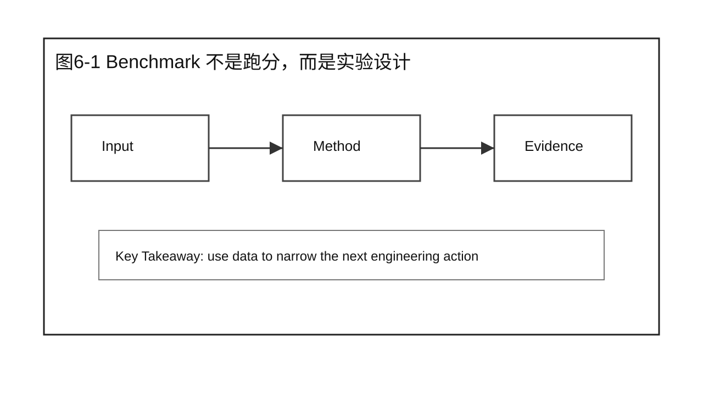
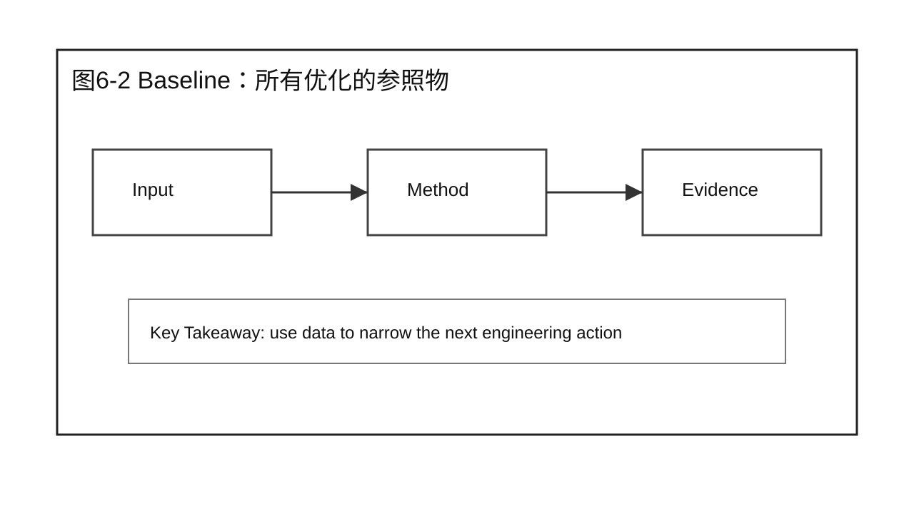
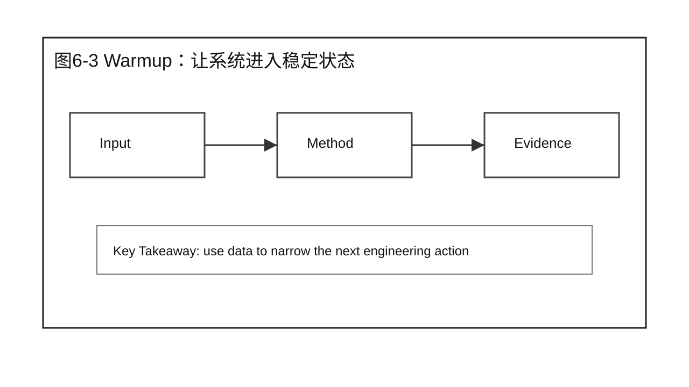
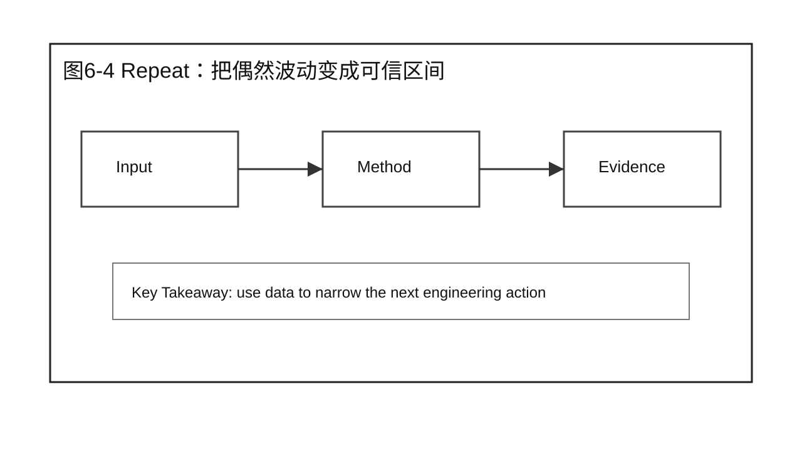
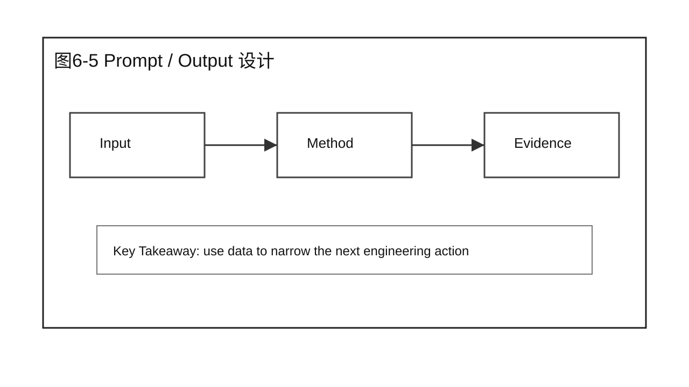
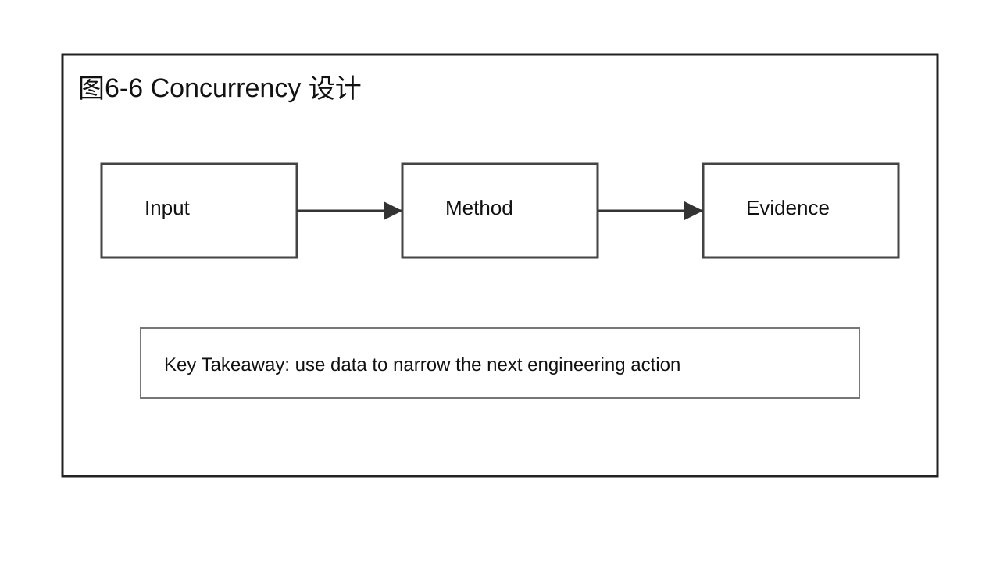
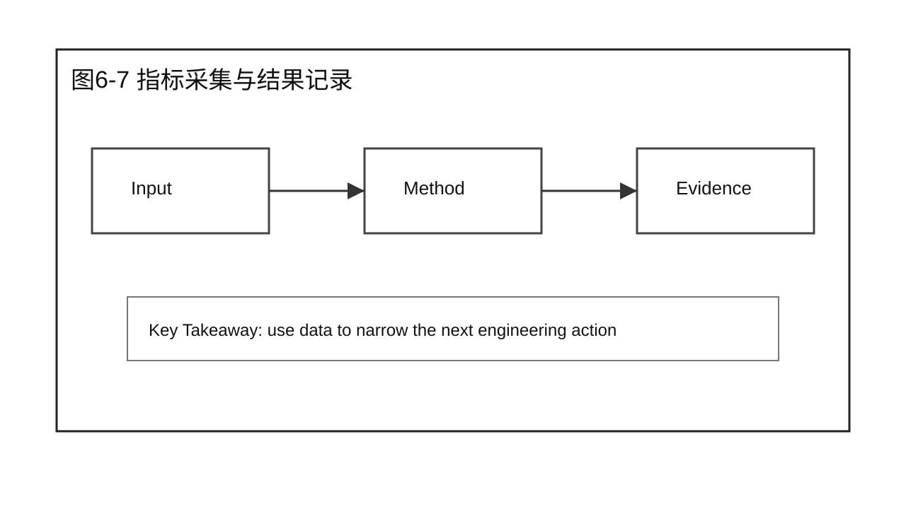
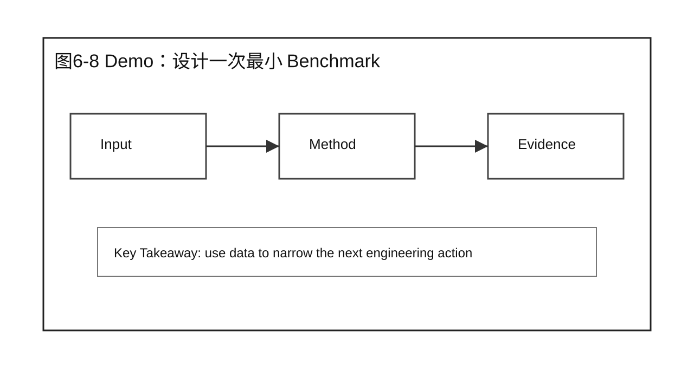
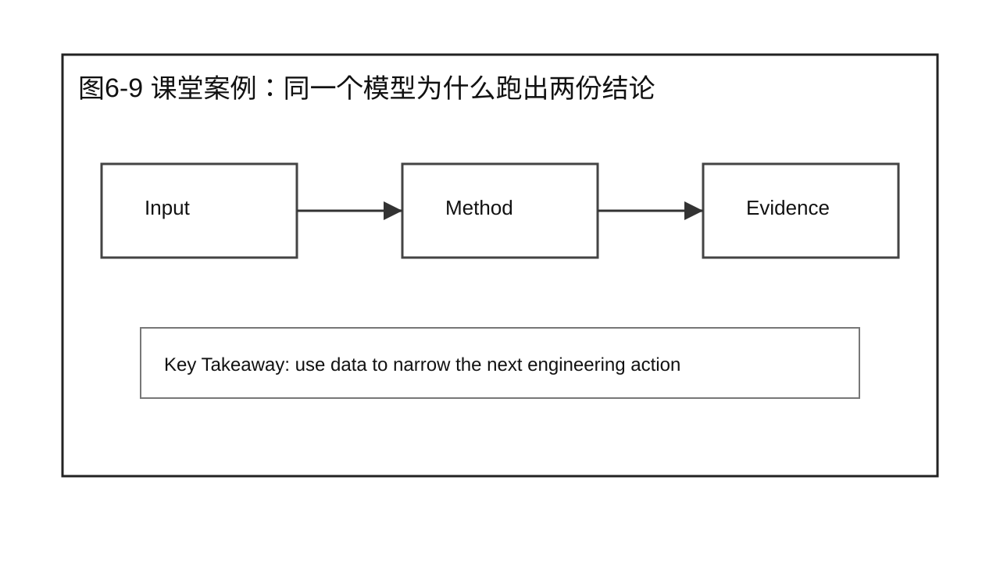
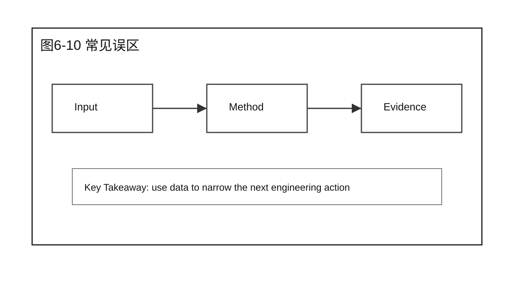

# 第 6 章 Benchmark Design

## 学习目标

学完本章后，你应该能够：

- 解释本章为什么要回答：如何建立可信、可重复的性能 Baseline？
- 把性能分析问题拆成 Baseline、Workload、指标和证据。
- 区分现象、假设、Profiling 证据和 Root Cause。
- 设计一个不越过本章边界的 Demo 或课堂讨论。
- 使用本章 Checklist 为后续优化章节准备输入。

本章属于 Part 2 Performance Analysis。它只建立分析方法，不提前给出 Prefill、Decode、Serving 或 Scalability 的优化结论。

## 核心问题

本章围绕四个问题展开：

1. 如何建立可信、可重复的性能 Baseline？
2. 这个问题在完整推理系统里落在哪些组件和阶段？
3. 哪些证据足以支持结论，哪些只是表面现象？
4. 如何把方法沉淀成后续章节可以复用的检查动作？



图6-1：Benchmark 不是跑分，而是实验设计。

## 6.1 Benchmark 不是跑分，而是实验设计

Benchmark 不是跑分，而是实验设计 是本章的起点。性能分析不是为了得到一个漂亮数字，而是为了让团队知道当前系统在什么工作负载下、用什么指标、以什么重复方式表现如何。没有这个前提，后续任何优化收益都可能只是偶然波动。



图6-2：Benchmark 不是跑分，而是实验设计。

## 6.2 Baseline：所有优化的参照物

在本书语境里，Baseline：所有优化的参照物 要写清楚输入条件、版本、模型、硬件、并发、请求分布和观测指标。它不是一次命令输出，而是一份可以被别人复现的实验约定。



图6-3：Baseline：所有优化的参照物。

## 6.3 Warmup：让系统进入稳定状态

Warmup：让系统进入稳定状态 的价值在于排除冷启动、缓存填充、编译、连接建立和一次性初始化带来的干扰。LLM 服务里，第一次请求往往不能代表稳定运行状态。



图6-4：Warmup：让系统进入稳定状态。

## 6.4 Repeat：把偶然波动变成可信区间

Repeat：把偶然波动变成可信区间 让我们知道结论是否稳定。只报告一次运行结果，会把系统抖动、邻居负载、网络波动和调度偶然性混进分析结论。



图6-5：Repeat：把偶然波动变成可信区间。

## 6.5 Prompt / Output 设计

Prompt / Output 设计 决定请求更像 Prefill 压力还是 Decode 压力。长 prompt 会放大首包前计算，长 output 会放大逐 token 生成，二者不能用同一组结论互相替代。



图6-6：Prompt / Output 设计。

## 6.6 Concurrency 设计

Concurrency 设计 影响队列、batch 形成、GPU 利用率和尾延迟。并发不是越高越好，可信实验要说明并发梯度如何设置，以及每个梯度回答什么问题。



图6-7：Concurrency 设计。

## 6.7 指标采集与结果记录

指标采集与结果记录 需要同时记录客户端指标、服务端指标和资源状态。只看客户端延迟，不知道问题在哪里；只看 GPU 利用率，又无法说明用户体验。



图6-8：指标采集与结果记录。

## 6.8 Demo：设计一次最小 Benchmark

Demo：设计一次最小 Benchmark 把本章方法落到一个可执行动作里。本章 Demo 使用模拟或最小化数据时，必须明确说明边界：它用于展示方法，不作为真实硬件性能结论。

本章 Demo 可以设计成一张 Benchmark Plan，而不是立刻追求完整压测平台。输入固定为一个 OpenAI-compatible LLM 服务，输出是一份实验计划表。

示例输入：

```text
模型：Qwen2.5-7B-Instruct
框架：vLLM
硬件：单张 A100 80GB
场景：企业问答在线服务
问题：当前 baseline 在交互式问答 workload 下是否稳定？
```

示例 workload：

| 组别 | Prompt tokens | Output tokens | Concurrency | 请求数 | 回答问题 |
|---|---:|---:|---:|---:|---|
| A | 256 | 128 | 1 / 4 / 8 | 100 | 单轮短问答的基础延迟 |
| B | 1024 | 128 | 1 / 4 / 8 | 100 | 长上下文对 TTFT 的影响 |
| C | 512 | 512 | 1 / 4 / 8 | 100 | 长输出对 TPOT 和 TPS 的影响 |

预期输出不是“哪个组最快”，而是：

```text
Baseline v0:
  workload A/B/C 均完成 warmup 和 3 次 repeat
  每组输出 TTFT、TPOT、TPS、P95/P99、GPU memory
  记录环境版本和异常值
  不跨 workload 比较单一指标
```

这个 Demo 的课堂重点，是让学员意识到 Benchmark Design 先于 Benchmark Tool。工具可以换，计划不能省。

## 6.9 课堂案例：同一个模型为什么跑出两份结论

团队 A 用 32 并发、短 prompt、长 output 测一个聊天模型，团队 B 用 4 并发、长 prompt、短 output 测同一个模型。两边都声称自己的 tokens/s 更可信。课堂讨论不急着判断谁对，而是先要求两边补齐 Baseline、Workload、Warmup、Repeat 和指标口径。

课堂讨论：

1. 这个案例最容易被误判成哪个问题？
2. 还缺哪两类证据才能进入优化方案？

### 补充案例 A：换一个工作负载

离线批处理报告平均 tokens/s，在线聊天报告 P95 TTFT。两份报告看似冲突，其实回答的是不同问题。

讨论重点：这个补充案例改变的是业务场景还是分析方法？

### 补充案例 B：换一个系统条件

模型版本相同但 tokenizer、max_model_len 和采样参数不同，Benchmark 结论不能直接比较。

讨论重点：哪些结论仍然成立，哪些必须重新验证？

### 贯穿案例：企业问答服务的 Baseline 合同

假设企业问答服务准备进入优化阶段。业务方反馈“最近慢了”，平台方希望先建立 Baseline。你可以把第 6 章的方法落成一份合同：

```text
Baseline Contract:
  目标：建立企业问答在线服务优化前 baseline
  模型：Qwen2.5-7B-Instruct
  场景：交互式问答，不覆盖离线批量总结
  Prompt 分布：P50=500 tokens, P95=1800 tokens
  Output 分布：P50=120 tokens, P95=350 tokens
  并发梯度：1, 4, 8, 16, 32
  Warmup：每组先跑 30 个请求，结果丢弃
  Repeat：每组重复 3 次
  指标：TTFT, TPOT, TPS, RPS, P95/P99, GPU memory
  边界：不用于评价长文档总结、Agent 多轮调用和离线批处理
```

这个合同不是最终答案，但它能阻止一个常见争论：A 同学拿短问答吞吐说系统健康，B 同学拿长上下文 TTFT 说系统很慢。合同把“我们到底在测什么”写清楚，后续优化才有共同参照。



图6-9：课堂案例：同一个模型为什么跑出两份结论。

## 6.10 常见误区

误区一：把单次运行结果当成性能结论。

单次结果只能说明那一次发生了什么，不能说明系统稳定能力。正式分析必须说明重复次数、波动范围和异常值处理方式。

误区二：看到一个指标变化就直接选择优化技术。

指标只是现象。进入优化之前，要先证明它来自哪个组件、哪个阶段、哪类资源约束。

误区三：只保留支持自己判断的数据。

性能工程要能被复核。反例、波动和限制条件同样要写进报告。



图6-10：Benchmark Design 的章节边界。

## 6.11 Benchmark 报告模板

Benchmark 结束后，不要只保留一张结果截图。最低限度要写出一份可以复核的报告。报告不是为了形式完整，而是为了让后续章节能够判断：这个 Baseline 能不能作为优化前的参照物。

一份最小报告应包含：

| 字段 | 应该写什么 | 为什么需要 |
|---|---|---|
| 目标 | 这次 Benchmark 回答什么问题 | 防止把离线吞吐和在线体验混在一起 |
| 环境 | 模型、框架、版本、GPU、驱动、并行方式 | 防止不同环境结果被直接比较 |
| Workload | prompt 长度、output 长度、并发、请求数、请求分布 | 防止只用一个请求形态代表所有场景 |
| Warmup | 预热次数、预热时间、丢弃哪些结果 | 排除冷启动、编译和缓存填充影响 |
| Repeat | 重复次数、统计口径、异常值处理 | 判断结论是否稳定 |
| 指标 | TTFT、TPOT / ITL、TPS、RPS、P95 / P99、显存、GPU Utilization | 让读者知道这次结论回答哪些问题 |
| 结论 | 哪个指标变化、变化幅度、在哪个条件下成立 | 避免把局部结果写成普遍规律 |
| 限制 | 未覆盖的模型、硬件、请求形态或生产条件 | 给后续复现实验留下边界 |

可以把报告摘要写成下面这种格式：

```text
在 Qwen2.5-7B、vLLM、单张 A100 80GB 环境下，
本次 Benchmark 使用 3 组 prompt/output 长度和 5 组并发梯度，
每组执行 3 次 repeat，丢弃 warmup 结果。

在 512 输入 / 128 输出、并发 16 的在线聊天 workload 下，
P95 TTFT 为 X ms，平均 TPOT 为 Y ms，峰值 TPS 为 Z。
当前结论只适用于该模型、该框架版本和该请求分布；
长上下文总结和离线批处理需要单独建立 Baseline。
```

这段文字看起来比一个数字长，但它能保护团队少犯两类错：第一，把不稳定结果当成优化收益；第二，把一个 workload 的结果推广到所有业务。

## 6.12 课堂执行建议

这一章适合用“同一系统，两份 Benchmark 报告”的方式讲。教师可以先给出两组看似矛盾的数据：一组显示 TPS 很高，另一组显示 P95 TTFT 很差。不要马上解释答案，而是让学员先检查两份报告的 workload、并发、prompt/output 分布、warmup 和 repeat。

课堂上可以按三个步骤推进：

第一步，让学员只看结果表。大多数人会自然地选择自己熟悉的指标，例如 tokens/s 或平均延迟。这个阶段的目的，是暴露“只看单个指标”的直觉问题。

第二步，补充实验条件。告诉学员第一份报告使用短 prompt、长 output、较高并发，第二份报告使用长 prompt、短 output、较低并发。此时要引导他们意识到：两份结果并不一定矛盾，因为它们回答的问题不同。

第三步，要求学员重写 Benchmark 结论。合格的结论不能写成“模型 A 更快”，而应该写成“在某个 workload、某个并发、某个硬件和某组指标下，模型 A 的某个指标更好”。这句话虽然啰嗦，却是性能工程最重要的严谨性。

本章结束时，学员应该能完成一个小产出：给任意一次 Benchmark 补齐实验合同。这个合同不需要复杂，但必须包含目标、环境、workload、warmup、repeat、指标和限制条件。后续所有优化章节，都应该引用这个合同作为 Baseline。

## 本章总结

本章回答了“如何建立可信、可重复的性能 Baseline？”这个问题。核心结论是：性能分析要先建立可复现输入，再采集合适层级的证据，最后把现象转化为可验证的假设。

本章不要求你已经会优化 Prefill、Decode 或 Serving。它要求你在进入优化之前，能够说清楚当前系统的 Baseline 是什么、证据来自哪里、Root Cause 假设如何被验证。

### 本章 Checklist

- [ ] 能说清楚本章问题对应的系统阶段。
- [ ] 能写出 Baseline、Workload、指标和重复性边界。
- [ ] 能区分客户端观测、服务端状态和 GPU 证据。
- [ ] 能提出至少两个可验证假设，而不是直接给优化方案。
- [ ] 能说明本章内容与下一章或下一篇的衔接。

## 课后练习

1. 选一个你熟悉的 LLM 服务，写出一个最小可复现分析计划。
2. 为同一个模型设计两组不同 workload，并说明它们分别强调什么瓶颈。
3. 读一份压测结果，标出哪些结论证据充分，哪些还只是猜测。
4. 把课堂案例改写成你所在业务的场景，保留本章分析边界。
5. 写一段 200 字以内的分析报告摘要，要求包含现象、证据、假设和下一步验证动作。
