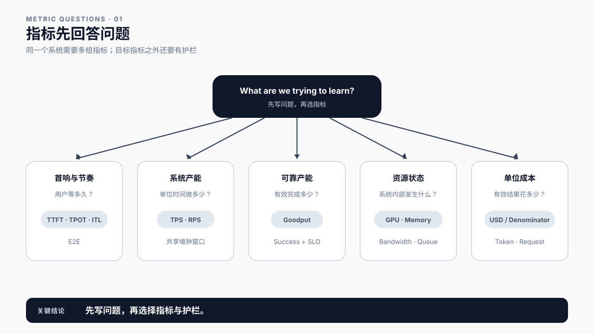
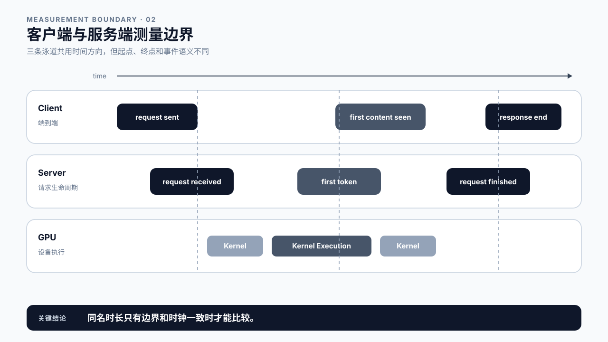
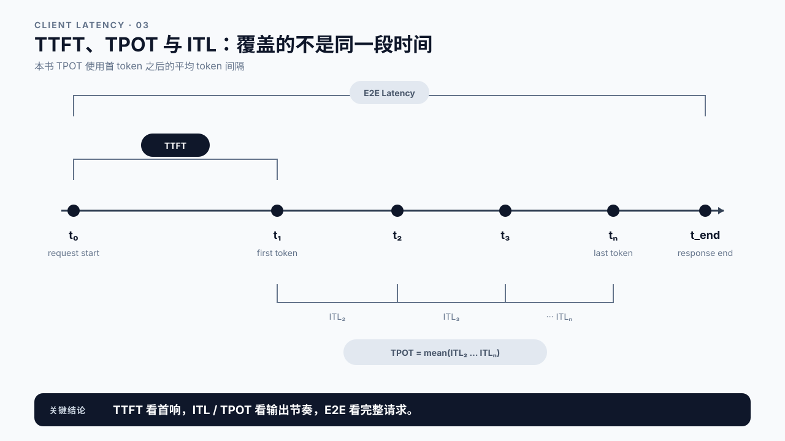
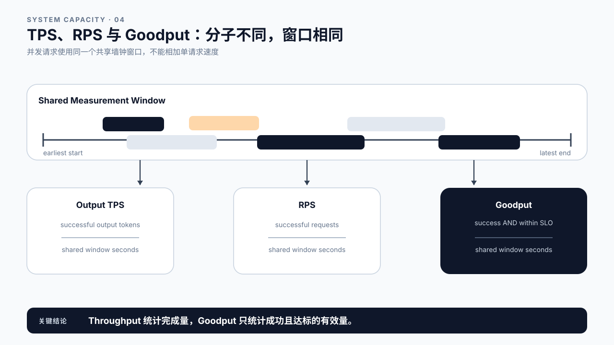
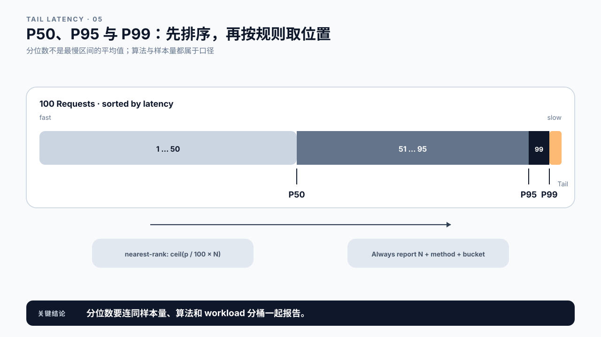
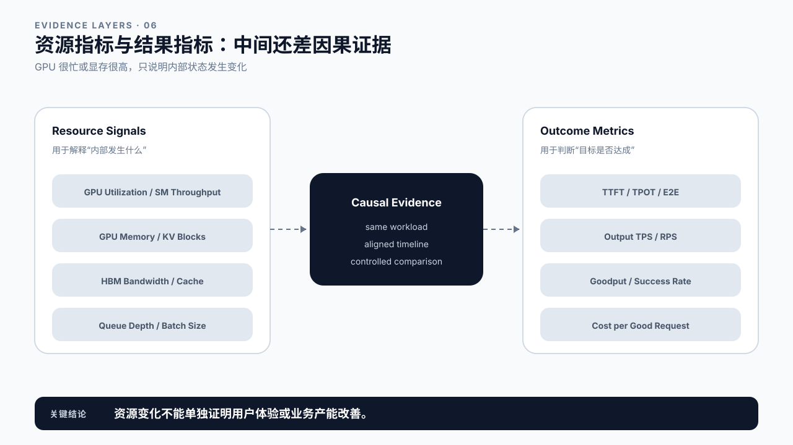
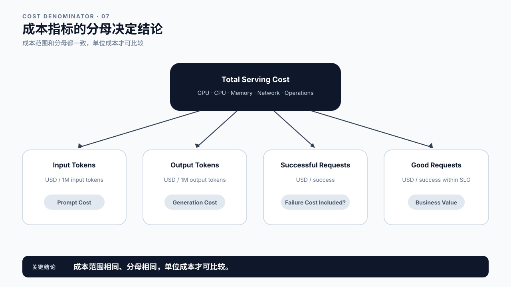
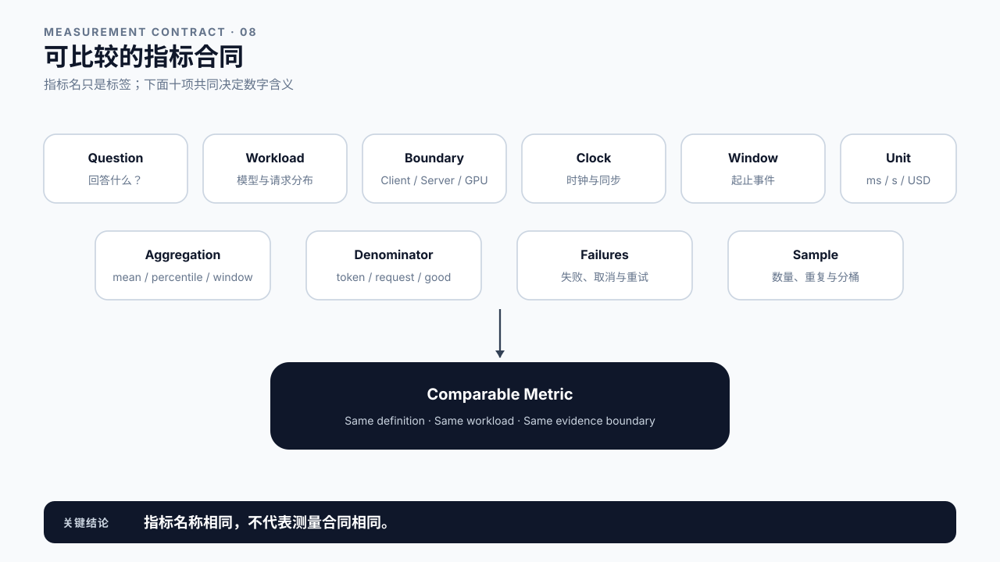
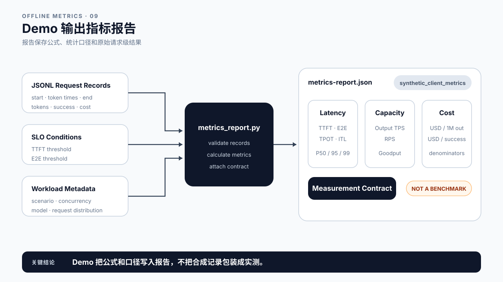

# 第 6 章 LLM 性能指标：先统一口径，再比较数字

## 学习目标

学完本章后，你应该能够：

- 按用户体验、系统产能、可靠性、资源和成本选择指标，而不是只报一个 tokens/s。
- 区分客户端、服务端和 GPU 三个测量边界。
- 定义 TTFT、E2E、TPOT、ITL、Output TPS、RPS 和 Goodput。
- 解释 P50、P95、P99、样本量与分位数算法之间的关系。
- 区分结果指标与资源指标，避免用 GPU Utilization 代替用户体验。
- 为成本指标写清输入 token、输出 token、成功请求或 SLO 合格请求等分母。
- 运行离线 Demo，从请求记录生成一份带测量合同的指标报告。

第 2 章已经定义请求生命周期，第 5 章解释 GPU 的资源约束。本章只解决测量语言：当团队说“慢”“吞吐高”“GPU 很忙”或“成本下降”时，这些话究竟对应哪个观测点、哪个统计窗口和哪个分母？

本章不教你设计正式 Benchmark。Warmup、重复次数、流量模型和实验控制属于第 8 章。这里先保证同一个指标名称指向同一种计算。

## 核心问题

1. 用户、服务端和 GPU 看到的是不是同一段时间？
2. TTFT、TPOT、ITL 和 E2E 分别覆盖哪段请求时间？
3. TPS、RPS 与 Goodput 为什么不能互相替代？
4. 为什么平均值正常，生产环境仍可能出现大量投诉？
5. “Cost per Token”缺少什么信息时无法比较？

## 6.0 指标先回答问题

指标不是越多越好。先写问题，再选择数字：

| 问题 | 指标族 | 常见指标 |
|---|---|---|
| 用户多久看到反馈？ | 交互延迟 | TTFT、ITL / TPOT、E2E |
| 系统单位时间完成多少工作？ | 产能 | Output TPS、Input TPS、RPS |
| 达标的有效工作有多少？ | 可靠产能 | Goodput、成功率、取消率 |
| 慢请求集中在尾部吗？ | 分布 | P50、P95、P99、最大值、样本量 |
| 资源发生了什么？ | 资源状态 | GPU Utilization、显存、HBM 带宽、Queue Depth |
| 每单位有效结果花多少钱？ | 成本 | USD / 1M input tokens、USD / 1M output tokens、USD / good request |

同一次改动可能让 Output TPS 上升，却让 TTFT P99 变差；也可能减少显存占用，却增加 GPU 小时。性能报告必须同时覆盖目标和护栏，不能只挑最好看的数字。



图6-1：指标先回答问题。

## 6.1 客户端、服务端与 GPU：先确定测量边界

同一个请求至少有三种时钟：

- **客户端时钟**：从调用方发出请求，到收到首个非空内容、后续流式片段和最终结束。
- **服务端时钟**：从 Gateway 或 Engine 接收请求，到排队、调度、首 token、最后 token、序列回收。
- **GPU 时钟**：Kernel 的提交、开始、结束，HBM 读写和计算单元活动。

客户端 TTFT 包含网络、入口处理、排队、Prefill、Sampling 和首段返回。服务端的 `first_token` 指标可能从 `request_received` 开始，也可能只覆盖 Engine 内部。GPU Kernel Duration 只覆盖设备执行。三个数字可以同时正确，却不应共用一个标签。

第 1 章 Demo 统计的是客户端首个非空内容 chunk，不保证一个 chunk 只含一个 token。接入真实接口时，如果没有逐 token 时间戳，应写 `time_to_first_content_chunk` 和 `chunk_interval`；不能把 chunk 间隔直接命名为严格 ITL。

时钟来源也要固定。单机时长适合使用单调时钟；跨机器事件需要时钟同步或 Trace 上下文，否则服务端事件与客户端事件可能无法安全相减。



图6-2：客户端与服务端测量边界。

## 6.2 TTFT、E2E、TPOT 与 ITL

假设客户端在 `t0` 发出请求，在 `t1` 观察到第一个输出 token，在 `t2 ... tn` 观察到后续 token，在 `t_end` 确认响应完成。

### TTFT：首 token 等待

```text
TTFT = t1 - t0
```

它描述用户等待首次有效反馈的时间。TTFT 是端到端结果指标，不等同于 Prefill；Queue、网络和入口处理都可能在其中。

### E2E Latency：请求总时长

```text
E2E = t_end - t0
```

E2E 同时受首 token 前等待、输出长度、生成节奏和响应尾部影响。比较 E2E 时必须同时报告输入与输出 token 分布。

### ITL：相邻 token 间隔

```text
ITL_i = t_i - t_(i-1),  i >= 2
```

ITL 是一组值，可以计算均值与分位数。它直接呈现流式输出是否均匀。只报告平均 ITL 会隐藏偶发停顿。

### TPOT：首 token 之后的平均 token 时间

本书的客户端 Demo 使用：

```text
TPOT = mean(ITL_2 ... ITL_n)
     = (t_n - t_1) / (n - 1),  n > 1
```

只有一个输出 token 时，TPOT 未定义，报告为 `null`，而不是 0。其他工具可能用 `(E2E - TTFT) / (output_tokens - 1)`；如果 `t_end` 还包含尾部网络或清理时间，两种结果会有差异。报告中必须写公式。



图6-3：TTFT、TPOT 与 ITL。

## 6.3 TPS、RPS 与 Goodput

“TPS”这个缩写很容易制造误解。它可能指 Input Tokens/s、Output Tokens/s，也可能把两者相加。本书要求把方向写进名称。

### Output Tokens Per Second

对并发请求，系统吞吐使用共享测量窗口：

```text
Output TPS
  = window 内成功生成的 output tokens
    / (最后结束时间 - 最早开始时间)
```

不能把各请求的 `output_tokens / request_latency` 相加，那会重复计算并发重叠的墙钟时间。

### Requests Per Second

```text
RPS = window 内成功请求数 / measurement_window
```

RPS 与 Output TPS 不会固定同比变化。短回答可能带来高 RPS、低 Output TPS；长回答可能相反。两者都要带上 workload。

### Goodput

Throughput 只问“做了多少”，Goodput 还要求结果有效。先定义合格条件，例如：

```text
good request
  = success
  AND TTFT <= 250 ms
  AND E2E <= 800 ms

Goodput = good requests / measurement_window
```

SLO 条件必须写进报告。不同团队若使用不同阈值，Goodput 数字不能直接比较。对于 Agent，还可以增加任务完成、工具调用成功或最大步数等业务条件。



图6-4：TPS、RPS 与 Goodput。

## 6.4 P50、P95、P99 与尾延迟

平均值回答整体中心，分位数回答请求分布。将 N 个延迟从小到大排序，P95 表示按指定算法取出的 95% 位置值。它不表示“最慢 5% 的平均值”。

分位数算法不止一种。课程 Demo 使用 **nearest-rank**：

```text
rank = ceil(p / 100 × N)
percentile = sorted_values[rank]
```

Python、NumPy、Prometheus、数据库和可观测平台可能采用插值、直方图估计或 nearest-rank。算法不同，小样本结果尤其容易不同。

样本量必须与 P99 一起报告。只有 20 个请求时，nearest-rank P99 实际取到最大值，很难支撑稳定的生产尾延迟结论。直方图指标还要报告 bucket 边界，否则 P99 只是桶内估计。

尾延迟分析还要分桶。长 Prompt、长 Output、高并发、冷启动和错误重试混在同一分布里，整体 P99 很难指导行动。按 workload 特征分层后，才知道尾部来自哪类请求。



图6-5：P50、P95 与 P99。

## 6.5 资源指标不是用户结果

GPU Utilization、显存占用、HBM Throughput、SM Throughput、Power、CPU Utilization 和 Queue Depth 都很重要。它们适合解释“系统内部发生了什么”，不能单独证明“用户体验更好”。

例如，GPU Utilization 从 55% 升到 90% 可能意味着：

- Batch 更大，Output TPS 上升；
- Queue 更长，TTFT P99 同时恶化；
- 请求量本身上升，系统接近饱和；
- 某个低效 Kernel 长时间占用 GPU；
- 采样窗口变化，两个数字不可比。

显存占用也只是容量状态。更多 KV Cache 可能支持更高并发，也可能让可用余量过小、增加抢占或 OOM 风险。

一份完整报告至少把两类指标放在一起：结果指标说明是否达成用户或业务目标，资源指标帮助提出和验证原因。第 7 章会把它们放入统一因果模型。



图6-6：资源指标与结果指标。

## 6.6 成本指标：分母决定结论

“Cost per Token 下降了”缺少三个关键信息：计算的是输入还是输出 token，成本包含哪些资源，失败与未达标请求如何处理。

常见口径包括：

```text
USD per 1M input tokens
  = total serving cost / input tokens × 1,000,000

USD per 1M output tokens
  = total serving cost / output tokens × 1,000,000

USD per successful request
  = total serving cost / successful requests

USD per good request
  = total serving cost / requests satisfying SLO
```

总成本可只算 GPU，也可包含 CPU、内存、存储、网络、托管服务与运维摊销。两份报告若成本范围不同，即使分母相同也不能直接比较。

失败请求消耗过资源但没有形成成功结果。若总成本包含失败请求，`USD per successful request` 会把这部分浪费计入单位成功成本，这通常更接近业务现实。若报告选择排除失败成本，也必须明示。

输入和输出 token 的计算成本与供应商定价可能不同。不要把两者简单相加后仍称为“每 token 成本”，除非业务明确接受这个合并口径。



图6-7：成本指标的分母。

## 6.7 可比较的指标合同

两个数字可以比较，至少要共享下面这份合同：

| 字段 | 必须写清的内容 |
|---|---|
| Question | 指标要回答的业务或工程问题 |
| Workload | 模型、Prompt / Output 分布、并发、采样和请求类型 |
| Boundary | Client、Gateway、Engine、Worker 或 GPU |
| Clock | 单调时钟、墙钟、跨机同步方式 |
| Window | 起止事件、Warmup 是否排除、窗口长度 |
| Unit | ms、s、tokens/s、requests/s、USD |
| Aggregation | mean、nearest-rank、直方图估计、窗口平均 |
| Denominator | 输入 token、输出 token、成功请求、good request |
| Failures | 失败、取消、超时和重试如何计入 |
| Sample | 请求数、重复次数与分桶方式 |

任何一项变化，都可能让同名指标失去可比性。最实用的习惯是让报告同时保存公式、元数据和原始记录，而不是只保存截图。



图6-8：可比较的指标合同。

## 6.8 Demo：从请求记录生成指标报告

本章 Demo 位于 `chapter06/demo`，只依赖 Python 标准库。它读取 JSONL 请求记录，生成客户端口径的延迟、吞吐、Goodput 与成本报告。

运行合成样例：

```bash
cd chapter06/demo
python3 metrics_report.py
```

每条记录包含：

- `start_ms`、`token_times_ms` 和 `end_ms`；
- `prompt_tokens`、`output_tokens`；
- `success` 和 `cost_usd`。

Demo 会拒绝逆序 token 时间、输出 token 数量不一致，以及失败请求仍声称完成输出等脏数据。报告使用所有请求的最早开始到最晚结束作为共享墙钟窗口，并把分位数算法、TPOT 公式和 SLO 条件写入 `measurement_contract`。

`synthetic_client_metrics` 表示输入是合成客户端记录。真实流式 API 若只能提供 chunk 到达时间，需要更换字段名称或在客户端重新 tokenize，不能原样沿用 token 口径。



图6-9：Demo 输出指标报告。

## 6.9 课堂案例：TPS 提升，为什么产品团队仍说变慢了

平台团队把 Batch 和并发提高后，报告 `Output TPS +35%`、GPU Utilization 从 55% 升到 82%。产品团队同时看到 `TTFT P95` 从 1.1 秒升到 2.4 秒，取消率也上升。

这两份报告不矛盾。平台报告描述系统产能与资源使用，产品报告描述交互体验与有效完成。课堂上先补合同：两边是否使用相同流量窗口、Prompt / Output 分布、客户端边界和成功条件？

然后定义护栏：如果优化目标是提升 Output TPS，TTFT P95、Goodput、取消率和单位 good request 成本至少要同时报告。是否上线取决于业务 SLO，不取决于哪一方的图更漂亮。

### 补充案例 A：RAG 的输入成本被藏起来了

RAG 优化前后，答案长度几乎不变，团队只报告 `USD per 1M output tokens`。新版本召回了更多文档，Prompt 从 2K 增长到 12K，输入计算和 TTFT 都上升。只看输出 token 分母会漏掉主要变化。

练习：补充 `input_tokens/request`、TTFT 分布、`USD per 1M input tokens` 和 `USD per good request`。第 23 章会进一步拆分检索、重排和生成成本。

### 补充案例 B：Agent 单次调用快，任务仍然慢

一个 Agent 的每次 LLM 调用 TTFT 和 TPOT 都达标，但完成一个任务需要 8 次串行 LLM 调用、3 次工具调用和一次重试。单次请求指标正常，任务 E2E 却很高。

练习：增加 `task_e2e_ms`、`llm_calls_per_task`、`tool_wait_ms`、`retry_count` 和 `successful_tasks`，并用 `good tasks / second` 而不是单次请求 Goodput 表达业务产能。第 24 章会建立正式 Agent 指标。

## 6.10 常见误区

误区一：把客户端 chunk 当成 token。

一个 chunk 可能包含零个、一个或多个 token。没有 token 级时间戳时，应使用 chunk 口径命名。

误区二：并发请求的 tokens/s 用单请求速度相加。

系统吞吐要用共享墙钟窗口。相加单请求速度会重复计算重叠时间。

误区三：TPOT 只有一个输出 token 时记为 0。

没有首 token 之后的间隔，TPOT 不存在。0 会错误暗示生成是瞬时完成的。

误区四：P99 不带样本量与算法。

小样本或不同插值方法会产生不同结果。报告 P99 时要写请求数和计算方式。

误区五：GPU Utilization 是最终目标。

资源指标用于解释结果，不替代 TTFT、Goodput、成功率和成本。

误区六：成本指标省略分母。

输入 token、输出 token、成功请求和 good request 会给出不同工程结论。

## 本章总结

LLM 性能指标必须绑定问题、边界、窗口、算法和分母。TTFT 描述首 token 等待，ITL / TPOT 描述首 token 之后的输出节奏，E2E 描述完整请求；Output TPS、RPS 和 Goodput 分别描述 token 产能、请求产能和满足条件的有效产能。

P50、P95、P99 要带上样本量与分位数算法。GPU 与显存指标是解释线索，不是用户结果。成本报告必须明确资源范围，以及输入 token、输出 token、成功请求或 SLO 合格请求等成本分母。

下一章把这些结果指标、生命周期阶段和第 5 章的资源约束连接起来，形成 Global Performance Model。

### 本章 Checklist

- [ ] 能分别写出 TTFT、E2E、ITL 和本书 TPOT 公式。
- [ ] 能区分客户端首 chunk、服务端首 token 与 GPU Kernel 时间。
- [ ] 能用共享墙钟窗口计算 Output TPS 和 RPS。
- [ ] 能为业务 SLO 定义 Goodput。
- [ ] 能解释 nearest-rank P95 / P99 与样本量的关系。
- [ ] 能区分结果指标与资源指标。
- [ ] 能为成本指标写清成本范围和分母。
- [ ] 能为两份待比较报告补齐指标合同。

## 课后练习

1. 给定 `t0=0ms`、token 时间 `[300, 350, 420, 500]ms`、`t_end=520ms`，计算 TTFT、E2E、每个 ITL 和 TPOT。
2. 两个并发请求在 2 秒共享窗口内共生成 300 个输出 tokens、成功完成 8 个请求，计算 Output TPS 与 RPS。
3. 在第 2 题中，若只有 6 个请求满足 `TTFT <= 500ms` 且 `E2E <= 2s`，计算 Goodput。
4. 使用 nearest-rank 计算 20 个样本的 P95 和 P99 分别落到第几个排序值，并解释其局限。
5. 修改 Demo 的 SLO 阈值，观察 Throughput 不变而 Goodput 改变的场景。
6. 为一个 RAG 或 Agent 服务写一份指标合同，至少包含 Boundary、Window、Aggregation、Failures 和成本分母。
