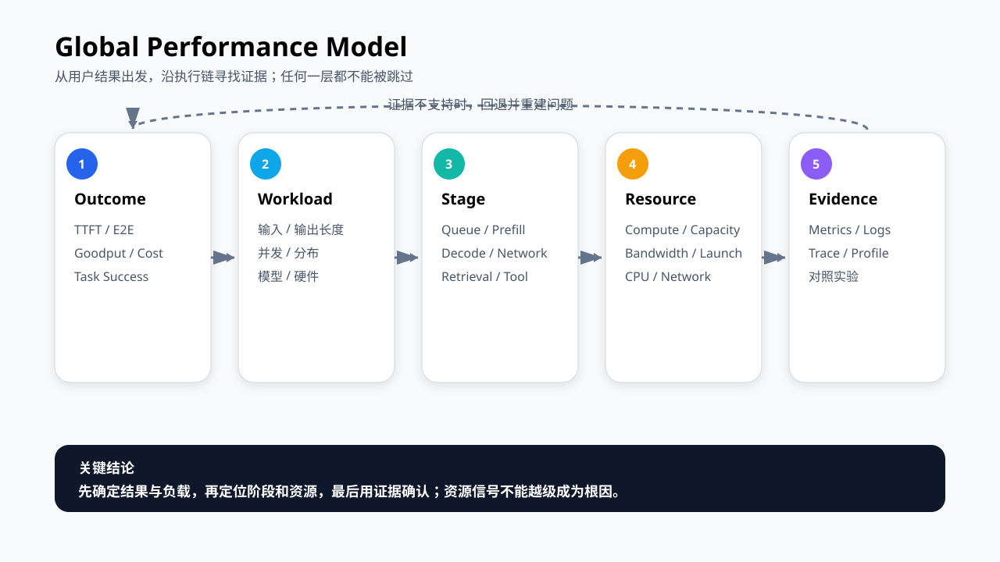
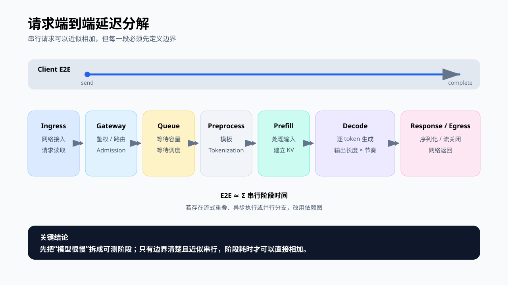
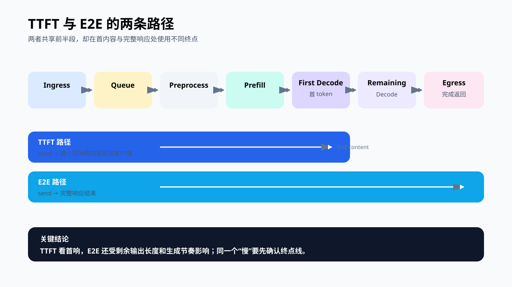
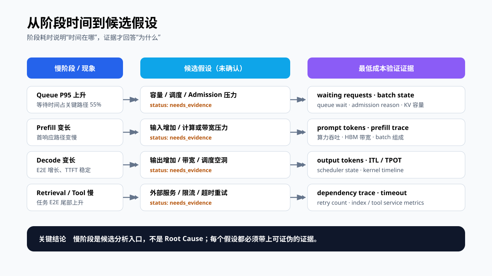
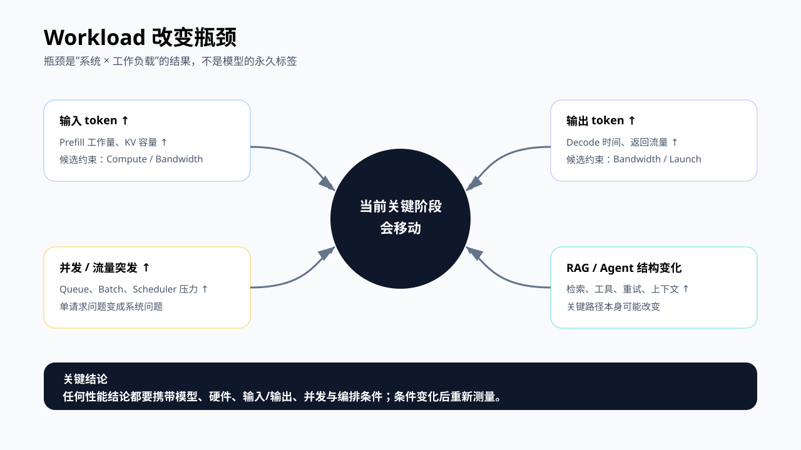
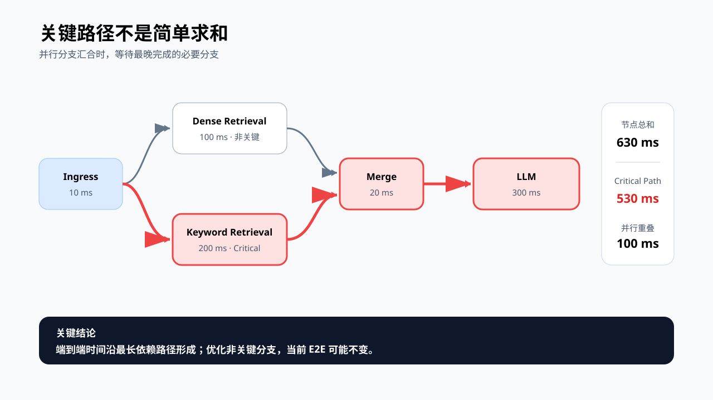
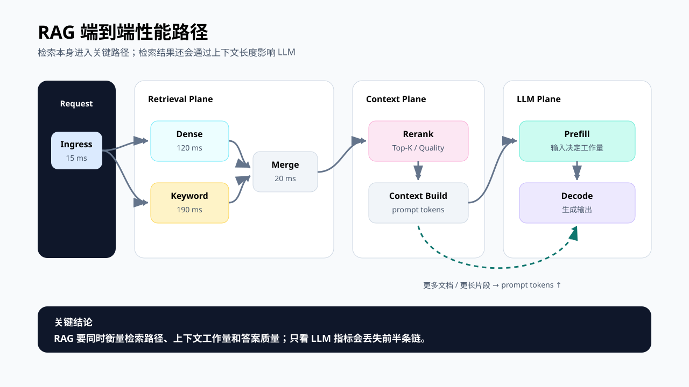
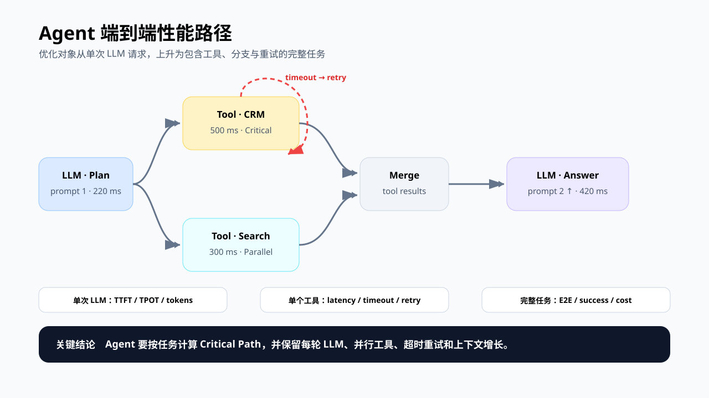
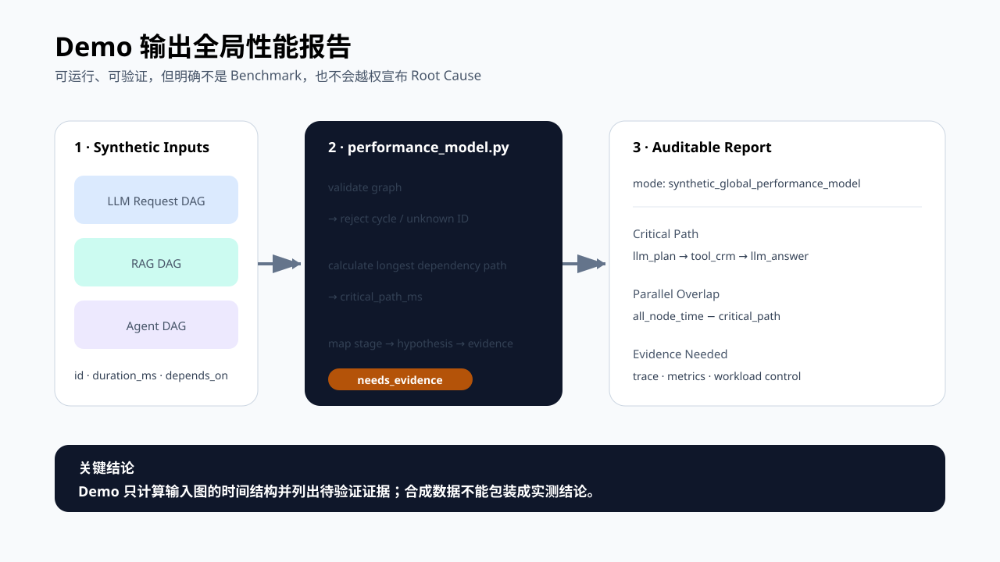

# 第 7 章 Global Performance Model

前六章分别讨论了服务入口、推理生命周期、系统架构、Transformer、GPU 约束和性能指标。到这里，我们已经认识了许多局部，却还缺一张能把它们放回同一条因果链的地图。

这一章建立全书的 Global Performance Model（全局性能模型）。它不是一个新的性能指标，也不是一条看到慢请求就能自动给出答案的公式。它是一套组织问题的方法：先确认用户看到的结果，再还原工作负载和执行路径，把时间归到具体阶段，把阶段映射到资源约束，最后用证据验证候选原因。

## 学习目标

学完本章后，你应该能够：

- 用 Outcome、Workload、Stage、Resource、Evidence 五层描述一次性能问题；
- 分解普通 LLM 请求的 TTFT 与 E2E 路径；
- 用依赖图和 Critical Path（关键路径）分析存在并行分支的 RAG 与 Agent；
- 根据慢阶段提出候选假设，并说明还要采集哪些证据；
- 识别“最长阶段就是根因”“节点时间全部相加”等常见误判；
- 运行一个离线 Demo，生成可审计的全局性能报告。

## 本章边界

本章回答的是“如何把一次端到端性能问题放进完整模型”。它不会提前给出量化、KV Cache、调度器或 CUDA Kernel 的优化配方，也不替代正式 Benchmark 和 Profiling。

全局模型负责决定下一步应该验证什么。第 8 章会把 Workload 和实验方法固定下来，第 9 章再介绍如何采集服务端、Runtime 与 GPU 证据。

## 核心问题

本章围绕四个问题展开：

1. 如何把用户看到的慢，映射到一次完整请求或任务的执行路径？
2. 哪些阶段可以近似相加，哪些场景必须使用依赖图？
3. 怎样从关键阶段提出候选假设，又不把它误写成 Root Cause？
4. RAG 与 Agent 增加了哪些 LLM 服务之外的性能路径？

## 7.0 一张图串起前六章

分析一次性能问题，可以从五层连续追问：

1. **Outcome**：用户或业务到底哪里变差了？是 TTFT、E2E、Goodput、成本，还是任务成功率？
2. **Workload**：这个结果发生在什么输入长度、输出长度、并发、请求分布和硬件条件下？
3. **Stage**：时间实际花在入口、排队、预处理、Prefill、Decode、检索、工具调用还是返回链路？
4. **Resource**：候选阶段受算力、显存容量、显存带宽、Kernel 启动、CPU、网络或外部依赖中的哪一类约束？
5. **Evidence**：什么 Trace、指标、日志或对照实验能够支持或推翻这个判断？



图7-1：Global Performance Model 把结果、负载、阶段、资源与证据连成闭环。

这五层不能跳着用。比如“P95 TTFT 上升”只描述了 Outcome；“GPU Utilization 低”只是一条 Resource Signal。两者之间还缺 Workload、Stage 和因果证据。直接据此得出“换更大的 GPU”，中间跨过了三层。

这个模型也不是单向瀑布。证据不支持原假设时，要回到阶段划分甚至测量边界重新检查。性能工程的可靠性，恰恰来自这种可以被推翻、可以回退的过程。

## 7.1 普通 LLM 请求：先拆端到端时间

对一条没有并行分支的普通 LLM 请求，客户端观察到的端到端延迟可以近似写成：

```text
E2E ≈ T_ingress
    + T_gateway/admission
    + T_queue
    + T_preprocess
    + T_prefill
    + T_decode
    + T_response_tail/egress
```

这里的“近似”很重要。真实系统里可能存在流式返回、CPU/GPU 重叠、异步日志以及请求批处理。这个加法只适用于边界明确、阶段近似串行的请求视图，不能无条件套到所有系统。



图7-2：普通请求的端到端延迟由入口、等待、模型执行和返回链路共同组成。

每个阶段回答不同问题：

| 阶段 | 它包含什么 | 常见观测 |
|---|---|---|
| Ingress / Gateway | 网络接入、鉴权、路由、限流 | 接入日志、状态码、网络时间戳 |
| Queue / Admission | 等待调度、等待容量、准入控制 | queue wait、waiting requests、拒绝原因 |
| Preprocess | 模板、tokenization、输入整理 | CPU profile、prompt tokens、预处理耗时 |
| Prefill | 处理全部输入 token，建立初始 KV Cache | prefill time、输入长度、GPU timeline |
| Decode | 逐步生成输出 token | output tokens、TPOT/ITL、decode timeline |
| Response tail / Egress | 序列化、流关闭、网络返回 | 服务端结束时间与客户端结束时间 |

分解的价值不是把请求画得更复杂，而是避免把所有慢都归给“模型”。如果 Queue 占了 70%，优化一个 GEMM Kernel 即使成功，端到端收益也可能很小。

## 7.2 TTFT 与 E2E 走的不是同一条终点线

TTFT 关注首个可消费内容何时到达客户端。E2E 关注完整响应何时结束。以流式请求为例：

```text
TTFT ≈ ingress + gateway + queue + preprocess + prefill
       + first-decode-step + first-chunk-egress

E2E  ≈ TTFT + remaining-decode + remaining-stream/egress
```



图7-3：TTFT 在首个内容到达时结束，E2E 继续覆盖剩余生成与返回。

因此，两个看似矛盾的现象可以同时成立：

- TTFT 变差而 TPOT 基本不变：更像入口、排队、预处理或 Prefill 路径变化；
- TTFT 基本不变而 E2E 变差：先检查输出长度和 Decode 节奏；
- TTFT 与 E2E 同时变差：可能是共享前缀阶段变慢，也可能是负载同时改变了多个阶段。

这里沿用第 6 章的测量合同：必须说明时钟、起止事件和首“内容块”是否等于首 token。客户端 TTFT 与服务端 TTFT 可以用于关联分析，但边界不同，不能直接相减。

## 7.3 慢阶段只能生成候选假设

阶段分解回答“时间在哪里”，还没有回答“为什么”。从阶段时间到工程动作，中间至少要经过“候选假设”和“验证证据”两步。



图7-4：阶段异常先生成候选假设，再由对应证据确认或推翻。

下面这张表给出常见映射，但每一项都只是起点：

| 慢阶段 | 候选假设 | 下一步证据 |
|---|---|---|
| Ingress / Egress | 网络、序列化或网关处理变慢 | 客户端/服务端时间戳、payload 大小、网络 Trace |
| Queue | 容量不足、调度不公平、Admission 限制、KV Cache 压力 | waiting requests、queue wait、batch 状态、准入原因 |
| Preprocess | Tokenization、模板或 CPU 处理变慢 | CPU profile、prompt tokens、预处理明细 |
| Prefill | 输入变长、计算压力、带宽压力或批处理变化 | 输入长度分布、prefill trace、算力/带宽指标 |
| Decode | 输出变长、带宽压力、调度空洞或启动开销 | output tokens、ITL/TPOT、scheduler 与 kernel timeline |
| Retrieval / Tool | 外部服务、索引、限流、超时或重试 | 分布式 Trace、依赖指标、timeout/retry 计数 |

“Decode 最慢”不等于“Decode 有故障”。自回归生成本来就可能占据最长时间。如果输出 token 数从 100 增长到 500，Decode 变长首先是工作量变化；只有控制输出长度后仍出现异常，才值得继续追查资源或调度。

## 7.4 Workload 会移动瓶颈

性能结论只在它对应的 Workload 下成立。以下变化都可能把瓶颈推向另一处：

- 输入 token 增长，Prefill 工作量与 KV Cache 占用增加；
- 输出 token 增长，Decode 时长和输出传输量增加；
- 并发增长，单请求执行问题可能转化为 Queue 和 Scheduler 问题；
- Batch、精度、硬件或并行策略改变，计算、带宽、容量与通信占比会重排；
- RAG 召回更多文档，既增加检索/重排时间，也会通过上下文长度影响 Prefill；
- Agent 增加步骤、工具和重试，任务路径会变长，分支结构也会改变。



图7-5：输入、输出、并发与编排结构变化，会把瓶颈推向不同阶段。

所以“这个模型是计算受限还是带宽受限”不是脱离条件的永久标签。更准确的表达是：在给定模型、硬件、输入/输出长度、并发和执行策略下，当前关键阶段表现出哪类约束。

## 7.5 有并行分支时，用 Critical Path，不要把节点全加起来

普通请求可以近似看成一条串行链，但 RAG 和 Agent 往往含有并行检索、并行工具或条件分支。此时，把所有节点时间相加会高估用户真正等待的时间。

可以把一次任务表示成有向无环依赖图（DAG）：

- 节点表示一个有明确起止点的阶段；
- 边表示“后一个节点必须等待前一个节点完成”；
- Critical Path 是从起点到终点的最长依赖路径；
- 并行分支汇合时，等待时间由最晚完成的必要分支决定，而不是所有分支之和。



图7-6：并行分支的端到端时间由最长依赖路径决定，而不是节点耗时总和。

图中的两个检索分支分别耗时 100 ms 和 200 ms。如果它们同时开始，汇合点需要等待 200 ms，而不是 300 ms。整个图的节点时间之和为 630 ms，Critical Path 为 530 ms，因此有 100 ms 没有落在最长依赖路径上。

关键路径带来两个直接判断：

1. 优化不在关键路径上的节点，当前这次任务的 E2E 可能完全不变；
2. 优化关键路径上的节点后，关键路径可能转移到另一条分支，收益不会永远线性延续。

它也有边界。Critical Path 依赖输入 Trace 的完整性，只解释这次依赖图的时间结构，不自动解释 Root Cause。共享资源争抢、批处理耦合和异步执行还需要系统级证据。

## 7.6 RAG：外部检索与 LLM 路径互相影响

RAG 不能简单压成 `Queue + Prefill + Decode`。一条典型路径可能是：入口之后并行进行向量检索与关键词检索，合并结果，再 Rerank、构造上下文，最后进入 LLM Prefill 和 Decode。



图7-7：RAG 的检索、重排、上下文构造与 LLM 推理共同决定端到端性能。

分析 RAG 时至少要保留两类联系：

- **时间联系**：检索和重排直接进入任务 Critical Path；
- **工作量联系**：文档数量、片段长度和上下文拼接方式会改变 prompt tokens，进而改变 Prefill 和 KV Cache 压力。

这意味着“把 Top-K 从 20 降到 5”可能同时缩短 Rerank 和 Prefill，但不能只看速度。它也可能降低召回率和答案质量。RAG 优化报告至少要同时给出延迟、检索质量或任务质量护栏，以及输入 token 的变化。

一个实用的 RAG 记录结构是：

```text
request_id
├─ dense_retrieval: start/end, result_count
├─ keyword_retrieval: start/end, result_count
├─ rerank: start/end, candidate_count
├─ context_build: start/end, prompt_tokens
└─ llm: queue/prefill/decode, output_tokens
```

如果只记录 LLM 服务内的 TTFT，就看不到检索路径；如果只记录检索耗时，也解释不了上下文变长后 Prefill 的变化。

## 7.7 Agent：优化对象从单次请求变成完整任务

Agent 的执行图更动态。它可能先调用一次 LLM 规划，再并行调用多个工具，汇合后再次调用 LLM；失败时还会超时、重试、反思或改走另一条分支。



图7-8：Agent 任务包含重复 LLM 调用、并行工具、汇合、重试与上下文增长。

因此，Agent 性能至少要区分三种尺度：

| 尺度 | 关注点 | 示例指标 |
|---|---|---|
| 单次 LLM 调用 | 一次推理是否变慢 | TTFT、TPOT、tokens、queue time |
| 单个工具调用 | 外部依赖是否阻塞 | tool latency、timeout、retry、error rate |
| 完整任务 | 用户最终等待多久、任务是否完成 | task E2E、task success、LLM calls/task、tool calls/task、cost/task |

只优化单次 LLM 调用，并不保证 Agent 任务明显变快。假设 LLM 一共占 400 ms，而串行工具与重试占 4 s，把 LLM 加速 30% 对任务 E2E 的影响仍然有限。

Agent 还有一个累积效应：每轮把历史和工具结果重新放进上下文，会让后续 Prefill 越来越长。性能模型应保留每次 LLM 调用的 prompt/output tokens，而不是把多次调用合并成一个平均值。

## 7.8 Demo：从依赖图生成全局性能报告

本章 Demo 不需要 GPU，也不伪造 Benchmark。它读取一个合成的 LLM、RAG 或 Agent 依赖图，计算 Critical Path、并行重叠和关键路径阶段占比，再为每个候选阶段列出待采证据。



图7-9：Demo 从合成依赖图生成关键路径、阶段占比和待验证假设。

从 Git 仓库根目录分别运行三类样例：

```bash
python3 code/chapter07/performance_model.py code/chapter07/sample_llm_request.json
python3 code/chapter07/performance_model.py code/chapter07/sample_rag.json
python3 code/chapter07/performance_model.py code/chapter07/sample_agent.json
```

也可以保存 Agent 报告：

```bash
python3 code/chapter07/performance_model.py code/chapter07/sample_agent.json \
  --output global-performance-report.json
```

样例中的 Agent 有两条并行工具分支。报告会保留完整路径，并输出类似结果：

```text
mode: synthetic_global_performance_model
critical_path:
  llm_plan -> tool_crm -> merge_tools -> llm_answer

hypothesis for tool_crm:
  external_tool_or_dependency_delay
status:
  needs_evidence
evidence_needed:
  tool_latency_ms, dependency_trace, timeout_and_retry_count
```

请注意 `needs_evidence`。程序不会生成 `root_cause` 字段，因为输入只有阶段时长与依赖关系。要确认根因，仍需真实 Trace、服务指标、Workload 对照和 GPU Profiling。

Demo 还会拒绝循环依赖、未知依赖、重复节点 ID 和负时长，防止一张结构不合法的图产生貌似精确的答案。运行测试：

```bash
python3 -m unittest discover -s code/chapter07 -p 'test_*.py' -v
```

## 7.9 课堂案例：企业问答为什么“GPU 不忙但用户很慢”

企业问答服务出现以下现象：

```text
P95 task E2E: 1.8 s -> 4.9 s
LLM TTFT:     0.9 s -> 1.0 s
GPU util:     45%
error rate:   unchanged
```

只看 GPU 利用率，很容易得出“GPU 没吃满”的模糊结论。放进全局模型后，分析顺序会变成：

1. Outcome：恶化的是完整任务 E2E，LLM TTFT 只增加 0.1 s；
2. Workload：确认查询类型、Top-K、并发和文档库版本是否变化；
3. Stage：通过 Trace 发现关键词检索从 180 ms 增长到 3.1 s，并位于 Critical Path；
4. Resource：问题更接近外部检索依赖，而不是 GPU 执行；
5. Evidence：查看检索服务队列、慢查询、索引发布记录，并用相同查询集复现。

此时，GPU 不忙是结果，不是根因。请求尚未到达 LLM 或无法连续到达，GPU 自然会出现空洞。

### 补充案例 A：RAG 降低 Top-K 后为何没有线性加速

Top-K 从 20 降到 10 后，Rerank 减少了 80 ms，但 E2E 只减少 20 ms。Trace 显示 Rerank 与另一项元数据读取部分重叠，而且原来的 Critical Path 经过元数据分支。

讨论重点：局部耗时下降不等于端到端收益相同；还要重新计算关键路径，并检查答案质量护栏。

### 补充案例 B：Agent 单次 LLM 加速后任务仍然很慢

某 Agent 把每次 LLM 调用从 600 ms 优化到 420 ms，但任务 P95 几乎不变。完整 Trace 显示工具超时触发了两次串行重试，增加了 5 s。

讨论重点：优化对象是否选错了尺度？应该先看单次调用指标，还是完整任务的 Critical Path 与重试分布？

## 7.10 常见误区

### 误区一：最长阶段就是根因

最长阶段只说明它值得优先解释。阶段可能因为输入更多而合理变长，也可能只是等待另一个未被记录的依赖。正确措辞应是“候选瓶颈”或“优先验证对象”。

### 误区二：所有节点时间相加就是 E2E

只有严格串行的节点才能直接相加。存在并行检索、并行工具或 CPU/GPU 重叠时，要使用依赖关系和 Critical Path。

### 误区三：只分析平均请求

平均输入长度和平均 E2E 可能掩盖长上下文、长输出、重试和慢租户。至少要按关键 Workload 维度分桶，并观察 P50/P95/P99。

### 误区四：把 GPU 指标当业务结果

GPU Utilization、带宽和显存占用用于解释系统状态。用户关心的是延迟、成功、质量和成本。资源更忙不等于 Goodput 更高。

### 误区五：优化局部后不重算路径

一条分支缩短后，另一条分支可能成为新的 Critical Path。每轮实验都要重新采样，而不是沿用优化前的瓶颈排序。

### 误区六：RAG 与 Agent 只看 LLM Server

这会遗漏检索、工具、编排、重试和上下文增长。端到端 Trace 与 LLM 内部指标必须通过 request/task ID 关联，但仍要保持各自的测量边界。

## 7.11 一份可执行的分析模板

遇到性能问题时，可以先填下面这张表：

| 层次 | 要写清楚的内容 |
|---|---|
| Outcome | 哪个指标、哪个分位数、变化多少、SLO 是否失守 |
| Workload | 模型、硬件、输入/输出长度、并发、流量分布、RAG/Agent 参数 |
| Boundary | Client、Gateway、Engine、GPU、外部依赖各自的时钟和起止点 |
| Graph | 节点、耗时、依赖、并行分支、Critical Path |
| Hypothesis | 候选解释，以及哪些现象与它一致或冲突 |
| Evidence | 下一项最低成本、能证伪假设的观测或实验 |
| Guardrail | 成功率、质量、成本、资源上限和公平性 |
| Decision | 继续验证、实施优化、回滚假设或调整 Workload |

一份好的分析不是数据最多，而是每个结论都能沿着这张表向前追溯。

## 本章总结

Global Performance Model 把性能问题组织成五层：Outcome、Workload、Stage、Resource、Evidence。普通串行请求可以先做阶段加法；出现并行检索、工具或重复调用后，必须用依赖图和 Critical Path 描述真实等待路径。

慢阶段只生成候选假设，不自动生成 Root Cause。RAG 要同时看检索路径与上下文对 Prefill 的影响；Agent 要从单次调用上升到完整任务，保留并行、重试和上下文增长。接下来，第 8 章会把这里的 Workload 与测量条件固化为可复现的 Benchmark。

### 本章 Checklist

- [ ] 能用五层模型描述当前性能问题。
- [ ] 能区分 TTFT 路径与完整 E2E 路径。
- [ ] 能为阶段定义明确的起止点和统一时钟。
- [ ] 遇到并行分支时，会构建依赖图并计算 Critical Path。
- [ ] 不把最长阶段、GPU 利用率或单次运行直接写成 Root Cause。
- [ ] RAG 报告包含检索、上下文 token 与 LLM 阶段。
- [ ] Agent 报告包含任务级 E2E、成功率、重复调用、工具和重试。
- [ ] 每个候选假设都写明下一项验证证据与质量护栏。

## 课后练习

1. 为一个流式 LLM 请求画出客户端 TTFT 与 E2E 路径，标明两者共同和不同的阶段。
2. 一个请求的 Queue、Prefill、Decode 分别为 400、300、900 ms。列出至少两个不能仅凭这些数字排除的解释。
3. 两个并行检索分支分别耗时 120 和 280 ms，汇合与 LLM 分别耗时 40 和 600 ms。计算 Critical Path，并说明把两个检索时间相加为什么不对。
4. 为你熟悉的 RAG 服务设计一份最小 Trace 字段表，要求能关联检索结果、prompt tokens 和 LLM 阶段。
5. 为一个带两次工具调用的 Agent 定义任务级性能合同，至少包含延迟、成功、质量与成本。
6. 修改 Demo 的 Agent 样例，让较短工具分支变成 Critical Path，比较报告前后变化。
