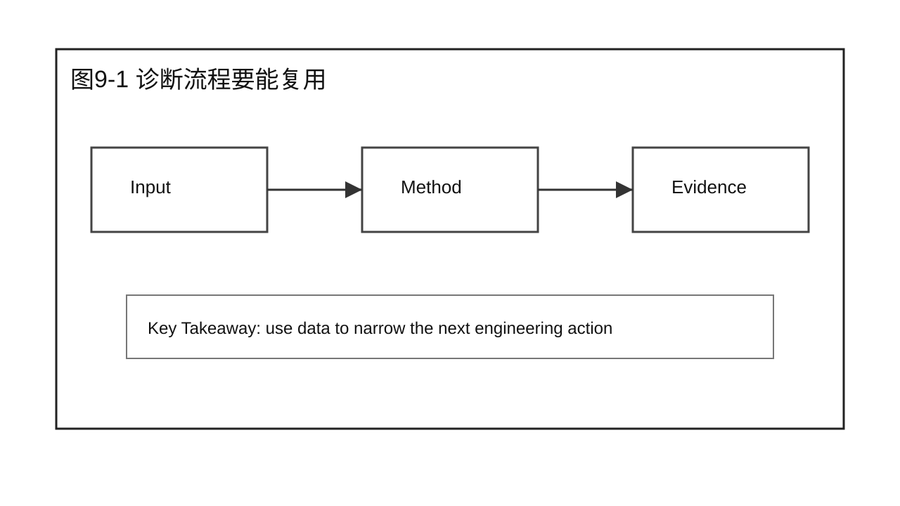
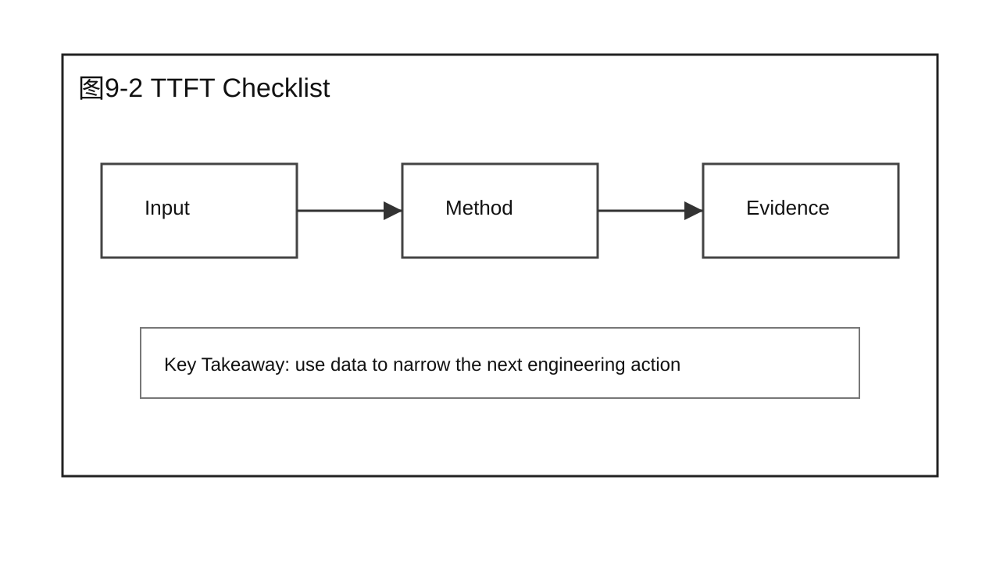
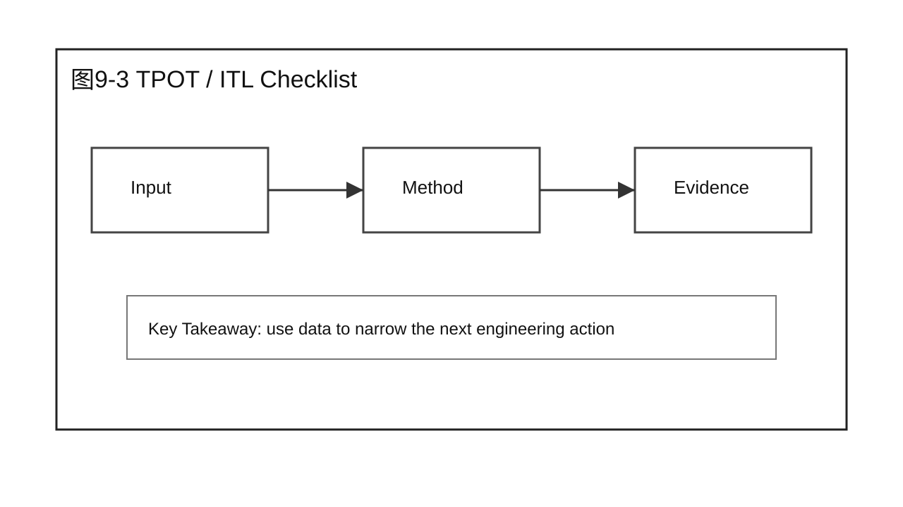
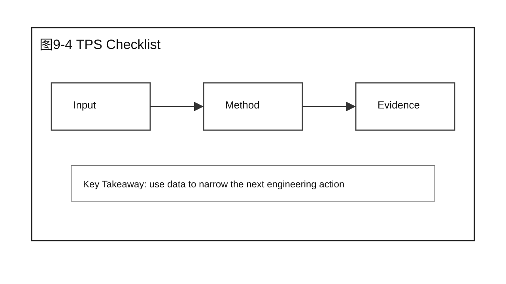
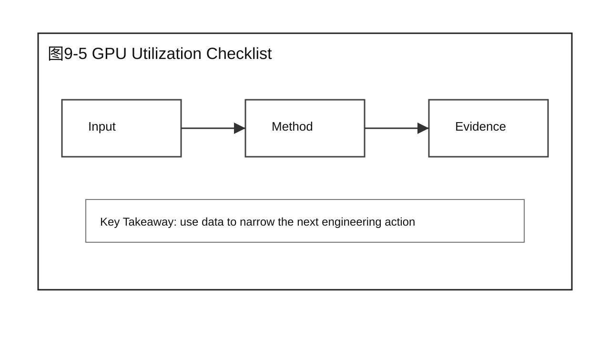
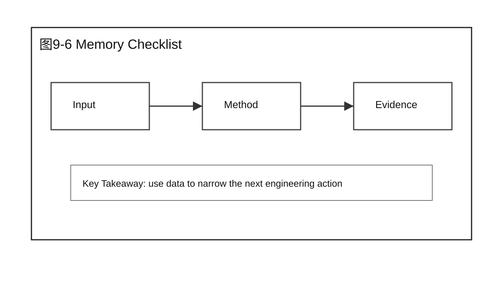
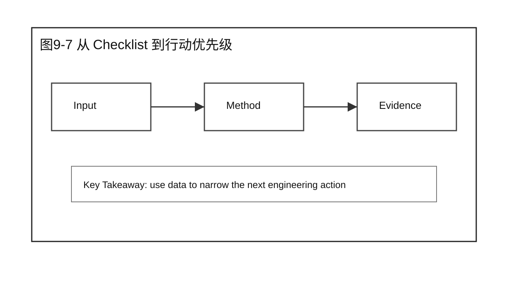
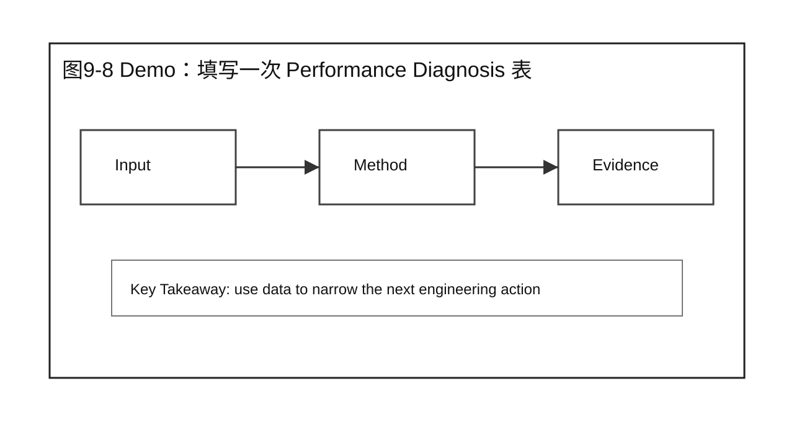
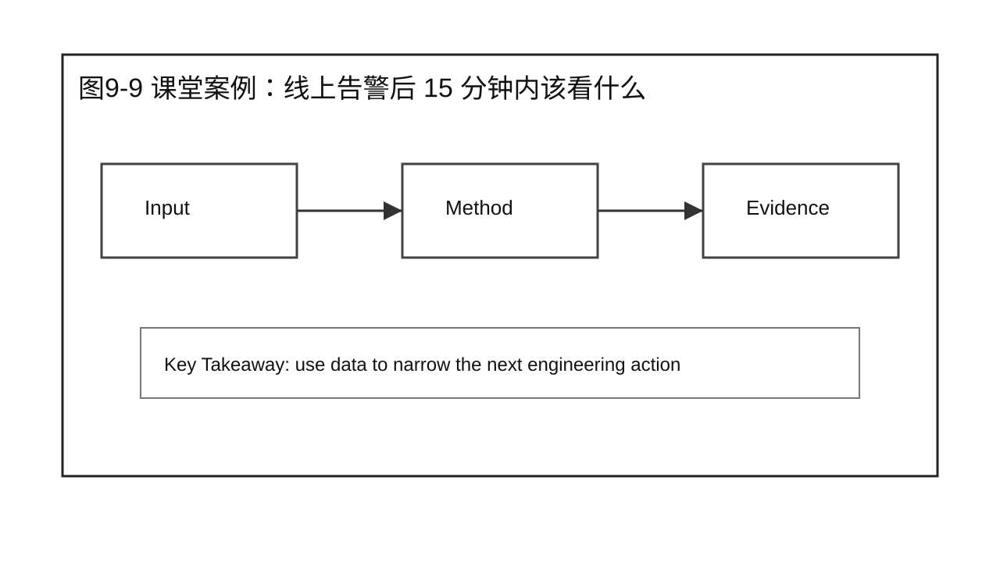
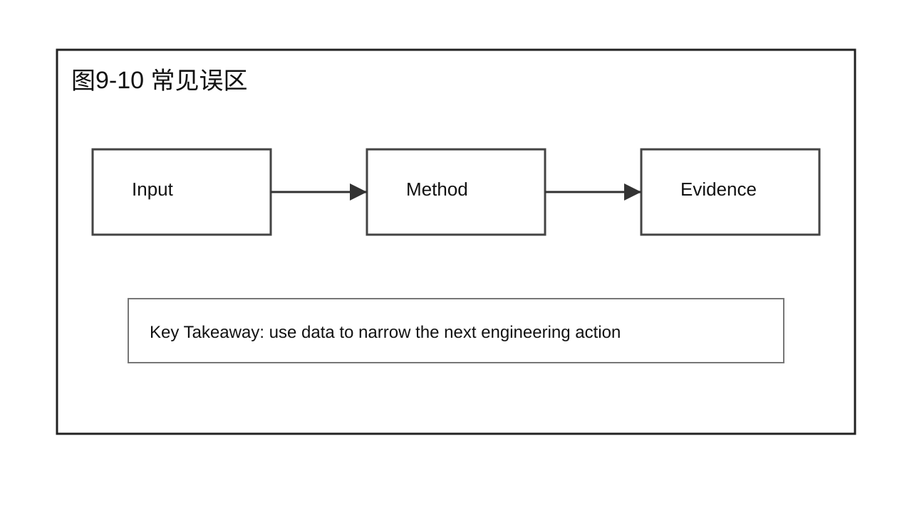

# 第 9 章 Performance Diagnosis

## 学习目标

学完本章后，你应该能够：

- 解释本章为什么要回答：如何形成统一、可执行的性能诊断流程？
- 把性能分析问题拆成 Baseline、Workload、指标和证据。
- 区分现象、假设、Profiling 证据和 Root Cause。
- 设计一个不越过本章边界的 Demo 或课堂讨论。
- 使用本章 Checklist 为后续优化章节准备输入。

本章属于 Part 2 Performance Analysis。它只建立分析方法，不提前给出 Prefill、Decode、Serving 或 Scalability 的优化结论。

## 核心问题

本章围绕四个问题展开：

1. 如何形成统一、可执行的性能诊断流程？
2. 这个问题在完整推理系统里落在哪些组件和阶段？
3. 哪些证据足以支持结论，哪些只是表面现象？
4. 如何把方法沉淀成后续章节可以复用的检查动作？



图9-1：诊断流程要能复用。

## 9.1 诊断流程要能复用

诊断流程要能复用。一个人临场判断可能很快，但团队协作需要稳定检查顺序。Checklist 的价值是让不同同学面对同类问题时，先看同一组证据，再讨论优化方案。



图9-2：诊断流程要能复用。

## 9.2 TTFT Checklist

TTFT Checklist 先看请求是否进入系统，再看队列等待、Prefill 计算、长 prompt、冷启动、KV Cache 分配和首个 chunk 返回。TTFT 是首包前路径，不应直接归因到 Decode。



图9-3：TTFT Checklist。

## 9.3 TPOT / ITL Checklist

TPOT / ITL Checklist 关注逐 token 生成节奏。它要看 Decode kernel、KV Cache 读取、sampling、streaming 返回、batch 中其他请求的影响，以及长输出下的稳定性。



图9-4：TPOT / ITL Checklist。

## 9.4 TPS Checklist

TPS Checklist 关注系统总体产出能力。要同时看请求分布、并发梯度、batch 形成、GPU 利用率、平均输出长度和尾延迟，避免为了吞吐牺牲交互体验。



图9-5：TPS Checklist。

## 9.5 GPU Utilization Checklist

GPU Utilization Checklist 不能只问高低，还要问是否有效忙。高利用率要结合 TPS 和 TPOT，低利用率要结合队列、CPU、Scheduler 和网络。



图9-6：GPU Utilization Checklist。

## 9.6 Memory Checklist

Memory Checklist 关注模型权重、KV Cache、临时 workspace、碎片、并发预算和 max model length。显存接近上限时，问题可能表现为拒绝请求、抢占、batch 变小或尾延迟变长。



图9-7：Memory Checklist。

## 9.7 从 Checklist 到行动优先级

Checklist 的结果要转成行动优先级。能快速排除的先排除，影响面最大的先确认，采集成本低的先采集。不要同时展开十个方向，否则诊断会变成噪声。



图9-8：从 Checklist 到行动优先级。

## 9.8 Demo：填写一次 Performance Diagnosis 表

Demo 的目标是填写一份 Performance Diagnosis 表。它要求记录现象、影响范围、已检查层级、初步判断、证据和下一步动作，而不是直接写“建议调大 batch”。

下面是一份课堂可用的半成品表。教师可以先隐藏“初步判断”和“下一步”，让学员根据证据填写。

| 字段 | 内容 |
|---|---|
| 事件 | 企业问答服务，周一 10:00 后 P95 TTFT 告警 |
| 影响范围 | 主要影响知识库长上下文问答，短 FAQ 请求影响较小 |
| 指标变化 | P95 TTFT 明显升高，TPOT 小幅变化，错误率稳定 |
| Gateway | 无明显 4xx / 5xx，路由到正确模型 |
| Admission / Queue | waiting queue 上升，高峰期更明显 |
| Engine Scheduler | 平均 batched tokens 下降，Prefill 请求等待变长 |
| Worker / GPU | GPU util 有空洞，显存未打满 |
| 初步判断 | 更像长 prompt 引发的 Prefill 与 queue 耦合问题 |
| 下一步 | 分离长短 prompt workload，复跑 Chapter 6 Baseline，并采集 Chapter 7 Timeline |

这份表刻意不写优化动作。它的输出是“下一步验证什么”，不是“立刻调什么参数”。等验证动作证明根因后，才进入 Prefill、Serving 或 Scalability 的优化章节。

## 9.9 课堂案例：线上告警后 15 分钟内该看什么

线上告警提示用户首包变慢。值班同学需要在 15 分钟内先判断问题方向：入口是否限流，队列是否堆积，Prefill 是否变重，GPU 是否有空洞，显存是否接近上限。Checklist 的价值是先缩小方向。

课堂讨论：

1. 这个案例最容易被误判成哪个问题？
2. 还缺哪两类证据才能进入优化方案？

### 补充案例 A：换一个工作负载

TPOT 变差但 TTFT 正常，优先看 Decode、KV Cache 读取和 memory bandwidth，而不是先改入口网关。

讨论重点：这个补充案例改变的是业务场景还是分析方法？

### 补充案例 B：换一个系统条件

GPU Utilization 低时不直接下结论，要同时看队列、batch、CPU、网络和 worker 健康状态。

讨论重点：哪些结论仍然成立，哪些必须重新验证？

### 贯穿案例：把 Part 2 四章串起来

企业问答服务的案例可以串起 Part 2 的四章：

```text
Chapter 6:
  先建立企业问答 baseline，明确 prompt/output 分布、并发梯度和指标口径。

Chapter 7:
  告警发生后，按轻量到深度的顺序选择工具，不直接进入 kernel profiling。

Chapter 8:
  把 TTFT、queue、prefill time、GPU util 等证据连成候选根因表。

Chapter 9:
  用 Performance Diagnosis 表沉淀事件、影响范围、已检查项和下一步验证动作。
```

这条贯穿案例说明 Part 2 的定位：它不是优化技术集合，而是优化之前的证据生产线。只有这条线跑通，后续 Part 3 到 Part 6 的优化方法才不会变成拍脑袋调参。



图9-9：课堂案例：线上告警后 15 分钟内该看什么。

## 9.10 常见误区

误区一：把单次运行结果当成性能结论。

单次结果只能说明那一次发生了什么，不能说明系统稳定能力。正式分析必须说明重复次数、波动范围和异常值处理方式。

误区二：看到一个指标变化就直接选择优化技术。

指标只是现象。进入优化之前，要先证明它来自哪个组件、哪个阶段、哪类资源约束。

误区三：只保留支持自己判断的数据。

性能工程要能被复核。反例、波动和限制条件同样要写进报告。



图9-10：Performance Diagnosis 的章节边界。

## 9.11 诊断记录模板

Performance Diagnosis 的目标，是让一次排障变成团队可以复用的资产。值班同学、优化同学和平台同学看到同一份诊断记录时，应该能知道问题现象、已检查项、未检查项和下一步动作。

建议使用下面的记录格式：

| 字段 | 内容 |
|---|---|
| 事件 | 什么时候、哪个模型、哪个服务、哪个租户或 workload 出现问题 |
| 现象 | TTFT、TPOT、TPS、P95 / P99、错误率、GPU Utilization、Memory 的变化 |
| 影响范围 | 单实例、多实例、单模型、多模型、单租户或全局 |
| 已检查 | Gateway、Router、Admission / Queue、Engine Scheduler、Worker、Runtime、GPU 中哪些层已经看过 |
| 初步判断 | 当前更像 Queue、Prefill、Decode、CPU、Scheduler、Memory 还是外部依赖问题 |
| 证据 | 支持判断的日志、指标、timeline、profile 或 benchmark 输出 |
| 下一步 | 还要补采什么数据，或进入哪个优化章节的方法 |
| 边界 | 当前诊断尚未覆盖的请求形态、实例或时间窗口 |

一个简短示例：

```text
事件：周一 10:00，企业问答模型在并发升高后 P95 TTFT 告警。
现象：P95 TTFT 上升，TPOT 基本稳定，错误率未升高。
影响范围：主要影响长 prompt 请求，短问答请求变化较小。
已检查：Gateway 无明显限流，Admission 队列长度升高，GPU memory 未打满。
初步判断：更像 Prefill 与队列耦合问题，而不是 Decode 或显存不足。
下一步：按 Chapter 6 重新构造长短 prompt workload，按 Chapter 7 采集 Timeline。
```

这份记录还不是最终优化方案。它的作用是把问题从“线上变慢了”推进到“当前最可疑的方向是什么，下一步如何验证”。进入 Part 3 以后，Prefill 相关问题才会继续展开具体机制、优化技术和实验验证。

## 9.12 课堂执行建议

这一章适合模拟一次线上告警。教师可以给出一个限制条件：值班同学只有 15 分钟，不能完整跑 Benchmark，也不能打开所有 Profiling 工具。目标不是立刻解决问题，而是把告警归类到最可能的方向。

第一阶段先看影响范围。是单租户、单模型、单实例，还是全局服务都受影响？如果只有一个租户受影响，优先看配额、请求形态和路由；如果所有模型都受影响，入口、网络、平台资源或共享组件更可疑。

第二阶段看指标组合。TTFT 升高但 TPOT 正常，优先看 queue 和 Prefill；TPOT 升高但 TTFT 正常，优先看 Decode、KV Cache 和 memory bandwidth；TPS 下降且 GPU 空闲，优先看请求供给、CPU、batch 形成和 worker 健康。

第三阶段写下一步动作。好的诊断记录不会只写“继续观察”，而是写清楚下一步采集什么证据：重新跑哪组 workload，打开哪个轻量 profile，看哪个 dashboard，或把问题交给哪个模块负责人。

本章的课堂产出是一份 Performance Diagnosis 表。它应该能让没有参加排障的人在 5 分钟内理解：发生了什么，哪些方向已经排除，当前最可能的方向是什么，下一步如何验证。做到这一点，Part 2 的分析方法才算真正闭环。

## 本章总结

本章回答了“如何形成统一、可执行的性能诊断流程？”这个问题。核心结论是：性能分析要先建立可复现输入，再采集合适层级的证据，最后把现象转化为可验证的假设。

本章不要求你已经会优化 Prefill、Decode 或 Serving。它要求你在进入优化之前，能够说清楚当前系统的 Baseline 是什么、证据来自哪里、Root Cause 假设如何被验证。

### 本章 Checklist

- [ ] 能说清楚本章问题对应的系统阶段。
- [ ] 能写出 Baseline、Workload、指标和重复性边界。
- [ ] 能区分客户端观测、服务端状态和 GPU 证据。
- [ ] 能提出至少两个可验证假设，而不是直接给优化方案。
- [ ] 能说明本章内容与下一章或下一篇的衔接。

## 课后练习

1. 选一个你熟悉的 LLM 服务，写出一个最小可复现分析计划。
2. 为同一个模型设计两组不同 workload，并说明它们分别强调什么瓶颈。
3. 读一份压测结果，标出哪些结论证据充分，哪些还只是猜测。
4. 把课堂案例改写成你所在业务的场景，保留本章分析边界。
5. 写一段 200 字以内的分析报告摘要，要求包含现象、证据、假设和下一步验证动作。
