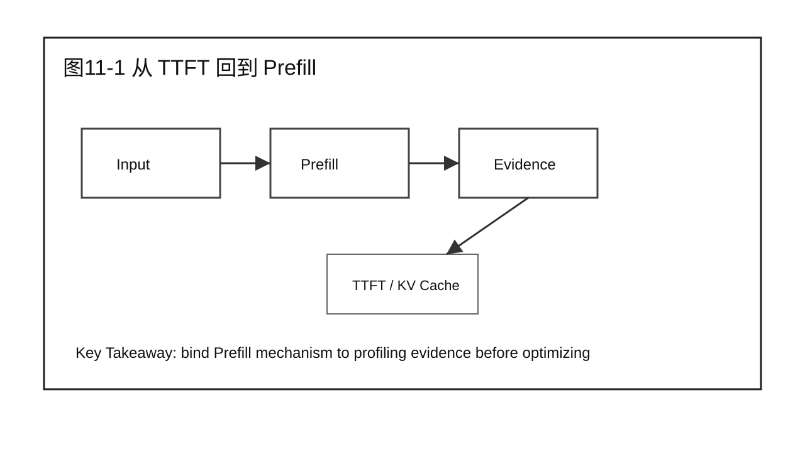
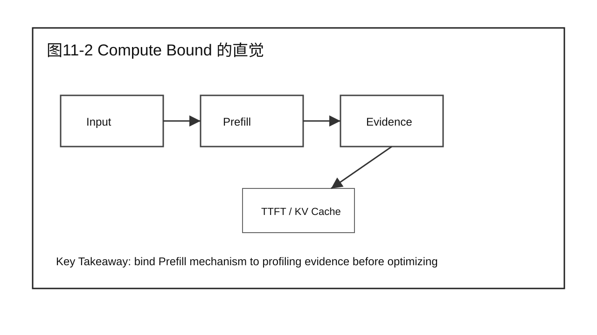
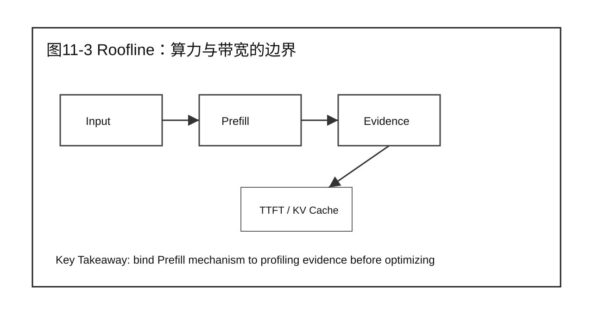
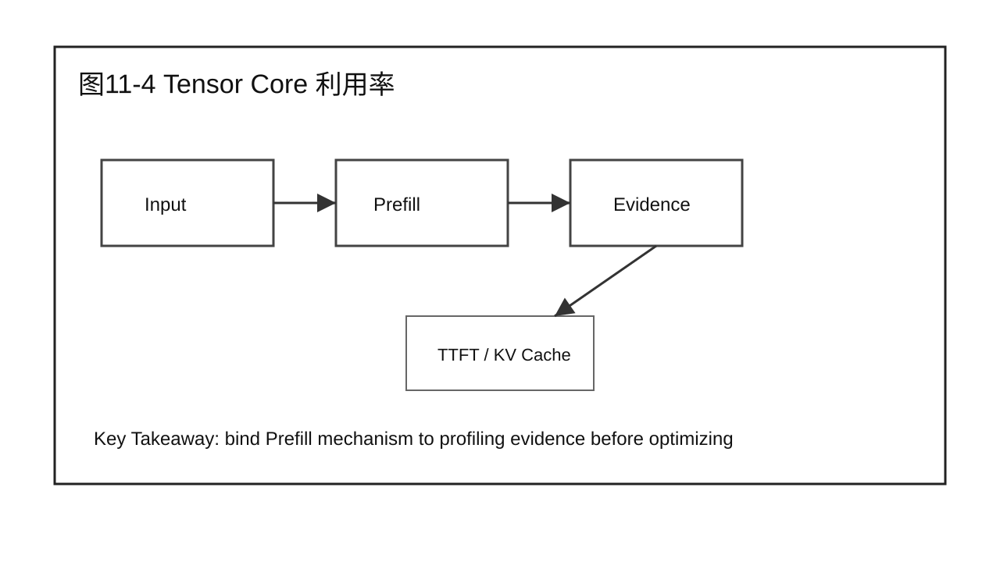
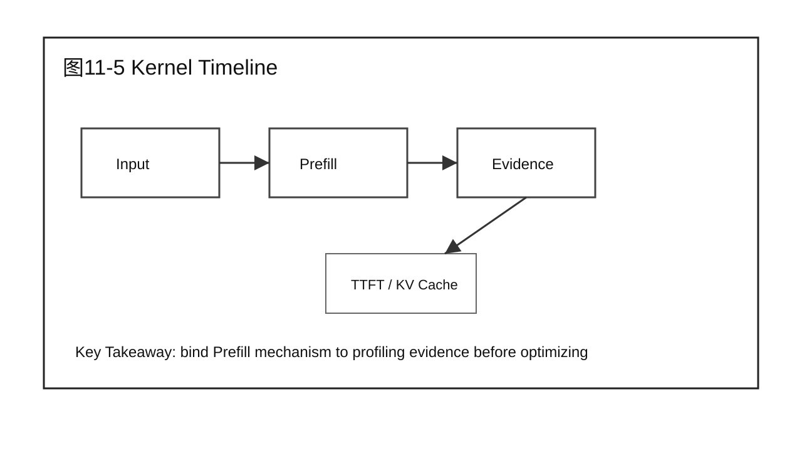
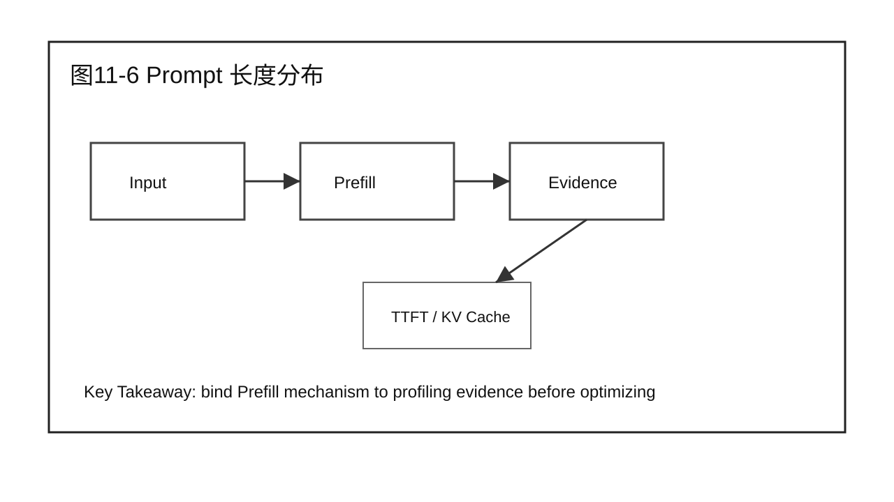
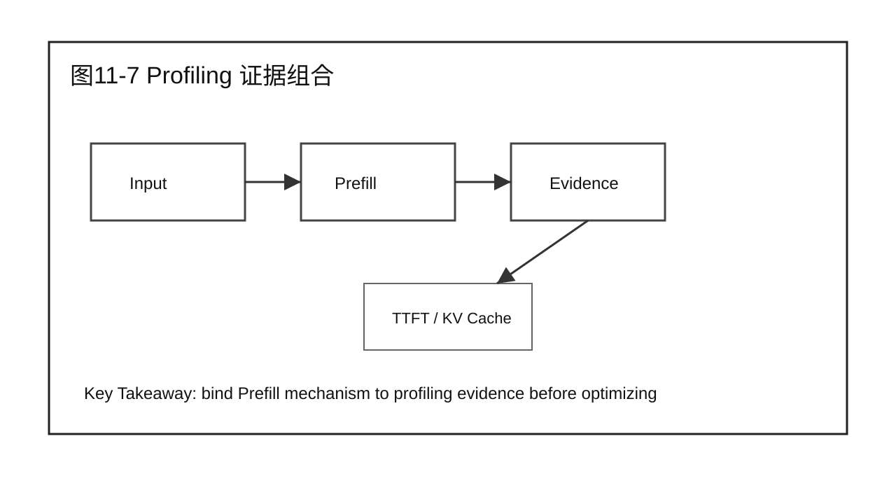
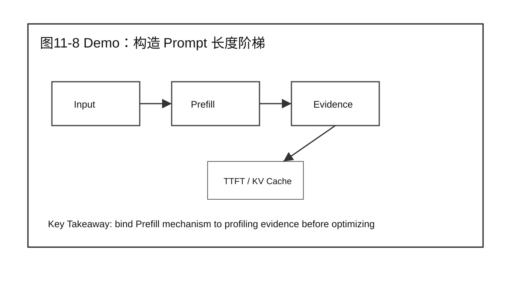
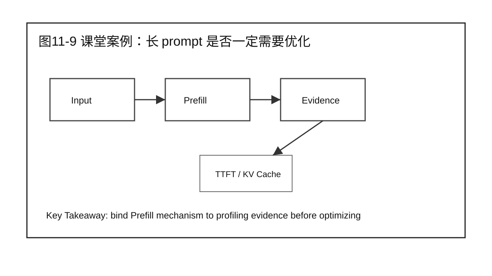

# 第 11 章 Prefill 性能分析

## 学习目标

学完本章后，你应该能够：

- 回答本章核心问题：为什么 Prefill 会慢，如何证明瓶颈在哪里？
- 说明本章内容在 Prefill Optimization 中的位置。
- 把 Part 1 的系统视图和 Part 2 的证据链应用到 Prefill 场景。
- 区分机制、瓶颈、优化方案和验证结论。
- 用案例、Demo 和 Checklist 支撑 20 分钟以上课堂讲授。

本章属于 Part 3 Prefill Optimization。写作边界是围绕 Prefill 展开，不提前进入 Decode、Serving 或 Scalability 的完整优化结论。

## 核心问题

本章围绕四个问题展开：

1. 为什么 Prefill 会慢，如何证明瓶颈在哪里？
2. 它和 Part 1 的请求生命周期、指标和全局性能模型如何连接？
3. 它如何使用 Part 2 的 Benchmark、Profiling、Root Cause 和 Diagnosis 方法？
4. 本章结束后，读者应该产出什么工程化判断或报告？



图11-1：从 TTFT 回到 Prefill。

## 11.1 从 TTFT 回到 Prefill

TTFT 高不等于 Prefill 一定慢，但 Prefill 是最常见方向之一。要先从第 9 章的诊断结果确认 queue、Gateway 和 Decode 不是主要问题，再进入 Prefill 分析。

从前两篇的角度看，本章不是孤立技术点。Part 1 给出系统位置，Part 2 给出证据方法，本篇开始把二者落到 Prefill 这个具体阶段。



图11-2：从 TTFT 回到 Prefill。

## 11.2 Compute Bound 的直觉

Prefill 处理完整 prompt，大量 GEMM 和 attention 计算可能让它更接近 compute-bound。输入越长，矩阵形状越大，GPU 算力利用和 Tensor Core 使用情况越关键。

分析时要同时问三件事：输入是什么，输出是什么，证据在哪里。只讲原理而没有输入输出边界，后续就无法做 Benchmark 和 Profiling。



图11-3：Compute Bound 的直觉。

## 11.3 Roofline：算力与带宽的边界

Roofline 用 operational intensity 把计算量和内存访问放在同一张图里。Prefill 分析中，它帮助判断优化应该朝提高算力利用，还是减少访存和数据搬运。

分析时要同时问三件事：输入是什么，输出是什么，证据在哪里。只讲原理而没有输入输出边界，后续就无法做 Benchmark 和 Profiling。

### 11.3.1 用一个小矩阵算一遍计算密度

先用一个很小的矩阵把公式算清楚。设输入矩阵和权重矩阵分别为：

```text
A[2, 3] × B[3, 2] → C[2, 2]
```

也就是 \(M=2\)、\(K=3\)、\(N=2\)。结果矩阵有 \(M×N=4\) 个输出元素。以 \(C_{11}\) 为例：

```text
C11 = A11×B11 + A12×B21 + A13×B31
```

计算一个输出元素需要 3 次乘法和 2 次加法。4 个输出元素一共需要：

```text
乘法：4 × 3 = 12 次
加法：4 × 2 =  8 次
合计：           20 FLOPs
```

精确计算量可以写成：

\[
\text{FLOPs}=MN(2K-1)=2×2×(2×3-1)=20
\]

工程估算中常把每个输出元素的 \(K-1\) 次加法近似成 \(K\) 次，于是得到更简单的公式：

\[
\text{FLOPs}\approx2MKN=2×2×3×2=24
\]

24 是近似值，20 是这个小例子的精确值。矩阵变大后，两者的相对差异会变小。

再看数据移动量。输入矩阵 \(A\) 有 \(MK=2×3=6\) 个元素，权重矩阵 \(B\) 有 \(KN=3×2=6\) 个元素，输出矩阵 \(C\) 有 \(MN=2×2=4\) 个元素。假设使用 FP16，每个元素占 2 字节，并且暂时假设每块数据只读写一次：

\[
\begin{aligned}
\text{Bytes}
&=2(MK+KN+MN)\\
&=2(6+6+4)\\
&=32\text{ Bytes}
\end{aligned}
\]

因此，这个例子的简化计算密度是：

\[
\text{计算密度}\approx\frac{24}{32}=0.75\text{ FLOPs/Byte}
\]

如果使用精确计算量，则为 \(20/32=0.625\text{ FLOPs/Byte}\)。这个数很低，表示相对于搬运的数据，计算量并不大，更容易受到显存带宽限制。真实 GPU 会利用缓存和数据复用，实际数据移动量不一定等于这个简化值，所以这个例子用于建立直觉，最终判断仍要结合 Profiling。



图11-4：Roofline：算力与带宽的边界。

## 11.4 Tensor Core 利用率

如果矩阵形状、精度和 kernel 实现没有很好匹配 Tensor Core，Prefill 可能表现为算力没有打满。此时单看 GPU Utilization 不够，要看 kernel 级证据。

分析时要同时问三件事：输入是什么，输出是什么，证据在哪里。只讲原理而没有输入输出边界，后续就无法做 Benchmark 和 Profiling。



图11-5：Tensor Core 利用率。

## 11.5 Kernel Timeline

Timeline 能显示 Prefill 的 kernel 顺序、空洞、launch 间隔和 CPU/GPU 协同。它可以证明问题是在大 kernel 内部，还是 kernel 之间有调度空洞。

分析时要同时问三件事：输入是什么，输出是什么，证据在哪里。只讲原理而没有输入输出边界，后续就无法做 Benchmark 和 Profiling。



图11-6：Kernel Timeline。

## 11.6 Prompt 长度分布

Prefill 对 prompt 长度敏感。平均 prompt 长度会掩盖 P95 长 prompt，线上 TTFT 问题常常来自少量长上下文请求拖慢 batch。

分析时要同时问三件事：输入是什么，输出是什么，证据在哪里。只讲原理而没有输入输出边界，后续就无法做 Benchmark 和 Profiling。



图11-7：Prompt 长度分布。

## 11.7 Profiling 证据组合

Prefill 分析要组合客户端 TTFT、engine prefill time、batch tokens、GPU timeline、kernel 指标和显存状态。单个指标不足以证明 root cause。

分析时要同时问三件事：输入是什么，输出是什么，证据在哪里。只讲原理而没有输入输出边界，后续就无法做 Benchmark 和 Profiling。



图11-8：Profiling 证据组合。

## 11.8 Demo：构造 Prompt 长度阶梯

本章 Demo 固定 output 长度和并发，逐步增加 prompt tokens，观察 TTFT、prefill time、GPU util 和 kernel timeline 的变化。

Demo 使用固定 workload 或模拟数据时，必须明确边界。它服务于方法演示，不替代真实硬件环境下的性能结论。

Demo 可以使用下面的实验表：

| 组别 | Prompt tokens | Output tokens | Concurrency | 观察指标 |
|---|---:|---:|---:|---|
| A | 256 | 128 | 8 | TTFT、prefill time、GPU util |
| B | 1024 | 128 | 8 | TTFT、prefill time、GPU util |
| C | 2048 | 128 | 8 | TTFT、prefill time、GPU util |
| D | 4096 | 128 | 8 | TTFT、prefill time、GPU util |

预期观察不是“越长越慢”这么简单，而是看增长曲线是否接近线性，是否在某个长度后出现拐点，Timeline 中是否出现更长的 attention 或 GEMM kernel，Tensor Core 利用率是否随 shape 变化。

可以用一份模拟结果训练分析表达：

| Prompt tokens | P95 TTFT | Prefill time | GPU util | 主要现象 |
|---:|---:|---:|---:|---|
| 256 | 220 ms | 90 ms | 38% | 固定开销占比较高 |
| 1024 | 610 ms | 430 ms | 62% | Prefill 成为主要部分 |
| 2048 | 1280 ms | 1040 ms | 78% | 大 kernel 时间明显增加 |
| 4096 | 3100 ms | 2780 ms | 82% | TTFT 出现非线性增长 |

分析时不能只写“长 prompt 慢”。更好的表述是：

```text
当 prompt 从 1024 增加到 4096 tokens 时，
P95 TTFT 增长超过 5 倍，Prefill time 占 TTFT 的比例持续上升。
GPU util 升高但 TPS 没有同步改善，说明系统更可能受 Prefill 计算路径限制。
下一步应采集 kernel timeline 和 Tensor Core / memory bandwidth 证据，
判断瓶颈更偏 attention、GEMM，还是 kernel launch / shape 变化。
```

这段报告仍然不是优化结论。它只是把第 6 章 Benchmark 和第 7 章 Profiling 的方法带入 Prefill，让第 12 章选择优化技术时有证据基础。

## 11.9 课堂案例：长 prompt 是否一定需要优化

企业问答服务发现长 prompt TTFT 高。课堂讨论不是马上打开 FlashAttention，而是先判断是否存在计算瓶颈、batch 混合问题或输入裁剪空间。

课堂讨论：

1. 这个案例最容易被误判成哪个问题？
2. 需要哪些 Benchmark 或 Profiling 证据才能进入下一步？
3. 哪些结论只适用于 Prefill，不应该推广到 Decode？

### 补充案例 A：短 prompt 聊天服务

如果服务主要处理 128-256 tokens 的短 prompt，Prefill 可能不是主要瓶颈。此时盲目优化 Prefill kernel，收益可能不如优化队列、Decode 或网络返回。讨论重点是：同一技术在不同 workload 下收益不同。

### 补充案例 B：长文档总结服务

如果服务主要处理 4K-16K tokens 的长文档总结，Prefill 往往占据首包前主要时间。此时 prompt 长度分布、attention 实现和 batch token 预算会直接影响 TTFT。讨论重点是：长 prompt 场景下要优先建立 Prefill 证据链。

### 贯穿案例：企业问答服务进入 Prefill 优化

Part 2 中的企业问答服务已经建立了 Baseline、Profiling 证据和 Diagnosis 表。进入 Part 3 后，我们只处理其中“长 prompt 导致 TTFT 升高”的分支：

```text
现象：P95 TTFT 升高，TPOT 基本稳定。
证据：长 prompt 占比上升，Prefill time 上升，Decode loop 无明显异常。
候选方向：Prefill attention / GEMM / KV Cache 创建 / batch token 预算。
本篇任务：理解机制，定位瓶颈，选择优化，验证 TTFT 收益。
```



图11-9：课堂案例：长 prompt 是否一定需要优化。

## 11.10 常见误区

误区一：看到 TTFT 高就直接认为 Prefill kernel 慢。

TTFT 包含 Gateway、Queue、Prefill、first token 返回等多个部分。只有 Part 2 的证据已经指向 Prefill，才进入本篇的优化路径。

误区二：把某项优化技术当成默认开关。

优化技术必须绑定 root cause。FlashAttention、CUDA Graph、Kernel Fusion 等技术解决的问题不同，适用条件和副作用也不同。

误区三：只报告收益，不报告边界。

Prefill 优化可能只在长 prompt、特定 batch shape、特定 GPU 或特定框架版本下有效。报告必须写清楚边界。


图11-10：Prefill 性能分析 的章节边界。

## 本章总结

本章回答了“为什么 Prefill 会慢，如何证明瓶颈在哪里？”这个问题。它把前两篇建立的系统视图和分析方法带入 Prefill 场景，强调先明确机制和证据，再进入优化或验证。

本章的关键不是记住某个名词，而是能把 Prefill 问题写成可执行工程判断：输入是什么，瓶颈在哪里，证据是什么，下一步如何验证。

### 本章 Checklist

- [ ] 能说明本章内容在 Prefill 阶段的位置。
- [ ] 能把 TTFT 问题和 Prefill 证据区分开。
- [ ] 能写出本章对应的输入、输出和关键观测指标。
- [ ] 能给出一个不越界的课堂案例或 Demo。
- [ ] 能说明本章和下一章的衔接。

## 课后练习

1. 选择一个长 prompt 请求，画出它在 Prefill 阶段的输入、执行路径和输出。
2. 用 Part 2 的证据链格式，写出一个 Prefill 瓶颈候选假设。
3. 为本章课堂案例补充一组你认为必要的 Benchmark 指标。
4. 说明一个 Prefill 优化不适用于短 prompt 场景的原因。
5. 写一段 200 字以内的工程报告摘要，要求包含现象、证据、候选方向和验证动作。
