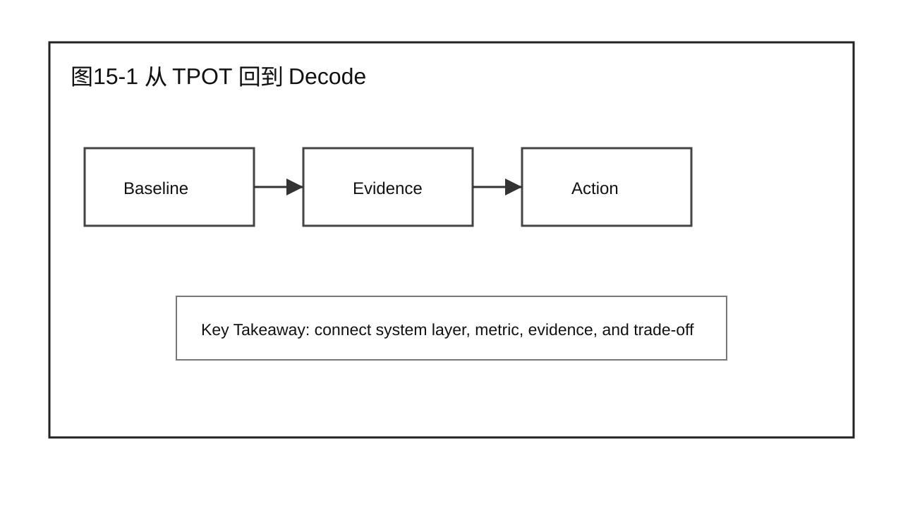
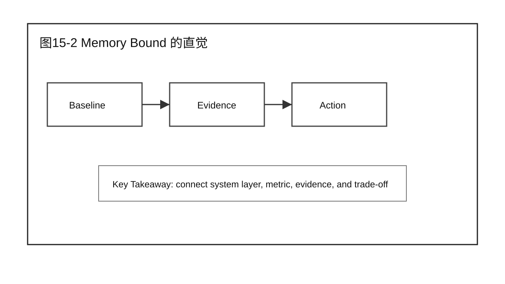
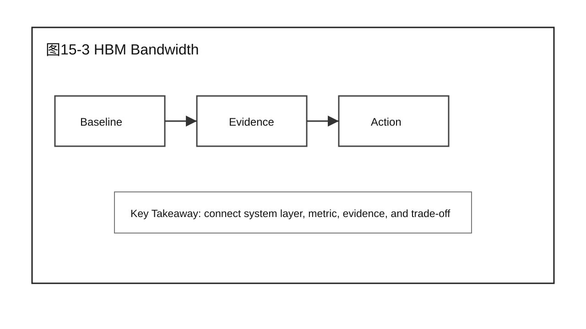
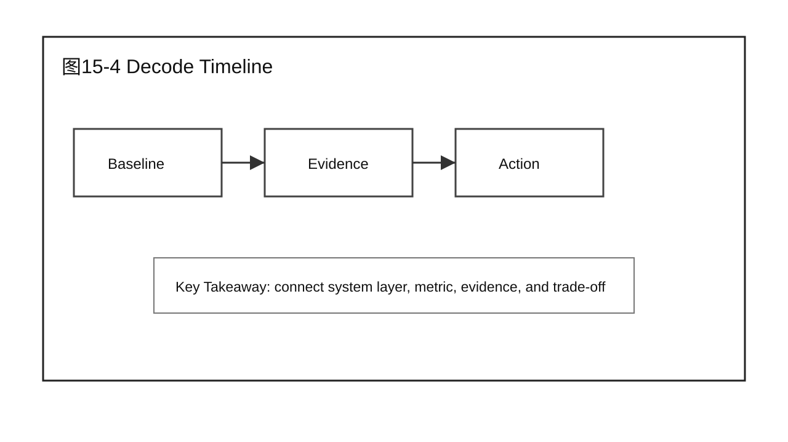
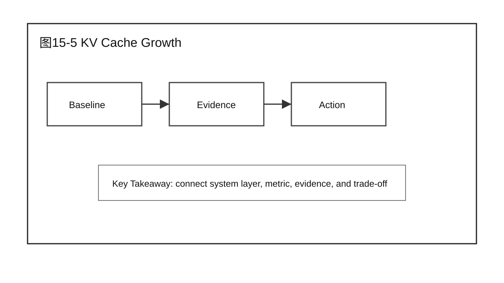
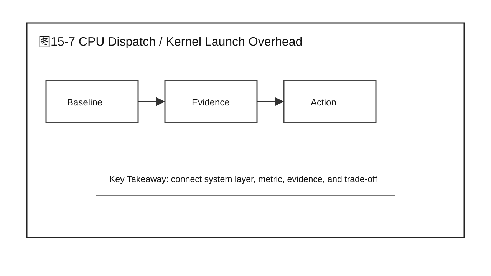
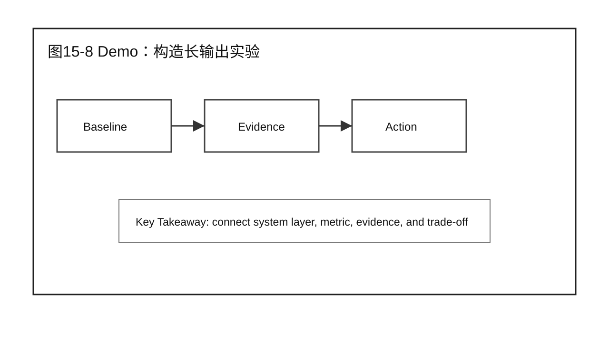
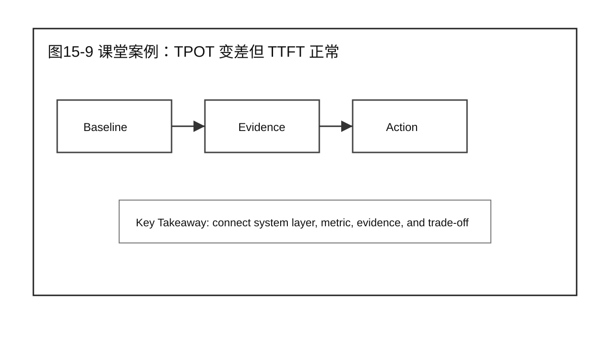
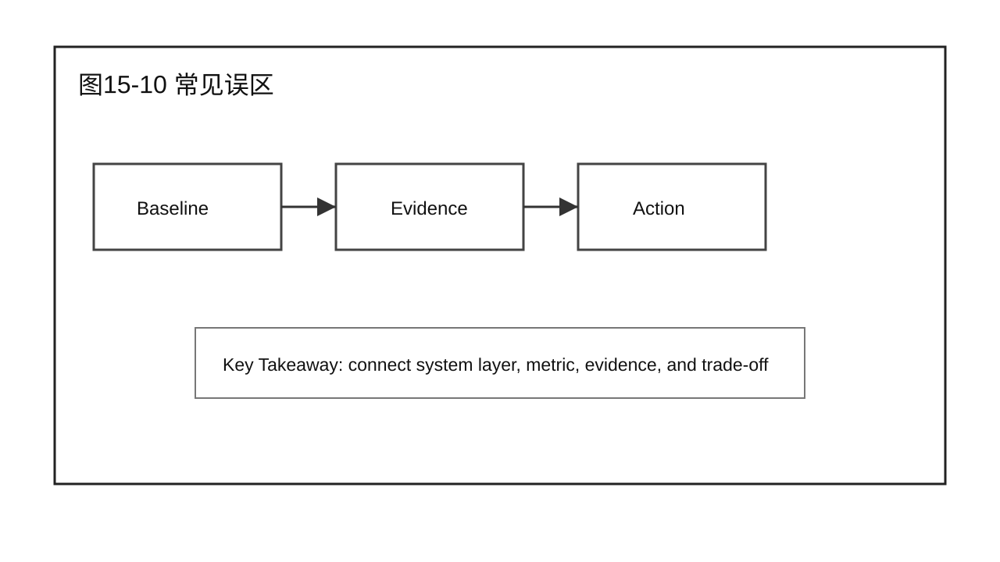

# 第 15 章 Decode 性能分析

## 学习目标

学完本章后，你应该能够：

- 回答本章核心问题：为什么 Decode 更容易受 memory bound 影响？
- 说明本章内容在 Part 4 Decode Optimization（Decode 优化） 中的位置。
- 继承前 3 篇的经验：先定位系统位置，再建立证据链，最后讨论优化或验证。
- 区分机制、瓶颈、优化方案、实验验证和生产结论。
- 用 Demo、课堂案例、补充案例和 Checklist 支撑 20 分钟以上讲授。

本章只处理 Decode 相关边界，不提前替后续章节给出完整优化结论。

## 核心问题

本章围绕四个问题展开：

1. 为什么 Decode 更容易受 memory bound 影响？
2. 它和前 3 篇的系统视图、分析方法、优化闭环如何连接？
3. 需要哪些 Benchmark / Profiling / Root Cause 证据支撑判断？
4. 本章结束后，读者应该产出什么工程化判断或报告？



图15-1：从 TPOT 回到 Decode。

## 15.1 从 TPOT 回到 Decode

从 TPOT 回到 Decode 是本章的核心内容之一。写作时先说明它在 Decode 流程中的位置，再说明输入、输出、关键状态和可观测证据。这样后续才能把指标变化和具体机制连起来。 这一节负责建立边界，不急着下优化结论。



图15-2：Memory Bound 的直觉。

## 15.2 Memory Bound 的直觉

Memory Bound 的直觉 是本章的核心内容之一。写作时先说明它在 Decode 流程中的位置，再说明输入、输出、关键状态和可观测证据。这样后续才能把指标变化和具体机制连起来。 这一节要和 Part 2 的 Profiling / Root Cause 方法连接，说明哪些证据支持当前判断。



图15-3：HBM Bandwidth。

## 15.3 HBM Bandwidth

HBM Bandwidth 是本章的核心内容之一。写作时先说明它在 Decode 流程中的位置，再说明输入、输出、关键状态和可观测证据。这样后续才能把指标变化和具体机制连起来。 这一节要和 Part 2 的 Profiling / Root Cause 方法连接，说明哪些证据支持当前判断。



图15-4：Decode Timeline。

## 15.4 Decode Timeline

Decode Timeline 是本章的核心内容之一。写作时先说明它在 Decode 流程中的位置，再说明输入、输出、关键状态和可观测证据。这样后续才能把指标变化和具体机制连起来。 这一节要和 Part 2 的 Profiling / Root Cause 方法连接，说明哪些证据支持当前判断。



图15-5：KV Cache Growth。

## 15.5 KV Cache Growth

KV Cache Growth 是本章的核心内容之一。写作时先说明它在 Decode 流程中的位置，再说明输入、输出、关键状态和可观测证据。这样后续才能把指标变化和具体机制连起来。 这一节要讨论指标之间的耦合关系，尤其是 TTFT、TPOT、TPS、GPU Utilization、Memory、Cost 和尾延迟。


图15-6：Batch 中长短输出混合。

## 15.6 Batch 中长短输出混合

Batch 中长短输出混合 是本章的核心内容之一。写作时先说明它在 Decode 流程中的位置，再说明输入、输出、关键状态和可观测证据。这样后续才能把指标变化和具体机制连起来。 这一节要讨论指标之间的耦合关系，尤其是 TTFT、TPOT、TPS、GPU Utilization、Memory、Cost 和尾延迟。



图15-7：CPU Dispatch / Kernel Launch Overhead。

## 15.7 CPU Dispatch / Kernel Launch Overhead

CPU Dispatch / Kernel Launch Overhead 是本章的核心内容之一。Decode 逐 token 生成，每步 batch 小但要发起一长串小 kernel，CPU 端逐个发起的启动与同步开销在小批量下会占到总耗时的显著比例——这是与 Chapter 16 Kernel-Level Optimization（CUDA Graph / Kernel Fusion / Persistent Kernel）对应的根因条目，缺了这一条会出现"优化手段有了、但分析章节没有对应瓶颈可查"的结构漏洞。这一节要讲清楚如何用 Profiling 证据（Nsight Systems 的 CPU/GPU timeline 空隙、kernel 数量与平均耗时）判断 launch overhead 是否是当前 Decode 瓶颈的主要成分，而不是默认归因给 HBM Bandwidth 或 KV Cache Growth。



图15-8：Demo：构造长输出实验。

## 15.8 Demo：构造长输出实验

本章 Demo 使用固定 workload 或模拟数据展示方法路径。它的作用是训练分析流程，不替代真实生产环境下的 Benchmark 结论。


## 15.9 课堂案例：TPOT 变差但 TTFT 正常

企业问答服务在进入本章主题后出现新的性能现象。团队不能直接套用前一篇的优化结论，而要重新检查 workload、指标、profile 和 root cause。这个案例的重点是训练读者把“Decode 性能分析”放回完整系统中分析。

课堂讨论：

1. 这个案例最容易被误判成哪个问题？
2. 还缺哪两类证据才能进入优化方案？
3. 哪些结论只属于本章边界，不能推广到其他阶段？

### 补充案例 A：低流量交互式服务

在低流量交互式服务中，Decode 问题可能被入口、队列、冷启动或少量长请求掩盖。课堂讨论重点是：不能只拿平均值判断系统能力，要说明 workload 和指标口径。

### 补充案例 B：高并发平台化服务

在高并发平台化服务中，Decode 问题更容易和租户、路由、资源预算、worker 健康状态耦合。课堂讨论重点是：先拆层，再定位，不要把所有问题都归给模型。

### 贯穿案例：企业问答服务继续演进

前 3 篇中的企业问答服务已经建立系统地图、Baseline、Profiling 证据和 Prefill 优化闭环。本章继续沿用同一个案例，把问题推进到 Decode 场景：

```text
现象：业务反馈和 Decode 相关指标出现异常。
证据：已有 Benchmark、Profiling 和 Diagnosis 记录。
候选方向：围绕 Decode 性能分析 的机制、瓶颈、优化或验证动作展开。
边界：本章只处理当前阶段，不替其他 Part 下结论。
```



图15-9：课堂案例：TPOT 变差但 TTFT 正常。

## 15.10 常见误区

误区一：跳过证据直接调参数。

前 3 篇反复强调，优化之前必须证明问题在哪里。没有 Baseline、Profiling 和 Root Cause，调参只能算尝试，不能算性能工程。

误区二：把一个 workload 的结论推广到所有业务。

LLM 推理系统对 prompt 长度、output 长度、并发、模型版本、硬件和框架实现都敏感。任何结论都要写明成立条件。

误区三：只报告收益，不报告 Trade-off。

提升一个指标可能牺牲另一个指标。正式报告至少要讨论 TTFT、TPOT、TPS、GPU Utilization、Memory、Cost 和 P95/P99。



图15-10：Decode 性能分析 的章节边界。

## 本章总结

本章回答了“为什么 Decode 更容易受 memory bound 影响？”这个问题。它延续前 3 篇的经验，把系统位置、分析证据和优化/验证闭环放到 Decode 场景中。

本章的最低完成标准是：读者能说清楚本章边界、关键证据、候选动作和收益验证方式。

### 本章 Checklist

- [ ] 能说明本章内容在完整推理系统中的位置。
- [ ] 能写出本章相关的输入、输出和关键指标。
- [ ] 能提出一个可验证的 root cause 假设。
- [ ] 能给出一个不越界的 Demo 或课堂案例。
- [ ] 能说明本章和相邻章节的衔接。

## 课后练习

1. 选择一个线上 LLM 服务，写出本章主题下的最小分析计划。
2. 用 Part 2 的证据链格式，写出一个候选瓶颈。
3. 设计一组 workload，说明它为什么能暴露本章问题。
4. 写出一个优化或验证动作，并说明它的 Trade-off。
5. 写一段 200 字以内的工程报告摘要，包含现象、证据、动作和边界。
