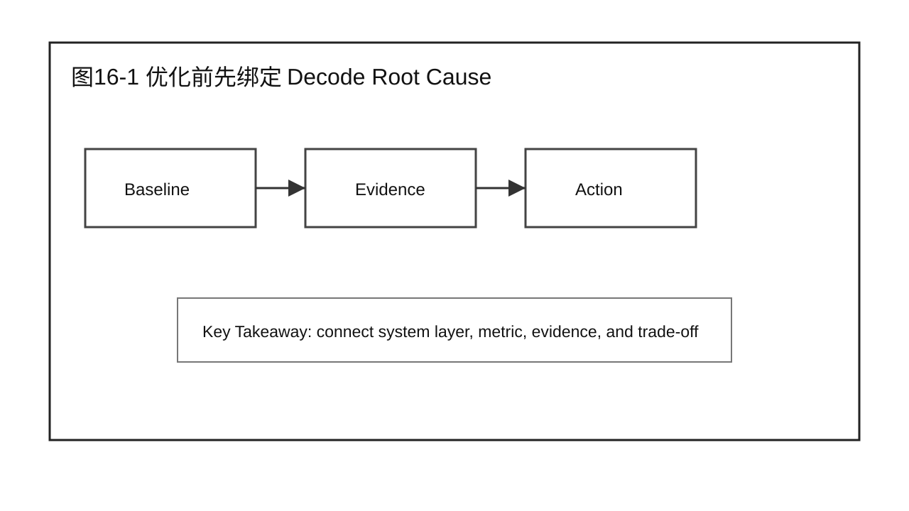
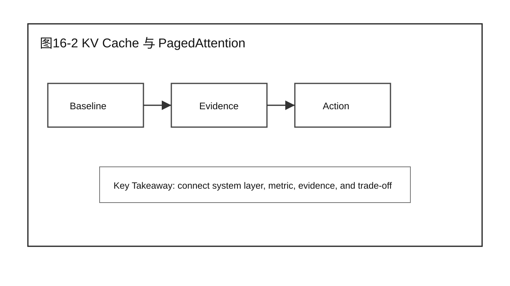
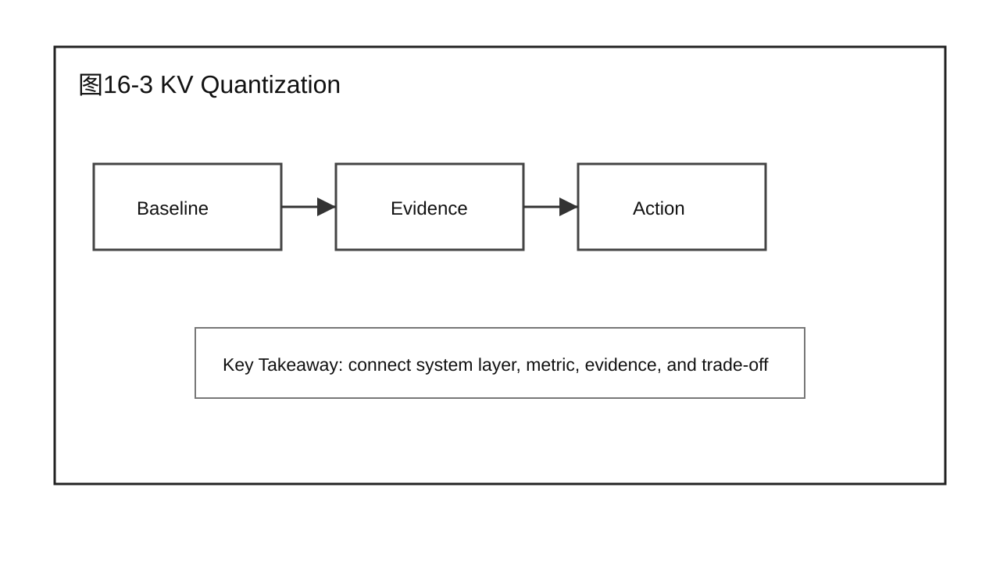
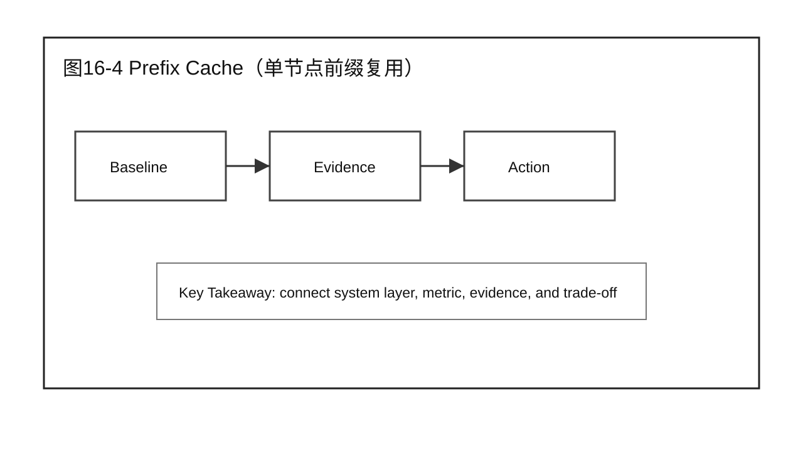
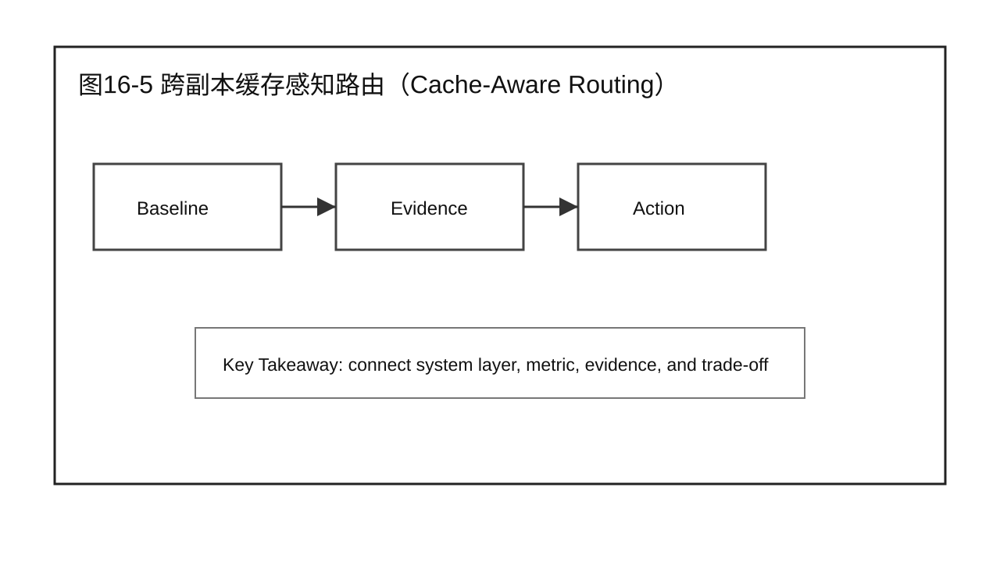
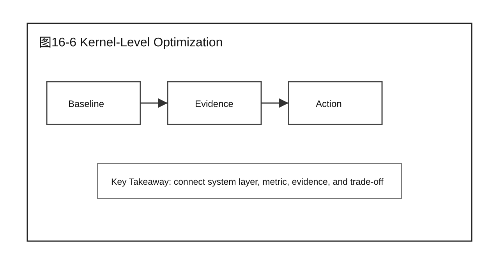
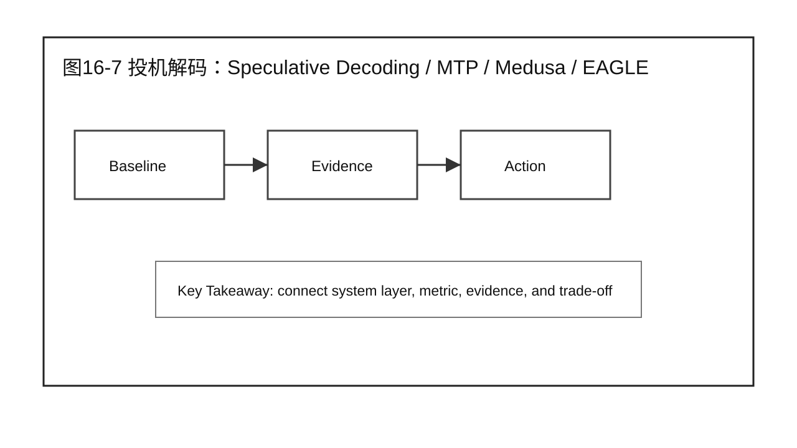
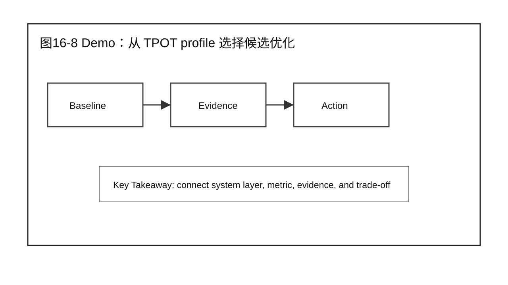
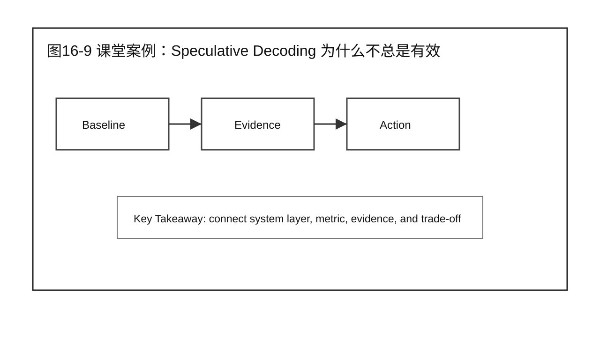
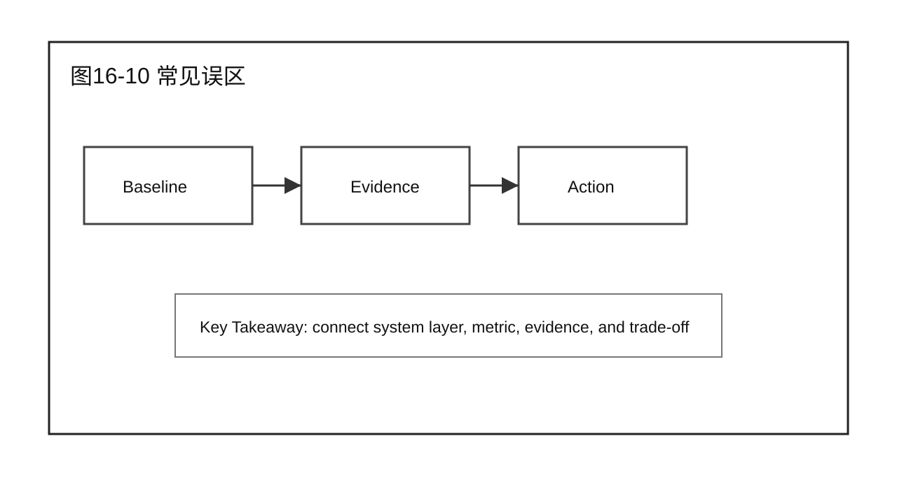

# 第 16 章 Decode 优化方法

## 学习目标

学完本章后，你应该能够：

- 回答本章核心问题：面对 Decode 瓶颈应该选择哪些优化方法？
- 说明本章内容在 Part 4 Decode Optimization（Decode 优化） 中的位置。
- 继承前 3 篇的经验：先定位系统位置，再建立证据链，最后讨论优化或验证。
- 区分机制、瓶颈、优化方案、实验验证和生产结论。
- 用 Demo、课堂案例、补充案例和 Checklist 支撑 20 分钟以上讲授。

本章只处理 Decode 相关边界，不提前替后续章节给出完整优化结论。

## 核心问题

本章围绕四个问题展开：

1. 面对 Decode 瓶颈应该选择哪些优化方法？
2. 它和前 3 篇的系统视图、分析方法、优化闭环如何连接？
3. 需要哪些 Benchmark / Profiling / Root Cause 证据支撑判断？
4. 本章结束后，读者应该产出什么工程化判断或报告？



图16-1：优化前先绑定 Decode Root Cause。

## 16.1 优化前先绑定 Decode Root Cause

优化前先绑定 Decode Root Cause 是本章的核心内容之一。写作时先说明它在 Decode 流程中的位置，再说明输入、输出、关键状态和可观测证据。这样后续才能把指标变化和具体机制连起来。这一节负责建立边界，不急着下优化结论。



图16-2：KV Cache 与 PagedAttention。

## 16.2 KV Cache 与 PagedAttention

KV Cache 与 PagedAttention 是本章的核心内容之一。KV Cache 决定 Decode 阶段的显存占用随序列长度增长的方式；PagedAttention 用分页管理消除显存碎片，是让 KV Cache 显存利用率逼近理论值的关键机制。这一节要和 Part 2 的 Profiling / Root Cause 方法连接，说明如何用最大并发数、显存利用率和 OOM 次数三类证据判断碎片问题是否存在。



图16-3：KV Quantization。

## 16.3 KV Quantization

KV Quantization 是本章的核心内容之一。写作时先说明它在 Decode 流程中的位置，再说明输入、输出、关键状态和可观测证据。这样后续才能把指标变化和具体机制连起来。这一节要和 Part 2 的 Profiling / Root Cause 方法连接，说明哪些证据支持当前判断。



图16-4：Prefix Cache（单节点前缀复用）。

## 16.4 Prefix Cache（单节点前缀复用）

Prefix Cache（单节点前缀复用） 是本章的核心内容之一。写作时先说明它在 Decode 流程中的位置，再说明输入、输出、关键状态和可观测证据。这样后续才能把指标变化和具体机制连起来。这一节只处理单节点内的前缀复用；跨节点的路由问题留给下一节。



图16-5：跨副本缓存感知路由（Cache-Aware Routing）。

## 16.5 跨副本缓存感知路由（Cache-Aware Routing）

单节点 Prefix Cache 解决"要不要重新计算"，多副本场景下还有一层问题："这个请求该发去哪台机器"。如果路由是轮询或随机的，前缀命中率会被打散——即使某台机器缓存了这个前缀，请求也可能被发到没有缓存的另一台机器，白白丢掉了 Prefix Cache 的收益。跨副本缓存感知路由（如 SGLang RadixAttention 路由器）按前缀树命中率而非轮询调度请求，在前缀密集场景下吞吐可提升约 5 倍。这一节要说明：单节点 Prefix Cache 和跨副本路由是互补的两层机制，不能只做一层就期望拿到完整收益。



图16-6：Kernel-Level Optimization：CUDA Graph / Kernel Fusion / Persistent Kernel。

## 16.6 Kernel-Level Optimization：CUDA Graph / Kernel Fusion / Persistent Kernel

Decode 逐 token 生成，每步 batch 小，但要发起一长串小 kernel；CPU 端逐个发起这些 kernel 的启动与同步开销，在小批量下会占到总耗时的显著比例——这正是 Chapter 15 分析的 CPU Dispatch / Kernel Launch Overhead 根因所对应的优化手段。CUDA Graph 通过捕获和重放固定执行图消除重复的启动开销（vLLM 官方设计文档实测可消除 Decode 每步约 28% 的启动+同步开销）；Kernel Fusion 把多个小算子合并，减少中间读写和 launch 次数；Persistent Kernel 让线程块长期驻留以减少调度开销。这三项此前被放在 Chapter 12（Prefill 优化方法）下，但 Prefill 是大批量计算密集型，启动开销占比很小，不是主要矛盾；它们的技术目标（减少小 kernel 高频调用的开销）与 Decode 的瓶颈特征更吻合，因此移到本章作为主要归属。



图16-7：投机解码：Speculative Decoding / MTP / Medusa / EAGLE。

## 16.7 投机解码：Speculative Decoding / MTP / Medusa / EAGLE

Speculative Decoding、MTP、Medusa、EAGLE 是本章的核心内容之一。写作时先说明它们各自用什么方式"猜多步、验一步"来减少昂贵的逐 token 前向次数，再说明输入、输出、关键状态和可观测证据。这一节要讨论指标之间的耦合关系，尤其是 TTFT、TPOT、TPS、GPU Utilization、Memory、Cost 和尾延迟，以及接受率（acceptance rate）如何决定这类技术是否真的省时间。



图16-8：Demo：从 TPOT profile 选择候选优化。

## 16.8 Demo：从 TPOT profile 选择候选优化

本章 Demo 使用固定 workload 或模拟数据展示方法路径。它的作用是训练分析流程，不替代真实生产环境下的 Benchmark 结论。


## 16.9 课堂案例：Speculative Decoding 为什么不总是有效

企业问答服务在进入本章主题后出现新的性能现象。团队不能直接套用前一篇的优化结论，而要重新检查 workload、指标、profile 和 root cause。这个案例的重点是训练读者把"Decode 优化方法"放回完整系统中分析。

课堂讨论：

1. 这个案例最容易被误判成哪个问题？
2. 还缺哪两类证据才能进入优化方案？
3. 哪些结论只属于本章边界，不能推广到其他阶段？

### 补充案例 A：低流量交互式服务

在低流量交互式服务中，Decode 问题可能被入口、队列、冷启动或少量长请求掩盖。课堂讨论重点是：不能只拿平均值判断系统能力，要说明 workload 和指标口径。

### 补充案例 B：高并发平台化服务

在高并发平台化服务中，Decode 问题更容易和租户、路由、资源预算、worker 健康状态耦合。课堂讨论重点是：先拆层，再定位，不要把所有问题都归给模型。

### 贯穿案例：企业问答服务继续演进

前 3 篇中的企业问答服务已经建立系统地图、Baseline、Profiling 证据和 Prefill 优化闭环。本章继续沿用同一个案例，把问题推进到 Decode 场景：

```text
现象：业务反馈和 Decode 相关指标出现异常。
证据：已有 Benchmark、Profiling 和 Diagnosis 记录。
候选方向：围绕 Decode 优化方法 的机制、瓶颈、优化或验证动作展开。
边界：本章只处理当前阶段，不替其他 Part 下结论。
```



图16-9：课堂案例：Speculative Decoding 为什么不总是有效。

## 16.10 常见误区

误区一：跳过证据直接调参数。

前 3 篇反复强调，优化之前必须证明问题在哪里。没有 Baseline、Profiling 和 Root Cause，调参只能算尝试，不能算性能工程。

误区二：把一个 workload 的结论推广到所有业务。

LLM 推理系统对 prompt 长度、output 长度、并发、模型版本、硬件和框架实现都敏感。任何结论都要写明成立条件。

误区三：只报告收益，不报告 Trade-off。

提升一个指标可能牺牲另一个指标。正式报告至少要讨论 TTFT、TPOT、TPS、GPU Utilization、Memory、Cost 和 P95/P99。

误区四：把跨副本缓存感知路由和单节点 Prefix Cache 当成同一件事。

两者解决的问题不同：单节点 Prefix Cache 回答"要不要重新计算"，跨副本路由回答"该发去哪台机器"。只做了其中一层就期望拿到两层的收益，是常见的规划错误。



图16-10：Decode 优化方法 的章节边界。

## 16.11 技术选择矩阵

| Profiling 特征 | 候选方法 | 验证指标 | 主要 Trade-off |
|---|---|---|---|
| 显存碎片导致并发上不去 | PagedAttention | 最大并发数、显存利用率、OOM 次数 | 分页间接寻址的小额开销 |
| 显存随并发线性吃紧 | KV Quantization | 显存占用、精度损失 | 可能影响生成质量 |
| 单节点重复计算相同前缀 | Prefix Cache | 命中率、TTFT | 只在单节点内生效 |
| 多副本前缀命中率低 | 跨副本缓存感知路由 | 跨副本命中率、吞吐 | 路由复杂度上升 |
| CPU launch/同步开销占比高 | CUDA Graph / Kernel Fusion / Persistent Kernel | kernel 数量、launch overhead 占比 | 动态 shape 限制、硬件依赖强 |
| 逐 token 前向次数是主要成本 | Speculative Decoding / MTP / Medusa / EAGLE | 接受率、TPOT | 接受率低时收益有限甚至变负 |

这张矩阵不能替代 Benchmark。它只负责把候选优化缩小到 1-2 个方向，真正是否采用还要由第 17 章的实验验证决定。

## 本章总结

本章回答了"面对 Decode 瓶颈应该选择哪些优化方法？"这个问题。它延续前 3 篇的经验，把系统位置、分析证据和优化/验证闭环放到 Decode 场景中，覆盖显存管理（KV Cache / PagedAttention / KV Quantization）、缓存复用（单节点 Prefix Cache / 跨副本缓存感知路由）、kernel 启动开销（CUDA Graph / Kernel Fusion / Persistent Kernel）和生成路径（投机解码家族）四类问题。

本章的关键不是记住某个名词，而是能把 Decode 问题写成可执行工程判断：输入是什么，瓶颈在哪里，证据是什么，下一步如何验证。

### 本章 Checklist

- [ ] 能说明本章内容在完整推理系统中的位置。
- [ ] 能写出本章相关的输入、输出和关键指标。
- [ ] 能提出一个可验证的 root cause 假设。
- [ ] 能给出一个不越界的 Demo 或课堂案例。
- [ ] 能说明本章和相邻章节的衔接。
- [ ] 能区分单节点 Prefix Cache 和跨副本缓存感知路由各自解决什么问题。

## 课后练习

1. 选择一个线上 LLM 服务，写出本章主题下的最小分析计划。
2. 用 Part 2 的证据链格式，写出一个候选瓶颈。
3. 设计一组 workload，说明它为什么能暴露本章问题。
4. 写出一个优化或验证动作，并说明它的 Trade-off。
5. 写一段 200 字以内的工程报告摘要，包含现象、证据、动作和边界。
