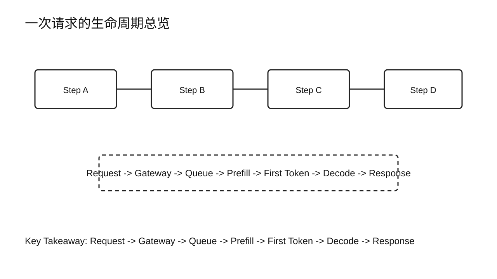
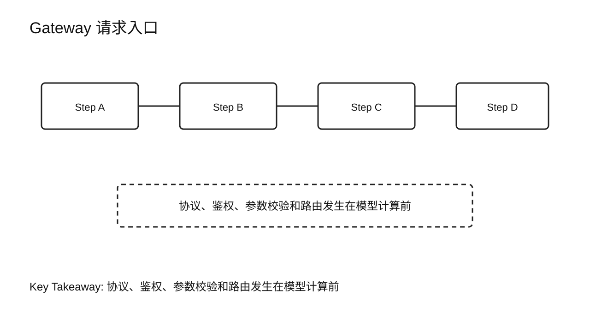
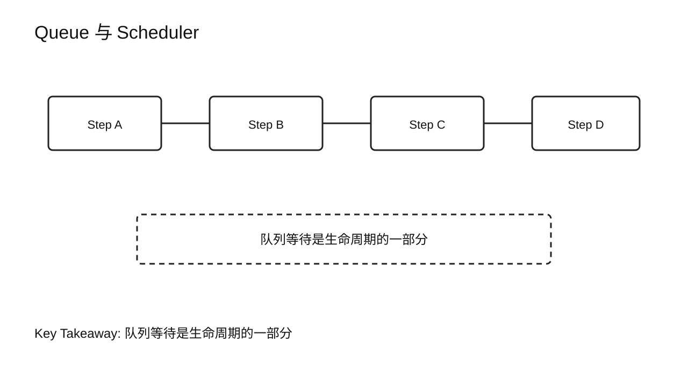
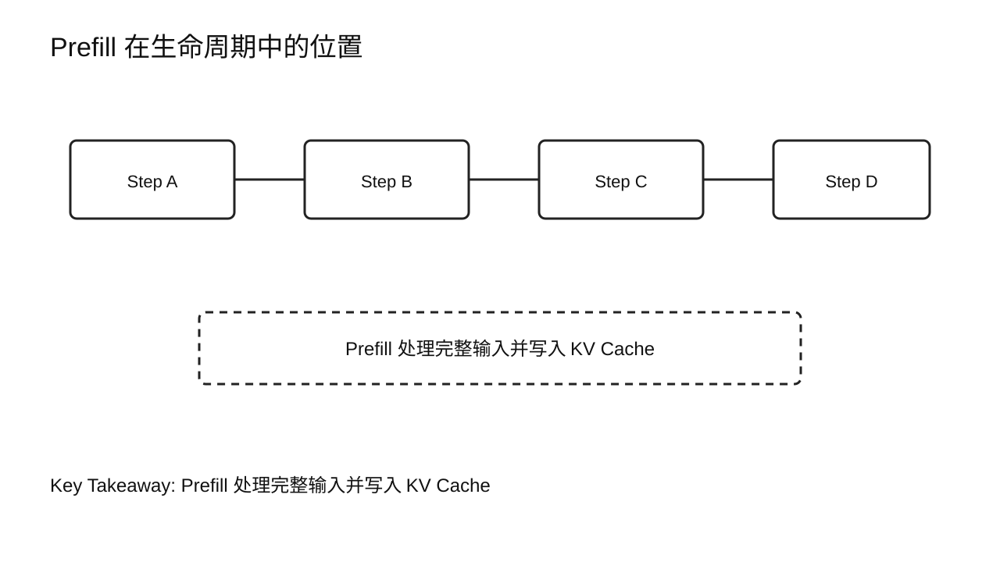
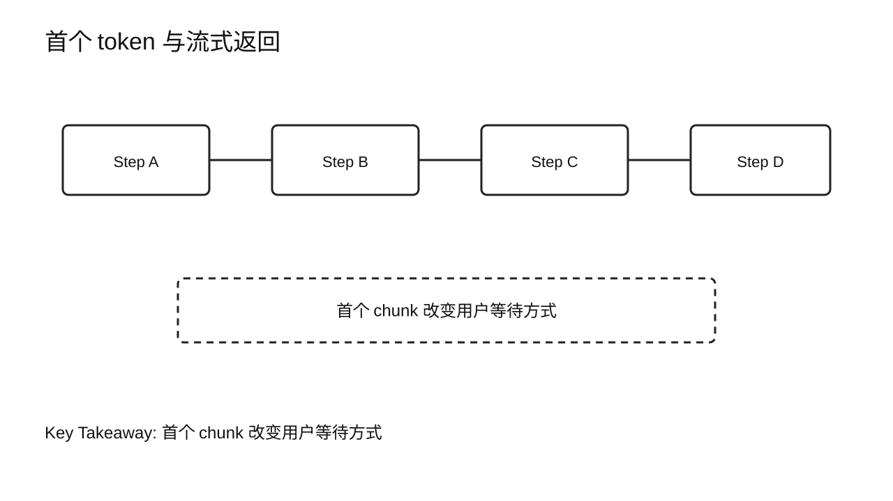
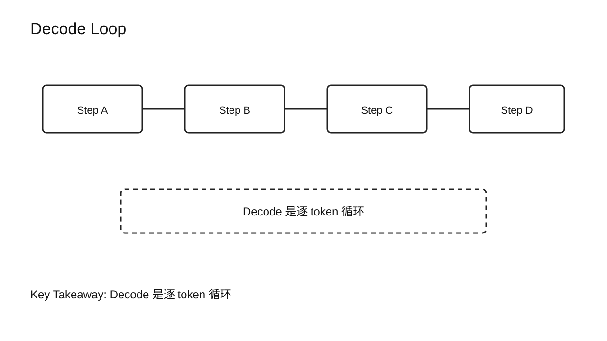
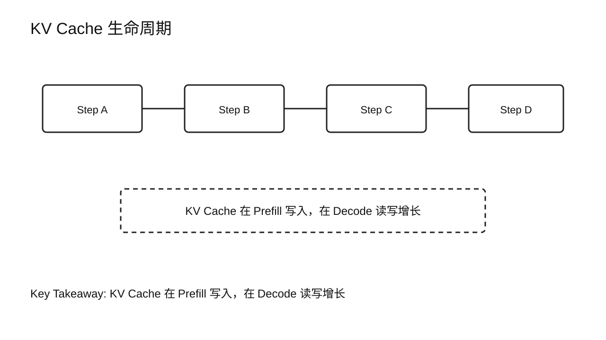
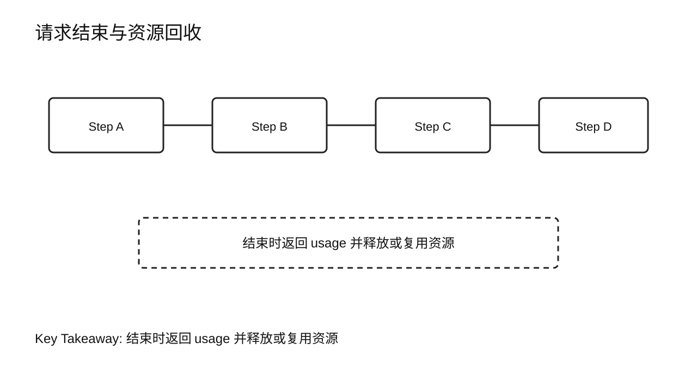
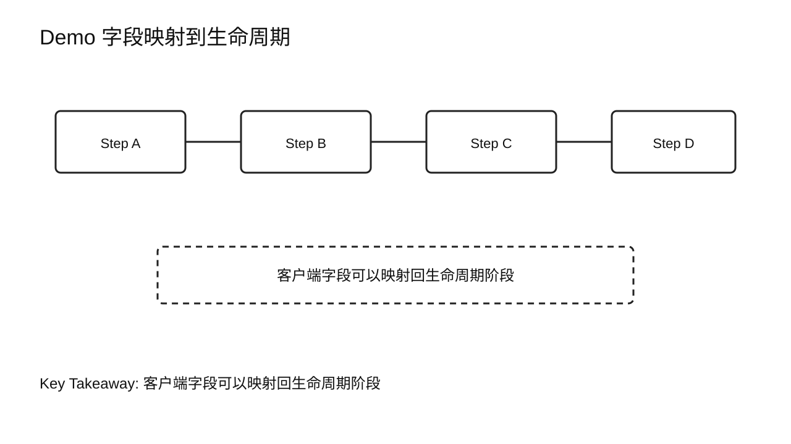

# 第 2 章 Inference Lifecycle

## 学习目标

学完本章后，你应该能够：

- 按顺序描述一次在线 LLM 请求从进入系统到返回结束的生命周期。
- 区分 Queue、Prefill、Decode、Response 在请求路径中的位置。
- 解释 KV Cache 在请求生命周期中何时创建、读取、增长和释放。
- 说明 Streaming Response 为什么会改变用户对延迟的感知。
- 用一次最小 Demo 观察请求、首个流式 chunk、后续 chunk 和 usage 的对应关系。

第 1 章讲的是系统长什么样。本章沿着一条真实请求往里走，回答“请求如何完成推理”。本章不系统定义指标，也不做 benchmark 结论。TTFT、TPOT / ITL、TPS 等指标会在第 3 章展开。

## 核心问题

1. 一个请求进入推理系统后会经过哪些阶段？
2. Queue、Prefill、Decode、Response 分别承担什么职责？
3. KV Cache 如何把 Prefill 和 Decode 连接起来？
4. Streaming Response 为什么能改善用户体感？



图2-1：一次请求的生命周期总览。

## 2.1 从架构图走到请求路径

上一章我们把系统拆成 Client、Gateway、Scheduler、Worker、Runtime 和 GPU。本章换一个视角：不再从组件出发，而是跟着一个请求走。

一个典型的在线请求可以先简化成这条链路：

```text
Request
  -> Gateway
  -> Queue
  -> Prefill
  -> First Token
  -> Decode Loop
  -> Response
  -> Finish
```

这条链路里的每一步都会留下可观察信号。请求进不来，先看 Gateway。请求进来了但迟迟不执行，看 Queue 和 Scheduler。第一个 token 出现前等待长，通常要检查排队、Prompt 长度和 Prefill。已经开始输出但后续一顿一顿，则要看 Decode、KV Cache 读取、调度节奏和返回链路。

本章先建立阶段语言。后续章节做指标、Benchmark、Profiling 和优化时，都会用这套语言描述问题。

## 2.2 Gateway：请求进入服务

请求首先到达 Gateway。Gateway 会解析协议、校验参数、确认模型名、处理鉴权和配额，再把请求交给模型服务实例。

在 OpenAI-compatible API 中，一个请求通常包含：

- `model`：目标模型或服务名。
- `messages` 或 `prompt`：输入内容。
- `max_tokens`：最大生成长度。
- `temperature`、`top_p` 等采样参数。
- `stream`：是否流式返回。

Gateway 这一层不负责模型计算，但它会影响请求能否进入系统。参数错误、模型名不匹配、租户配额耗尽、路由到不可用实例，都会让请求在模型执行前失败。



图2-2：Gateway 请求入口。

## 2.3 Queue：请求等待执行机会

通过 Gateway 后，请求不会一定立刻进入 GPU。在线推理服务通常会维护等待队列。Scheduler 根据当前运行中的请求、可用 KV Cache、batch 预算和并发策略，决定哪些请求进入下一轮执行。

Queue 的存在不是坏事。没有队列，服务很难在高并发下保持资源可控。问题在于队列等待不能失控，也不能让短请求长期被长请求挡住。

这一阶段常见观察点包括：

- 等待队列长度。
- 请求在队列中的等待时间。
- 当前可用的 batch slot。
- 当前可用的 KV Cache block。
- 是否因为显存预算不足而暂缓执行。

第 13 到第 20 章会专门讲 Serving 工作机制、性能分析和调度优化。本章只要求你知道：Queue 是请求生命周期的一部分，用户感受到的慢可能发生在模型计算前。



图2-3：Queue 与 Scheduler。

## 2.4 Prefill：处理完整输入

当请求被 Scheduler 选中后，模型首先处理完整输入序列。这个阶段叫 Prefill。

Prefill 的输入是 prompt tokens。模型会把这段输入送入 Transformer，计算每一层的中间状态，并为历史 token 写入 KV Cache。Prefill 结束后，模型得到用于生成第一个输出 token 的 logits。

本章不展开 attention 和 GEMM 的计算细节，只抓住生命周期里的位置：

```text
Prompt tokens
  -> Prefill
  -> KV Cache for prompt
  -> logits for first generated token
```

Prefill 出现在第一个输出 token 之前，所以它强影响首包等待。但首包等待不等于 Prefill 本身，还可能包含排队、tokenization、采样和网络返回。第 3 章会正式定义 TTFT，第 9 到第 12 章会深入 Prefill 的机制、分析和优化。



图2-4：Prefill 在生命周期中的位置。

## 2.5 First Token 与 Streaming Response

Prefill 结束后，模型会根据 logits 和采样参数选出第一个输出 token。对于流式接口，服务通常会尽快把这个 token 或包含它的 chunk 返回给客户端。

这一步对用户体感很关键。完整答案可能还没生成完，但只要第一个 chunk 到达，用户就会觉得系统“开始响应了”。

Streaming Response 把一次完整响应拆成多个片段：

```text
chunk_1
chunk_2
chunk_3
...
usage / finish reason
```

流式返回不会让模型少算，但它改变了用户等待方式。非流式接口要等完整答案生成完才返回；流式接口可以在生成过程中持续返回部分内容。



图2-5：首个 token 与流式返回。

## 2.6 Decode Loop：逐 token 生成

第一个 token 之后，请求进入 Decode 阶段。Decode 不是一次操作，而是一个循环。每一轮通常读取上一步生成的 token 和历史 KV Cache，计算下一个 token，并把新 token 的 K/V 追加回缓存。

简化过程如下：

```text
last token + KV Cache
  -> model step
  -> next token
  -> append new K/V
  -> repeat
```

Decode 会持续到停止条件出现。停止条件可能是 EOS、stop words、达到 `max_tokens`，或者客户端取消请求。

输出越长，Decode 循环次数越多。多个请求并发时，Scheduler 会不断把处于 Decode 阶段的请求组合成执行批次。这个循环节奏直接影响流式输出是否顺滑，但具体指标放到第 3 章。



图2-6：Decode Loop。

## 2.7 KV Cache 生命周期

KV Cache 是连接 Prefill 和 Decode 的关键状态。

在 Prefill 阶段，模型为 prompt 中的历史 token 写入 K/V。在 Decode 阶段，每生成一个新 token，模型会读取已有 K/V，并追加这个新 token 的 K/V。请求结束后，这些缓存会释放、复用，或者在支持前缀复用的系统里保留为 Prefix Cache 的候选。

生命周期可以这样表示：

```text
allocate blocks
  -> prefill writes prompt K/V
  -> decode reads history K/V
  -> decode appends new K/V
  -> release or reuse
```

本章只讲生命周期，不讲分页管理、显存碎片、KV Quantization 或 Prefix Cache 命中策略。这些内容会在 Decode Optimization 和相关技术章节展开。



图2-7：KV Cache 生命周期。

## 2.8 Response 结束与资源回收

请求完成后，服务要做几件收尾工作：

- 返回 finish reason。
- 返回 usage 或 token 统计。
- 清理请求状态。
- 释放或复用 KV Cache block。
- 记录日志、指标和错误信息。

这些动作看起来不起眼，但生产系统里很重要。如果客户端断开后请求没有及时取消，GPU 可能继续做无用计算。如果 KV Cache 没有正确释放，可用并发会越来越低。如果 usage 和 finish reason 缺失，后续成本统计、限流和质量分析都会受影响。



图2-8：请求结束与资源回收。

## 2.9 Demo：观察一次流式请求

本章 Demo 沿用 `chapter01/demo/` 中的最小 vLLM 服务脚本。这里不新增复杂 benchmark，只观察一次请求的生命周期。

启动服务后，从课程根目录运行：

```bash
python3 chapter01/demo/demo.py \
  --base-url http://127.0.0.1:8000/v1 \
  --model Qwen/Qwen2.5-0.5B \
  --prompt "请用中文解释一个 LLM 请求从进入服务到流式返回结束的过程。" \
  --max-tokens 160 \
  --requests 1 \
  --concurrency 1
```

观察输出时，把字段映射到生命周期：

| 输出字段 | 生命周期含义 |
|---|---|
| `prompt_tokens` | 输入被 tokenizer 转成 token 后的规模 |
| `ttft_ms` | 从客户端发起请求到首个流式 token 到达的时间 |
| `stream_chunks` | 流式返回过程中的 chunk 数 |
| `output_tokens` | Decode 循环最终生成的 token 数 |
| `total_latency_ms` | 请求完整结束前的总耗时 |

注意，本章只做映射，不评价数值好坏。



图2-9：Demo 字段映射到生命周期。

## 2.10 课堂案例：为什么“首包慢”和“输出慢”要分开问

一个客服机器人上线后，业务方给出两条反馈：

- 早上 9 点刚上班时，用户发出问题后，经常等 5 秒才看到第一个字。
- 中午之后，第一个字很快出来，但后续输出一顿一顿。

这两条反馈听起来都是“慢”，但在生命周期图上位置不同。

第一条更像首包前的问题。可能是早高峰请求一起进入系统，Queue 变长；也可能是用户带着很长的聊天历史，Prefill 处理时间增加；还可能是模型服务刚扩容，某些实例正在加载模型。此时优先把路径拆成：

```text
Gateway
  -> Queue
  -> Prefill
  -> First Token
```

第二条更像 Decode 过程的问题。首个 chunk 很快说明请求已经进入执行并完成了第一个输出，但后续 token 间隔变大，可能与 Decode Loop、KV Cache 读取、batch 调度或网络发送有关。此时优先看：

```text
Decode Loop
  -> KV Cache read / append
  -> Streaming chunks
```

课堂上可以让学员用两种颜色标注同一张生命周期图：一种颜色标“首包慢”的可能位置，另一种颜色标“输出慢”的可能位置。这个练习能帮助他们养成一个习惯：先定位阶段，再选择指标。

注意，这里还没有做根因判断。第 3 章会把这两类反馈转成 TTFT 和 TPOT / ITL，第 5、6、7 章才会进入 Benchmark、Profiling 和 Root Cause Analysis。

### 补充案例 A：长文档总结请求如何改变生命周期

一个普通问答请求可能只有几十到几百个输入 token。长文档总结不同，用户可能一次提交几千甚至上万 token。生命周期没有变，仍然是 Gateway、Queue、Prefill、Decode、Response，但各阶段权重变了。

可以让学员标注这条请求：

```text
Long document
  -> Tokenization
  -> Prefill with long prompt
  -> Short summary decode
```

这个请求的特点是：输入长，输出可能不长。课堂讨论时只问“哪一段生命周期更可能变重”，不要提前讨论 FlashAttention 或 Chunked Prefill 的优化实现。

### 补充案例 B：Agent 多步调用为什么是一串生命周期

Agent 场景里，一次用户请求可能触发多次 LLM 调用：先规划，再调用工具，再读取工具结果，再生成最终回答。对用户来说这是一次任务；对推理系统来说，它可能是多次请求生命周期。

```text
User Task
  -> LLM call 1: plan
  -> Tool call
  -> LLM call 2: interpret result
  -> LLM call 3: final answer
```

课堂讨论：如果最终回答很慢，是不是只能看最后一次 LLM 调用？通常不是。前面的 LLM call、工具等待和中间上下文都会影响端到端体验。本章只要求学员能把“一次业务任务”和“多次模型请求生命周期”区分开。

## 2.11 常见误区

误区一：把 TTFT 直接等同于 Prefill。

Prefill 通常是首包等待的重要组成，但 TTFT 还包含排队、tokenization、采样和返回链路。第 3 章会正式定义。

误区二：认为非流式和流式只是接口格式差异。

流式返回会改变用户体感和客户端处理方式，也会影响日志、取消请求和错误处理策略。

误区三：把 KV Cache 当成单纯的显存公式。

KV Cache 不只是占多少显存，还参与请求调度、并发容量、Decode 读写和资源回收。

误区四：在生命周期章节提前展开优化技术。

本章只把阶段讲清楚。PagedAttention、Prefix Cache、KV Quantization、Continuous Batching 等技术会在后续章节讲。


图2-10：生命周期与后续章节边界。

## 本章总结

本章从请求视角走完了一次在线 LLM 推理生命周期。

请求先经过 Gateway，再进入 Queue，随后由 Scheduler 选择进入执行。Prefill 处理完整输入并写入 KV Cache，第一个 token 出现后，流式响应可以开始返回。Decode Loop 持续生成后续 token，并不断读取和追加 KV Cache。请求结束时，服务返回 usage、finish reason，并释放或复用资源。

下一章会把这些生命周期阶段转化成指标语言。只有能描述 TTFT、TPOT / ITL、TPS、RPS、尾延迟、GPU Utilization 和 Cost per Token，才谈得上稳定地比较系统表现。

### 本章 Checklist

- [ ] 能画出 Request -> Gateway -> Queue -> Prefill -> Decode -> Response 的链路。
- [ ] 能说明 Queue 发生在模型计算前。
- [ ] 能说明 Prefill 与第一个 token 的关系。
- [ ] 能说明 Decode 为什么是循环。
- [ ] 能说明 KV Cache 何时写入、读取、追加和释放。
- [ ] 能把 demo 输出字段映射到生命周期阶段。

## 课后练习

1. 画出一次流式请求的生命周期，并标出首个 chunk 出现的位置。
2. 解释 Queue 时间为什么不能算作模型 forward 时间。
3. 用自己的话说明 KV Cache 如何连接 Prefill 和 Decode。
4. 运行本章 Demo，把 `ttft_ms`、`stream_chunks`、`output_tokens`、`total_latency_ms` 分别标注到生命周期图上。
5. 课堂讨论：如果客户端主动取消请求，生命周期图里哪些状态必须被清理？
