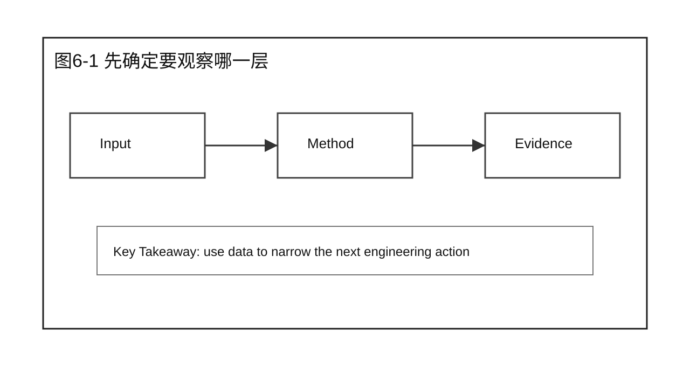
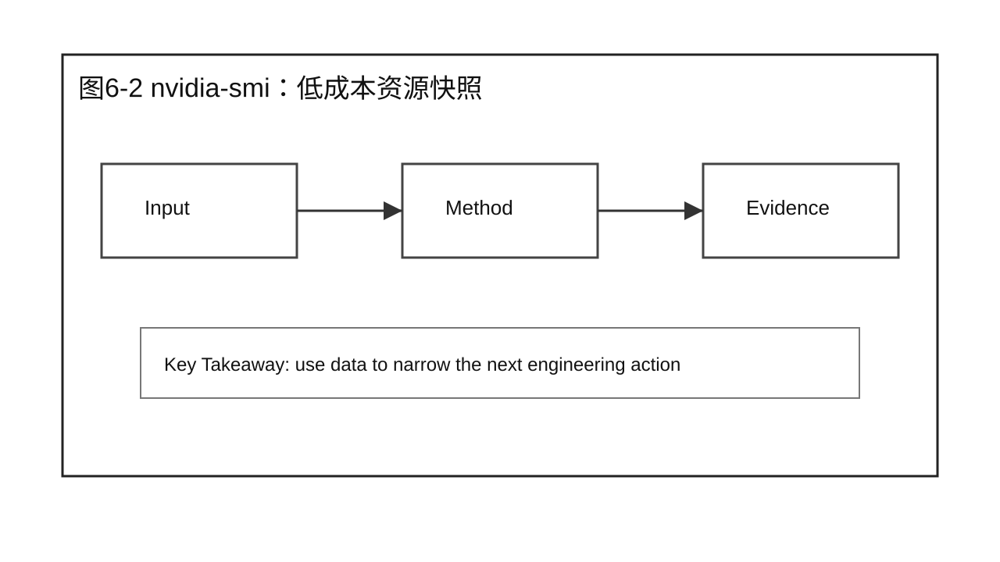
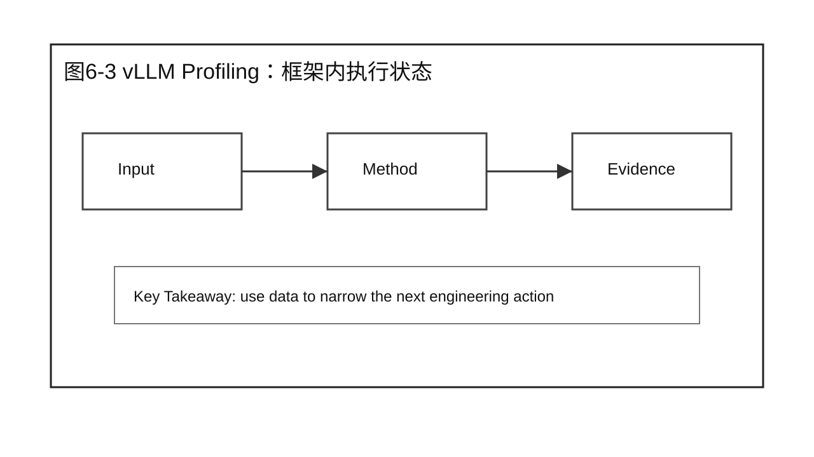
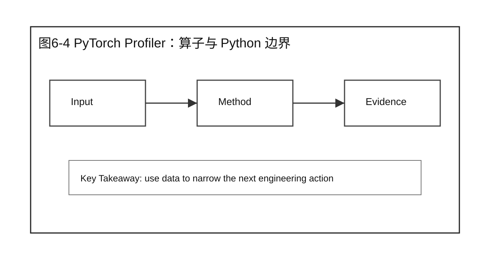
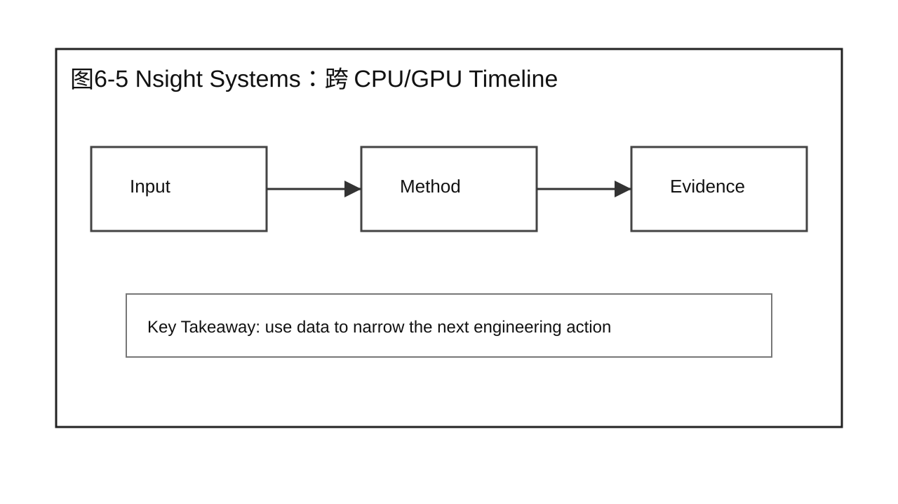
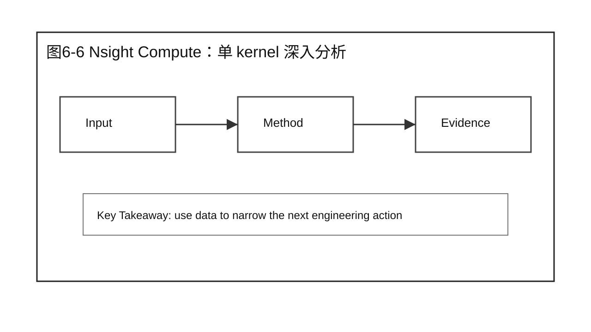
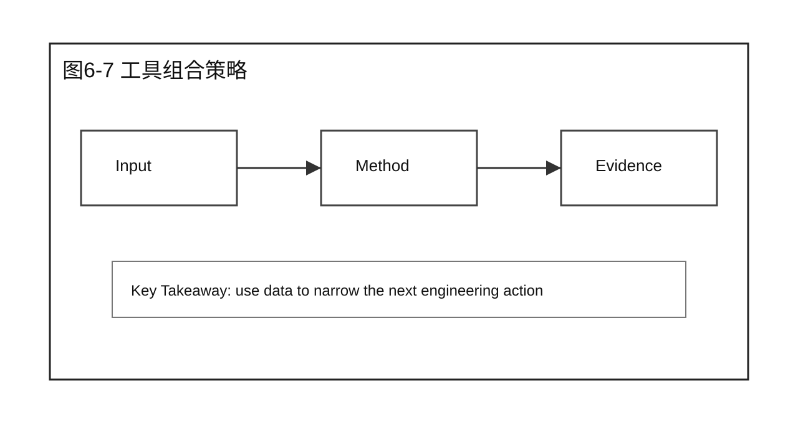
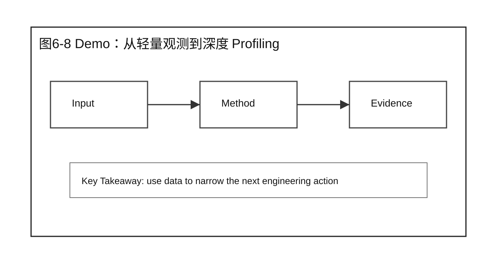
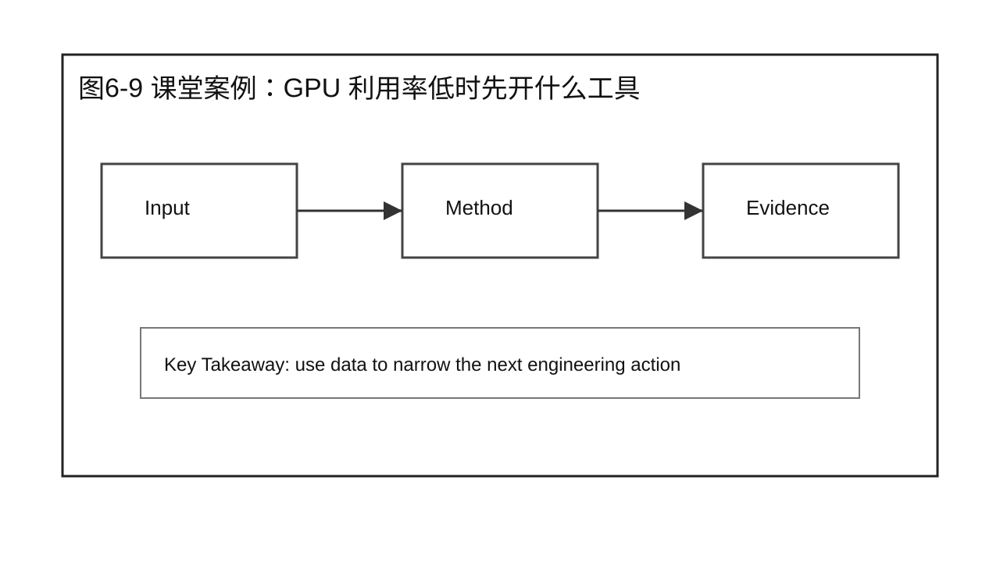

# 第 6 章 Profiling Toolchain

## 学习目标

学完本章后，你应该能够：

- 解释本章为什么要回答：如何采集推理系统不同层次的性能数据？
- 把性能分析问题拆成 Baseline、Workload、指标和证据。
- 区分现象、假设、Profiling 证据和 Root Cause。
- 设计一个不越过本章边界的 Demo 或课堂讨论。
- 使用本章 Checklist 为后续优化章节准备输入。

本章属于 Part 2 Performance Analysis。它只建立分析方法，不提前给出 Prefill、Decode、Serving 或 Scalability 的优化结论。

## 核心问题

本章围绕四个问题展开：

1. 如何采集推理系统不同层次的性能数据？
2. 这个问题在完整推理系统里落在哪些组件和阶段？
3. 哪些证据足以支持结论，哪些只是表面现象？
4. 如何把方法沉淀成后续章节可以复用的检查动作？



图6-1：先确定要观察哪一层。

## 6.1 先确定要观察哪一层

Profiling 的第一步不是打开工具，而是判断问题可能发生在哪一层。入口、队列、调度、Worker、Runtime、GPU kernel 都有不同证据。层级判断越清楚，工具选择越轻，采集成本越低。



图6-2：先确定要观察哪一层。

## 6.2 nvidia-smi：低成本资源快照

nvidia-smi 适合做第一层资源快照。它能快速看到 GPU 利用率、显存占用、进程、功耗和温度，但不能解释 kernel 为什么慢，也不能区分 Prefill 和 Decode。它的作用是快速排除明显资源异常。



图6-3：nvidia-smi：低成本资源快照。

## 6.3 vLLM Profiling：框架内执行状态

vLLM Profiling 更靠近 LLM serving engine。它能帮助观察请求排队、batch 形成、Prefill / Decode 时间、KV Cache 使用等框架内状态。它回答的是“engine 怎么调度请求”，不是单个 CUDA kernel 的微观效率。



图6-4：vLLM Profiling：框架内执行状态。

## 6.4 PyTorch Profiler：算子与 Python 边界

PyTorch Profiler 适合分析 Python、算子调用和框架开销之间的边界。如果问题怀疑来自 tokenizer、数据准备、采样逻辑或 PyTorch eager 执行，它比 GPU 硬件工具更直接。



图6-5：PyTorch Profiler：算子与 Python 边界。

## 6.5 Nsight Systems：跨 CPU/GPU Timeline

Nsight Systems 适合看跨 CPU/GPU 的时间线。它能把 CPU 调度、CUDA API、kernel launch、GPU 执行和空洞放在一张 timeline 上，帮助判断 GPU 是在算、在等 CPU，还是在等待调度形成 batch。



图6-6：Nsight Systems：跨 CPU/GPU Timeline。

## 6.6 Nsight Compute：单 kernel 深入分析

Nsight Compute 面向单个 kernel 的深入分析。它适合在已经定位到某个 attention、GEMM 或采样 kernel 后使用，用来观察 occupancy、memory throughput、warp stall 和访存效率。它不适合作为排障第一步。



图6-7：Nsight Compute：单 kernel 深入分析。

## 6.7 工具组合策略

工具组合策略要遵守从轻到重、从全局到局部的顺序。先用客户端和服务端指标确认现象，再用资源快照和框架 profiling 缩小范围，最后才进入 timeline 或 kernel 分析。



图6-8：工具组合策略。

## 6.8 Demo：从轻量观测到深度 Profiling

Demo 的目标是演示工具选择路径。先观察客户端延迟和服务端日志，再看 nvidia-smi 和框架指标；只有当证据指向 GPU 执行路径时，才引入 Nsight Systems 或 Nsight Compute。

可以把 Demo 设计成三轮观察。

第一轮只看轻量指标：

```text
客户端：
  TTFT P95 = 1800 ms
  TPOT avg = 38 ms
  error rate = 0

服务端：
  queue length = rising
  running requests = stable

nvidia-smi:
  GPU util = 42%
  memory used = 62GB / 80GB
```

此时不能直接打开 Nsight Compute，因为证据还没有指向单个 kernel。更合理的下一步是看框架内的 batch 和 scheduler 状态。

第二轮看 engine profiling：

```text
vLLM / engine profile:
  waiting requests increased
  average batched tokens lower than expected
  prefill requests frequently delayed
```

这说明问题更接近 queue / scheduler / workload 组合，而不是 GPU 算子本身。

第三轮才决定是否进入 Timeline：

```text
Nsight Systems:
  CPU side gap before GPU kernels
  GPU kernels are short but launch intervals large
```

课堂讨论：这时应该继续深入 Nsight Compute，还是回头检查 CPU、Scheduler 和请求分布？这能训练学员根据证据选工具，而不是根据工具名选工具。

## 6.9 课堂案例：GPU 利用率低时先开什么工具

线上服务 GPU 利用率只有 35%，业务方要求立刻打开 Nsight Compute。更合理的做法是先用 nvidia-smi 和服务端日志确认是否有队列空洞，再用 vLLM Profiling 看 batch 形成，最后才决定是否进入 kernel 级分析。

课堂讨论：

1. 这个案例最容易被误判成哪个问题？
2. 还缺哪两类证据才能进入优化方案？

### 补充案例 A：换一个工作负载

CPU 占用高但 GPU 空闲时，PyTorch Profiler 或服务层日志可能比 GPU kernel 工具更先发挥作用。

讨论重点：这个补充案例改变的是业务场景还是分析方法？

### 补充案例 B：换一个系统条件

一次深度 Profiling 会改变系统开销，课堂讨论应说明何时在生产旁路采样，何时在复现实验环境采样。

讨论重点：哪些结论仍然成立，哪些必须重新验证？

### 贯穿案例：同一个告警的工具升级路径

继续使用企业问答服务。线上告警说 P95 TTFT 上升，但错误率没有变化。工具选择可以这样升级：

```text
Step 1: Gateway / access log
  确认请求已经进入正确模型，没有大量 4xx / 5xx。

Step 2: client metrics
  确认 TTFT 变差是否稳定，TPOT 是否同时变差。

Step 3: nvidia-smi / dashboard
  确认 GPU 是否空闲、显存是否接近上限。

Step 4: engine profiling
  查看 queue、running requests、batch tokens、prefill/decode 时间。

Step 5: Nsight Systems
  当怀疑 CPU/GPU timeline 存在空洞时再打开。

Step 6: Nsight Compute
  只有当某个 kernel 被定位为核心耗时后才进入。
```

这条路径能让学员看到：Profiling Toolchain 是一套升级策略，不是一堆工具名。不同工具对应不同证据粒度，也对应不同成本。



图6-9：课堂案例：GPU 利用率低时先开什么工具。

## 6.10 常见误区

误区一：把单次运行结果当成性能结论。

单次结果只能说明那一次发生了什么，不能说明系统稳定能力。正式分析必须说明重复次数、波动范围和异常值处理方式。

误区二：看到一个指标变化就直接选择优化技术。

指标只是现象。进入优化之前，要先证明它来自哪个组件、哪个阶段、哪类资源约束。

误区三：只保留支持自己判断的数据。

性能工程要能被复核。反例、波动和限制条件同样要写进报告。


图6-10：Profiling Toolchain 的章节边界。

## 6.11 Profiling 选择模板

Profiling 工具不是越重越好。工具越深入，开销越高，对运行环境的要求也越严格。工程上更稳的做法，是先用轻量观测缩小范围，再逐步进入框架级和 kernel 级工具。

可以用下面的选择模板：

| 你看到的现象 | 先用什么 | 下一步可能用什么 | 暂时不要急着用什么 |
|---|---|---|---|
| 请求完全进不来 | Gateway 日志、HTTP 状态码、服务健康检查 | 服务端 access log、路由日志 | Nsight Compute |
| TTFT 变长 | 客户端时间戳、队列长度、vLLM Profiling | Nsight Systems、PyTorch Profiler | 直接调 kernel 参数 |
| TPOT 变差 | Decode 时间、GPU Utilization、显存状态 | Nsight Systems、Nsight Compute | 只看平均 tokens/s |
| GPU 利用率低 | nvidia-smi、队列长度、batch 状态 | vLLM Profiling、服务端调度日志 | 直接判断 GPU 不够 |
| CPU 占用高 | top、进程日志、tokenizer 时间 | PyTorch Profiler、系统 tracing | 只看 GPU Timeline |
| 单个 kernel 很慢 | Nsight Systems 定位 kernel | Nsight Compute 深入 kernel | 从 HTTP 日志猜 root cause |

一个常见流程是：

```text
1. 客户端指标确认现象是否稳定。
2. 服务端日志确认请求是否进入正确模型和实例。
3. nvidia-smi 或框架指标确认 GPU、显存和队列是否异常。
4. vLLM / SGLang / TensorRT-LLM Profiling 确认 batch、Prefill、Decode 状态。
5. Nsight Systems 看 CPU/GPU Timeline。
6. Nsight Compute 只用于已经定位到的关键 kernel。
```

这套流程的重点是控制成本。生产问题通常先需要方向判断，而不是第一时间拿到最细的 kernel counter。只有当证据指向某个 kernel、某类 attention 或某段内存访问时，Nsight Compute 这类深度工具才值得打开。

## 6.12 课堂执行建议

这一章适合让学员练习“工具选择”而不是“工具炫技”。教师可以准备三类现象：请求进不来、GPU 利用率低、单个 kernel 时间异常。每类现象让学员选择第一工具、第二工具和暂时不该用的工具。

第一类现象是入口问题。请求返回 429、404 或 5xx 时，优先看 Gateway、路由、模型名和服务健康状态。这个阶段打开 Nsight Compute 没有意义，因为请求可能根本没有进入模型执行路径。

第二类现象是 GPU 利用率低。这里也不能直接说“GPU 不够”或“模型太小”。要先看队列有没有请求，batch 是否形成，CPU 是否阻塞，worker 是否健康。只有确认请求已经进入 engine，并且 GPU 执行路径存在空洞，才进入更深的 timeline 分析。

第三类现象是 kernel 异常。只有当 Nsight Systems 已经显示某个 kernel 或某类 kernel 占据主要时间时，Nsight Compute 才有价值。它适合回答 occupancy、memory throughput、warp stall 这类问题，不适合回答租户限流、请求路由或 queue delay。

本章的课堂产出可以是一张工具选择表。表里每一行都要写清楚：现象是什么，先看哪一层，用哪个工具，预期看到什么证据，如果证据不支持假设，下一步转向哪里。这个表会直接服务第 7 章的 Root Cause Analysis。

## 本章总结

本章回答了“如何采集推理系统不同层次的性能数据？”这个问题。核心结论是：性能分析要先建立可复现输入，再采集合适层级的证据，最后把现象转化为可验证的假设。

本章不要求你已经会优化 Prefill、Decode 或 Serving。它要求你在进入优化之前，能够说清楚当前系统的 Baseline 是什么、证据来自哪里、Root Cause 假设如何被验证。

### 本章 Checklist

- [ ] 能说清楚本章问题对应的系统阶段。
- [ ] 能写出 Baseline、Workload、指标和重复性边界。
- [ ] 能区分客户端观测、服务端状态和 GPU 证据。
- [ ] 能提出至少两个可验证假设，而不是直接给优化方案。
- [ ] 能说明本章内容与下一章或下一篇的衔接。

## 课后练习

1. 选一个你熟悉的 LLM 服务，写出一个最小可复现分析计划。
2. 为同一个模型设计两组不同 workload，并说明它们分别强调什么瓶颈。
3. 读一份压测结果，标出哪些结论证据充分，哪些还只是猜测。
4. 把课堂案例改写成你所在业务的场景，保留本章分析边界。
5. 写一段 200 字以内的分析报告摘要，要求包含现象、证据、假设和下一步验证动作。
