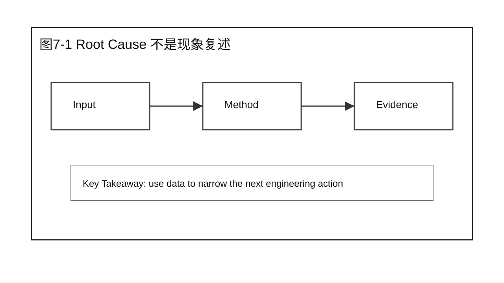
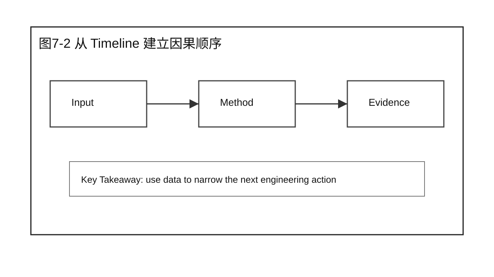
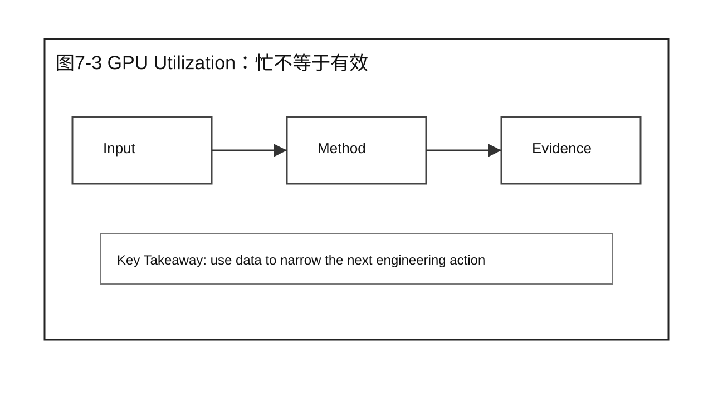
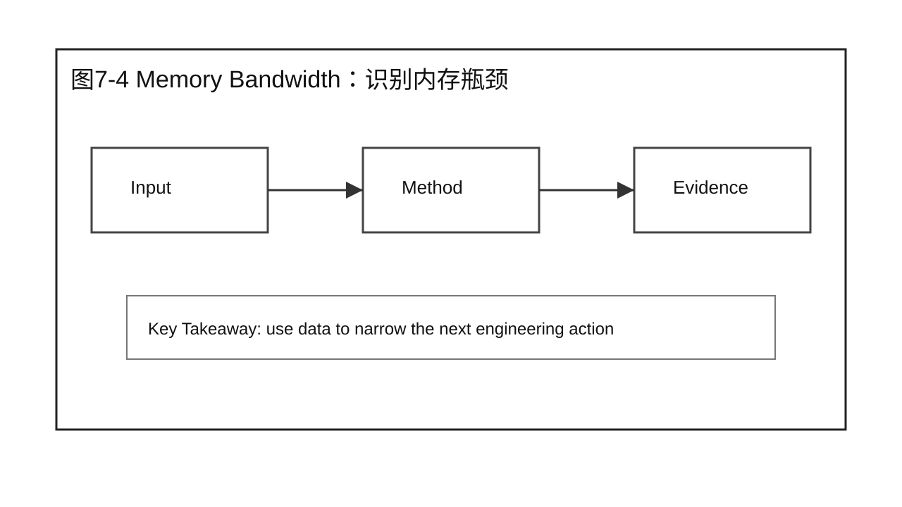
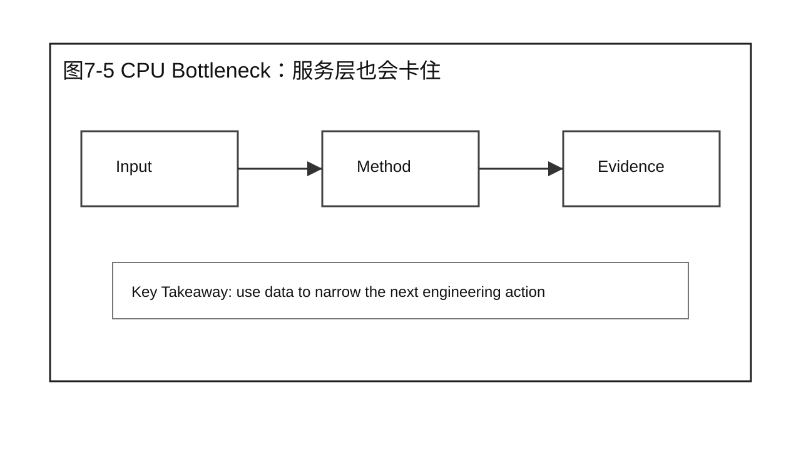
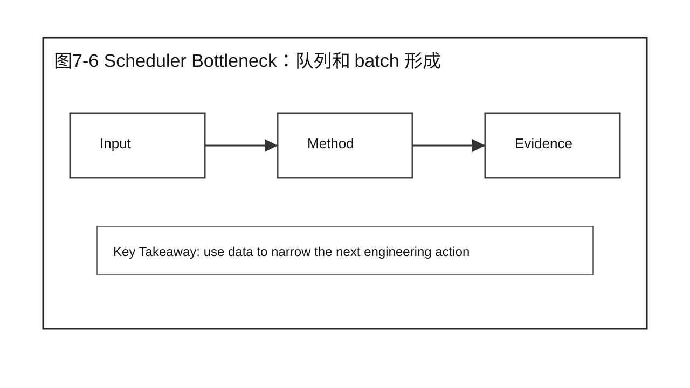
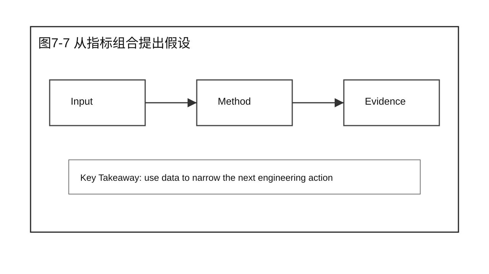
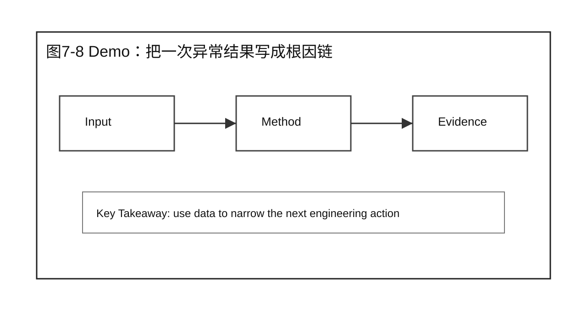
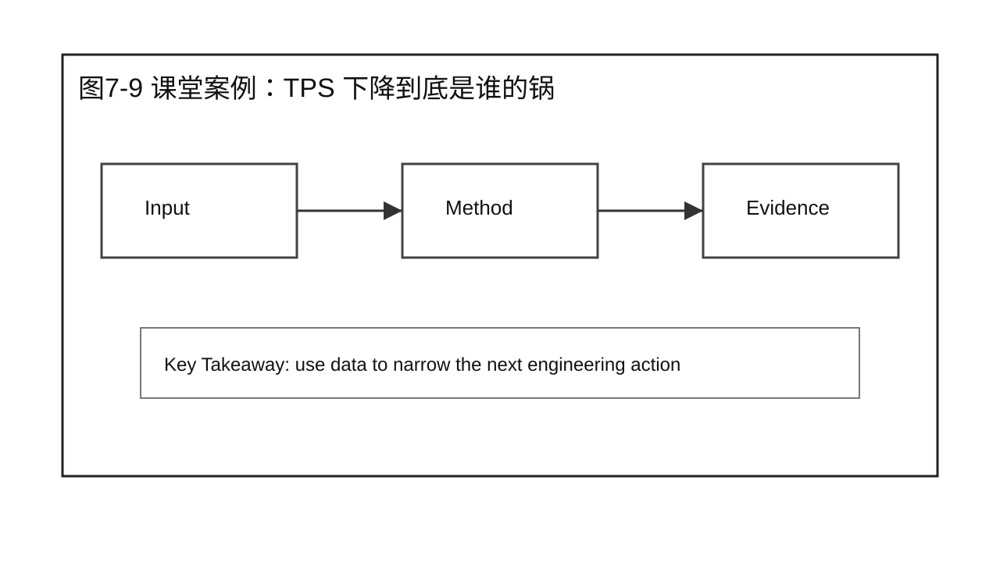
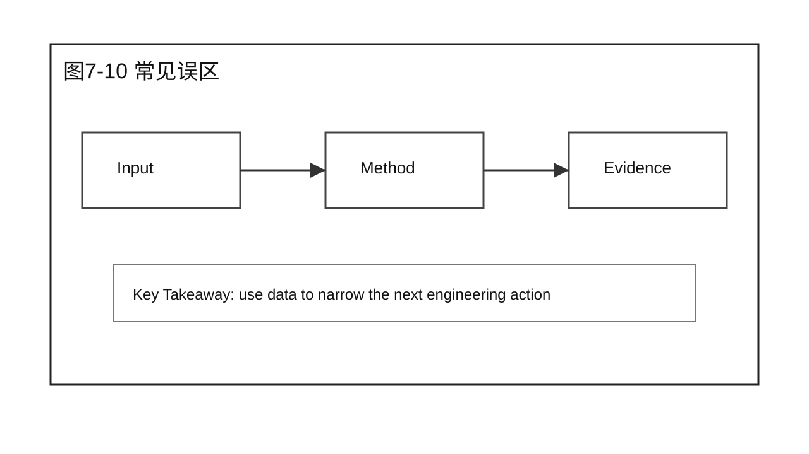

# 第 7 章 Root Cause Analysis

## 学习目标

学完本章后，你应该能够：

- 解释本章为什么要回答：如何从性能现象追溯到真正瓶颈？
- 把性能分析问题拆成 Baseline、Workload、指标和证据。
- 区分现象、假设、Profiling 证据和 Root Cause。
- 设计一个不越过本章边界的 Demo 或课堂讨论。
- 使用本章 Checklist 为后续优化章节准备输入。

本章属于 Part 2 Performance Analysis。它只建立分析方法，不提前给出 Prefill、Decode、Serving 或 Scalability 的优化结论。

## 核心问题

本章围绕四个问题展开：

1. 如何从性能现象追溯到真正瓶颈？
2. 这个问题在完整推理系统里落在哪些组件和阶段？
3. 哪些证据足以支持结论，哪些只是表面现象？
4. 如何把方法沉淀成后续章节可以复用的检查动作？

图7-1：Root Cause 不是现象复述。

## 7.1 Root Cause 不是现象复述

Root Cause 不是现象复述。TTFT 高、TPS 低、GPU 利用率低都只是现象。根因分析要回答：哪个组件、哪个阶段、哪类资源约束导致了这个现象，证据是否足以排除其他解释。

图7-2：Root Cause 不是现象复述。

## 7.2 从 Timeline 建立因果顺序

Timeline 的价值在于建立因果顺序。先发生队列堆积，还是先发生 GPU 空洞；CPU 是否在 kernel launch 前阻塞；Decode 循环之间是否有异常间隔，这些都需要按时间线观察。

图7-3：从 Timeline 建立因果顺序。

## 7.3 GPU Utilization：忙不等于有效

GPU Utilization 高不一定代表系统健康，低也不一定代表 GPU 不够。高利用率可能来自低效 kernel，低利用率可能来自队列不足、CPU 阻塞或 batch 形成失败。要结合 TPS、TPOT、queue delay 和 timeline 判断。

图7-4：GPU Utilization：忙不等于有效。

## 7.4 Memory Bandwidth：识别内存瓶颈

Memory Bandwidth 证据用于判断问题是否偏 memory-bound。Decode 阶段大量读取 KV Cache，显存带宽和访存模式会影响 TPOT。只看显存占用不够，还要看带宽、cache 行为和 kernel stall。

图7-5：Memory Bandwidth：识别内存瓶颈。

## 7.5 CPU Bottleneck：服务层也会卡住

CPU Bottleneck 常出现在 tokenizer、请求解析、采样、日志、网络返回和调度循环里。GPU 空闲但请求慢时，要检查 CPU 是否在准备输入、组织 batch 或处理 streaming response。

图7-6：CPU Bottleneck：服务层也会卡住。

## 7.6 Scheduler Bottleneck：队列和 batch 形成

Scheduler Bottleneck 发生在请求无法有效组成 batch 或资源预算被少数请求占住时。现象可能是队列变长、GPU 有空洞、长短请求互相干扰，或者 TTFT 和 TPS 同时恶化。

图7-7：Scheduler Bottleneck：队列和 batch 形成。

## 7.7 从指标组合提出假设

Root Cause 假设通常来自指标组合，而不是单个指标。TTFT 高但 TPOT 正常，优先怀疑队列或 Prefill；TPOT 高但 TTFT 正常，优先看 Decode 和 memory；TPS 低且 GPU 空闲，优先查 batch、CPU 或请求供给。

图7-8：从指标组合提出假设。

## 7.8 Demo：把一次异常结果写成根因链

Demo 的目标是把异常结果写成根因链：现象是什么，证据来自哪里，排除了什么，剩下哪些候选根因，下一步如何验证。它训练的是分析表达，而不是调参技巧。

## 7.9 课堂案例：TPS 下降到底是谁的锅

压测报告显示 TPS 下降。第一反应不是调大 batch，而是建立证据链：队列是否变长，GPU 是否空闲，memory bandwidth 是否打满，CPU 是否在 tokenizer 或网络返回上阻塞，Scheduler 是否形成了低效 batch。

课堂讨论：

1. 这个案例最容易被误判成哪个问题？
2. 还缺哪两类证据才能进入优化方案？

### 补充案例 A：换一个工作负载

P99 TTFT 突然升高，但平均 TTFT 变化不大，根因可能在队列尾部或少量长 prompt。

讨论重点：这个补充案例改变的是业务场景还是分析方法？

### 补充案例 B：换一个系统条件

GPU Utilization 很高但 TPS 不升，可能是无效忙，也可能是 memory-bound kernel。

讨论重点：哪些结论仍然成立，哪些必须重新验证？

图7-9：课堂案例：TPS 下降到底是谁的锅。

## 7.10 常见误区

误区一：把单次运行结果当成性能结论。

单次结果只能说明那一次发生了什么，不能说明系统稳定能力。正式分析必须说明重复次数、波动范围和异常值处理方式。

误区二：看到一个指标变化就直接选择优化技术。

指标只是现象。进入优化之前，要先证明它来自哪个组件、哪个阶段、哪类资源约束。

误区三：只保留支持自己判断的数据。

性能工程要能被复核。反例、波动和限制条件同样要写进报告。

图7-10：Root Cause Analysis 的章节边界。

## 7.11 Root Cause 证据链模板

Root Cause Analysis 的产出不应该是一句话，例如“GPU 利用率低”或“Scheduler 有问题”。这些只是现象或怀疑。更有用的产出是一条证据链，让别人能沿着同样路径复核。

可以按下面格式写：

| 步骤 | 内容 | 示例 |
|---|---|---|
| 现象 | 用户或压测看到什么 | 并发 32 时 P95 TTFT 从 800 ms 升到 2400 ms |
| 范围 | 哪些 workload、模型、实例受影响 | 长 prompt 请求受影响，短 prompt 请求变化不大 |
| 初步证据 | 客户端和服务端指标 | 队列等待增加，Prefill 时间增加，Decode TPOT 基本稳定 |
| 排除项 | 哪些原因暂时不像 root cause | GPU memory 未接近上限，错误率未上升 |
| 候选根因 | 还剩哪些可解释假设 | 长 prompt 导致 Prefill 占用过多 batch token，短请求被排队 |
| 验证动作 | 下一步如何证明或否定 | 固定 output 长度，分离长短 prompt workload，观察 TTFT 和 batch token |
| 结论边界 | 结论在哪些条件下成立 | 只适用于当前 prompt 分布和并发梯度 |

这个模板能防止“看到一个指标就下结论”。例如 GPU Utilization 低，可能是请求没有进入队列，可能是 CPU tokenizer 慢，可能是 Scheduler 没形成 batch，也可能是 GPU 在等跨机通信。只有把时间顺序、资源状态和请求状态连起来，才能说哪个解释更接近 root cause。

课堂上可以要求学员把同一份压测结果写成两版报告：一版只写现象，另一版写证据链。对比以后，差别会很明显：前者只能触发争论，后者能指导下一步实验。

## 7.12 课堂执行建议

这一章适合用“错误归因”来讲。教师可以故意给出一个不完整结论，例如“TPS 下降是因为 GPU 不够”，然后逐步补充证据，让学员判断这个结论是否还能成立。

第一轮只给客户端结果：TPS 降低，P95 延迟升高。此时任何根因判断都太早。学员最多只能提出候选假设，例如 queue delay、GPU 资源不足、CPU 阻塞、调度问题或请求分布变化。

第二轮补充服务端指标：队列长度升高，running requests 没有明显增加。这个信息开始指向 admission、scheduler 或资源预算，但仍不能证明 GPU 是根因。

第三轮补充 GPU 和 CPU 证据：GPU 有周期性空洞，CPU tokenizer 时间升高。此时根因链可能转向 CPU 或请求预处理，而不是 GPU 计算能力。这个过程能让学员看到：Root Cause Analysis 的重点不是猜得快，而是不断用证据缩小解释空间。

本章的课堂产出是一条证据链，而不是优化方案。证据链至少要包含现象、范围、初步证据、排除项、候选根因、验证动作和结论边界。只有证据链稳定后，后续章节才讨论具体优化技术。

## 本章总结

本章回答了“如何从性能现象追溯到真正瓶颈？”这个问题。核心结论是：性能分析要先建立可复现输入，再采集合适层级的证据，最后把现象转化为可验证的假设。

本章不要求你已经会优化 Prefill、Decode 或 Serving。它要求你在进入优化之前，能够说清楚当前系统的 Baseline 是什么、证据来自哪里、Root Cause 假设如何被验证。

### 本章 Checklist

- [ ] 能说清楚本章问题对应的系统阶段。
- [ ] 能写出 Baseline、Workload、指标和重复性边界。
- [ ] 能区分客户端观测、服务端状态和 GPU 证据。
- [ ] 能提出至少两个可验证假设，而不是直接给优化方案。
- [ ] 能说明本章内容与下一章或下一篇的衔接。

## 课后练习

1. 选一个你熟悉的 LLM 服务，写出一个最小可复现分析计划。
2. 为同一个模型设计两组不同 workload，并说明它们分别强调什么瓶颈。
3. 读一份压测结果，标出哪些结论证据充分，哪些还只是猜测。
4. 把课堂案例改写成你所在业务的场景，保留本章分析边界。
5. 写一段 200 字以内的分析报告摘要，要求包含现象、证据、假设和下一步验证动作。
