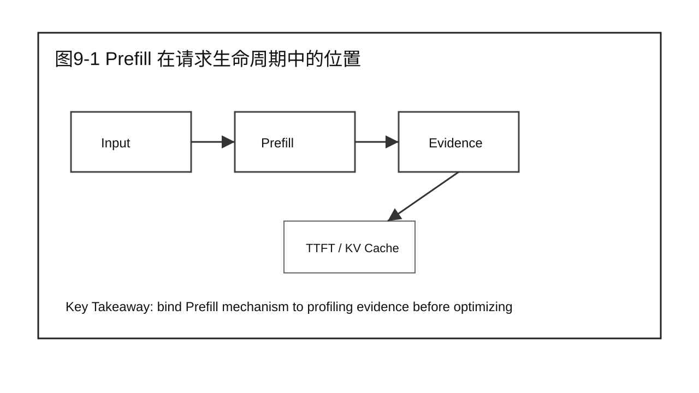
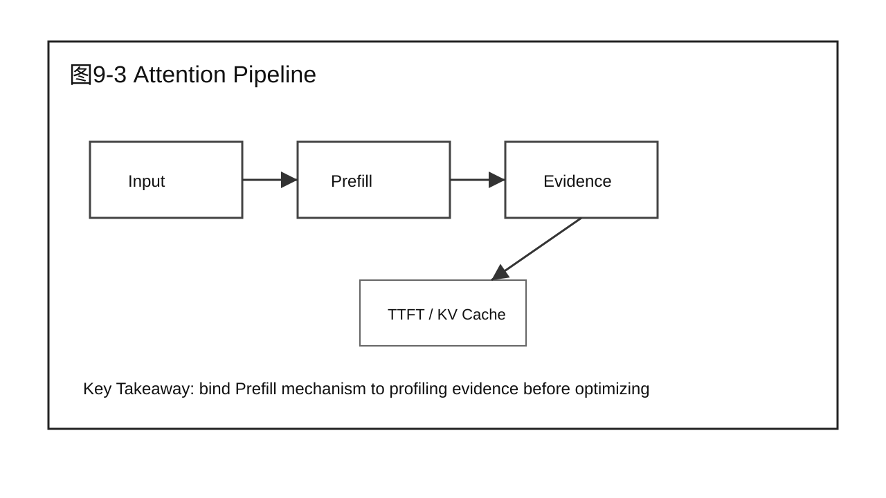
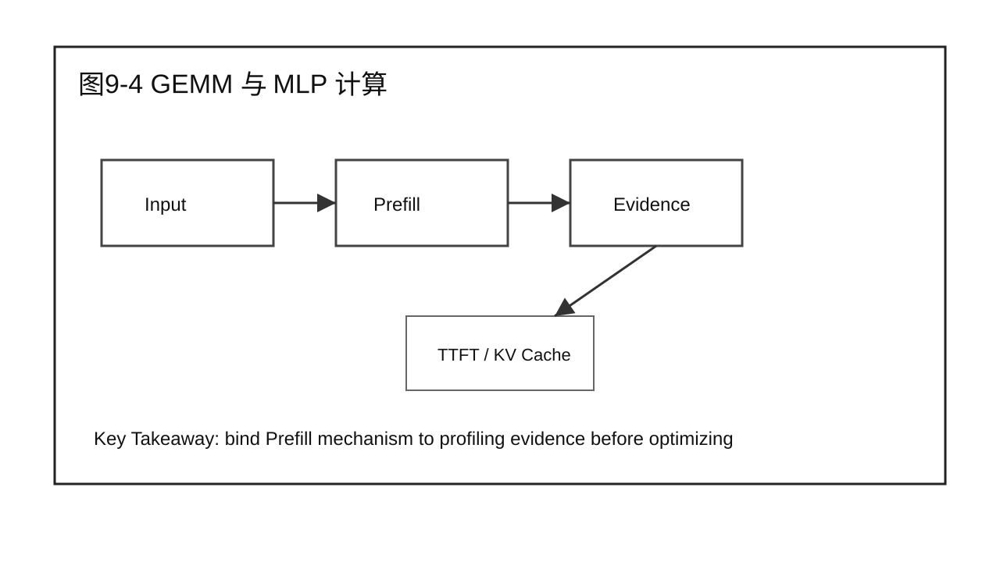
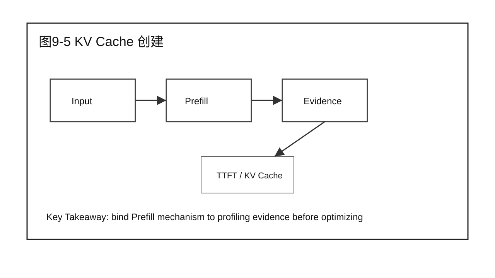
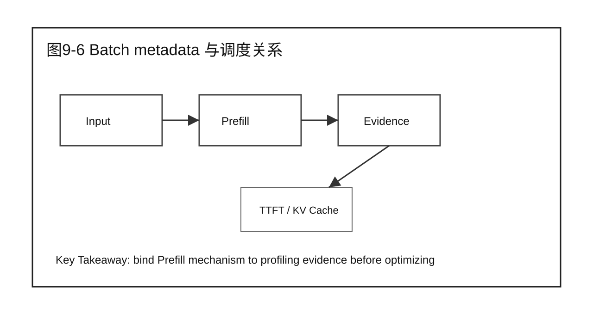
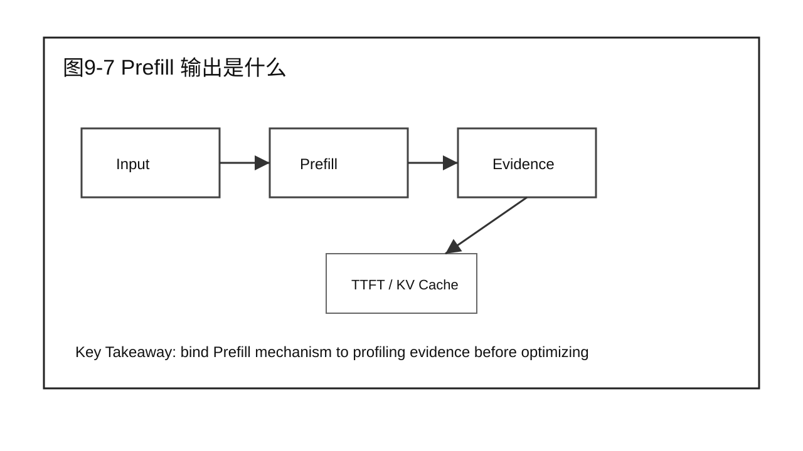
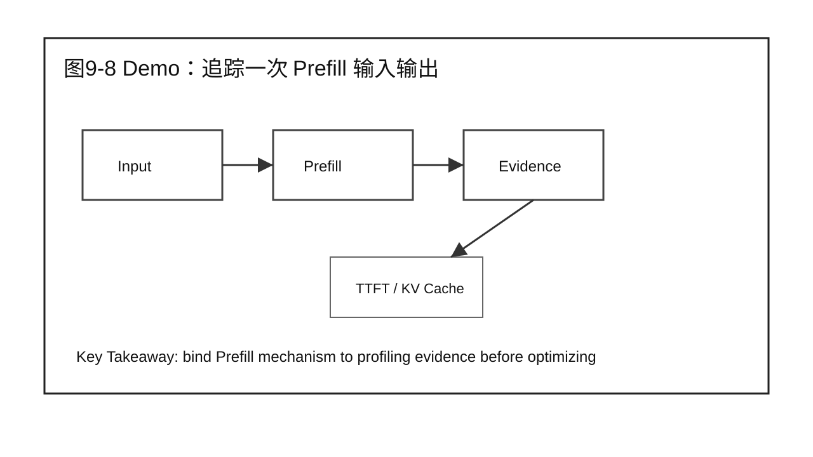
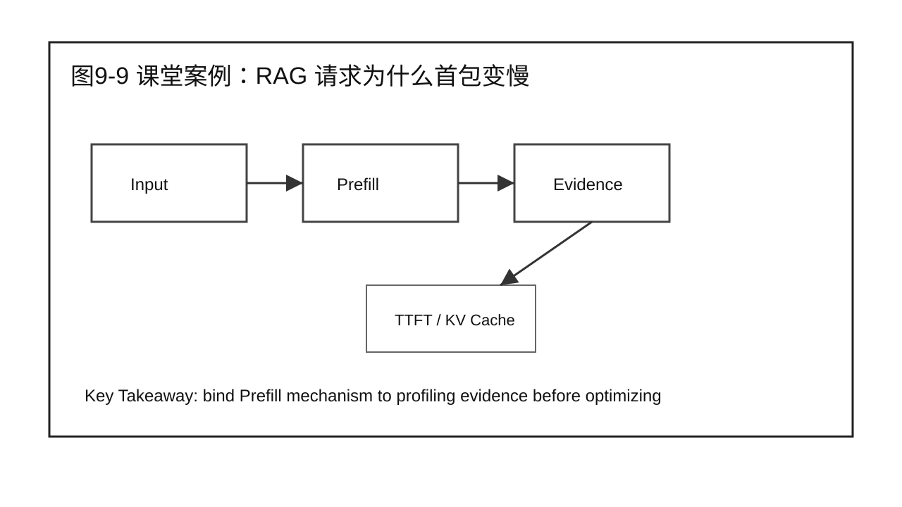
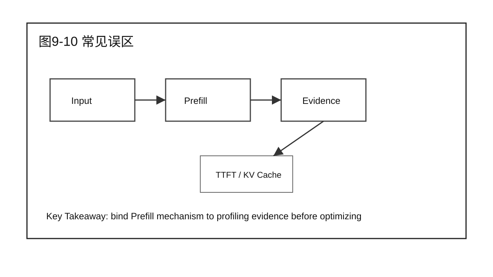

# 第 9 章 Prefill 工作机制

## 学习目标

学完本章后，你应该能够：

- 回答本章核心问题：Prefill 阶段到底做了什么？
- 说明本章内容在 Prefill Optimization 中的位置。
- 把 Part 1 的系统视图和 Part 2 的证据链应用到 Prefill 场景。
- 区分机制、瓶颈、优化方案和验证结论。
- 用案例、Demo 和 Checklist 支撑 20 分钟以上课堂讲授。

本章属于 Part 3 Prefill Optimization。写作边界是围绕 Prefill 展开，不提前进入 Decode、Serving 或 Scalability 的完整优化结论。

## 核心问题

本章围绕四个问题展开：

1. Prefill 阶段到底做了什么？
2. 它和 Part 1 的请求生命周期、指标和全局性能模型如何连接？
3. 它如何使用 Part 2 的 Benchmark、Profiling、Root Cause 和 Diagnosis 方法？
4. 本章结束后，读者应该产出什么工程化判断或报告？



图9-1：Prefill 在请求生命周期中的位置。

## 9.1 Prefill 在请求生命周期中的位置

Prefill 位于请求进入执行之后、首个 token 产生之前。它读取完整 prompt，将 token embedding 输入 transformer layers，并为后续 Decode 创建 KV Cache。第 2 章讲生命周期时只标出了 Prefill 的位置，本章要把这段执行路径拆开。

从前两篇的角度看，本章不是孤立技术点。Part 1 给出系统位置，Part 2 给出证据方法，本篇开始把二者落到 Prefill 这个具体阶段。


图9-2：Prefill 在请求生命周期中的位置。

## 9.2 输入从文本到 token batch

Prefill 的输入不是自然语言字符串，而是 tokenizer 之后的 token ids、position ids、attention metadata 和 batch metadata。服务层还会带上请求 id、模型名、采样参数和最大输出长度。

分析时要同时问三件事：输入是什么，输出是什么，证据在哪里。只讲原理而没有输入输出边界，后续就无法做 Benchmark 和 Profiling。



图9-3：输入从文本到 token batch。

## 9.3 Attention Pipeline

每一层 transformer 都会执行 attention。Prefill 阶段的 attention 需要处理完整 prompt，注意力矩阵随输入长度增长，长 prompt 会放大计算和访存压力。

分析时要同时问三件事：输入是什么，输出是什么，证据在哪里。只讲原理而没有输入输出边界，后续就无法做 Benchmark 和 Profiling。



图9-4：Attention Pipeline。

## 9.4 GEMM 与 MLP 计算

除了 attention，Prefill 还包含大量矩阵乘法和 MLP 计算。对现代 GPU 来说，Prefill 很多时候更接近大矩阵计算任务，是否充分使用 Tensor Core 会显著影响吞吐。

分析时要同时问三件事：输入是什么，输出是什么，证据在哪里。只讲原理而没有输入输出边界，后续就无法做 Benchmark 和 Profiling。



图9-5：GEMM 与 MLP 计算。

## 9.5 KV Cache 创建

Prefill 会为每一层写入 key/value cache。Decode 阶段会复用这些缓存，不再重复处理完整 prompt。KV Cache 创建既是 Prefill 的输出，也是 Decode 的输入。

分析时要同时问三件事：输入是什么，输出是什么，证据在哪里。只讲原理而没有输入输出边界，后续就无法做 Benchmark 和 Profiling。



图9-6：KV Cache 创建。

## 9.6 Batch metadata 与调度关系

Prefill 不是单请求独立执行。Engine Scheduler 会决定本轮有多少 prompt token 进入 batch，长短 prompt 混合会影响 TTFT 和 batch 效率。

分析时要同时问三件事：输入是什么，输出是什么，证据在哪里。只讲原理而没有输入输出边界，后续就无法做 Benchmark 和 Profiling。



图9-7：Batch metadata 与调度关系。

## 9.7 Prefill 输出是什么

Prefill 的输出包括最后位置的 hidden states、可用于生成首个 token 的 logits，以及为每层写入的 KV Cache。服务层看到的是首个 token 之前的等待时间。

分析时要同时问三件事：输入是什么，输出是什么，证据在哪里。只讲原理而没有输入输出边界，后续就无法做 Benchmark 和 Profiling。



图9-8：Prefill 输出是什么。

## 9.8 Demo：追踪一次 Prefill 输入输出

本章 Demo 不做优化，只要求学员记录 prompt tokens、batch tokens、prefill start/end、KV Cache blocks 和 first token 时间。它用于确认 Prefill 在系统中的输入输出边界。

Demo 使用固定 workload 或模拟数据时，必须明确边界。它服务于方法演示，不替代真实硬件环境下的性能结论。

Demo 使用的记录表可以很简单：

| 字段 | 示例 | 说明 |
|---|---|---|
| request_id | req-001 | 把客户端请求和服务端 trace 对上 |
| prompt_tokens | 2048 | Prefill 输入长度 |
| batched_tokens | 4096 | 本轮 batch 中的总 token 数 |
| prefill_start | 10:00:01.120 | 进入 Prefill 执行的时间 |
| prefill_end | 10:00:01.760 | Prefill 完成并准备首 token 的时间 |
| kv_blocks | 128 | 为本请求分配的 KV Cache blocks |
| first_token_time | 10:00:01.790 | 客户端看到首个 token 的时间 |

从这张表可以得到一个基本判断：

```text
Prefill duration = prefill_end - prefill_start
Client-side TTFT = first_token_time - request_start
Queue / return overhead = TTFT - Prefill duration
```

课堂上可以让学员观察三条请求：

| 请求 | prompt tokens | batch tokens | prefill duration | first token time | 讨论点 |
|---|---:|---:|---:|---:|---|
| A | 256 | 1024 | 80 ms | 130 ms | 短 prompt 下，入口和队列开销可能占比更高 |
| B | 2048 | 4096 | 620 ms | 710 ms | Prefill 已经成为 TTFT 主体 |
| C | 4096 | 8192 | 1380 ms | 1510 ms | 长 prompt 会显著放大 Prefill 和 KV Cache 创建 |

这个 Demo 的重点不是计算精确性能，而是让读者看到：Prefill 是一个有明确输入和输出的阶段。只有把它从完整请求里切出来，后续讨论 Compute Bound、FlashAttention 或 TTFT Benchmark 才有落点。

## 9.9 课堂案例：RAG 请求为什么首包变慢

企业问答服务加入 RAG 后，prompt 从 500 tokens 增加到 2500 tokens。用户说“模型变慢了”，但根因可能只是 Prefill 输入变长。课堂讨论要把文本长度、token 长度、Prefill 时间和 TTFT 串起来。

课堂讨论：

1. 这个案例最容易被误判成哪个问题？
2. 需要哪些 Benchmark 或 Profiling 证据才能进入下一步？
3. 哪些结论只适用于 Prefill，不应该推广到 Decode？

### 补充案例 A：短 prompt 聊天服务

如果服务主要处理 128-256 tokens 的短 prompt，Prefill 可能不是主要瓶颈。此时盲目优化 Prefill kernel，收益可能不如优化队列、Decode 或网络返回。讨论重点是：同一技术在不同 workload 下收益不同。

### 补充案例 B：长文档总结服务

如果服务主要处理 4K-16K tokens 的长文档总结，Prefill 往往占据首包前主要时间。此时 prompt 长度分布、attention 实现和 batch token 预算会直接影响 TTFT。讨论重点是：长 prompt 场景下要优先建立 Prefill 证据链。

### 贯穿案例：企业问答服务进入 Prefill 优化

Part 2 中的企业问答服务已经建立了 Baseline、Profiling 证据和 Diagnosis 表。进入 Part 3 后，我们只处理其中“长 prompt 导致 TTFT 升高”的分支：

```text
现象：P95 TTFT 升高，TPOT 基本稳定。
证据：长 prompt 占比上升，Prefill time 上升，Decode loop 无明显异常。
候选方向：Prefill attention / GEMM / KV Cache 创建 / batch token 预算。
本篇任务：理解机制，定位瓶颈，选择优化，验证 TTFT 收益。
```



图9-9：课堂案例：RAG 请求为什么首包变慢。

## 9.10 常见误区

误区一：看到 TTFT 高就直接认为 Prefill kernel 慢。

TTFT 包含 Gateway、Queue、Prefill、first token 返回等多个部分。只有 Part 2 的证据已经指向 Prefill，才进入本篇的优化路径。

误区二：把某项优化技术当成默认开关。

优化技术必须绑定 root cause。FlashAttention、CUDA Graph、Kernel Fusion 等技术解决的问题不同，适用条件和副作用也不同。

误区三：只报告收益，不报告边界。

Prefill 优化可能只在长 prompt、特定 batch shape、特定 GPU 或特定框架版本下有效。报告必须写清楚边界。



图9-10：Prefill 工作机制 的章节边界。

## 本章总结

本章回答了“Prefill 阶段到底做了什么？”这个问题。它把前两篇建立的系统视图和分析方法带入 Prefill 场景，强调先明确机制和证据，再进入优化或验证。

本章的关键不是记住某个名词，而是能把 Prefill 问题写成可执行工程判断：输入是什么，瓶颈在哪里，证据是什么，下一步如何验证。

### 本章 Checklist

- [ ] 能说明本章内容在 Prefill 阶段的位置。
- [ ] 能把 TTFT 问题和 Prefill 证据区分开。
- [ ] 能写出本章对应的输入、输出和关键观测指标。
- [ ] 能给出一个不越界的课堂案例或 Demo。
- [ ] 能说明本章和下一章的衔接。

## 课后练习

1. 选择一个长 prompt 请求，画出它在 Prefill 阶段的输入、执行路径和输出。
2. 用 Part 2 的证据链格式，写出一个 Prefill 瓶颈候选假设。
3. 为本章课堂案例补充一组你认为必要的 Benchmark 指标。
4. 说明一个 Prefill 优化不适用于短 prompt 场景的原因。
5. 写一段 200 字以内的工程报告摘要，要求包含现象、证据、候选方向和验证动作。
