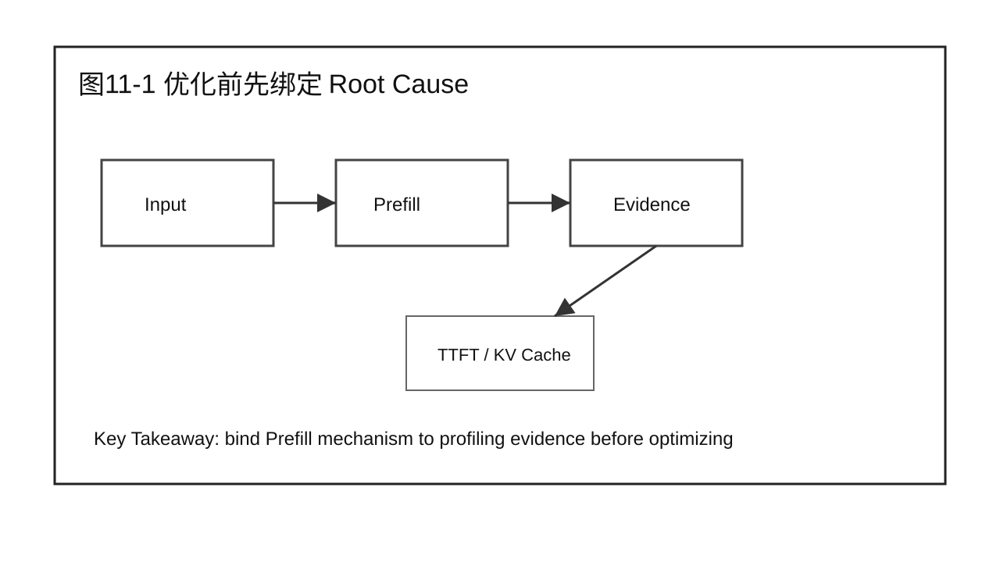
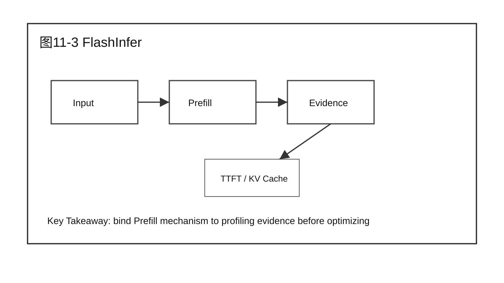
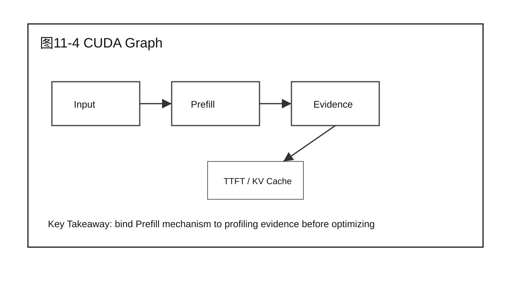
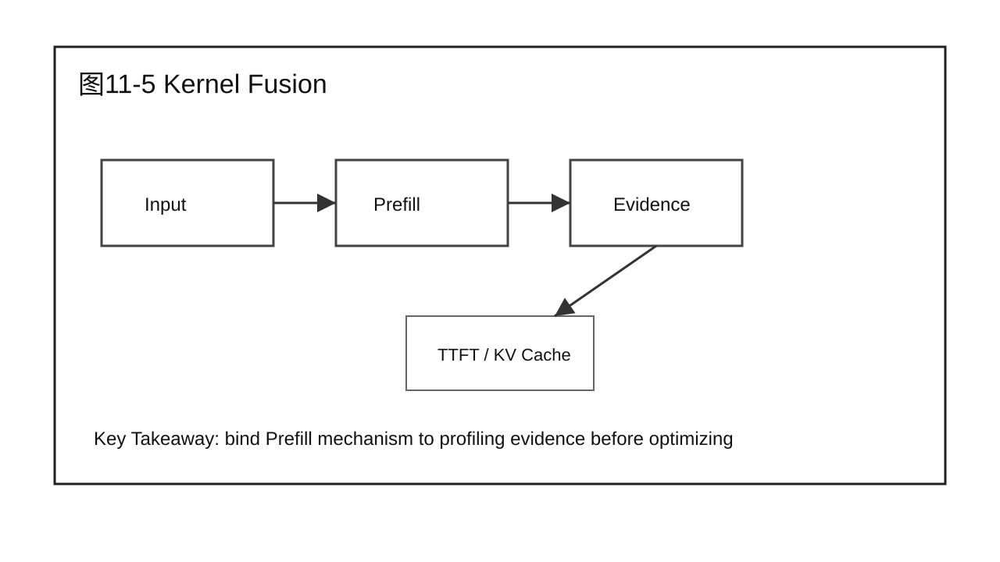
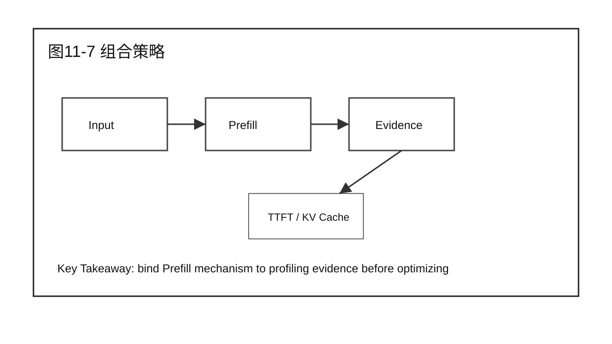
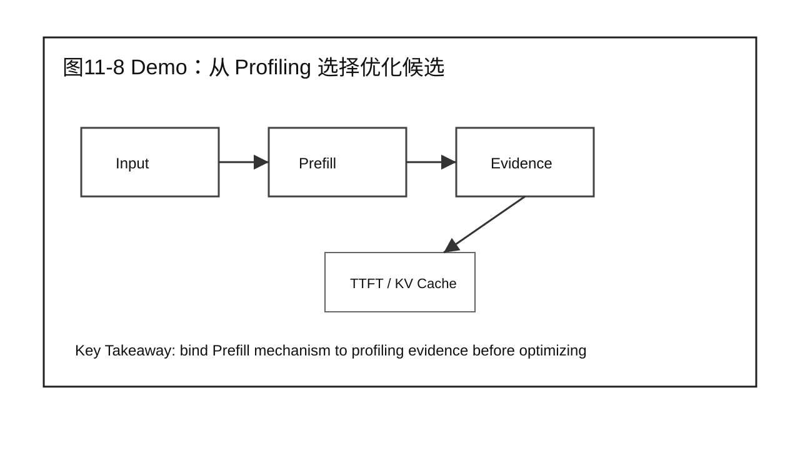
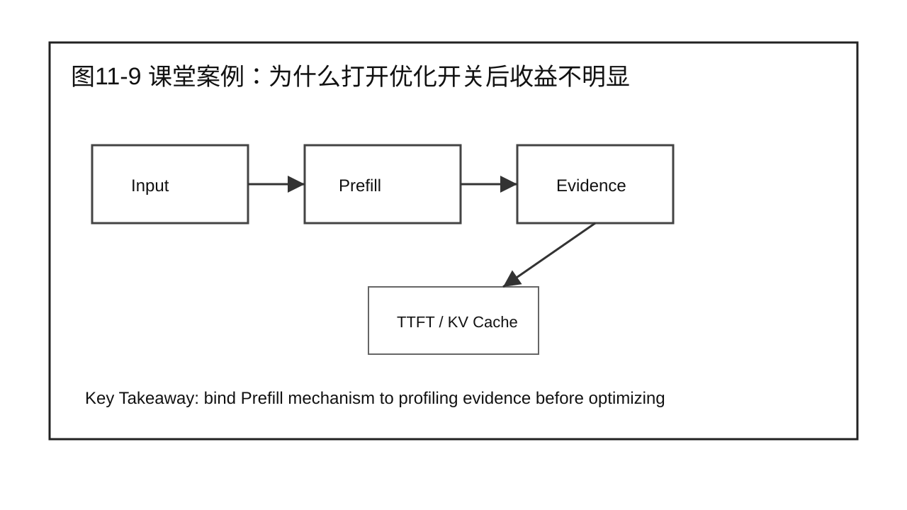

# 第 11 章 Prefill 优化方法

## 学习目标

学完本章后，你应该能够：

- 回答本章核心问题：面对已经定位的 Prefill 瓶颈，应该选择哪些优化方法？
- 说明本章内容在 Prefill Optimization 中的位置。
- 把 Part 1 的系统视图和 Part 2 的证据链应用到 Prefill 场景。
- 区分机制、瓶颈、优化方案和验证结论。
- 用案例、Demo 和 Checklist 支撑 20 分钟以上课堂讲授。

本章属于 Part 3 Prefill Optimization。写作边界是围绕 Prefill 展开，不提前进入 Decode、Serving 或 Scalability 的完整优化结论。

## 核心问题

本章围绕四个问题展开：

1. 面对已经定位的 Prefill 瓶颈，应该选择哪些优化方法？
2. 它和 Part 1 的请求生命周期、指标和全局性能模型如何连接？
3. 它如何使用 Part 2 的 Benchmark、Profiling、Root Cause 和 Diagnosis 方法？
4. 本章结束后，读者应该产出什么工程化判断或报告？



图11-1：优化前先绑定 Root Cause。

## 11.1 优化前先绑定 Root Cause

第 11 章不把技术列成菜单。每项技术必须回答：它解决哪类 Prefill 瓶颈，Profiling 上有什么特征，Benchmark 如何证明收益，Trade-off 是什么。

从前两篇的角度看，本章不是孤立技术点。Part 1 给出系统位置，Part 2 给出证据方法，本篇开始把二者落到 Prefill 这个具体阶段。


图11-2：优化前先绑定 Root Cause。

## 11.2 FlashAttention

FlashAttention 主要改进 attention 的数据访问方式，减少 HBM 读写和中间矩阵 materialization。它适合 attention 访存开销明显、长 prompt 或较大 batch 下 attention 成本突出的场景。

分析时要同时问三件事：输入是什么，输出是什么，证据在哪里。只讲原理而没有输入输出边界，后续就无法做 Benchmark 和 Profiling。



图11-3：FlashAttention。

## 11.3 FlashInfer

FlashInfer 提供面向推理的高性能 kernel 和 serving 友好接口。Prefill 场景中，它的价值在于把 attention、sampling 或相关 kernel 路径做成更适合推理 workload 的实现。

分析时要同时问三件事：输入是什么，输出是什么，证据在哪里。只讲原理而没有输入输出边界，后续就无法做 Benchmark 和 Profiling。



图11-4：FlashInfer。

## 11.4 CUDA Graph

CUDA Graph 通过捕获和重放固定执行图，减少 kernel launch 和 CPU 调度开销。它适合 shape 较稳定、launch overhead 明显的路径，但对动态 shape 和复杂调度有约束。

分析时要同时问三件事：输入是什么，输出是什么，证据在哪里。只讲原理而没有输入输出边界，后续就无法做 Benchmark 和 Profiling。



图11-5：CUDA Graph。

## 11.5 Kernel Fusion

Kernel Fusion 把多个小算子合并，减少中间读写和 kernel launch。Prefill 中如果 timeline 显示大量短 kernel 和空洞，fusion 可能比单独优化某个大 kernel 更有效。

分析时要同时问三件事：输入是什么，输出是什么，证据在哪里。只讲原理而没有输入输出边界，后续就无法做 Benchmark 和 Profiling。


图11-6：Kernel Fusion。

## 11.6 Persistent Kernel

Persistent Kernel 让线程块长期驻留，以减少调度开销并改善数据复用。它更依赖硬件、kernel 实现和 workload 形态，不是所有模型和框架都直接适用。

分析时要同时问三件事：输入是什么，输出是什么，证据在哪里。只讲原理而没有输入输出边界，后续就无法做 Benchmark 和 Profiling。



图11-7：Persistent Kernel。

## 11.7 组合策略

优化技术常常组合出现，但组合不是越多越好。FlashAttention 可能改善 attention，CUDA Graph 改善 launch，fusion 改善小算子路径，组合前要确认瓶颈不是 queue 或 workload。

分析时要同时问三件事：输入是什么，输出是什么，证据在哪里。只讲原理而没有输入输出边界，后续就无法做 Benchmark 和 Profiling。



图11-8：组合策略。

## 11.8 Demo：从 Profiling 选择优化候选

本章 Demo 给出三份 profile：attention memory-heavy、launch gap-heavy、small-kernel-heavy。学员需要选择候选技术，并写出验证计划。

Demo 使用固定 workload 或模拟数据时，必须明确边界。它服务于方法演示，不替代真实硬件环境下的性能结论。


## 11.9 课堂案例：为什么打开优化开关后收益不明显

团队启用了 FlashAttention，但 TTFT 只下降 3%。后来发现主要瓶颈是 CPU 预处理和 batch 等待。课堂讨论要强调优化技术必须和 root cause 对齐。

课堂讨论：

1. 这个案例最容易被误判成哪个问题？
2. 需要哪些 Benchmark 或 Profiling 证据才能进入下一步？
3. 哪些结论只适用于 Prefill，不应该推广到 Decode？

### 补充案例 A：短 prompt 聊天服务

如果服务主要处理 128-256 tokens 的短 prompt，Prefill 可能不是主要瓶颈。此时盲目优化 Prefill kernel，收益可能不如优化队列、Decode 或网络返回。讨论重点是：同一技术在不同 workload 下收益不同。

### 补充案例 B：长文档总结服务

如果服务主要处理 4K-16K tokens 的长文档总结，Prefill 往往占据首包前主要时间。此时 prompt 长度分布、attention 实现和 batch token 预算会直接影响 TTFT。讨论重点是：长 prompt 场景下要优先建立 Prefill 证据链。

### 贯穿案例：企业问答服务进入 Prefill 优化

Part 2 中的企业问答服务已经建立了 Baseline、Profiling 证据和 Diagnosis 表。进入 Part 3 后，我们只处理其中“长 prompt 导致 TTFT 升高”的分支：

```text
现象：P95 TTFT 升高，TPOT 基本稳定。
证据：长 prompt 占比上升，Prefill time 上升，Decode loop 无明显异常。
候选方向：Prefill attention / GEMM / KV Cache 创建 / batch token 预算。
本篇任务：理解机制，定位瓶颈，选择优化，验证 TTFT 收益。
```



图11-9：课堂案例：为什么打开优化开关后收益不明显。

## 11.10 常见误区

误区一：看到 TTFT 高就直接认为 Prefill kernel 慢。

TTFT 包含 Gateway、Queue、Prefill、first token 返回等多个部分。只有 Part 2 的证据已经指向 Prefill，才进入本篇的优化路径。

误区二：把某项优化技术当成默认开关。

优化技术必须绑定 root cause。FlashAttention、CUDA Graph、Kernel Fusion 等技术解决的问题不同，适用条件和副作用也不同。

误区三：只报告收益，不报告边界。

Prefill 优化可能只在长 prompt、特定 batch shape、特定 GPU 或特定框架版本下有效。报告必须写清楚边界。


图11-10：Prefill 优化方法 的章节边界。

## 11.11 技术选择矩阵

| Profiling 特征 | 优先候选 | 验证指标 | 主要 Trade-off |
|---|---|---|---|
| Attention 访存开销高 | FlashAttention / FlashInfer | TTFT、HBM、attention kernel time | 框架兼容性、shape 支持 |
| kernel launch 间隔明显 | CUDA Graph | CPU launch overhead、timeline gap | 动态 shape 限制 |
| 多个短 kernel 和中间读写 | Kernel Fusion | kernel 数量、memory traffic | 调试复杂度 |
| 调度和数据复用问题 | Persistent Kernel | occupancy、stall、timeline | 硬件和实现依赖强 |

这张矩阵不能替代 Benchmark。它只负责把候选优化缩小到 1-2 个方向，真正是否采用还要由第 12 章的实验验证决定。

## 本章总结

本章回答了“面对已经定位的 Prefill 瓶颈，应该选择哪些优化方法？”这个问题。它把前两篇建立的系统视图和分析方法带入 Prefill 场景，强调先明确机制和证据，再进入优化或验证。

本章的关键不是记住某个名词，而是能把 Prefill 问题写成可执行工程判断：输入是什么，瓶颈在哪里，证据是什么，下一步如何验证。

### 本章 Checklist

- [ ] 能说明本章内容在 Prefill 阶段的位置。
- [ ] 能把 TTFT 问题和 Prefill 证据区分开。
- [ ] 能写出本章对应的输入、输出和关键观测指标。
- [ ] 能给出一个不越界的课堂案例或 Demo。
- [ ] 能说明本章和下一章的衔接。

## 课后练习

1. 选择一个长 prompt 请求，画出它在 Prefill 阶段的输入、执行路径和输出。
2. 用 Part 2 的证据链格式，写出一个 Prefill 瓶颈候选假设。
3. 为本章课堂案例补充一组你认为必要的 Benchmark 指标。
4. 说明一个 Prefill 优化不适用于短 prompt 场景的原因。
5. 写一段 200 字以内的工程报告摘要，要求包含现象、证据、候选方向和验证动作。
