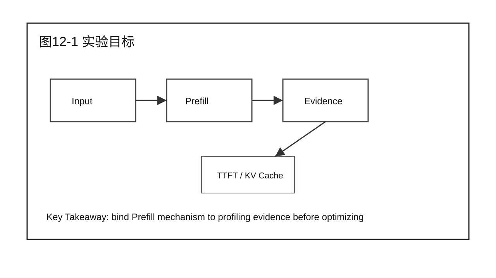
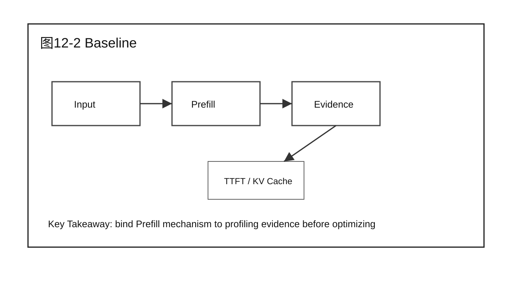
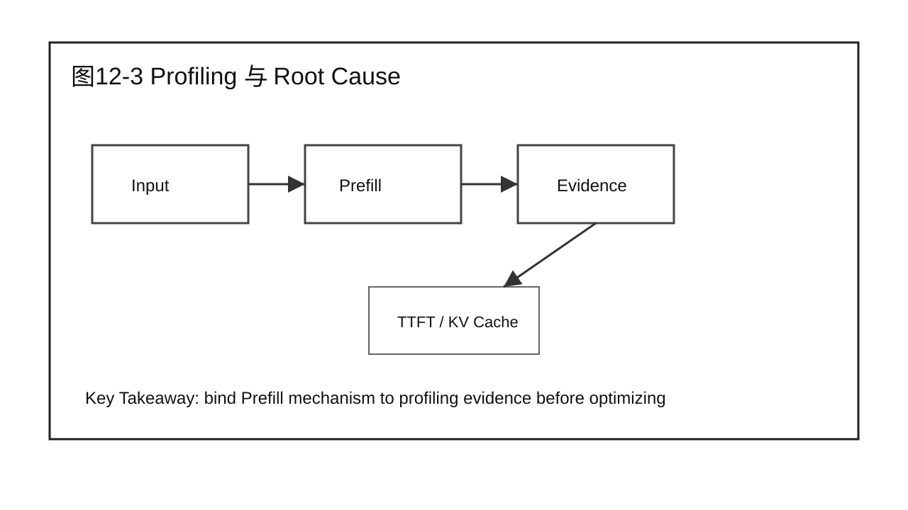
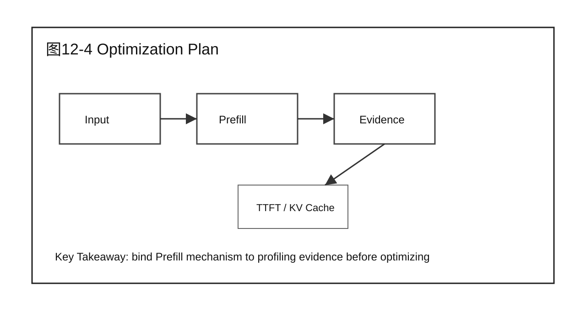
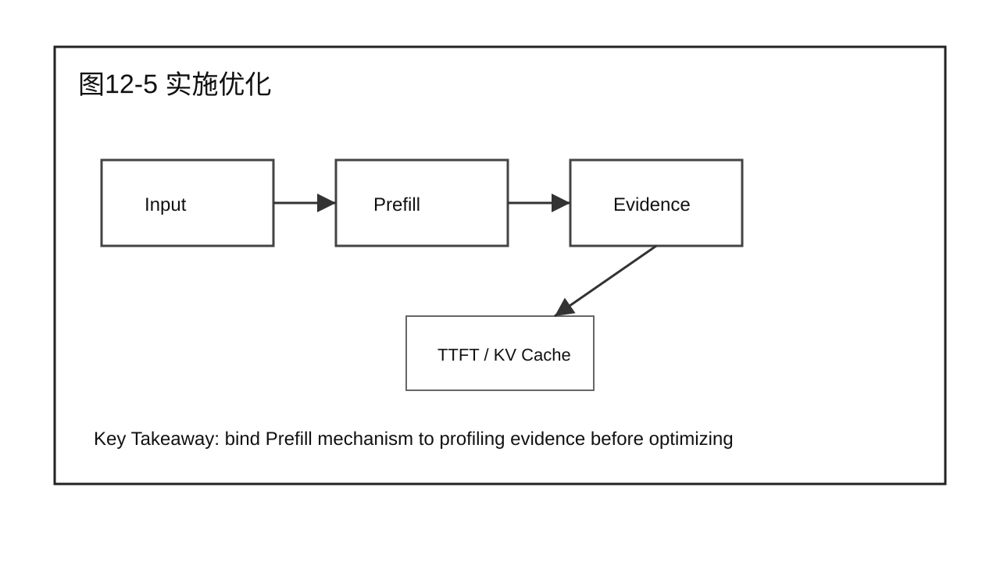
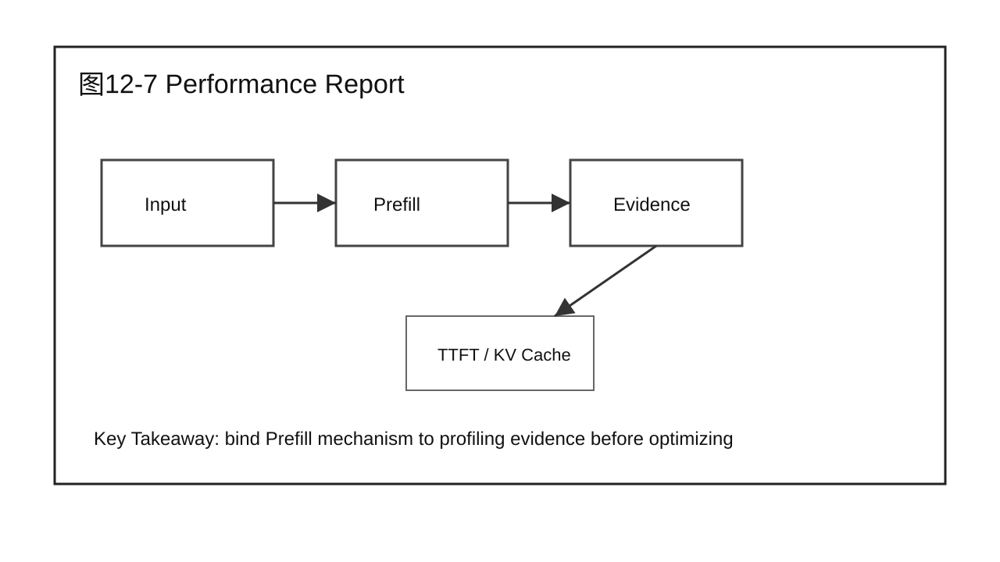
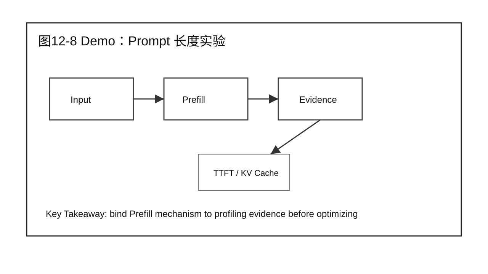
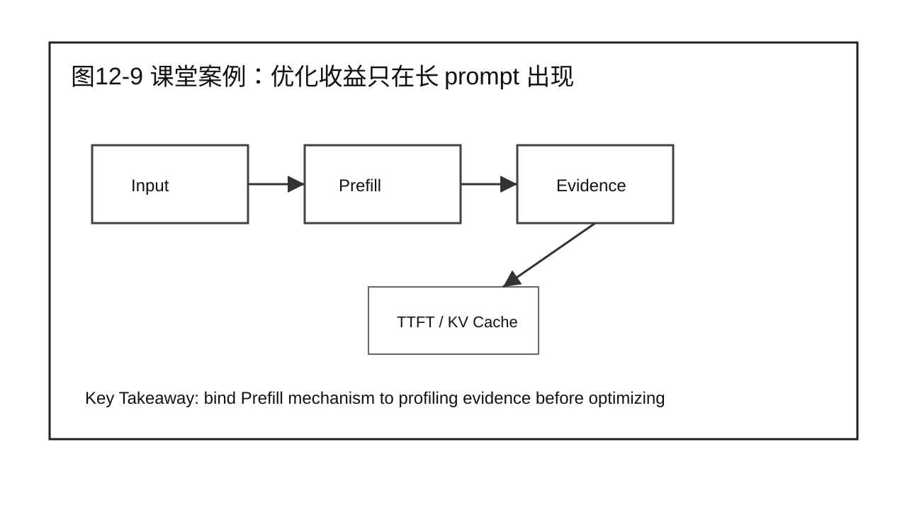

# 第 12 章 Prefill 实战验证

## 学习目标

学完本章后，你应该能够：

- 回答本章核心问题：如何证明 Prefill 优化真的降低了 TTFT？
- 说明本章内容在 Prefill Optimization 中的位置。
- 把 Part 1 的系统视图和 Part 2 的证据链应用到 Prefill 场景。
- 区分机制、瓶颈、优化方案和验证结论。
- 用案例、Demo 和 Checklist 支撑 20 分钟以上课堂讲授。

本章属于 Part 3 Prefill Optimization。写作边界是围绕 Prefill 展开，不提前进入 Decode、Serving 或 Scalability 的完整优化结论。

## 核心问题

本章围绕四个问题展开：

1. 如何证明 Prefill 优化真的降低了 TTFT？
2. 它和 Part 1 的请求生命周期、指标和全局性能模型如何连接？
3. 它如何使用 Part 2 的 Benchmark、Profiling、Root Cause 和 Diagnosis 方法？
4. 本章结束后，读者应该产出什么工程化判断或报告？



图12-1：实验目标。

## 12.1 实验目标

实战验证从目标开始：降低长 prompt 场景下的 TTFT，同时不显著牺牲 TPS、显存稳定性和尾延迟。目标必须写成可度量指标，而不是“优化 Prefill”。

从前两篇的角度看，本章不是孤立技术点。Part 1 给出系统位置，Part 2 给出证据方法，本篇开始把二者落到 Prefill 这个具体阶段。



图12-2：实验目标。

## 12.2 Baseline

Baseline 记录优化前配置、模型、硬件、框架版本、prompt/output 分布、并发梯度、TTFT、TPOT、TPS、GPU Utilization 和显存。没有 Baseline，收益无从判断。

分析时要同时问三件事：输入是什么，输出是什么，证据在哪里。只讲原理而没有输入输出边界，后续就无法做 Benchmark 和 Profiling。



图12-3：Baseline。

## 12.3 Profiling 与 Root Cause

根据第 10 章方法确认瓶颈：是 attention 访存、Tensor Core 利用不足、kernel launch、batch 混合，还是 CPU 和 queue。只有确认 root cause，优化方案才有意义。

分析时要同时问三件事：输入是什么，输出是什么，证据在哪里。只讲原理而没有输入输出边界，后续就无法做 Benchmark 和 Profiling。



图12-4：Profiling 与 Root Cause。

## 12.4 Optimization Plan

根据 root cause 选择方案。比如 attention 访存问题选择 FlashAttention，launch overhead 选择 CUDA Graph，小 kernel 空洞选择 fusion，batch 混合问题则可能不属于 Prefill kernel 优化。

分析时要同时问三件事：输入是什么，输出是什么，证据在哪里。只讲原理而没有输入输出边界，后续就无法做 Benchmark 和 Profiling。



图12-5：Optimization Plan。

## 12.5 实施优化

实施时每次只改变一个主要变量，记录配置、开关、版本和 fallback。不要同时打开多个开关后再声明整体收益。

分析时要同时问三件事：输入是什么，输出是什么，证据在哪里。只讲原理而没有输入输出边界，后续就无法做 Benchmark 和 Profiling。


图12-6：实施优化。

## 12.6 Benchmark Verification

验证使用 prompt 长度阶梯：短 prompt、中等 prompt、长 prompt。观察 TTFT、TPOT、TPS、P95/P99、GPU Utilization 和 memory。收益必须和 workload 条件绑定。

分析时要同时问三件事：输入是什么，输出是什么，证据在哪里。只讲原理而没有输入输出边界，后续就无法做 Benchmark 和 Profiling。



图12-7：Benchmark Verification。

## 12.7 Performance Report

报告要说明优化前后对比、收益条件、无收益条件、风险和上线建议。尤其要说明是否只改善长 prompt，是否影响短 prompt 和吞吐。

分析时要同时问三件事：输入是什么，输出是什么，证据在哪里。只讲原理而没有输入输出边界，后续就无法做 Benchmark 和 Profiling。



图12-8：Performance Report。

## 12.8 Demo：Prompt 长度实验

本章 Demo 使用模拟数据或最小 benchmark 表，展示如何从 Baseline 到 Optimization Report。它不替代真实硬件验证。

Demo 使用固定 workload 或模拟数据时，必须明确边界。它服务于方法演示，不替代真实硬件环境下的性能结论。


## 12.9 课堂案例：优化收益只在长 prompt 出现

企业问答服务启用 Prefill 优化后，2500 tokens prompt 的 P95 TTFT 下降明显，但 256 tokens prompt 几乎不变。课堂讨论要解释这不是失败，而是收益边界。

课堂讨论：

1. 这个案例最容易被误判成哪个问题？
2. 需要哪些 Benchmark 或 Profiling 证据才能进入下一步？
3. 哪些结论只适用于 Prefill，不应该推广到 Decode？

### 补充案例 A：短 prompt 聊天服务

如果服务主要处理 128-256 tokens 的短 prompt，Prefill 可能不是主要瓶颈。此时盲目优化 Prefill kernel，收益可能不如优化队列、Decode 或网络返回。讨论重点是：同一技术在不同 workload 下收益不同。

### 补充案例 B：长文档总结服务

如果服务主要处理 4K-16K tokens 的长文档总结，Prefill 往往占据首包前主要时间。此时 prompt 长度分布、attention 实现和 batch token 预算会直接影响 TTFT。讨论重点是：长 prompt 场景下要优先建立 Prefill 证据链。

### 贯穿案例：企业问答服务进入 Prefill 优化

Part 2 中的企业问答服务已经建立了 Baseline、Profiling 证据和 Diagnosis 表。进入 Part 3 后，我们只处理其中“长 prompt 导致 TTFT 升高”的分支：

```text
现象：P95 TTFT 升高，TPOT 基本稳定。
证据：长 prompt 占比上升，Prefill time 上升，Decode loop 无明显异常。
候选方向：Prefill attention / GEMM / KV Cache 创建 / batch token 预算。
本篇任务：理解机制，定位瓶颈，选择优化，验证 TTFT 收益。
```



图12-9：课堂案例：优化收益只在长 prompt 出现。

## 12.10 常见误区

误区一：看到 TTFT 高就直接认为 Prefill kernel 慢。

TTFT 包含 Gateway、Queue、Prefill、first token 返回等多个部分。只有 Part 2 的证据已经指向 Prefill，才进入本篇的优化路径。

误区二：把某项优化技术当成默认开关。

优化技术必须绑定 root cause。FlashAttention、CUDA Graph、Kernel Fusion 等技术解决的问题不同，适用条件和副作用也不同。

误区三：只报告收益，不报告边界。

Prefill 优化可能只在长 prompt、特定 batch shape、特定 GPU 或特定框架版本下有效。报告必须写清楚边界。


图12-10：Prefill 实战验证 的章节边界。

## 12.11 Prefill Performance Report 模板

| 字段 | 内容 |
|---|---|
| 目标 | 降低哪类 workload 的 TTFT，约束哪些指标不能恶化 |
| Baseline | 优化前配置、指标、prompt/output 分布和重复性 |
| Root Cause | Profiling 如何证明瓶颈在 Prefill |
| 方案 | 采用哪项优化，改了哪些配置或实现 |
| 结果 | TTFT、TPOT、TPS、P95/P99、GPU Util、Memory 前后对比 |
| Trade-off | 哪些场景无收益，哪些指标可能变差 |
| 上线建议 | 是否灰度、如何回滚、监控哪些指标 |

报告的最后一句应该写边界，而不是口号。例如：本优化主要改善 2K tokens 以上 prompt 的 TTFT，对 256 tokens 以下短问答收益不明显。

## 本章总结

本章回答了“如何证明 Prefill 优化真的降低了 TTFT？”这个问题。它把前两篇建立的系统视图和分析方法带入 Prefill 场景，强调先明确机制和证据，再进入优化或验证。

本章的关键不是记住某个名词，而是能把 Prefill 问题写成可执行工程判断：输入是什么，瓶颈在哪里，证据是什么，下一步如何验证。

### 本章 Checklist

- [ ] 能说明本章内容在 Prefill 阶段的位置。
- [ ] 能把 TTFT 问题和 Prefill 证据区分开。
- [ ] 能写出本章对应的输入、输出和关键观测指标。
- [ ] 能给出一个不越界的课堂案例或 Demo。
- [ ] 能说明本章和下一章的衔接。

## 课后练习

1. 选择一个长 prompt 请求，画出它在 Prefill 阶段的输入、执行路径和输出。
2. 用 Part 2 的证据链格式，写出一个 Prefill 瓶颈候选假设。
3. 为本章课堂案例补充一组你认为必要的 Benchmark 指标。
4. 说明一个 Prefill 优化不适用于短 prompt 场景的原因。
5. 写一段 200 字以内的工程报告摘要，要求包含现象、证据、候选方向和验证动作。
