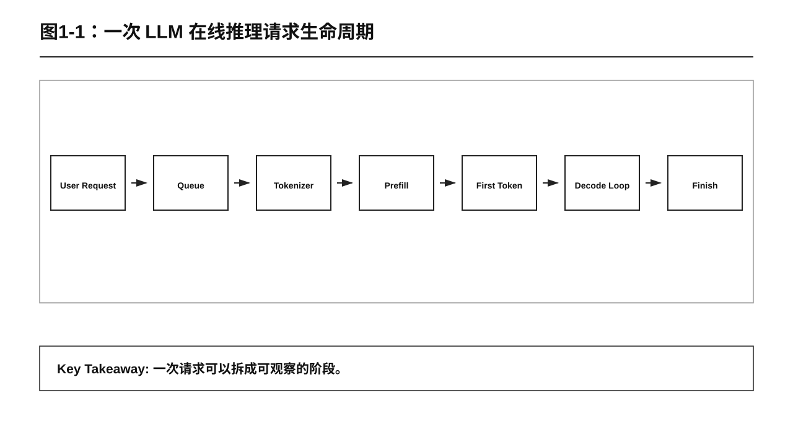
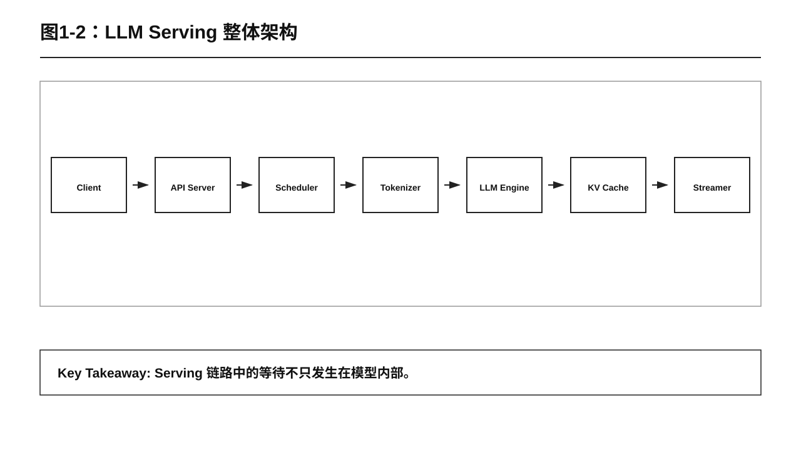
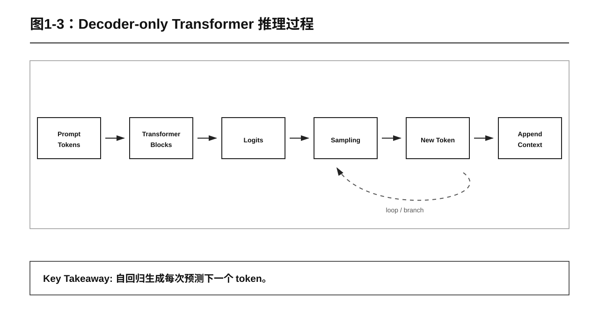
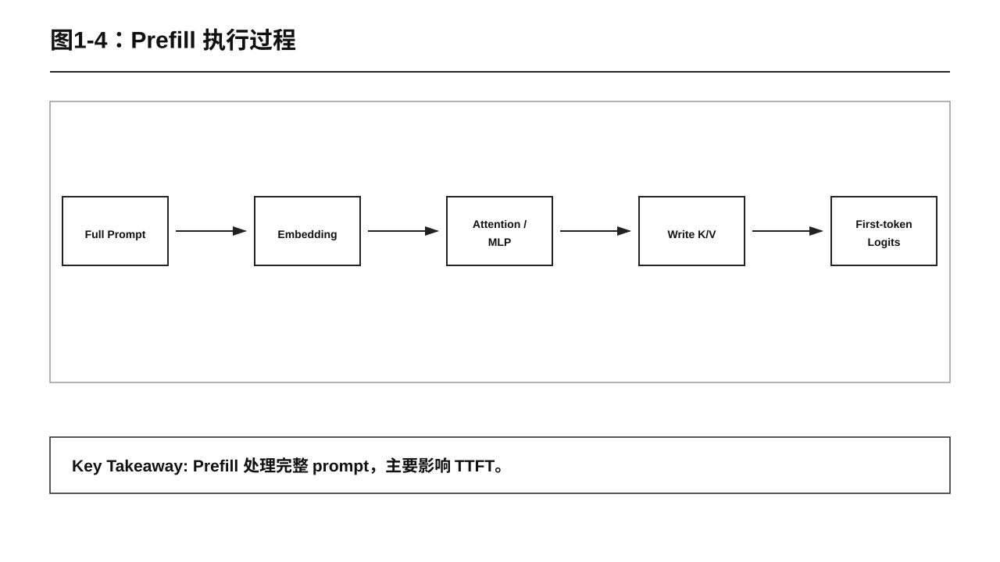
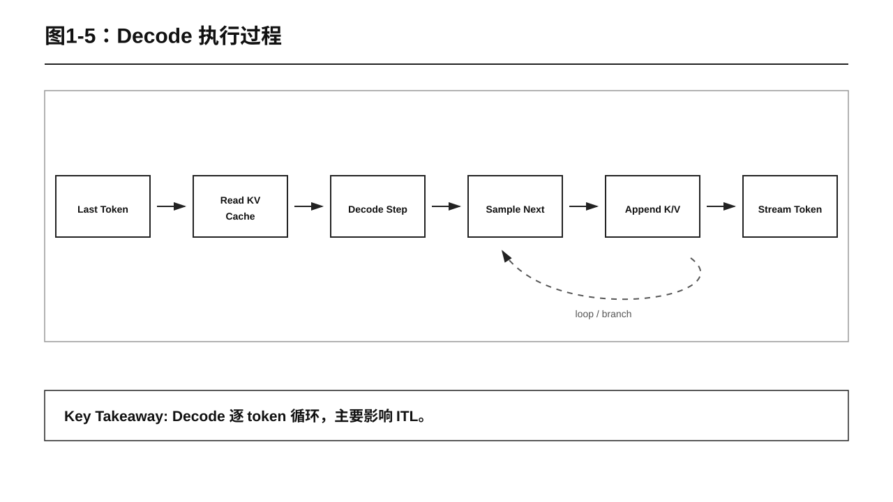
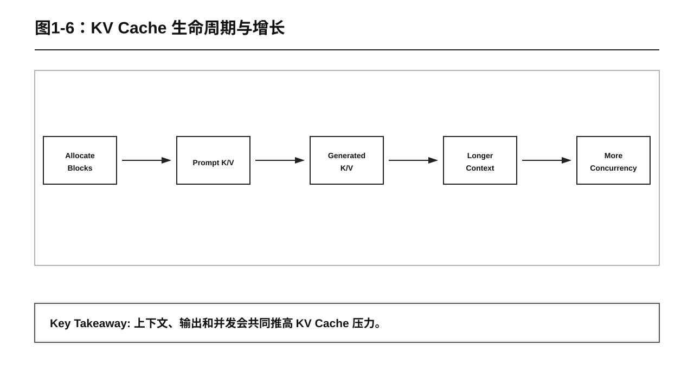
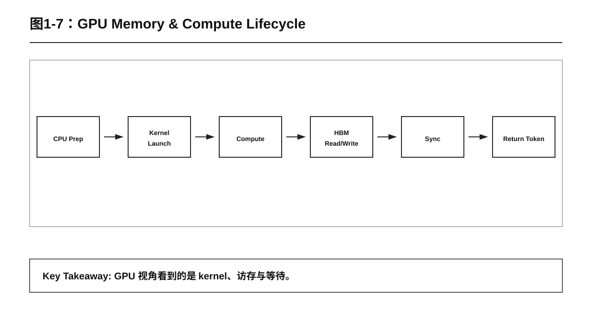
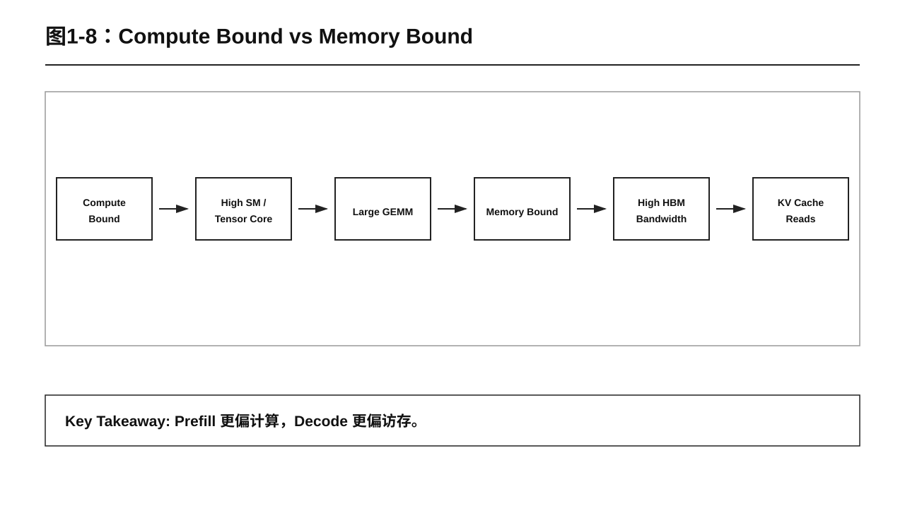
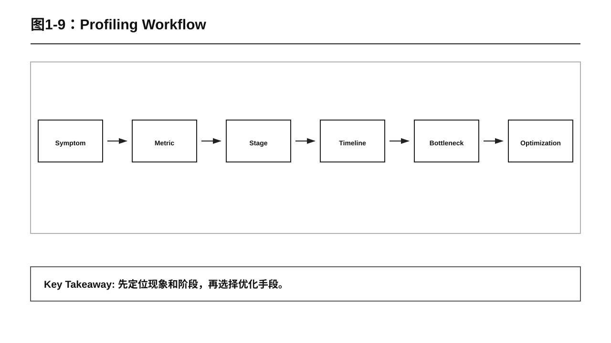
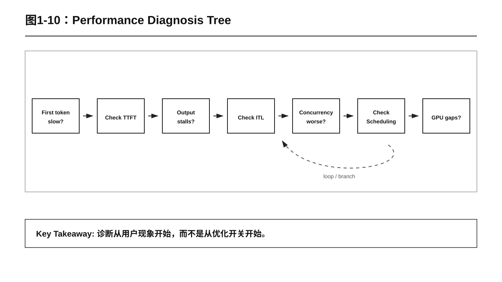

# 第 1 章 LLM 推理流程

## 本章导读

学习 LLM 推理性能优化，第一步不是调参数，也不是先追求最高 tokens/s，而是先弄清楚一件事：一次请求从用户输入 prompt，到模型返回第一个 token，再到完整回答结束，中间到底发生了什么。

本章围绕“LLM 推理流程”建立一张基础地图。后面讨论 TTFT、ITL、KV Cache、Profiling、FlashAttention、PagedAttention、Batching、Speculative Decoding 时，都会回到这张地图上定位问题。

读完本章，你应该能够回答五个问题：

- 一次 LLM 请求会经过哪些阶段？
- Prefill 和 Decode 分别做什么？
- 为什么首 token 慢和输出卡顿不是同一个问题？
- KV Cache 为什么是推理性能里的关键对象？
- 看到一个性能现象时，应该先观察哪些指标？

可以先把一次请求想成下面这条链路：

```text
用户请求
  -> 排队与调度
  -> Tokenizer
  -> Prefill：处理完整 Prompt
  -> 采样第一个 token
  -> 流式返回首 token
  -> Decode：逐 token 生成
  -> 满足停止条件
  -> 释放或复用 KV Cache
```

这条链路就是第一章的主线。



图1-1：一次 LLM 在线推理请求生命周期。

## 1.1 从“用户觉得慢”开始

推理系统面对的是在线请求。用户不会关心 GPU kernel 是否漂亮，也不会先问显存利用率是否合理。用户最直接的感受通常只有两种：

- 等了很久才看到第一个字。
- 已经开始输出了，但后续一顿一顿。

这两种慢，背后的原因可能完全不同。

如果第一个 token 很慢，问题通常要从 TTFT 开始看。TTFT 是 Time To First Token，表示从请求发出到第一个生成 token 返回之间的时间。它可能受到排队、tokenization、prefill、首 token 采样、网络返回等多个环节影响。

如果第一个 token 很快，但后续输出不稳定，就要看 ITL。ITL 是 Inter-Token Latency，表示相邻两个输出 token 之间的时间间隔。它更接近用户看到模型“打字速度”的体验。

所以，推理性能不能只看一个平均 tokens/s。一个服务可能吞吐很高，但首 token 很慢；也可能首 token 很快，但并发一上来 P95、P99 延迟明显变差。

本课程后续会反复使用这个分析顺序：

```text
先描述现象
  -> 再定位阶段
  -> 再选择指标
  -> 再判断瓶颈
  -> 最后选择优化手段
```

第一章要解决的就是“定位阶段”这件事：先把一次请求拆成 Prefill、Decode、KV Cache、调度和返回链路，再说明每个阶段应该优先观察哪些指标。指标本身会在后续章节展开，本章只先建立它们和请求阶段之间的对应关系。



图1-2：LLM Serving 整体架构。

## 1.2 一次请求的完整生命周期

一次典型的 LLM 在线推理请求，可以拆成八个阶段。

第一，用户发送 prompt。这个 prompt 可能是一句话，也可能是一段长文档、一个代码文件、一次多轮对话历史。

第二，请求进入推理服务。服务可能会做鉴权、限流、排队、调度，也可能会把多个请求合并成 batch。

第三，Tokenizer 把文本转换成 token ids。模型不能直接处理自然语言文本，它处理的是 token 序列。

第四，模型进入 Prefill 阶段。Prefill 会处理完整 prompt，计算每一层 Transformer 的中间结果，并建立后续生成要用的 KV Cache。

第五，模型得到第一个输出 token 的 logits，采样器根据 temperature、top-p、top-k 等参数选出第一个 token。

第六，服务把第一个 token 流式返回给用户。用户感受到的“终于开始回答了”，就发生在这里。

第七，模型进入 Decode 阶段。Decode 每次基于上一个 token 和历史 KV Cache 继续生成下一个 token。这个过程会循环很多次。

第八，请求满足停止条件后结束。停止条件可能是 EOS、stop words、达到 max tokens，或者客户端主动断开。请求结束后，KV Cache 会被释放，也可能因为前缀复用而被保留。

用一条更紧凑的链路表示：

```text
Prompt
  -> Token IDs
  -> Prefill
  -> First Token
  -> Decode Loop
  -> Final Response
```

其中最重要的分界线，是 Prefill 和 Decode。



图1-3：Decoder-only Transformer 推理过程。

## 1.3 Decoder-only Transformer 如何生成 token

当前主流大语言模型大多是 decoder-only Transformer。它的生成方式是自回归的：每次预测下一个 token，再把这个新 token 接到上下文后面，继续预测再下一个 token。

一个简化过程如下：

```text
prompt tokens
  -> 模型计算
  -> 预测 token_1
  -> 把 token_1 加入上下文
  -> 预测 token_2
  -> 把 token_2 加入上下文
  -> ...
  -> 遇到停止条件
```

这个机制决定了推理性能的两个基本事实。

第一，输出越长，Decode 次数越多。生成 20 个 token，大约要经历 20 次 decode；生成 2000 个 token，就要经历大约 2000 次 decode。输出长度会直接影响总响应时间。

第二，历史上下文会被反复使用。如果每生成一个新 token，都重新计算完整 prompt 和所有历史输出，成本会非常高。KV Cache 的作用，就是把历史 token 在 attention 中的 Key 和 Value 缓存起来，让后续 decode 可以复用。

因此，理解 LLM 推理，不能只看模型结构，还要看生成过程中的状态复用。

## 1.4 Prefill：处理完整 Prompt

Prefill 是从模型开始处理输入，到第一个输出 token 生成之前的阶段。它的输入是完整 prompt。

在 Prefill 阶段，模型会把 prompt 中所有 token 一次性送入 Transformer。每一层都会执行 attention、MLP、残差连接和归一化。与此同时，模型会为这些历史 token 计算并写入 KV Cache。

Prefill 的主要工作包括：

- 处理完整 prompt token 序列。
- 计算每一层 attention 中的 Q、K、V。
- 执行大规模矩阵计算。
- 为后续 Decode 写入 KV Cache。
- 得到用于采样第一个输出 token 的 logits。

Prefill 通常强影响 TTFT。prompt 越长，Prefill 处理的 token 越多，第一个 token 之前的等待就越可能变长。

当你看到“用户等了很久才看到第一个字，但后面输出还算顺滑”时，不要第一反应就去看 Decode。更合理的顺序是先检查：

- 请求是否在排队。
- tokenization 是否耗时明显。
- Prefill 是否处理了很长 prompt。
- GPU timeline 中 Prefill kernel 是否占据主要时间。
- 首 token 采样和流式返回是否有额外等待。

Prefill 常见瓶颈是 compute bound。意思是它更容易受计算能力限制，因为它处理的是一整段序列，矩阵乘规模较大，更容易把 GPU 的计算单元用起来。

但这不是铁律。工程上不能只靠口号判断瓶颈，必须用指标和 profiling 结果确认。



图1-4：Prefill 执行过程。

## 1.5 Decode：逐 token 生成

Decode 是第一个 token 之后的生成阶段。它的输入通常不是完整 prompt，而是“刚生成的 token + 历史 KV Cache”。

每一步 Decode 大致做三件事：

```text
读取历史 KV Cache
  -> 基于当前 token 做一次前向计算
  -> 采样下一个 token，并把新的 K/V 追加到 KV Cache
```

这个过程会一直循环，直到遇到停止条件。

Decode 的关键特点是：

- 每一步新增 token 很少，通常每个请求只新增 1 个 token。
- 每一步都要读取历史 KV Cache。
- 输出越长，循环次数越多。
- 单步计算粒度比 Prefill 小。
- 并发和 batching 策略会明显影响吞吐与延迟。

Decode 通常强影响 ITL。ITL 偏高时，用户会感觉模型输出很卡。

Decode 常见瓶颈是 memory bound。原因是每一步新增计算不多，但要不断读取历史 KV Cache。上下文越长，需要读取的历史状态越多，内存带宽压力越明显。

当你看到“第一个 token 很快，但后续输出一顿一顿”时，应优先检查：

- ITL 是否稳定。
- KV Cache 读取是否成为瓶颈。
- batch size 是否太小或太大。
- 请求长度差异是否导致调度效率下降。
- 采样、后处理或网络发送是否拖慢。



图1-5：Decode 执行过程。

## 1.6 KV Cache：连接 Prefill 与 Decode

KV Cache 是推理性能优化中的核心对象。它缓存的是 attention 里历史 token 的 Key 和 Value。

没有 KV Cache 时，每生成一个 token，都需要重新处理完整上下文。这样成本会随着上下文变长迅速上升。

有了 KV Cache 后，Prefill 先把 prompt 的 K/V 写入缓存；Decode 每一步读取历史 K/V，只为新 token 计算新的 K/V，并追加到缓存里。

KV Cache 的生命周期可以简化为：

```text
请求开始
  -> 分配 cache block
  -> Prefill 写入 prompt K/V
  -> Decode 读取历史 K/V
  -> Decode 追加新 token K/V
  -> 请求结束
  -> 释放、复用或保留为 prefix cache
```



图1-6：KV Cache 生命周期与增长。

KV Cache 的显存占用主要受这些因素影响：

- 模型层数。
- hidden size。
- attention heads 和 KV heads。
- dtype，例如 FP16、FP8、INT8。
- prompt length。
- generated tokens。
- batch size 和并发请求数。

可以用一个直觉公式理解：

```text
KV Cache 显存 ~= 层数 x token 数 x KV hidden 维度 x 2(K 和 V) x dtype bytes
```

这个公式不是生产系统里的精确内存模型，但足够帮助我们建立方向感：上下文越长、输出越长、并发越高，KV Cache 越容易成为显存容量和内存带宽压力的来源。

后续课程中的 PagedAttention、Prefix Cache、KV Quantization，本质上都围绕 KV Cache 展开。



图1-7：GPU Memory & Compute Lifecycle。

## 1.7 三个核心指标：TTFT、ITL、TPS

第一章先掌握三个指标就够了。

TTFT 是 Time To First Token。它回答的问题是：用户要等多久才能看到第一个输出 token？

TTFT 主要对应首 token 体验，常用于观察 Prefill、排队、tokenization 和首包链路。

ITL 是 Inter-Token Latency。它回答的问题是：两个相邻输出 token 之间隔了多久？

ITL 主要对应流式输出是否顺滑，常用于观察 Decode、KV Cache、调度、采样和网络发送。

TPS 是 Tokens Per Second。它回答的问题是：系统单位时间内能生成多少 token？

TPS 主要对应吞吐，但不能单独代表用户体验。更大的 batch 可能提升 TPS，也可能让单个请求等待更久。

三者可以这样对应：

| 指标 | 关注问题 | 常见关联阶段 |
|---|---|---|
| TTFT | 第一个 token 等多久 | 排队、Tokenizer、Prefill、首包返回 |
| ITL | 输出是否顺滑 | Decode、KV Cache、调度、采样 |
| TPS | 总吞吐有多高 | Batch、并发、调度、GPU 利用率 |

优化前先确认目标。如果目标是交互式聊天，TTFT 和 ITL 很重要；如果目标是离线批处理，TPS 可能更重要。



图1-8：Compute Bound vs Memory Bound。

## 1.8 Compute Bound 与 Memory Bound

性能优化时，经常会听到两个词：compute bound 和 memory bound。

Compute bound 表示主要受计算能力限制。典型现象包括：

- SM 或 Tensor Core 利用率较高。
- HBM 带宽没有明显打满。
- 大规模矩阵计算占据主要时间。
- 更快的 attention、GEMM、算子融合可能有效。

Prefill 更容易表现为 compute bound，因为它一次处理完整 prompt，计算规模较大。

Memory bound 表示主要受数据读取和写入限制。典型现象包括：

- HBM 带宽压力高。
- SM 利用率可能不满。
- 上下文变长后 ITL 明显变差。
- KV Cache layout、PagedAttention、KV Quantization 可能有效。

Decode 更容易表现为 memory bound，因为它每一步新增计算少，却要反复读取历史 KV Cache。

真实系统还会有其他瓶颈，例如：

- Scheduling bound：调度策略导致请求等待或 GPU 空洞。
- Capacity bound：显存容量限制 batch size、上下文长度或并发数。
- CPU bound：tokenization、采样、后处理或网络栈拖慢。
- Synchronization bound：频繁同步打断 GPU pipeline。

所以，第一判断可以靠经验，但最终结论必须靠观测。



图1-9：Profiling Workflow。

## 1.9 本章实验：观察一次推理过程

本章实验只做一件事：用 vLLM 启动一个 OpenAI-compatible 服务，发送一次真实流式请求，观察请求从进入服务到持续返回 token 的过程。

系统性的 TTFT、ITL、TPS、P95/P99、GPU Utilization 等指标实验放到第 2 章。本章只把这些字段当作辅助观察结果，不展开 benchmark 结论。

本章配套代码位于：

```text
book/chapters/chapter01/demo/demo.py
```

### 1.9.1 启动 vLLM 服务

在 GX10 或云 GPU 环境中安装 vLLM 后，启动一个兼容 OpenAI API 的服务。模型下载和环境准备由读者或实验环境提前完成，本章只演示如何启动服务和发送请求。

默认模型为：

```text
Qwen/Qwen2.5-0.5B
```

如果模型已经在 Hugging Face cache 中，或当前环境可以直接解析该模型 id：

```bash
python3 book/chapters/chapter01/demo/start_vllm.py \
  --model Qwen/Qwen2.5-0.5B \
  --served-model-name Qwen/Qwen2.5-0.5B \
  --host 0.0.0.0 \
  --port 8000
```

如果模型已经在本地目录，例如 GX10 上的 `/home/admin/models/Qwen2.5-0.5B`：

```bash
python3 book/chapters/chapter01/demo/start_vllm.py \
  --model /home/admin/models/Qwen2.5-0.5B \
  --served-model-name Qwen/Qwen2.5-0.5B \
  --host 0.0.0.0 \
  --port 8000
```

云环境部署时，只要能访问 vLLM 的 `/v1/chat/completions` 接口即可。模型路径、显存配置、tensor parallel size 等参数根据实际机器调整。

### 1.9.2 发送一次流式请求

从课程根目录运行：

```bash
python3 book/chapters/chapter01/demo/demo.py \
  --base-url http://127.0.0.1:8000/v1 \
  --model Qwen/Qwen2.5-0.5B \
  --prompt "请解释一次 LLM 在线推理请求从 Prompt 到完整回答的过程。" \
  --max-tokens 256 \
  --requests 1 \
  --concurrency 1
```

观察：

- 请求是否能成功进入 vLLM 服务。
- 是否先等待一段时间，然后开始收到第一个流式 chunk。
- 第一个 chunk 之后，后续 chunk 是否持续返回。
- 请求结束时，服务是否返回 token usage。
- 如果机器上有 `nvidia-smi`，脚本是否能采集请求前后的 GPU 快照。

这里不要求你解释指标优劣，只要把一次真实请求的生命周期跑通。下一章会专门讨论如何把这些观察变成 TTFT、ITL、TPS 等指标实验。



图1-10：Performance Diagnosis Tree。

## 1.10 常见误区

误区一：GPU 利用率越高越好。

GPU 利用率高只说明 GPU 忙，不说明用户体验好。在线推理还要同时看 TTFT、ITL、吞吐、P95/P99 延迟、错误率和资源成本。

误区二：吞吐提升就是优化成功。

吞吐提升可能来自更大的 batch，但更大的 batch 也可能增加排队和单请求延迟。交互式聊天和离线批处理的目标不同，不能用同一套标准判断。

误区三：所有慢都靠 FlashAttention 解决。

FlashAttention 主要改善 attention 相关计算和访存模式。如果瓶颈在调度、KV Cache 容量、CPU tokenization 或网络返回，它不会解决根因。

误区四：Prefill 和 Decode 可以用同一套直觉优化。

Prefill 更像大块计算，Decode 更像反复读取历史状态的小步循环。二者指标、瓶颈和优化策略都不同。

## 1.11 本章小结

本章建立了 LLM 推理流程的基础地图。

一次请求从用户 prompt 开始，经过排队、tokenization、Prefill、首 token 返回、Decode 循环，最后在停止条件满足后结束。Prefill 处理完整 prompt，通常强影响 TTFT；Decode 逐 token 生成，通常强影响 ITL 和总响应时间。

KV Cache 连接了 Prefill 和 Decode。Prefill 写入历史 K/V，Decode 反复读取并追加新的 K/V。随着上下文长度、输出长度和并发增加，KV Cache 会逐渐成为显存容量和内存带宽压力的重要来源。

后续章节的优化技术，都可以放回这张地图里理解：

- FlashAttention：优化 attention 计算和访存。
- CUDA Graph：降低重复执行路径的调度和 launch 开销。
- PagedAttention：管理 KV Cache 显存块。
- Prefix Cache：减少重复 Prefill。
- Dynamic Batching 和 Continuous Batching：提升调度效率。
- Speculative Decoding：减少目标模型 Decode 步数。

理解推理流程之后，性能优化就不再是盲目试参数，而是一个可观察、可定位、可验证的工程过程。

## 课后练习

1. 用自己的话画出一次 LLM 请求的生命周期。
2. 分别解释 Prefill 和 Decode 的输入、输出和主要开销。
3. 运行本章 demo 的三组实验，记录 TTFT、ITL、TPS 的变化。
4. 写一段 200 字以内的分析：哪个变量对 TTFT 影响最大，哪个变量对总响应时间影响最大。

## 自检清单

- [ ] 能说明一次请求从 prompt 到完整回答的流程。
- [ ] 能解释 Prefill 为什么影响 TTFT。
- [ ] 能解释 Decode 为什么影响 ITL。
- [ ] 能说明 KV Cache 的作用和生命周期。
- [ ] 能区分 TTFT、ITL、TPS。
- [ ] 能初步判断 compute bound 和 memory bound。
- [ ] 能根据 demo 输出写出一段性能分析结论。
