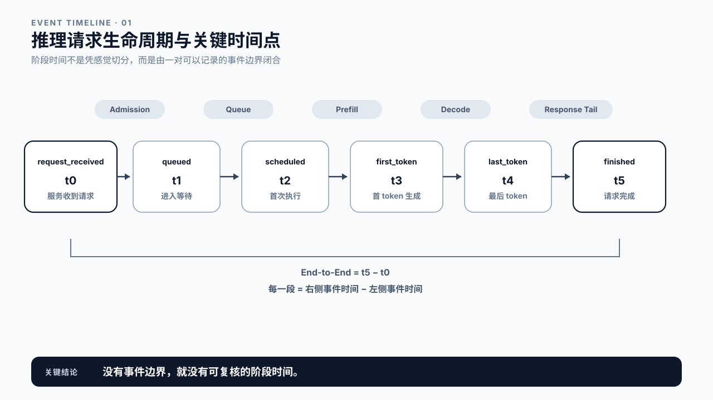
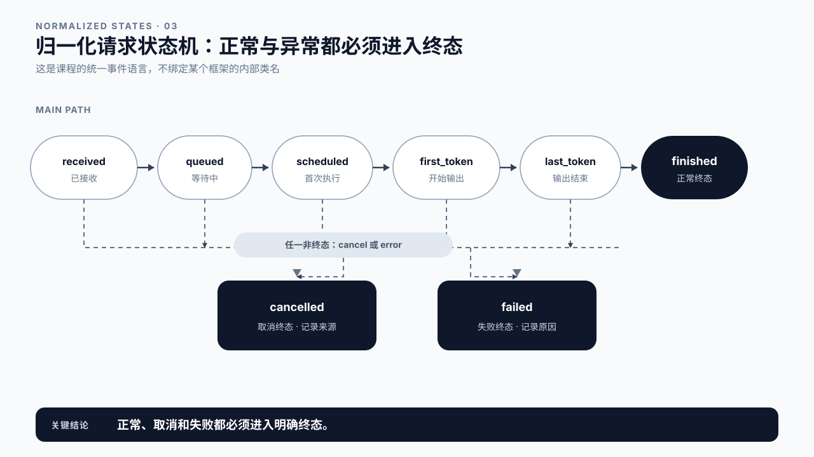
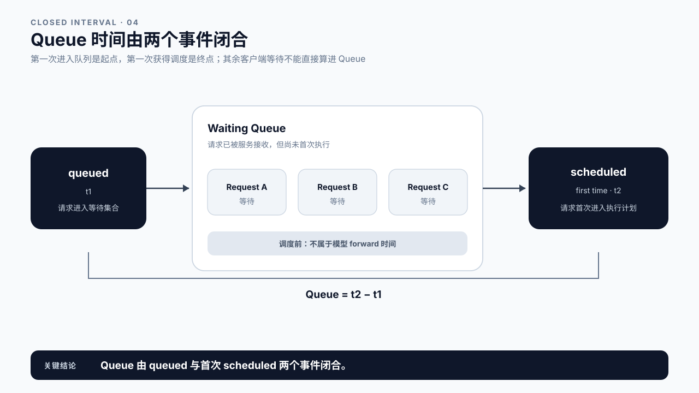
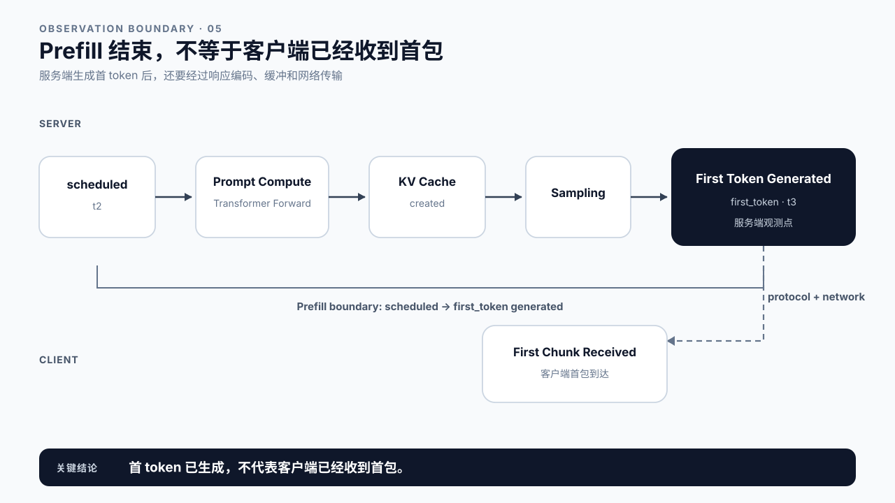
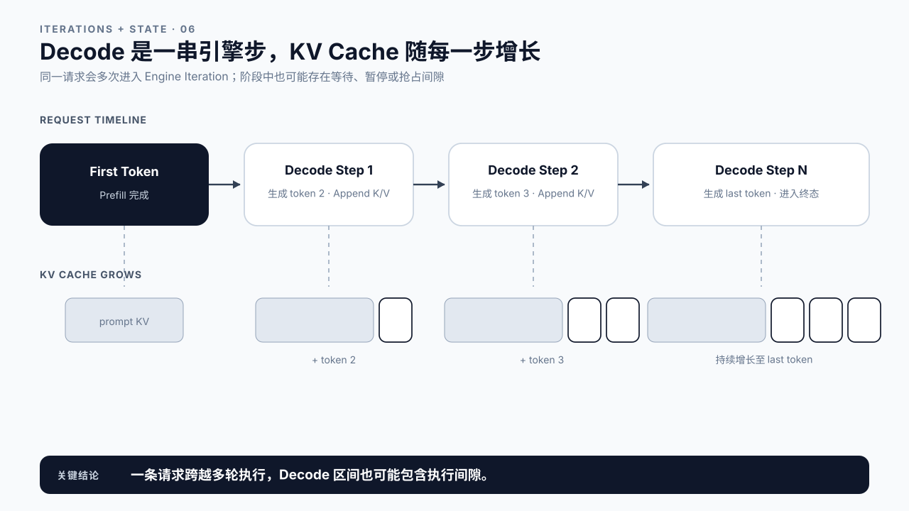
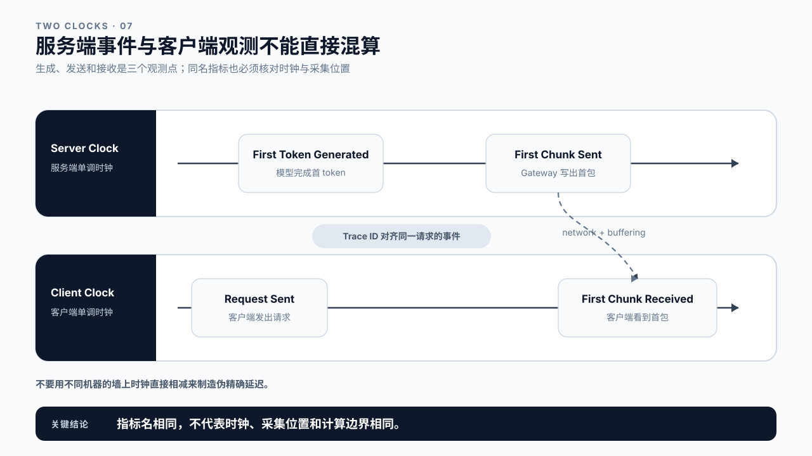
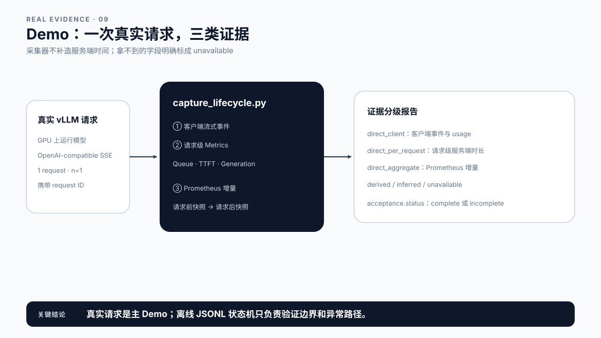
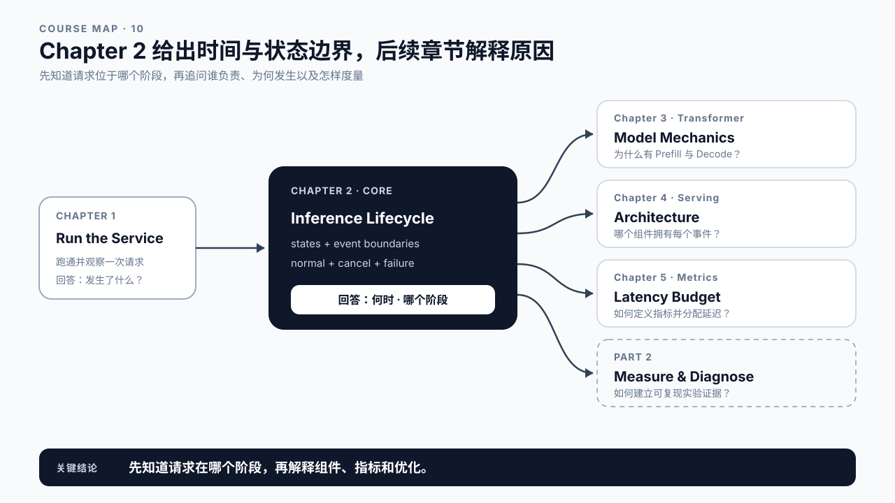

# 第 2 章 真实请求生命周期：请求在系统里如何流动

## 学习目标

学完本章后，你应该能够：

- 区分一次业务任务、一次 LLM 调用和一条推理请求。
- 用统一事件描述请求从接收、排队、执行到结束的状态变化。
- 标出 Queue、Scheduled-to-First-Token、Decode、Response Tail 和资源回收的时间边界。
- 解释服务端生成首 token 与客户端收到首个 chunk 为什么不是同一个时刻。
- 识别 finished、cancelled、failed 三类终态，并说明每类终态都要完成资源清理。
- 对同一次真实 vLLM 请求采集客户端事件、请求级服务端指标和 Prometheus 增量，并标注证据等级。

本章属于 Core Track。第 1 章已经用同步请求证明服务能够返回完整答案，但等待期间没有反馈，也看不到第一个内容何时到达。本章因此引入流式响应，并继续调用同一个真实 vLLM 服务；流式事件改善客户端观察，服务端请求级指标、日志和 Prometheus 增量则用于支持生命周期判断。Transformer 为什么会产生 Prefill 和 Decode 留到第 3 章，组件由谁实现留到第 4 章，TTFT、TPOT 和分位数的正式定义留到第 5 章。

Advanced Track 可以继续追踪框架内部的抢占、Chunked Prefill、远程 KV 传输和 Prefill/Decode 分离事件。本章 Demo 只覆盖无抢占的 Core 主路径；不能用它计算多次调度和恢复后的内部区间。

## 核心问题

1. 请求生命周期需要记录哪些关键事件？
2. Queue、Prefill、Decode 和 Response 的起止点在哪里？
3. 并发、抢占、取消和失败会怎样改变一条请求的路径？
4. 客户端观测与服务端观测为什么不能直接混算？
5. 如何从一组事件重建请求经历过的阶段？



图2-1：推理请求生命周期与关键时间点。

## 2.1 先分清三种“请求”

业务侧说“一次请求”，推理引擎听到的可能完全不是一回事。

以 Agent 为例，用户只提交了一次“帮我比较三家供应商”的任务。Agent 可能先调用一次 LLM 制订计划，随后并行调用三个工具，再调用一次 LLM 汇总结果。业务系统看到一个 Task，模型服务看到两次或更多 LLM Call；如果中间发生重试，同一个 Call 还可能对应多条 Inference Request。

```text
Business Task
  -> LLM Call 1
       -> Inference Request 1
  -> Tool Calls
  -> LLM Call 2
       -> Inference Request 2
       -> Retry Request 3
```

本章研究的对象是最内层的 Inference Request。它有独立的请求 ID、输入 token、生成参数、队列状态、KV Cache、输出 token 和终态。第 24 章再把多条请求拼回 Agent 的端到端任务。


图2-2：业务任务、LLM 调用与推理请求是三个不同层级。

## 2.2 用归一化状态描述生命周期

不同框架给状态起的名字并不一致。课程先使用一套归一化事件，避免把概念绑死在某个版本的内部类上：

```text
request_received
  -> queued
  -> scheduled
  -> first_token
  -> token ...
  -> last_token
  -> finished
```

这条主路径表达的是：服务收到请求；请求完成入口处理并进入等待队列；调度器给它分配执行机会；模型产出首 token；后续 token 持续产生；最后一个 token 生成；响应发送完毕，请求结束。

`cancelled` 和 `failed` 是旁路终态。它们可以发生在排队、Prefill 或 Decode 期间。实际系统还可能出现 waiting for grammar、waiting for remote KV、preempted 等更细状态。例如 vLLM 当前的 RequestStatus 明确区分 WAITING、RUNNING、PREEMPTED 以及若干特殊等待状态；这些都可以映射回本章的归一化模型，而不必照搬名称。[vLLM RequestStatus](https://docs.vllm.ai/en/stable/api/vllm/v1/request/)

这里有四个容易混用的概念：

| 概念 | 表达什么 | 例子 |
|---|---|---|
| Event | 某件事发生的瞬间 | `queued`、`first_token` |
| State | 请求在一段时间内所处的状态 | WAITING、RUNNING、FINISHED |
| Phase | 两个边界事件之间的逻辑区间 | Queue、Prefill、Decode |
| Duration | 在确定时钟和边界后计算出的时间 | `t2 - t1` |

Event 是点，Phase 是区间，State 描述区间内的处境，Duration 才是数字。先把前三者定义清楚，再计算时间；否则，同一个“Prefill 30 ms”可能分别指模型计算、首次调度到首 token，或者客户端等待首包，三者不是同一件事。



图2-3：归一化状态机保留主路径，也允许取消和失败提前结束请求。

## 2.3 给生命周期建立时间坐标

状态说清楚后，再给每个关键事件记一个时间戳：

| 时间点 | 事件 | 说明 |
|---|---|---|
| `t0` | `request_received` | 服务端接收到请求 |
| `t1` | `queued` | 请求进入引擎等待队列 |
| `t2` | `scheduled` | 请求首次获得执行机会 |
| `t3` | `first_token` | 服务端生成第一个输出 token |
| `t4` | `last_token` | 服务端生成最后一个输出 token |
| `t5` | `finished` | 响应发送和收尾工作结束 |

于是可以得到一组阶段时间：

```text
Admission                = t1 - t0
Queue                    = t2 - t1
Scheduled-to-First-Token = t3 - t2
Decode                   = t4 - t3
Response Tail            = t5 - t4
End-to-End               = t5 - t0
```

`t3 - t2` 这一段常被直接称作 Prefill，但它除了 prompt 计算，还包含取 logits、采样和组装输出对象。除非引擎明确告诉你埋点位置，否则应使用 `Scheduled-to-First-Token` 这个按边界命名的写法——它只声明“从首次调度到首 token 生成”，不声称这段时间全都花在 Prefill 上。2.5 会展开这条边界。

这组相减成立有一个前提：参与计算的时间点来自同一个时钟域，或者已经经过可靠的时钟对齐。客户端的 `request_sent` 使用客户端时钟，服务端的 `first_token` 使用服务端时钟，不能把两个原始时间戳直接相减。即使两台机器都启用了 NTP，也应把跨机差值视为近似值，并保留同步误差。

单进程测量持续时间时，优先使用单调时钟。它只关心经过了多久，不受系统时间回拨影响。需要把多个进程、多个服务拼成 Trace 时，再同时保留墙钟时间、Trace ID、Span 关系和时钟同步信息。这样既能排序单个进程内的事件，也能解释跨服务路径，而不是制造一个看起来精确、实际边界不成立的数字。

这组式子是生命周期概念模型，不代表 OpenAI-compatible API 会返回全部时间戳。某些引擎把 tokenization 算进 arrival 到 scheduled，某些系统把首 token 的采样放在 Prefill 尾部，还有些监控只能看到客户端 chunk。第 5 章会要求每个指标同时写清名称、时间点、公式和采集位置。

vLLM 暴露 Queue、Prefill、Decode、TTFT 和 E2E 等服务端指标，但其边界可能随引擎版本以及抢占行为变化。本章固定无抢占主路径，并记录实际 vLLM 版本；遇到抢占时只报告“当前 Core Demo 不支持归因”，不强行套用一次 `scheduled` 的公式。[vLLM Production Metrics](https://docs.vllm.ai/en/latest/usage/metrics/)



图2-4：只有明确 queued 和 scheduled 两个时间点，Queue 才有可复核的边界。

## 2.4 Request Received 与 Queue：计算开始前发生了什么

`request_received` 表示服务边界已经接到请求，但请求还不一定进入引擎队列。协议解析、鉴权、参数校验、tokenization、路由和准入控制都可能发生在这一段。它们是否计入 Admission，取决于观测点放在哪里。

`queued` 表示请求已经进入某个等待执行的队列。排队不是“系统什么都没做”，而是在等待一组条件满足：有可用执行预算、有足够 KV Cache 空间、调度策略允许、请求没有超时或被取消。

`scheduled` 是第一次真正获得引擎执行机会。这里要强调“第一次”：请求后面仍可能经历很多轮调度，甚至被抢占后重新排队。生命周期里的 Queue 通常关注首次排队到首次调度；要研究重复等待，需要额外事件，不能靠一个 queue 时间猜出来。

第 4 章会区分 Gateway、Router、Admission Queue 和 Engine Scheduler。当前只需记住，`request_received -> queued -> scheduled` 发生在模型产出 token 之前，其中任何一段变长，用户都会觉得首包变慢。

## 2.5 Scheduled、Prefill 与 First Token

请求第一次被调度后，模型要先处理输入上下文。对普通文本生成请求来说，这段执行称为 Prefill。它读取 prompt tokens，经过 Transformer 各层，并为历史 token 建立 KV Cache。

Prefill 的结束边界容易说错。完成最后一个 prompt token 的计算，还不等于客户端已经看见结果。服务端通常还要得到 logits、执行采样、形成输出对象，再把首个 chunk 写入网络。本章把 `first_token` 定义为服务端生成首 token；客户端首次收到 chunk 是另一个观测点。

```text
scheduled
  -> prompt compute
  -> KV Cache created
  -> logits
  -> sampling
  -> first_token generated
```

如果启用了 Prefix Cache 或 Chunked Prefill，这条路径会出现缓存命中或多轮 Prefill，但请求仍要经过“输入尚未处理完”到“首 token 已生成”的状态变化。基础计算机制在第 3 章讲；长上下文与 Prefill 优化放在第 12～14 章。



图2-5：Prefill 连接首次调度与服务端首 token，客户端首 chunk 还要经过返回链路。

## 2.6 Decode 是一串引擎步，不是一段黑盒时间

首 token 之后，请求进入 Decode。每个标准 Decode step 读取当前 token 和已有 KV Cache，计算下一 token，并把新 token 的 K/V 追加到缓存；这个循环一直持续到 EOS、stop condition、长度上限、取消或错误出现为止。

```text
first_token
  -> decode step 1 -> token 2 -> append KV
  -> decode step 2 -> token 3 -> append KV
  -> ...
  -> last_token
```

一条请求会跨越许多 engine iteration。并发时，一个 iteration 又可能同时推进多条请求。因此有两条正交时间线：请求时间线回答“这条请求经历了什么”，引擎时间线回答“这一轮 GPU 推进了哪些请求”。后续分析 GPU 空洞或 Batch Efficiency 时，两条线都要看。

抢占会让 Decode 不再连续。请求可能从 RUNNING 进入 PREEMPTED，释放或转移资源，之后重新等待调度。此时 `first_token -> last_token` 仍然是用户经历的 Decode 区间，但其中包含了暂停。要解释暂停原因，必须再看 Scheduler 和 KV Cache 事件。



图2-6：一条请求跨越多个 Decode step，KV Cache 随生成长度增长。

## 2.7 Streaming：token、输出对象和网络 chunk 不是一一对应

模型生成 token 后，服务端还要解码文本、组装协议对象并发送数据。最简单的实现可能每个 token 发送一个 chunk，但这不是可靠假设。服务端可能缓冲多个 token，网络栈可能合并写入，投机解码也可能一次接受多个 token。

所以需要分开记录：

- `first_token_generated`：引擎第一次产出 token。
- `first_chunk_sent`：服务端第一次写出流式数据。
- `first_chunk_received`：客户端第一次读到流式数据。
- `response_finished`：客户端或服务端认为响应已经结束。

第 1 章的同步 Demo 只能回答“调用是否成功、整次请求花了多久”，它拿到的是一个完整响应，中间没有任何可观察的事件。本章 Demo 先用流式请求把这段等待拆成可记录的事件，再读取 vLLM 的请求级 timing metrics，并对请求前后的 `/metrics` 做差。请求级指标可以直接归属于这条请求；Prometheus 增量是直接观测到的服务端聚合变化，但只有在无其他流量时才近似对应当前请求。两种证据不能混为一谈。[vLLM Per-Request Metrics](https://docs.vllm.ai/en/latest/features/per_request_metrics/)

“直接观测”也不等于“可以回答所有问题”。客户端直接观测到首个 chunk，只能闭合客户端首包窗口；Prometheus 直接观测到某个直方图计数增加，只能证明统计窗口内发生了变化。证据是否足够，取决于它的作用域是否与问题一致。



图2-7：服务端首 token、首个网络 chunk 和客户端首包属于三个观测点。

## 2.8 Finished、Cancelled、Failed 都必须收口

正常结束只是终态之一：

- `finished`：生成满足 EOS、stop condition 或长度上限，响应正常完成。
- `cancelled`：客户端断开、业务主动取消或超时策略终止请求。
- `failed`：参数、模型执行、Worker、网络或其他环节发生错误。

三条路径都必须进入资源清理。服务需要停止后续计算，释放或复用 KV Cache block，清理调度状态，关闭流式响应，并写入 finish reason、错误和 usage。否则一次已取消的请求仍可能继续消耗 GPU；状态泄漏积累后，服务看起来像是“越跑并发越低”。

不要把清理等同于立即释放所有缓存。Prefix Cache、会话缓存或远程 KV 可能按策略保留。生命周期要求的是请求所有权结束后，资源进入明确的新所有者或可回收状态，而不是留成无法解释的占用。


图2-8：成功、取消和失败走不同终态，但都汇入资源与状态清理。

## 2.9 Demo：为真实 vLLM 请求生成证据报告

本章主 Demo 位于 `code/ch02/capture_lifecycle.py`。它要求真实 vLLM 服务运行在 GPU 上，并建议使用 `--enable-per-request-metrics` 启动。脚本会完成一条流式请求，同时采集三类证据：

1. **直接观测——客户端**：请求发出、响应头、首个内容 chunk、最后内容 chunk 和 `[DONE]`；
2. **直接观测——服务端**：响应中的 `queue_time_ms`、`time_to_first_token_ms`、`generation_time_ms` 等请求级指标，以及 `/metrics` 的前后增量；
3. **推断或不可得**：API 没有给出的服务端接收时间、精确事件时间戳和无法单请求归属的聚合变化。

为了避免“有数字就算证据”，本章把报告字段分成四级：

| 证据等级 | 典型字段 | 可以回答的问题 | 不能越过的边界 |
|---|---|---|---|
| 客户端直接观测 | 请求发出、响应头、首个内容 chunk、`[DONE]` | 用户侧何时看到数据，流是否正常结束 | 不能单独拆出 Queue 或 Prefill |
| 请求级服务端直接观测 | request ID、Queue、TTFT、Generation | 当前请求的服务端阶段时长 | 仍受当前 vLLM 版本的指标定义约束 |
| 服务端聚合直接观测 | `/metrics` 前后快照及 delta | 统计窗口内服务发生了什么变化 | 并发时不能归属于单条请求 |
| 推导、推断或不可得 | 客户端时长差、缺失阶段边界 | 明确哪些结论经过计算，哪些仍未知 | 未知不能填成 `0`，推断不能改写成实测 |

先启动服务：

```bash
vllm serve /home/admin/models/Qwen2.5-0.5B-Instruct \
  --served-model-name Qwen/Qwen2.5-0.5B-Instruct \
  --enable-per-request-metrics \
  --host 0.0.0.0 \
  --port 8000
```

再运行采集脚本：

```bash
python3 code/ch02/capture_lifecycle.py \
  --base-url http://127.0.0.1:8000/v1 \
  --model Qwen/Qwen2.5-0.5B-Instruct \
  --model-revision local-snapshot \
  --server-command "vllm serve ... --enable-per-request-metrics" \
  --require-server-metrics \
  --require-complete-evidence \
  --output content/ch02/evidence/gx10-real-lifecycle-report.json
```

报告中的 `direct_observations`、`derived_client_durations_ms` 和 `phase_evidence` 必须分开阅读。Queue、TTFT 和 Generation 三个请求级时长都有效，并且 request ID、usage 与环境元数据齐全时，`acceptance.status` 才会是 `complete`。`scheduled_to_first_token` 使用 vLLM 返回的请求级 TTFT，它不应在没有版本契约的情况下直接改名为“纯 Prefill”。`server_prometheus_delta` 是服务端真实聚合证据；如果运行期间存在并发流量，就不能归属于本请求。

拿到报告后，按下面的顺序重建生命周期：

1. 先确认 request ID、模型、模型 revision、vLLM 版本和启动命令，避免分析错服务或错版本；
2. 检查客户端是否收到正文、usage 和 `[DONE]`，确认请求是否正常收口；
3. 只在同一时钟域内排序事件和计算持续时间；
4. 将请求级服务端指标映射到 Queue、scheduled-to-first-token 和 Generation，不擅自改名；
5. 将 Prometheus delta 保留为聚合旁证，并记录采集窗口内是否存在其他流量；
6. 对每个阶段写出证据来源和可信等级，缺失边界标为 `unavailable`。

一份合格报告不是要求所有阶段都有数字，而是要求每个结论都能追溯到来源。真实接口没有暴露 `request_received` 或 `first_token` 的精确时间戳时，报告应坦白缺失；把空值写成零，会把“没有证据”误写成“没有耗时”。

### 2.9.1 本章预期看到什么

本章目前尚未保存通过完整验收的 GX10 真机报告，因此正文不提供虚构示例数值。真机执行后，读者至少应该看到：

- `acceptance.status` 为 `complete`；
- 客户端事件包含请求发出、首个内容 chunk 和流结束；
- 请求级 Queue、TTFT、Generation 都是有限的非负值；
- request ID、usage、Python、vLLM、GPU、模型 revision 和完整启动命令齐全；
- `phase_evidence` 对每个阶段标明证据等级，而不是只输出一列毫秒数；
- Prometheus delta 被标成聚合证据，没有冒充单请求时间线。

如果 `acceptance.status` 为 `incomplete`，先看缺失字段，不要从已有数字继续推演完整生命周期。客户端路径成功、服务端字段缺失，说明“调用成功”和“证据完整”是两种不同的验收结果。

### 2.9.2 已有的客户端流式证据

完整生命周期报告尚未生成，但本章已经保存了一份**只覆盖客户端层的真实流式记录**：[GX10 客户端流式报告](evidence/gx10-streaming-client-report.json)。它由 `code/ch02/streaming_client.py` 在 GX10 的 NVIDIA GB10 上对 `Qwen/Qwen2.5-0.5B-Instruct` 发起一次流式请求得到，记录了 `prompt_tokens=30`、`output_tokens=256`、`stream_chunks=254`、首个内容 chunk 等待和 chunk 间隔。

这份报告属于四级证据表中的第一级，只能回答客户端问题：

| 它能回答 | 它不能回答 |
|---|---|
| 客户端何时看到首段正文，流是否正常结束 | Queue、Prefill、Decode 各占多久 |
| 本次请求的输入与输出 token 数（来自 usage） | 服务端首 token 与首个 chunk 的差值 |
| 客户端收到多少个非空内容 chunks | 254 个 chunks 对应多少次模型执行 |

因此它**不能**让 `acceptance.status` 变成 `complete`——请求级 Queue、TTFT、Generation 三个服务端指标仍然缺失，本章的真机门禁依旧打开。它的作用是让后续章节在等待完整报告期间，仍有一份真实的客户端观测可以引用：第 3 章用它的 token 与 chunk 计数解释 Prefill/Decode 机制，第 5 章用它判断哪些指标已经具备边界。

这份报告同样缺少 `vllm_version`，所以它可以证明链路和客户端观测，不能作为可复现的 Benchmark 记录。

原有 `lifecycle_trace.py` 和 `sample-events.jsonl` 保留为**离线分析器**，用于单元测试正常、取消、失败和非法状态跳转。它不再承担主 Demo，也不构成 GPU 实测证据。[离线合成验收报告](evidence/offline-synthetic-lifecycle-report.json)只证明分析器可运行；新的真实报告需要在 GX10 上重新生成。

完整命令、字段说明和边界见 [Demo README](../../code/ch02/README.md)。



图2-9：主 Demo 同时收集客户端、请求级服务端和服务端聚合证据；离线 JSONL 分析器只作辅助。

## 2.10 课堂案例：读取一份真实 vLLM 生命周期报告

本节不使用预设时间戳。课堂数据必须来自第 2.9 节在真实 vLLM 服务上生成的 `content/ch02/evidence/gx10-real-lifecycle-report.json`。如果该文件尚未生成，本节状态就是“待实测”，不能用合成数字补位。

拿到真机报告后，先复制下面这张表，再从报告逐项填写。所有数值保留报告原始精度，不手工修饰结果。

| 要回答的问题 | 报告字段 | 证据等级 | 允许写出的结论 |
|---|---|---|---|
| 请求是否正常完成 | `acceptance.status`、客户端终态事件 | 客户端直接观测 + 验收规则 | 调用是否完成，证据是否齐全 |
| 客户端何时看到首段正文 | `direct_observations.client_events_ms` | 客户端直接观测 | 客户端首内容 chunk 等待 |
| 请求等待调度多久 | `direct_observations.server_per_request_metrics_ms.queue_time_ms` | 请求级服务端直接观测 | 当前请求的 Queue 时间 |
| 首次调度到首 token 多久 | `direct_observations.server_per_request_metrics_ms.time_to_first_token_ms` | 请求级服务端直接观测 | 当前 vLLM 版本定义下的 scheduled-to-first-token |
| 首 token 到末 token 多久 | `direct_observations.server_per_request_metrics_ms.generation_time_ms` | 请求级服务端直接观测 | 当前请求的 Generation 时间 |
| 服务端统计窗口发生了什么 | `direct_observations.server_prometheus_delta` | 服务端聚合直接观测 | 指标在采集窗口内的变化 |
| 哪些阶段仍然未知 | `phase_evidence` 中的 `unavailable` | 缺失证据 | 只能声明暂时不可得 |

课堂上按四步阅读：

1. 先核对环境、模型 revision、vLLM 版本和完整启动命令；
2. 再核对 request ID、usage、正文和结束事件，确认分析的是同一条请求；
3. 分别读取客户端窗口、请求级服务端阶段和 Prometheus 聚合变化；
4. 最后检查每条结论是否超出了证据作用域。

讨论问题：客户端首内容 chunk 等待与请求级 `time_to_first_token_ms` 相差多少？这个差值能否直接命名为网络耗时？为什么？

本章只还原一次真实请求的路径和证据边界。调度是否合理，要到第 21 章结合队列、Batch 和 SLO 分析。

### 补充案例 A：在同一份真机报告中检查客户端与服务端边界

分别找出客户端首内容 chunk 和服务端首 token 的证据。两者来自不同观测点，数值接近也不能视为同一个事件。

讨论问题：还需要采集哪个服务端发送事件，才能把首 token 生成到首 chunk 发出单独闭合？

### 补充案例 B：在同一份真机报告中检查单请求与聚合证据

对照请求级 Queue、TTFT、Generation 与 `/metrics` 前后增量。前者可以归属于 request ID，后者属于整个采集窗口。

讨论问题：怎样证明采集窗口内没有其他请求？无法证明时，Prometheus delta 应该怎样表述？

## 2.11 常见误区

误区一：一个 token 一定对应一个流式 chunk。

协议缓冲、网络写入和投机解码都可能改变 token 与 chunk 的对应关系。做生命周期分析时应记录事件语义，不要拿 chunk 数替代 token 数。

误区二：把客户端首包等待全部算成 Prefill。

客户端等待还包含网络、入口处理、排队和返回链路。没有服务端 scheduled 与 first token 事件，只能观察总等待，不能完成阶段归因。

误区三：认为请求进入 RUNNING 后会连续执行到结束。

在线服务按 engine iteration 推进多条请求。抢占、优先级、KV Cache 压力和 Chunked Prefill 都可能让一条请求暂停后再继续。

误区四：只给成功请求记结束事件。

取消和失败更需要终态与清理记录。没有终态，监控无法区分“仍在运行”和“状态泄漏”。

误区五：把课程状态名当成框架内部 API。

本章事件是跨框架的归一化模型。接入 vLLM、SGLang 或其他引擎时，要显式维护映射，不能假设名称和边界完全相同。

误区六：缺失事件按零耗时处理。

没有采集到 `scheduled`，无法计算 Queue；没有服务端 `first_token`，无法计算服务端 Prefill 边界。`null` 或 `unavailable` 表示证据不足，`0 ms` 表示两个已观测边界重合，两者不能互换。



图2-10：本章定义生命周期，架构、指标、分析和优化分别由后续章节展开。

## 本章总结

一条推理请求可以用六个关键时间点描述：接收、入队、首次调度、首 token、末 token 和结束。它们把 Admission、Queue、Scheduled-to-First-Token、Decode、Response Tail 和 End-to-End 分开，也让取消和失败有明确位置。

请求时间线与引擎时间线不是同一张图。前者追踪单条请求，后者解释多个请求如何共享执行轮次。服务端事件和客户端观测也不能混用：首 token 已生成，不代表首个 chunk 已经到达用户。

下一章进入 Transformer 生成机制，解释 Prefill 为什么一次处理整段输入、Decode 为什么逐 token 推进，以及 KV Cache 如何连接两个阶段。第 4 章再回答 Gateway、Scheduler、Worker 和 Runtime 分别负责什么。

### Core Checklist

- [ ] 能区分 Business Task、LLM Call 和 Inference Request。
- [ ] 能画出正常完成、取消和失败三条状态路径。
- [ ] 能用关键时间点计算 Admission、Queue、Scheduled-to-First-Token、Decode 和 End-to-End。
- [ ] 能解释为什么缺失阶段事件应记为未知，而不是零。
- [ ] 能区分请求时间线与引擎 iteration 时间线。
- [ ] 能区分服务端首 token 与客户端首 chunk。
- [ ] 能运行真实采集 Demo，并逐项标出直接观测、计算得到、推断和不可得。

### Advanced 延伸

- [ ] 为真实推理引擎设计事件到归一化生命周期的适配表。
- [ ] 在 Trace 中表达 preempted、resumed、prefix cache hit 和 remote KV transfer。
- [ ] 设计跨 Gateway、Scheduler、Worker 和客户端的统一 Trace ID。

## 课后练习

1. 为一次正常流式请求画出 `t0` 到 `t5`，并写出每个阶段的计算式。
2. 运行 `capture_lifecycle.py`，比较客户端首 chunk 与服务端 TTFT，解释为什么二者不同。
3. 在有并发流量和无并发流量时分别观察 Prometheus delta，说明归属边界。
4. 修改 `sample-events.jsonl`，增加一条在 Queue 中取消的请求，观察哪些阶段仍可计算。
5. 为你熟悉的 LLM 框架列出实际状态名，并映射到本章归一化事件。

## 延伸阅读

- [vLLM RequestStatus](https://docs.vllm.ai/en/stable/api/vllm/v1/request/)
- [vLLM Production Metrics](https://docs.vllm.ai/en/latest/usage/metrics/)
- [vLLM Per-Request Metrics](https://docs.vllm.ai/en/latest/features/per_request_metrics/)
- [vLLM Benchmark CLI：Latency Metrics](https://docs.vllm.ai/en/stable/benchmarking/cli/)
