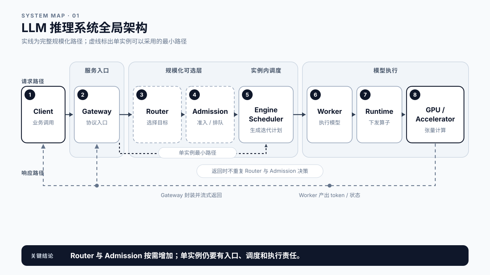
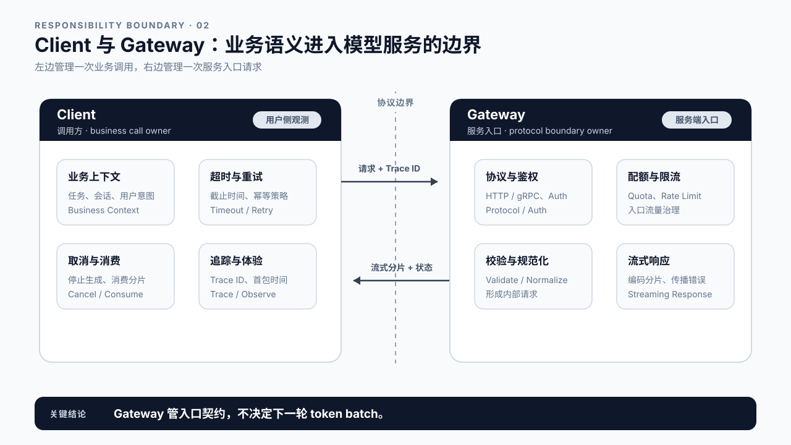
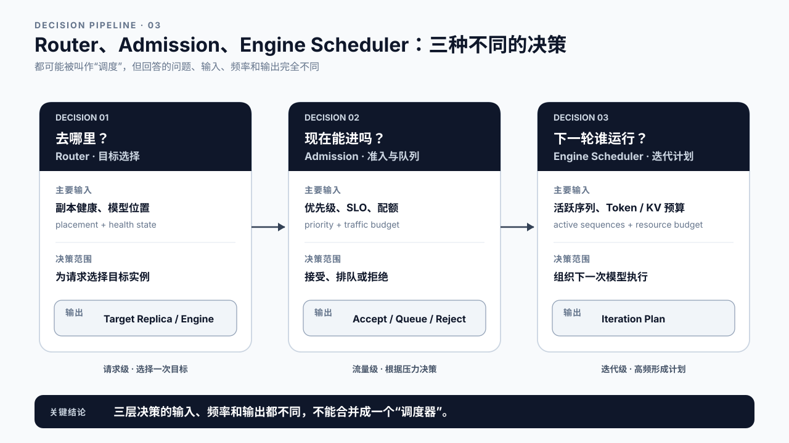
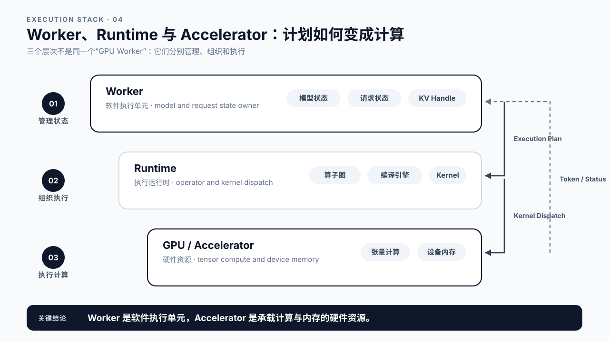
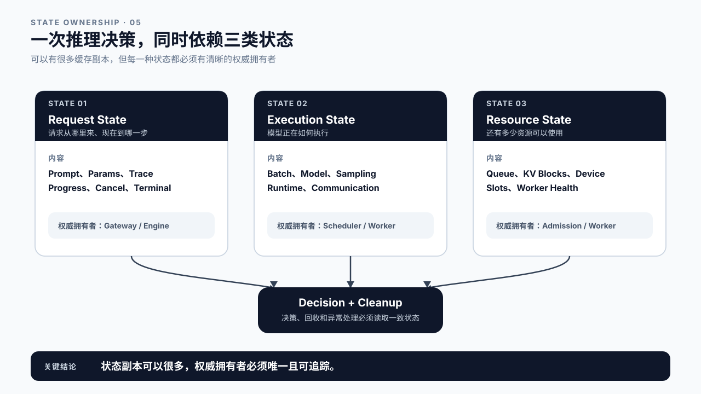
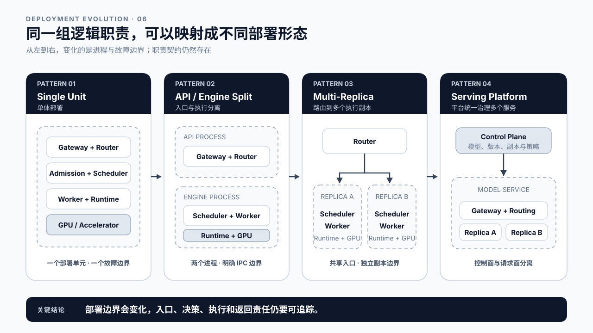
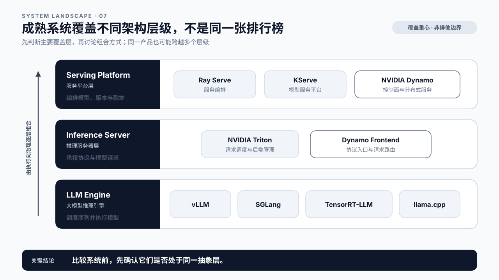
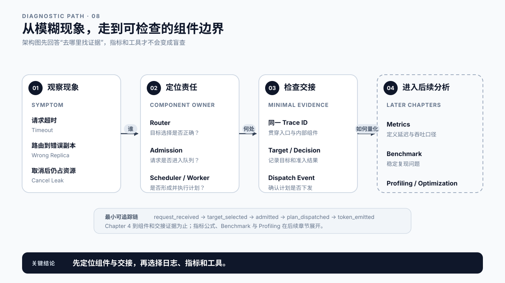
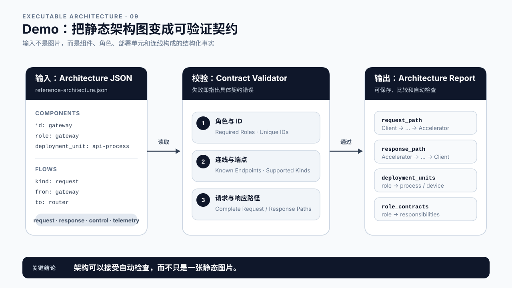
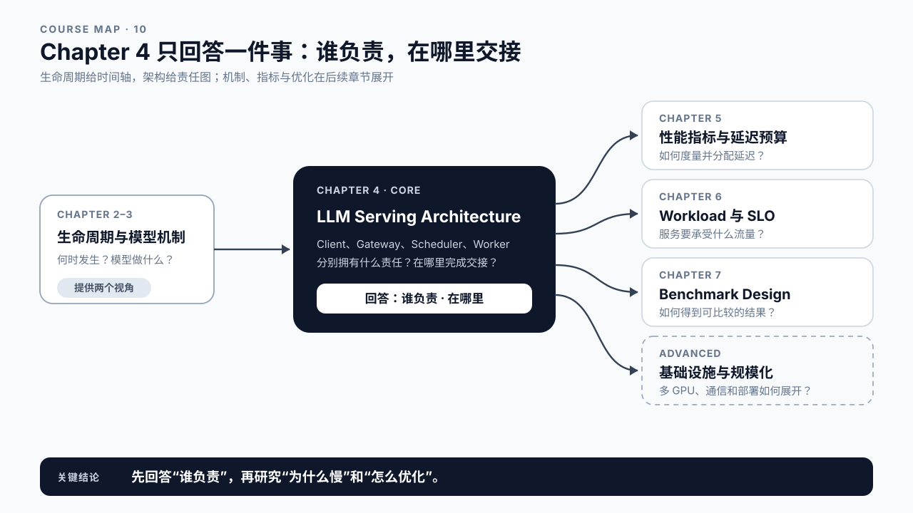

# 第 4 章 LLM Serving 架构：谁负责请求链路的哪一段

## 学习目标

学完本章后，你应该能够：

- 画出单实例 LLM Serving 的最小逻辑架构，并说明 Router、Admission 在多实例或治理场景中何时出现。
- 区分“请求发往哪个实例”“请求能否进入执行队列”“下一轮执行哪些 token”三类不同决策。
- 说明每个组件接收什么信息、做什么决定、输出什么结果。
- 区分逻辑组件、进程边界、部署单元和硬件设备，不把架构图上的每个框都理解成独立服务。
- 运行架构契约 Demo，检查请求路径、响应路径、角色缺失和错误连线。

完成 Core Track 后，选读部分再讨论请求平面、控制平面、遥测平面和多种成熟系统的层级映射。第一次学习不要求记住所有平台名称。

本章属于 Core Track。第 2 章描述请求经历哪些状态，第 3 章解释模型怎样生成 token；本章换一个视角，回答这些状态和计算由谁接收、决定、执行和观测。正式性能指标留到第 5 章。

Advanced Track 可以继续研究控制面高可用、跨节点服务发现、KV-aware routing、多 GPU Worker Group 和 Prefill/Decode 分离。它们会改变部署拓扑，但不会推翻本章的职责划分。

## 核心问题

1. 一个在线 LLM 请求会经过哪些逻辑组件？
2. Router、Admission 与 Engine Scheduler 为什么不能合并成一个模糊的“调度器”？
3. Worker、Runtime 与 GPU 各自拥有哪一层状态和执行责任？
4. 逻辑组件、进程和部署单元是什么关系？
5. 如何把架构图变成可检查的组件契约？



图4-1：LLM 推理系统的请求路径、响应路径与主要逻辑组件。

## 4.1 架构图不是方框清单，而是一组责任契约

只画 `Client -> LLM -> GPU`，足以说明系统大致在做什么，却不足以排障。用户看到超时，团队仍然不知道请求有没有通过鉴权、是否选中了正确实例、有没有进入引擎队列，还是已经下发到 GPU 后执行失败。

单实例 vLLM 的最小逻辑请求路径可以写成：

```text
Client
  -> Gateway
  -> Engine Scheduler
  -> Worker
  -> Runtime
  -> Accelerator
```

当系统出现多副本选择、全局配额或分级队列时，再扩展为：

```text
Client -> Gateway -> Router -> Admission / Queue
       -> Engine Scheduler -> Worker -> Runtime -> Accelerator
```

把第 1 章启动、第 2 章继续观测的那个单实例 vLLM 放进这张图，可以得到本书的 Reference System：

| 逻辑角色 | 课程实例中的对应物 | 当前证据 |
|---|---|---|
| Client | 第 1 章的同步调用与第 2 章的流式客户端 | 第 2 章客户端流式报告记录了 base URL、模型和流式结果 |
| Gateway | vLLM OpenAI-compatible API | `/v1/models` 与 `/v1/chat/completions` 实际可访问 |
| Router | 不单独出现 | 当前只有一个目标实例，不需要跨副本选择 |
| 全局 Admission | 不单独出现 | 当前实验没有外置配额或分级队列 |
| Engine Scheduler | vLLM 实例内的调度职责 | 由 vLLM 架构与请求级 Queue 指标说明，具体实现随版本变化 |
| Worker / Runtime | vLLM 的模型执行路径 | 属于服务内部逻辑，现有客户端报告不直接暴露进程边界 |
| Accelerator | NVIDIA GB10 | 第 2 章 GX10 客户端流式报告直接记录 |

这张表故意把“没有独立部署”写成“不单独出现”，而不是写成“系统里完全不存在这项能力”。例如，单实例仍然要校验请求并决定何时执行，只是没有必要为 Router 或全局 Admission 虚构独立服务。

返回路径通常更短：计算结果经 Runtime 和 Worker 回到负责协议输出的 Gateway，再流向 Client。Router 不必为每个 token 重新选择实例，Admission 也不会再次做准入决定。真实系统还可能经过 Output Processor、Detokenizer、消息总线或代理，但这些扩展仍要回答三个问题：接收什么，决定什么，输出什么。

本书把图中的框称为“逻辑组件”。逻辑组件不等于进程，也不等于 Pod。Gateway 与 Router 可以在同一个 API Server 进程里；Admission 与 Engine Scheduler 可以同处一个 EngineCore；Worker 与 Runtime 也常在同一个 Worker 进程里。反过来，一个逻辑 Worker 也可能展开为跨多张 GPU 的 Worker Group。

因此，读架构图时要同时看两层：

- 逻辑层回答责任归属。
- 部署层回答进程、节点、设备和故障边界。

先把逻辑责任画清楚，再讨论如何部署。否则一换框架或一拆进程，整张系统地图就失效了。

## 4.2 Client 与 Gateway：业务语义进入模型服务的边界

Client 可能是网页、后端服务、IDE 插件、Agent Orchestrator、评测脚本，也可能是另一个模型。它负责构造业务请求、生成或传递 Trace ID、处理超时与取消，并消费普通响应或流式响应。

Gateway 是服务端入口。常见职责包括：

- 终止 HTTP、gRPC 或内部 RPC 协议；
- 完成鉴权、租户识别、配额和基础限流；
- 校验模型名、生成参数、上下文大小和流式选项；
- 把外部协议转换成内部请求对象；
- 组装错误响应、usage 和 streaming chunks；
- 记录入口时间、状态码、Trace ID 和客户端断开事件。

Gateway 不负责模型 forward，也不应决定每个 engine iteration 运行哪些 token。它拥有的是协议与租户边界。这里的失败通常表现为请求还没进入引擎：认证失败、参数非法、上下文超限、配额耗尽或连接已经断开。

单实例服务不一定发生目标选择，因此不需要虚构独立 Router。多副本场景中，路由有时直接写在 Gateway 进程里，但分析时仍应区分两种责任：协议处理回答“请求是否合法”，路由回答“合法请求去哪里”。



图4-2：Gateway 管理协议、身份与请求规范化，Client 管理业务调用和用户侧观测。

## 4.3 Router、Admission 与 Engine Scheduler：三种不同的流量决策

LLM Serving 里常把所有排队和选择都叫 scheduling。这个词太宽，一旦出问题，团队很容易同时去改负载均衡、并发上限和 batch 参数。多实例系统可以分成三层；单实例最小路径通常只显式保留 Engine Scheduler，Router 和全局 Admission 属于按需增加的角色。

| 逻辑组件 | 核心问题 | 主要输入 | 主要输出 |
|---|---|---|---|
| Router | 请求去哪个后端？ | 模型、版本、租户、实例健康、负载、缓存信息 | 目标 replica、worker group 或 engine |
| Admission / Queue | 请求现在能不能进去？ | 配额、优先级、SLO、队列长度、并发上限 | 接收、排队、拒绝或降级决定 |
| Engine Scheduler | 下一轮执行谁？ | 等待/运行请求、token 预算、KV Cache、Worker 状态 | iteration plan、batch metadata、抢占或等待决定 |

Router 做的是放置选择。最简单的实现是轮询；更复杂的实现会看实例负载、会话亲和性、模型版本或 Prefix Cache 重叠。它不应越过引擎边界，直接构造下一轮 token batch。

Admission 管的是全局流量预算。它可以把交互式请求和离线任务放进不同队列，也可以在过载时快速拒绝，避免所有请求进入引擎后一起超时。这里的 Queue 可能位于 Gateway、Router 后面或引擎入口，具体位置由实现决定，架构图必须标明。

Engine Scheduler 已经处于某个推理实例内部。它知道请求当前处于 Prefill 还是 Decode、还剩多少 token 预算、KV Cache 是否足够、哪些 Worker 能执行。它输出的是执行计划，不是业务响应。

三者可以部署在同一进程，但不能丢掉职责边界。Router 选错实例、Admission 允许过多流量、Engine Scheduler 形成低效 batch，会产生完全不同的证据和修复路径。



图4-3：Router 管目标选择，Admission 管准入和全局队列，Engine Scheduler 管实例内执行计划。

## 4.4 Worker、Runtime 与 Accelerator：计划如何变成模型计算

Engine Scheduler 产生执行计划后，Worker 才把计划变成一次实际模型执行。

Worker 是模型执行单元。它通常持有或管理模型权重、请求执行状态、KV Cache 句柄、并行通信上下文和 Model Runner。单卡部署中，一个 Worker 常绑定一张 GPU；多 GPU 部署中，多个 Worker 可以组成 Tensor Parallel 或 Pipeline Parallel Group。具体并行方式放在 Advanced 的多 GPU 与 NCCL 附录中。

Runtime 位于 Worker 与硬件之间。它把模型操作转换成框架算子、编译后的 engine、CUDA/HIP/Metal 调用、kernel 或 graph。PyTorch eager、CUDA Graph、TensorRT engine 和 ggml backend 都属于不同形态的 Runtime 路径。Runtime 决定“怎么执行”，但不理解租户为什么具有更高优先级。

Accelerator 是执行张量计算并承载设备内存的硬件。本书主要以 GPU 为例，但同样的逻辑边界可以映射到 CPU、NPU、TPU 或其他加速器。硬件会暴露计算、容量、带宽和通信约束，却不会理解 HTTP request ID 或业务 SLO。

| 组件 | 拥有的核心信息 | 产出 |
|---|---|---|
| Worker | 模型与请求执行状态 | Model Runner 调用、token 结果、状态更新 |
| Runtime | 算子、engine、kernel 与设备执行配置 | 硬件调用、logits、采样结果、运行时事件 |
| Accelerator | 张量、权重、KV Cache、工作区 | 计算结果、设备内存变化、硬件计数器 |

“GPU 利用率高”只说明硬件正在忙，不能证明 Router、Queue 或 Scheduler 的架构是健康的。同样，“Worker 正常”也不能排除 Runtime kernel 或设备内存问题。组件边界的意义，就是让一句模糊判断可以继续往下拆。



图4-4：Worker 持有模型执行状态，Runtime 组织执行路径，Accelerator 承担计算和设备内存压力。

## 4.5 三类状态：谁拥有，谁消费，谁负责回收

推理服务同时管理三类状态：

| 状态类型 | 典型内容 | 主要拥有者 | 主要消费者 |
|---|---|---|---|
| 请求状态 | prompt、参数、Trace ID、生成进度、取消、终态 | Gateway / Engine | Router、Scheduler、Worker、Client |
| 执行状态 | batch metadata、模型配置、采样状态、通信上下文 | Scheduler / Worker / Runtime | Worker、Runtime、Output Processor |
| 资源状态 | 队列槽位、KV block、设备内存、Worker 健康 | Admission / Scheduler / Worker | Router、Scheduler、控制面 |

“主要拥有者”不代表其他组件没有副本。例如 Gateway 记录外部 request ID，引擎内部可能再生成 request handle；Router 持有 Worker 负载快照，权威状态却可能来自 Worker 或遥测系统。真正重要的是说明哪份状态可以做决定，哪份状态只是缓存或观测副本。

取消传播最能暴露所有权问题。Client 断开连接后，Gateway 要识别取消；引擎要把请求从等待或运行集合中移除；Worker 要停止后续执行；KV Cache 要释放、复用或转交给明确策略。只在 HTTP 层返回“已取消”，GPU 上的请求却继续 Decode，说明架构契约没有闭合。

这也解释了为什么 Chapter 2 的 `finished`、`cancelled`、`failed` 不能只由一个组件自说自话。终态需要跨组件传播，并最终完成状态与资源收口。



图4-5：请求、执行和资源状态由不同组件拥有，但调度与清理需要它们协同。

## 4.6 选读：从单实例走向平台化服务

Core Track 到 4.5 已经建立了本章必需的组件责任和状态所有权。若你的目标是先理解单实例 LLM 服务，可以直接跳到 4.7；平台工程师和基础设施工程师可以继续阅读下面三个小节。

### 4.6.1 请求平面、控制平面与遥测平面

规模化系统常分成三类平面：请求平面承载请求、token、取消和错误；控制平面管理版本、实例和发布状态；遥测平面承载日志、指标与 Trace。Core 只需记住一条：控制命令、遥测数据和用户请求不是同一种流量，架构图应使用不同语义的连线。

### 4.6.2 从单实例到平台化服务：变的是部署，不变的是责任

最小服务可以把 Gateway、Scheduler、Worker 和 Runtime 放在一台机器上。Router 和全局 Admission 只有在需要目标选择或流量治理时才加入。

流量上升后，系统可能逐步演变：

1. API 与 Engine 分离，让入口 CPU 工作和模型执行分别扩展。
2. 同一模型部署多个 Replica，由 Router 选择目标实例。
3. 多个模型或版本共享平台，控制面负责发布、回滚、配额和容量。
4. Prefill 与 Decode 使用不同 Worker Pool，Router 还要协调 KV 状态位置。

复杂度不会凭空消失。多副本提高容量，也引入负载偏斜和缓存局部性；多模型提高资源复用，也带来冷启动和隔离问题；平台化统一治理，也扩大控制面和故障域。

本章不判断哪种部署一定更好，只要求每次拓扑变化后重新标出：入口在哪里、谁选实例、谁做准入、谁形成执行计划、状态由谁持有、结果从哪里返回。容量与多副本在第 26、27 章展开，多 GPU 和 PD Disaggregation 留在 Advanced。



图4-6：从单实例到平台化服务，逻辑职责保持稳定，进程和故障边界逐步展开。

### 4.6.3 把成熟系统放回正确层级

不要把不同层级的软件放进同一张“框架排行榜”。本章只保留三个层级：

| 层级 | 主要责任 | 代表性例子 |
|---|---|---|
| Serving Platform | 发布、路由、扩缩容和治理 | Ray Serve、KServe |
| Inference Server | 协议入口、模型实例和请求调度 | Triton、Dynamo Frontend |
| LLM Engine / Runtime | KV Cache、迭代调度和模型执行 | vLLM、SGLang、TensorRT-LLM、llama.cpp |

这些名称只帮助定位阅读范围，不构成产品优劣比较。系统会组合，也会随版本改变边界。判断时仍要回到请求路径和责任契约。完整项目对照与版本化链接放入 Advanced 在线材料，Core 正文不展开。



图4-7：平台、推理服务器和 LLM Engine 覆盖不同层级，不能脱离范围直接横向比较。

## 4.7 从架构图走向可观测边界

架构图只有连线，没有观测点，排障时还是会退回猜测。每次跨越组件边界，至少应该能回答“请求是否到达”“目标是谁”“结果是什么”。

| 现象 | 首先核对的边界 | 最小证据 |
|---|---|---|
| 请求立即失败 | Client -> Gateway | Trace ID、协议错误、鉴权/参数校验结果 |
| 请求已接收但长期未执行 | Router -> Admission -> Scheduler | 目标实例、准入决定、入队与首次调度事件 |
| 引擎有请求但设备空闲 | Scheduler -> Worker -> Runtime | iteration plan、dispatch、kernel launch 事件 |
| 客户端取消后仍在生成 | Client -> Gateway -> Engine -> Worker | 同一 Trace ID 下的取消传播和资源释放事件 |
| 某些副本持续无流量 | Router -> Replica | 实例发现、健康状态、路由选择记录 |

这些证据现在只用于确认“问题落在哪个组件或交接点”。第 5 章才正式定义 TTFT、TPOT、成功输出/请求速率与分位数；第 7、9 章再建立 Benchmark 和 Profiling 工具链。架构定位早于指标归因，但不能替代它。



图4-8：架构图把现象落到组件与交接点，后续指标和工具才有明确采集位置。

## 4.8 Demo：检查一份 LLM Serving 架构契约

本章 Demo 位于 `code/ch04/`。它读取一份 JSON 架构说明，检查以下内容：

- Client 到 Accelerator 的请求路径是否完整；
- Accelerator 返回 Client 的响应路径是否完整；
- 所选架构 profile 要求的角色是否齐全；单实例不强制 Router 和 Admission；
- 组件 ID、连线类型和连线端点是否合法；
- 哪些逻辑组件部署在同一进程、服务或设备中；
- Router 与 Engine Scheduler 的职责是否保持分离。

从 Git 仓库根目录运行：

```bash
python3 code/ch04/architecture_contract.py \
  --input code/ch04/reference-architecture.json
```

报告中最值得先看的三部分是：

```text
request_path
response_path
deployment_units
```

默认参考文件使用 `single_instance` profile，让 Gateway 直接连接 Scheduler。读者先运行这条最小路径，再用 `scale-out-architecture.json` 比较加入 Router 与 Admission 后的职责变化。两份输入也说明：逻辑角色不等于独立进程。

这份默认契约应从课程真实服务反向填写：模型启动命令确定服务入口和模型实例，第 2 章客户端流式报告确认 Client、Gateway 与 GPU 链路，第 2 章完整生命周期报告再补充 request ID、Queue 和请求终态。当前契约检查器只验证声明是否自洽，不会自动发现真实进程，也不能替代服务健康检查。

尝试删除 `scheduler -> worker` 连线，程序会报告缺少完整请求路径。在 `scale_out` profile 中删除 Router 也会失败；改为 `single_instance` profile 并建立 `gateway -> scheduler` 连线后，Router 和 Admission 可以合法省略。Demo 检查的是声明的架构是否自洽，而不是强迫所有部署长成同一张图。

完整输入格式、命令和练习见 [Demo README](../../code/ch04/README.md)。这套 Demo 不连接真实服务，也不产生性能结论。



图4-9：Demo 把组件与连线转成可验证的请求路径、响应路径和部署边界。

## 4.9 课堂案例：还原课程中的真实 vLLM 单实例

课堂主案例直接使用第 1 章跑通、第 2 章继续观测的那个 vLLM 服务，不另造平台拓扑。已知事实包括：客户端访问 OpenAI-compatible API，模型服务名为 `Qwen/Qwen2.5-0.5B-Instruct`，请求在 NVIDIA GB10 上完成，流式响应正常结束。其中流式这一段由第 2 章的客户端流式报告证明，第 1 章的同步调用只证明链路可用。

先画出最小逻辑路径：

```text
客户端（Ch1 同步 / Ch2 流式）
  -> vLLM OpenAI-compatible API
  -> Engine Scheduler
  -> Worker / Runtime
  -> NVIDIA GB10
  -> 同步响应或流式响应
```

然后给每条连线标证据：客户端报告直接证明 API 调用、模型名、GPU 和响应结果；vLLM 官方架构说明支持 Scheduler、Worker 与 Runtime 的逻辑映射；现有报告没有证明这些角色是否分属不同进程。Router 和全局 Admission 不在当前单实例最小路径中。

课堂讨论：

1. 哪些组件由真机报告直接证明，哪些来自架构说明？
2. 为什么不能根据逻辑架构图推断进程数量？
3. 第 2 章真实生命周期报告完成后，会为哪些组件边界增加证据？

### 补充案例 A：企业知识助手增加了哪些责任

一家企业知识助手需要部门权限、交互式与夜间批处理隔离，并支持两个模型版本灰度发布。模型服务部分可以在单实例路径前增加 Enterprise Gateway、Model Router 和 Admission Queues；文档检索仍属于 RAG 应用链路，不应塞进 LLM Engine。

讨论问题：权限、模型版本选择和流量优先级分别应该落在哪个逻辑角色？哪些角色可以同处一个进程？

### 补充案例 B：Agent 重试造成的“重复请求”由谁识别

Agent 调用模型超时后自动重试。Gateway 看见两次合法请求，Engine 也分别分配了 request handle。如果业务希望避免重复执行，幂等键应该由 Agent Client 生成，在 Gateway 或更靠前的业务层检查；Engine Scheduler 不应该靠猜测两个 prompt 是否相同来做业务去重。

讨论问题：重试、路由重选和 Engine 内部抢占都可能再次执行工作，三者分别属于哪个组件边界？

## 4.10 常见误区

误区一：架构图上的每个框都是一个微服务。

逻辑组件表达责任，部署图才表达进程、Pod 和节点。为了追求“微服务化”而拆开热路径，可能增加序列化、网络和故障处理成本。

误区二：Router 与 Engine Scheduler 都是调度器，可以合并讨论。

Router 选择目标实例，Engine Scheduler 选择下一轮执行请求和 token。两个决策使用的状态、频率和资源预算都不同。

误区三：Worker 就是 GPU。

Worker 是软件执行单元，GPU 是硬件资源。一个 Worker 可以管理一张或多张设备，多 Worker 也可能共享或协调硬件。

误区四：控制面不在请求热路径，所以不会影响线上流量。

控制面下发的模型版本、实例数量和路由配置会改变数据面。区别在于它通常不处理每个 token，而不是它与线上行为无关。

误区五：选了一个高性能 LLM Engine，就自动拥有完整生产平台。

Engine 解决模型调度与执行，生产系统还需要入口、租户、路由、发布、观测、容量和故障处理。反过来，部署平台也不会替代引擎内部的 token 调度。



图4-10：Chapter 4 定义组件责任和交接关系，模型计算、硬件、指标与调度优化由后续章节展开。

## 本章总结

单实例 LLM Serving 的最小逻辑角色是 Client、Gateway、Engine Scheduler、Worker、Runtime 和 Accelerator。多副本选择或全局治理出现后，再增加 Router 与 Admission：前者选择目标实例，后者管理准入和全局队列。

逻辑角色不等于进程。多个角色可以同处一个部署单元，一个角色也可以展开成多个副本或 Worker Group。架构评审既要看责任，也要看进程、设备和故障边界。

本章完成了课程统一方法中的“理解系统”。下一章统一性能指标与延迟预算，把前四章看到的客户端事件、生命周期阶段、模型执行和 Serving 边界转换成可比较的测量语言。

### Core Checklist

- [ ] 能画出 Client 到 Accelerator 的完整请求路径和简化响应路径。
- [ ] 能用一句话分别说明 Gateway、Router、Admission 和 Engine Scheduler 的责任。
- [ ] 能区分 Worker、Runtime 与 Accelerator。
- [ ] 能说明逻辑组件为什么不等于独立进程。
- [ ] 能运行架构契约 Demo，并解释一条错误连线为何被拒绝。

### Advanced 延伸

- [ ] 为多副本系统补充服务发现、健康检查与负载状态的新鲜度契约。
- [ ] 为多 GPU Worker Group 标出控制消息、张量通信和故障边界。
- [ ] 为 Prefill/Decode 分离架构标出 Router、KV Transfer 与独立扩缩容控制面。
- [ ] 能标出请求平面、控制平面和遥测平面。
- [ ] 选择一个实际使用的系统，说明它覆盖平台、推理服务器或 LLM Engine 中的哪些层级。

## 课后练习

1. 画出你当前使用的 LLM 应用架构，分别标注逻辑组件和部署单元；不要默认一个框就是一个进程。
2. 修改 `reference-architecture.json`，把 Router 与 Gateway 拆到不同部署单元，比较报告变化。
3. 删除一条响应路径连线，运行 Demo，解释为什么“模型已经生成 token”仍不足以证明客户端能收到结果。
4. （Advanced）选择你实际使用的一个系统，写出它覆盖的层级和没有覆盖的责任；无需为了完成 Core Track 比较多个陌生平台。
5. 为一次客户端取消设计最小 Trace，列出每个组件必须记录的事件和关联 ID。

## 延伸阅读

- [Ray Serve Architecture](https://docs.ray.io/en/latest/serve/architecture.html)
- [KServe Concepts and Architecture](https://kserve.github.io/website/docs/concepts)
- [Triton Inference Server Architecture](https://docs.nvidia.com/deeplearning/triton-inference-server/user-guide/docs/user_guide/architecture.html)
- [NVIDIA Dynamo Architecture](https://docs.nvidia.com/dynamo/dev/knowledge-base/concepts/architecture)
- [vLLM Architecture Overview](https://docs.vllm.ai/en/stable/design/arch_overview/)
- [TensorRT-LLM Executor API](https://nvidia.github.io/TensorRT-LLM/advanced/executor.html)
- [llama.cpp README](https://github.com/ggml-org/llama.cpp/blob/master/README.md)
