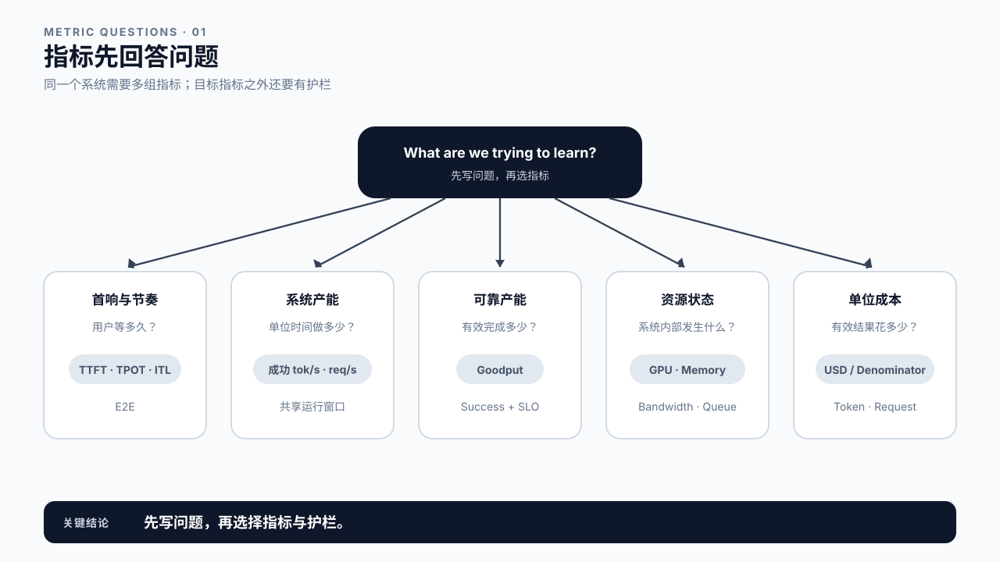
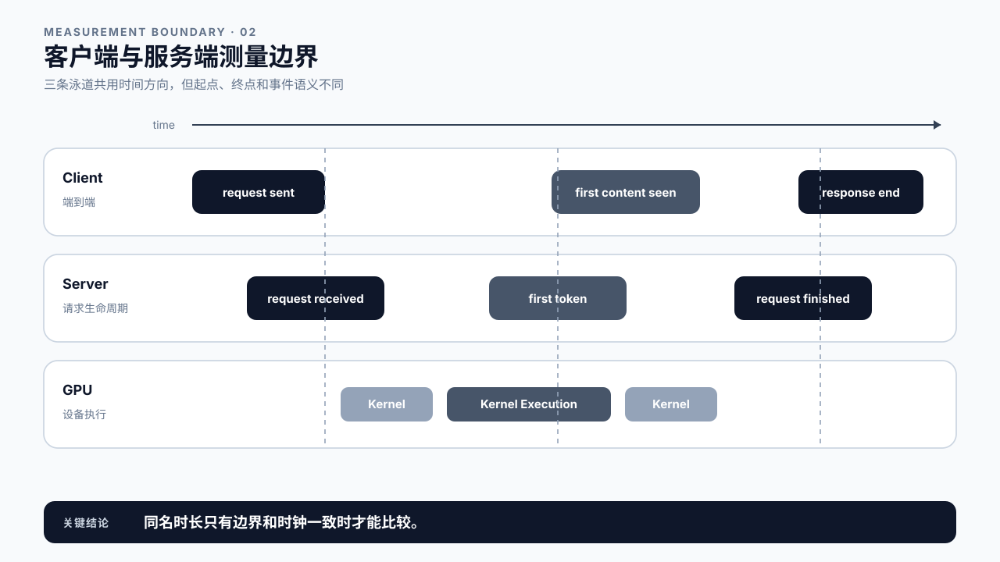
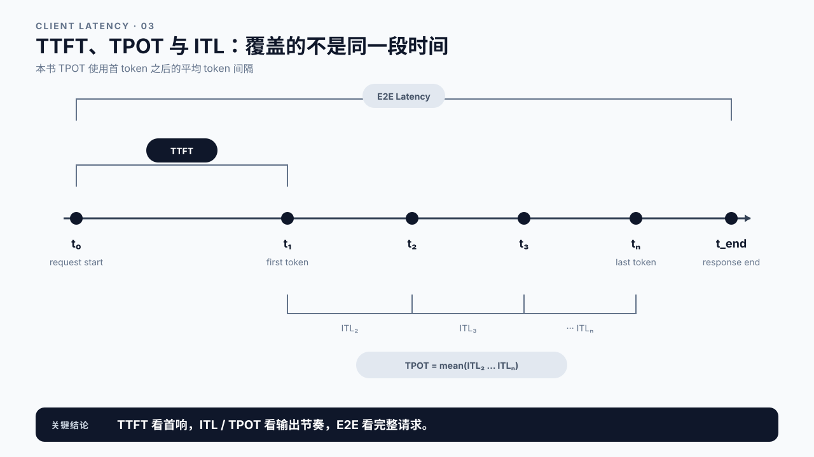
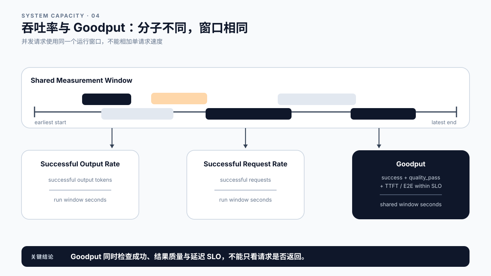
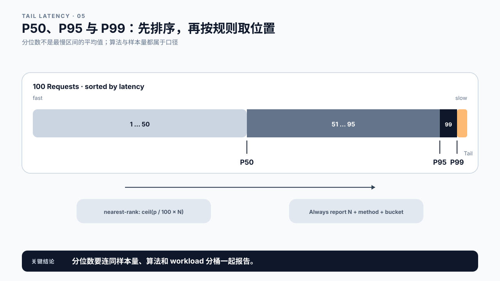
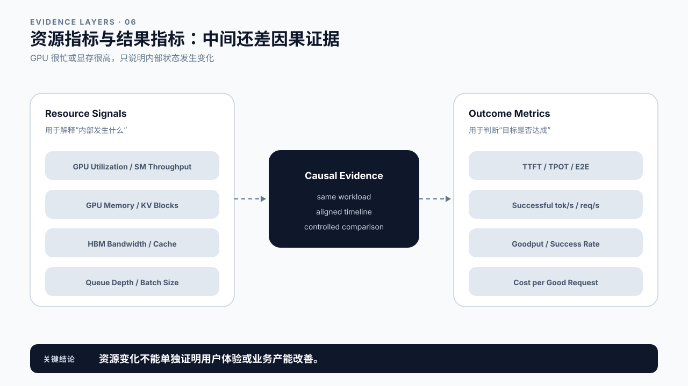
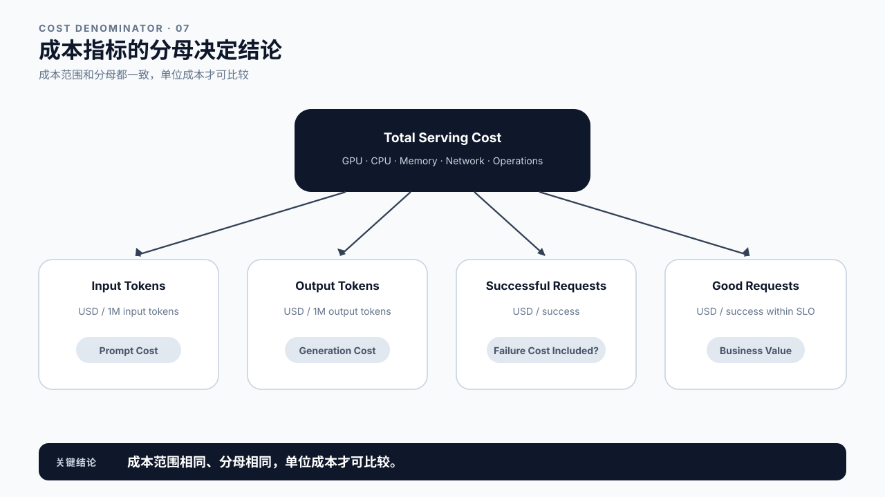
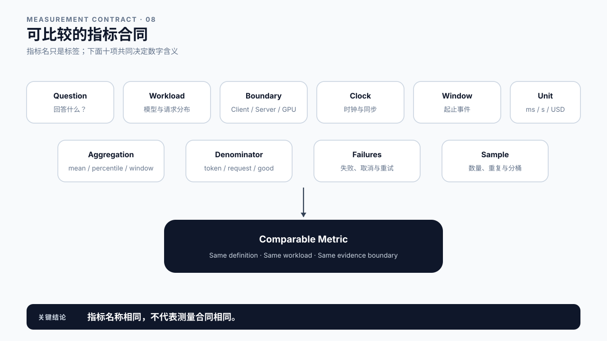
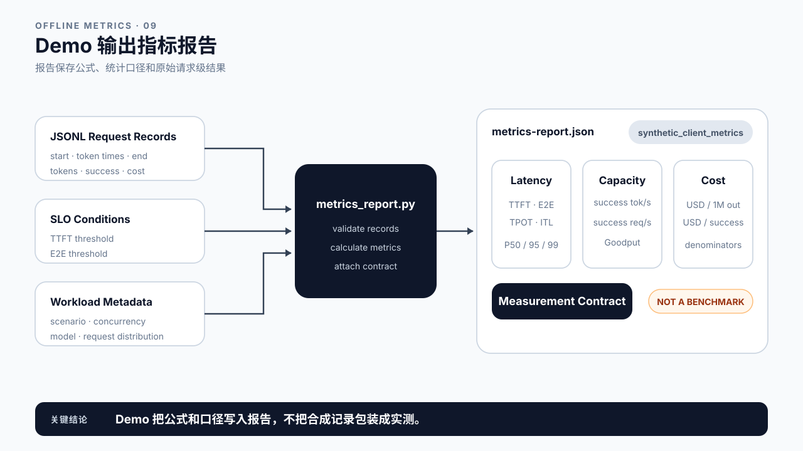

# 第 5 章 性能指标与延迟预算：先统一口径，再比较数字

## 学习目标

学完本章后，你应该能够：

- 按用户体验、系统产能、可靠性、资源和成本选择指标，而不是只报一个 tokens/s。
- 区分客户端、服务端和 GPU 三个测量边界。
- 定义 TTFT、E2E、TPOT、ITL、成功/已观测输出速率、成功请求速率和 Goodput。
- 从业务 TTFT / E2E SLO 反推 Client/Gateway、Queue、首 token、Decode/Streaming 和 Response Tail 的阶段预算。
- 解释 P50、P95、P99、样本量与分位数算法之间的关系。
- 区分结果指标与资源指标，避免用 GPU Utilization 代替用户体验。
- 为成本指标写清输入 token、输出 token、成功请求或 SLO 合格请求等分母。
- 从真实 vLLM 请求报告中提取可成立的指标，再用离线检查器验证公式、质量合同和延迟预算。

第 2 章定义了请求生命周期，第 3、4 章分别解释模型执行和 Serving 组件。本章把前三种视图转换成测量语言：当团队说“慢”“吞吐高”“GPU 很忙”或“成本下降”时，这些话究竟对应哪个观测点、哪个统计窗口和哪个分母？

本章不教你设计正式 Benchmark。Workload 与 SLO 在第 6 章定义，Warmup、重复次数和实验控制属于第 7 章。这里先保证同一个指标名称指向同一种计算，并把业务 SLO 拆成可检查的阶段预算。

## 核心问题

1. 用户、服务端和 GPU 看到的是不是同一段时间？
2. TTFT、TPOT、ITL 和 E2E 分别覆盖哪段请求时间？
3. 输出 token 速率、请求速率与 Goodput 为什么不能互相替代？
4. 为什么平均值正常，生产环境仍可能出现大量投诉？
5. “Cost per Token”缺少什么信息时无法比较？
6. 如何把业务 SLO 分配成阶段预算，又不把预算误当作实测值？

## 5.0 指标先回答问题

指标不是越多越好。先写问题，再选择数字：

| 问题 | 指标族 | 常见指标 |
|---|---|---|
| 用户多久看到反馈？ | 交互延迟 | TTFT、ITL / TPOT、E2E |
| 系统单位时间完成多少工作？ | 产能 | 成功/已观测 output tokens/s、成功 requests/s |
| 达标的有效工作有多少？ | 可靠产能 | Goodput、成功率、取消率 |
| 慢请求集中在尾部吗？ | 分布 | P50、P95、P99、最大值、样本量 |
| 资源发生了什么？ | 资源状态 | GPU Utilization、显存、HBM 带宽、Queue Depth |
| 每单位有效结果花多少钱？ | 成本 | USD / 1M input tokens、USD / 1M output tokens、USD / good request |

同一次改动可能让成功输出 token 速率上升，却让 TTFT P99 变差；也可能减少显存占用，却增加 GPU 小时。性能报告必须同时覆盖目标和护栏，不能只挑最好看的数字。



图5-1：指标先回答问题。

## 5.1 客户端、服务端与 GPU：先确定测量边界

同一个请求至少有三种时钟：

- **客户端时钟**：从调用方发出请求，到收到首个非空内容、后续流式片段和最终结束。
- **服务端时钟**：从 Gateway 或 Engine 接收请求，到排队、调度、首 token、最后 token、序列回收。
- **GPU 时钟**：Kernel 的提交、开始、结束，HBM 读写和计算单元活动。

客户端 TTFT 包含网络、入口处理、排队、Prefill、Sampling 和首段返回。服务端的 `first_token` 指标可能从 `request_received` 开始，也可能只覆盖 Engine 内部。GPU Kernel Duration 只覆盖设备执行。三个数字可以同时正确，却不应共用一个标签。

第 2 章的客户端流式 Demo 统计的是首个非空内容 chunk，不保证一个 chunk 只含一个 token。接入真实接口时，如果没有逐 token 时间戳，应写 `time_to_first_content_chunk` 和 `chunk_interval`；不能把 chunk 间隔直接命名为严格 ITL。

时钟来源也要固定。单机时长适合使用单调时钟；跨机器事件需要时钟同步或 Trace 上下文，否则服务端事件与客户端事件可能无法安全相减。



图5-2：客户端与服务端测量边界。

## 5.2 TTFT、E2E、TPOT 与 ITL

假设客户端在 `t0` 发出请求，在 `t1` 观察到第一个输出 token，在 `t2 ... tn` 观察到后续 token，在 `t_end` 确认响应完成。

### TTFT：首 token 等待

```text
TTFT = t1 - t0
```

它描述用户等待首次有效反馈的时间。TTFT 是端到端结果指标，不等同于 Prefill；Queue、网络和入口处理都可能在其中。

### E2E Latency：请求总时长

```text
E2E = t_end - t0
```

E2E 同时受首 token 前等待、输出长度、生成节奏和响应尾部影响。比较 E2E 时必须同时报告输入与输出 token 分布。

### ITL：相邻 token 间隔

```text
ITL_i = t_i - t_(i-1),  i >= 2
```

ITL 是一组值，可以计算均值与分位数。它直接呈现流式输出是否均匀。只报告平均 ITL 会隐藏偶发停顿。

### TPOT：首 token 之后的平均 token 时间

本书的客户端 Demo 使用：

```text
TPOT = mean(ITL_2 ... ITL_n)
     = (t_n - t_1) / (n - 1),  n > 1
```

只有一个输出 token 时，TPOT 未定义，报告为 `null`，而不是 0。其他工具可能用 `(E2E - TTFT) / (output_tokens - 1)`；如果 `t_end` 还包含尾部网络或清理时间，两种结果会有差异。报告中必须写公式。



图5-3：TTFT、TPOT 与 ITL。

## 5.3 从业务 SLO 反推延迟预算

SLO 是结果约束，预算是团队为各阶段预留的上限。以交互式请求为例：

```text
TTFT Budget
  = Client/Gateway
  + Queue
  + Scheduled-to-First-Token

E2E Budget
  = TTFT Budget
  + Decode/Streaming
  + Response Tail
```

假设业务要求 `TTFT <= 250 ms`、`E2E <= 800 ms`，可以先提出一版工程预算：

| 阶段 | 预算 |
|---|---:|
| Client/Gateway | 40 ms |
| Queue | 60 ms |
| Scheduled-to-First-Token | 130 ms |
| TTFT 未分配余量 | 20 ms |
| Decode/Streaming | 500 ms |
| Response Tail | 40 ms |
| E2E 未分配余量 | 30 ms |

预算不是对真实系统的断言。Ch2 的客户端流式报告只能核对首 chunk 和 E2E；Ch2 的请求级指标可以核对 Queue、Scheduled-to-First-Token 和 Generation。缺少某个边界时应标为不可得，不能为了让预算表闭合而反推一个“实测值”。

预算的作用是让排障有优先级：哪个已观测阶段超出分配，先去检查对应组件；所有已知阶段都达标但端到端仍超标，说明入口、网络、Response Tail 或测量边界仍有缺口。

## 5.4 吞吐率与 Goodput：先把分子和窗口写全

“TPS”这个缩写很容易制造误解。它可能指 Input Tokens/s、Output Tokens/s，也可能把两者相加。本书要求把方向写进名称。

### Successful Output Tokens Per Second

对并发请求，系统吞吐使用共享测量窗口：

```text
successful_output_tokens_per_second
  = window 内成功生成的 output tokens
    / (最后结束时间 - 最早开始时间)
```

不能把各请求的 `output_tokens / request_latency` 相加，那会重复计算并发重叠的墙钟时间。

### Successful Requests Per Second

```text
successful_requests_per_second
  = window 内成功请求数 / measurement_window
```

成功请求速率与成功输出 token 速率不会固定同比变化。短回答可能带来更高的请求速率和更低的 token 速率；长回答可能相反。两者都要带上 workload。

`submitted_requests_per_second_over_run_window` 使用“最早提交到最晚完成”的整场运行窗口。它描述本次运行的提交负载，不是严格到达率。若要报告 arrival rate，必须另设固定到达窗口。

### Goodput

Throughput 只问“做了多少”，Goodput 还要求结果有效。先定义合格条件，例如：

```text
good request
  = success
  AND quality_pass
  AND TTFT <= 250 ms
  AND E2E <= 800 ms

Goodput = good requests / measurement_window
```

SLO、质量和可靠性条件必须写进报告。不同团队若使用不同阈值或质量门槛，Goodput 数字不能直接比较。对于 Agent，还可以增加任务完成、工具调用成功或最大步数等业务条件。



图5-4：成功输出速率、成功请求速率与 Goodput 使用同一个运行窗口，但分子不同。

## 5.5 P50、P95、P99 与尾延迟

平均值回答整体中心，分位数回答请求分布。将 N 个延迟从小到大排序，P95 表示按指定算法取出的 95% 位置值。它不表示“最慢 5% 的平均值”。

分位数算法不止一种。课程 Demo 使用 **nearest-rank**：

```text
rank = ceil(p / 100 × N)
percentile = sorted_values[rank]
```

Python、NumPy、Prometheus、数据库和可观测平台可能采用插值、直方图估计或 nearest-rank。算法不同，小样本结果尤其容易不同。

样本量必须与 P99 一起报告。只有 20 个请求时，nearest-rank P99 实际取到最大值，很难支撑稳定的生产尾延迟结论。直方图指标还要报告 bucket 边界，否则 P99 只是桶内估计。

尾延迟分析还要分桶。长 Prompt、长 Output、高并发、冷启动和错误重试混在同一分布里，整体 P99 很难指导行动。按 workload 特征分层后，才知道尾部来自哪类请求。



图5-5：P50、P95 与 P99。

## 5.6 资源指标不是用户结果

GPU Utilization、显存占用、HBM Throughput、SM Throughput、Power、CPU Utilization 和 Queue Depth 都很重要。它们适合解释“系统内部发生了什么”，不能单独证明“用户体验更好”。

例如，GPU Utilization 上升可能意味着：

- Batch 更大，成功输出 token 速率上升；
- Queue 更长，TTFT P99 同时恶化；
- 请求量本身上升，系统接近饱和；
- 某个低效 Kernel 长时间占用 GPU；
- 采样窗口变化，两个数字不可比。

显存占用也只是容量状态。更多 KV Cache 可能支持更高并发，也可能让可用余量过小、增加抢占或 OOM 风险。

一份完整报告至少把两类指标放在一起：结果指标说明是否达成用户或业务目标，资源指标帮助提出和验证原因。第 6、7 章会先固定 Workload/SLO，再建立可重复 Baseline。



图5-6：资源指标与结果指标。

## 5.7 成本指标：分母决定结论

“Cost per Token 下降了”缺少三个关键信息：计算的是输入还是输出 token，成本包含哪些资源，失败与未达标请求如何处理。

常见口径包括：

```text
USD per 1M input tokens
  = total serving cost / input tokens × 1,000,000

USD per 1M output tokens
  = total serving cost / output tokens × 1,000,000

USD per successful request
  = total serving cost / successful requests

USD per good request
  = total serving cost / requests satisfying success + quality + latency SLO
```

总成本可只算 GPU，也可包含 CPU、内存、存储、网络、托管服务与运维摊销。两份报告若成本范围不同，即使分母相同也不能直接比较。

失败请求消耗过资源但没有形成成功结果。若总成本包含失败请求，`USD per successful request` 会把这部分浪费计入单位成功成本，这通常更接近业务现实。若报告选择排除失败成本，也必须明示。

输入和输出 token 的计算成本与供应商定价可能不同。不要把两者简单相加后仍称为“每 token 成本”，除非业务明确接受这个合并口径。



图5-7：成本指标的分母。

## 5.8 可比较的指标合同

两个数字可以比较，至少要共享下面这份合同：

| 字段 | 必须写清的内容 |
|---|---|
| Question | 指标要回答的业务或工程问题 |
| Workload | 模型、Prompt / Output 分布、并发、采样和请求类型 |
| Boundary | Client、Gateway、Engine、Worker 或 GPU |
| Clock | 单调时钟、墙钟、跨机同步方式 |
| Window | 起止事件、Warmup 是否排除、窗口长度 |
| Unit | ms、s、tokens/s、requests/s、USD |
| Aggregation | mean、nearest-rank、直方图估计、窗口平均 |
| Denominator | 输入 token、输出 token、成功请求、good request |
| Failures | 失败、取消、超时和重试如何计入 |
| Sample | 请求数、重复次数与分桶方式 |

任何一项变化，都可能让同名指标失去可比性。最实用的习惯是让报告同时保存公式、元数据和原始记录，而不是只保存截图。



图5-8：可比较的指标合同。

## 5.9 Demo：真实请求报告与指标合同检查器

本章首先读取第 2 章真实 vLLM 请求报告 `content/ch02/evidence/gx10-streaming-client-report.json`。这份报告提供客户端首内容 chunk、完整请求时间、token usage、chunk 数和 GPU 快照，可以用于判断哪些指标已经具备边界，哪些仍然不可计算。

`code/ch05/metrics_report.py` 是指标合同检查器，只依赖 Python 标准库。它读取 JSONL 请求记录，验证客户端延迟、吞吐、Goodput、成本和预算公式。默认样例用于检查计算规则，不代表 vLLM 或 GX10 的性能。

从 Git 仓库根目录运行公式样例：

```bash
python3 code/ch05/metrics_report.py
```

每条记录包含：

- `start_ms`、`token_times_ms` 和 `end_ms`；
- `prompt_tokens`、`output_tokens`；
- `success`、`quality_pass` 和 `cost_usd`；
- `quality_metric`、`quality_score`、`quality_threshold`、`evaluator_name` 和 `evaluator_version`。

Demo 会拒绝逆序 token 时间、输出 token 数量不一致和无法复核的质量标签。失败、超时或取消的请求可以保留已经到达客户端的部分 token；报告会把 `successful_output_tokens`、`partial_output_tokens` 和 `observed_output_tokens` 分开，并分别报告运行窗口提交速率、成功请求速率、成功输出速率和已观测输出速率。Goodput 还要求 `quality_score >= quality_threshold`，并满足成功与 TTFT/E2E SLO。报告会保存质量指标、阈值、评估器名称和版本。

报告使用所有请求的最早开始到最晚结束作为共享墙钟窗口，把分位数算法、TPOT 公式和 SLO 条件写入 `measurement_contract`，并输出一份 TTFT/E2E 阶段预算。预算是目标分配，不是对样例记录的性能归因。

`synthetic_client_metrics` 表示这份输出只验证公式和数据合同。它不能进入课堂主案例，也不能替代真实 vLLM 报告。真实流式 API 若只能提供 chunk 到达时间，需要更换字段名称或在客户端重新 tokenize，不能原样沿用 token 口径。



图5-9：指标合同检查器输出。

## 5.10 课堂案例：一份真实报告能算出哪些指标

第 2 章 GX10 客户端流式报告记录了一次真实 vLLM 请求。它只覆盖客户端观测层：请求级 Queue、TTFT 和 Generation 要等第 2 章的完整生命周期报告，本节先看仅凭客户端证据能算到哪一步。先把原始字段和结论边界放在一起：

| 真实字段 | 报告值 | 可以写出的结论 | 不能写成什么 |
|---|---:|---|---|
| `time_to_first_content_chunk_ms` | 29.64 ms | 客户端在 29.64 ms 后看到首段正文 | 纯 Prefill 时间、严格服务端 TTFT |
| `total_latency_ms` | 2345.26 ms | 客户端观察到的完整流式请求时长 | 纯模型执行时间 |
| `prompt_tokens` | 30 | 本次请求的输入 token 数 | 生产 Prompt 长度分布 |
| `output_tokens` | 256 | 本次请求的输出 token 数 | 系统持续吞吐能力 |
| `stream_chunks` | 254 | 客户端收到 254 个非空内容 chunks | 254 个模型 tokens 或 Decode steps |
| `chunk_interval_avg_ms` | 9.15 ms | 内容 chunks 的平均到达间隔 | 严格 ITL 或 TPOT |
| `request_output_rate_tokens_per_second` | 109.16 | 输出 token 数除以完整请求时间 | 纯 Decode 速率、并发服务吞吐 |
| `gpu_after.gpu_util_pct` | 96.0% | 请求结束后一次 GPU 快照的读数 | 整段请求的平均 GPU Utilization |

这份报告只有一个请求，因此不能形成 P50、P95、P99，也不能证明稳定的请求速率、Goodput 或容量。它还缺少 vLLM 版本，不能作为完整可复现的 Benchmark。真实数据并不会自动带来正确结论；样本、边界和分母不成立时，最准确的结果就是“当前不可计算”。

课堂讨论：

1. 哪些字段属于客户端结果指标，哪个字段只是资源快照？
2. 为什么 `109.16` 不能简称为“模型 TPS”？
3. 要计算严格 TPOT、P95 和 Goodput，还需要补采哪些原始记录？

### 补充案例 A：用第二章真机报告拆分首包等待

第 2 章真实报告完成后，把请求级 Queue、scheduled-to-first-token 与客户端首内容 chunk 等待放进同一张表。只比较各自定义，不用相减结果冒充网络耗时。

讨论问题：哪些阶段已经有请求级服务端证据，哪些入口和返回路径仍然不可得？

### 补充案例 B：把真实 RAG 或 Agent 任务放回业务边界

选择一次真实 RAG 或 Agent Trace，记录实际发生的 LLM 调用、工具调用、重试、输入/输出 token 和任务终态。单请求指标属于模型调用层，`task_e2e_ms` 和任务 Goodput 属于业务任务层，两层分母不能混用。

讨论问题：如果工具等待占据关键路径，优化模型 TPOT 是否一定缩短任务 E2E？还缺哪类证据？

## 5.11 常见误区

误区一：把客户端 chunk 当成 token。

一个 chunk 可能包含零个、一个或多个 token。没有 token 级时间戳时，应使用 chunk 口径命名。

误区二：并发请求的 tokens/s 用单请求速度相加。

系统吞吐要用共享墙钟窗口。相加单请求速度会重复计算重叠时间。

误区三：TPOT 只有一个输出 token 时记为 0。

没有首 token 之后的间隔，TPOT 不存在。0 会错误暗示生成是瞬时完成的。

误区四：P99 不带样本量与算法。

小样本或不同插值方法会产生不同结果。报告 P99 时要写请求数和计算方式。

误区五：GPU Utilization 是最终目标。

资源指标用于解释结果，不替代 TTFT、Goodput、成功率和成本。

误区六：成本指标省略分母。

输入 token、输出 token、成功请求和 good request 会给出不同工程结论。

## 本章总结

LLM 性能指标必须绑定问题、边界、窗口、算法和分母。TTFT 描述首 token 等待，ITL / TPOT 描述首 token 之后的输出节奏，E2E 描述完整请求；成功输出速率、成功请求速率和 Goodput 分别描述 token 产能、请求产能和满足条件的有效产能。

P50、P95、P99 要带上样本量与分位数算法。GPU 与显存指标是解释线索，不是用户结果。成本报告必须明确资源范围，以及输入 token、输出 token、成功请求或 SLO 合格请求等成本分母。

下一章定义 LLM Workload 与 SLO，确保这些指标是在有业务含义的输入/输出长度、到达模式、并发和质量要求下使用。

### 本章 Checklist

- [ ] 能分别写出 TTFT、E2E、ITL 和本书 TPOT 公式。
- [ ] 能区分客户端首 chunk、服务端首 token 与 GPU Kernel 时间。
- [ ] 能用共享墙钟窗口计算成功输出 token 速率和成功请求速率。
- [ ] 能为业务 SLO 定义 Goodput。
- [ ] 能解释 nearest-rank P95 / P99 与样本量的关系。
- [ ] 能区分结果指标与资源指标。
- [ ] 能为成本指标写清成本范围和分母。
- [ ] 能为两份待比较报告补齐指标合同。

## 课后练习

1. 使用第 2 章 GX10 客户端流式报告，列出能够直接读取、需要计算和当前不可得的指标。
2. 解释为什么报告中的 `chunk_interval_avg_ms` 不能直接改名为 TPOT。
3. 说明单请求报告为什么不能形成 P95、系统吞吐和 Goodput。
4. 第 2 章真机报告完成后，对照客户端首内容 chunk 与请求级服务端 TTFT，分别写出两者的边界。
5. 运行指标合同检查器，改变 SLO 阈值，解释为什么公式输出变化不能当作 GX10 性能变化。
6. 为一条真实 RAG 或 Agent Trace 写指标合同，至少包含 Boundary、Window、Aggregation、Failures 和成本分母。
