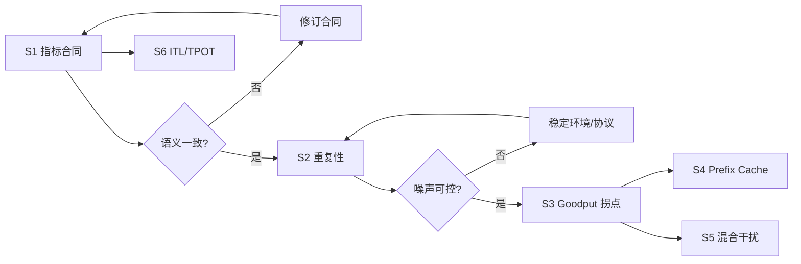

# 第一批 Spike 实验计划 v1.0

> 目标：在批量建设 Ch8–Ch30 Demo 前，用最小实验回答最危险的架构不确定性。
> 原则：Spike 只证明方法可行或不可行，不直接演进为正式实现；所有临时代码应放在 `.spike/<topic>/`。

## 1. 优先级总览

|顺序|Spike|级别|核心不确定性|预计时间|退出条件|
|---|---|---|---|---|---|
|S1|指标口径与报告合同|L1|Ch6、Workshop、vLLM 是否算出同一指标|0.5–1 天|共享测试向量全部一致|
|S2|可重复性与缓存卫生|L2|warmup/repeat/cache policy 能否把噪声降到可用范围|1 天|TPS CV≤5%，TTFT p95 CV≤10%|
|S3|饱和拐点与 Goodput|L2|如何稳定找到“吞吐还涨但体验已坏”的拐点|1 天|得到可重复容量曲线|
|S4|Prefix Cache 因果矩阵|L2|现有脚本是否真正隔离缓存收益与污染|1 天|共享前缀显著受益、无共享前缀不虚报收益|
|S5|混合 Prefill/Decode 干扰|L2|Chunked Prefill 是否改善短请求尾延迟，代价是什么|1–2 天|短请求尾延迟改善且长请求代价被量化|
|S6|投机解码 ITL/TPOT 语义|L1+L2|多 token chunk 是否导致当前 ITL 指标误导|1 天|客户端与 vLLM 输出解释一致|

第一批必须先做 S1、S2、S3；S4–S6 是对统一框架的首批实际验收。

## 2. 共同前置

- 不在当前内容迁移提交中混入 Spike 代码。
- 新建前先检查 `.spike/` 和 `docs/designs/README.md`，避免重复实验。
- 推荐单卡 Core 环境：能稳定运行 7B instruct 模型的 NVIDIA GPU；不规定跨机器通用绝对性能数字。
- 每个 Spike 保存 `NOTES.md`、resolved manifest、原始记录、运行日志和结论。
- GPU Spike 必须记录精确 GPU、driver、CUDA、PyTorch、vLLM、模型 revision 和容器 digest。
- 每次发现 wall，应重新评估替代方案，不把“继续修当前脚本”当作默认答案。

## 3. S1：指标口径与报告合同

### 假设

只要统一测量点、token 数和共享时间窗，Ch6 的合成指标、Workshop 客户端与 vLLM benchmark 可以在同一测试向量上得到一致结果。

### 三种候选

1. **最简单**：只写一份指标说明文档。成本最低，但不能阻止代码再次漂移。
2. **推荐**：建立语言无关 JSON 测试向量 + versioned schema，Ch6 与 Workshop 同时消费。
3. **工具优先**：完全委托 `vllm bench serve`/GenAI-Perf，仓库只做转换。维护少，但失去 L1 教学能力且受工具版本影响。

### 实验步骤

1. 构造 6–10 个确定性的 RequestRecord，包括单 token、正常流、空 chunk、多 token chunk、失败、截断。
2. 预先手算 TTFT、E2E、TPOT、ITL、Output TPS、RPS、Goodput。
3. 分别喂给 Ch6 计算器和 Workshop 计算器。
4. 使用本地假 SSE server 重放同样事件，验证协议解析不会改变语义。
5. 对一小批真实 vLLM 输出，与 `vllm bench serve --save-detailed` 对齐。

### 成功标准

- 所有确定性向量精确一致或浮点误差 < 0.1%；
- 空流、截断、单 token 有明确状态，不产生假成功或除零；
- ITL 与 TPOT 在多 token chunk 向量上有意不同；
- system TPS 来自共享窗口，而非 per-request TPS 求和；
- schema 能拒绝重复/错误类型字段。

### 交付物

- `.spike/metrics-contract/NOTES.md`
- `request-records.fixture.jsonl`
- `expected-metrics.json`
- schema 兼容性结论

## 4. S2：可重复性与缓存卫生

### 假设

明确 warmup、交错运行、固定 seed 和 cache reset 后，单卡基线的 trial 波动足够小，可以判断 5%–10% 级优化。

### 实验矩阵

|变量|取值|
|---|---|
|warmup|0 / 固定请求数 / 稳态检测|
|运行顺序|AAA-BBB / A-B-B-A|
|prefix cache|跨 trial 保留 / 每 trial 重启|
|seed|固定 / 每 trial 变化|
|trial|至少 5|

### 步骤

1. 选择不启用实验优化的标准 vLLM 配置和固定 S-S workload。
2. 依次跑上述矩阵，记录 Output TPS、TTFT p95、GPU 时钟、温度、功耗。
3. 计算每组 CV 和漂移趋势。
4. 再用共享前缀 workload 重复，确认 prefix cache 会污染重复运行。
5. 选出成本最低且满足稳定性门槛的协议。

### 成功标准

- 稳定协议下 Output TPS trial CV ≤ 5%；
- TTFT p95 trial CV ≤ 10%；
- 能自动标记未 reset 的缓存污染；
- 明确教学短跑和正式参考跑的最小样本量。

## 5. S3：饱和拐点与 Goodput

### 假设

单看总 TPS 会把过载点误判为最佳配置；加入 TTFT/TPOT SLO 后，Goodput 曲线会更早出现峰值。

### 实验设计

- workload：S-S 与 L-S 两种；
- load model：closed-loop concurrency `1,2,4,8,16,32...`，直到错误或明显过载；
- 每个点按 S2 选出的协议重复；
- SLO：根据案例预注册，不从结果反推；
- 指标：Output TPS、TTFT p95/p99、TPOT p95、RPS、Goodput、错误率、GPU utilization。

### 成功标准

- 至少连续两个扫描点显示过载趋势；
- 可重复识别 capacity knee；
- 报告能区分“最大原始吞吐”和“最大 Goodput”；
- 为 Ch8、Ch21、Ch26 提供同一张容量曲线数据。

## 6. S4：Prefix Cache 因果矩阵

### 假设

Prefix Cache 的 TTFT 收益随前缀复用率增加；在 0% 复用时不应出现稳定收益。高并发排队会掩盖该收益。

### 2×3×2 因子

- cache：off/on；
- prefix reuse：0%/50%/近 100%；
- concurrency：低/接近饱和；
- cache state：每个 trial 采用预注册 cold 或 warm 策略。

### 主指标与 guardrails

- 主指标：TTFT p50/p95、实际 Prefill token、cache hit rate；
- guardrails：Output TPS、GPU memory、错误率；
- 反例：0% reuse 必须展示收益边界。

### 成功标准

- 配置日志/capability probe 能证明开关生效；
- reuse 与收益存在一致剂量关系；
- cache-off 不受前一 trial 污染；
- 高并发结果能解释 queue delay 如何掩盖 prefill 节省。

## 7. S5：混合 Prefill/Decode 干扰

### 假设

Chunked Prefill 会用少量长请求 TTFT 代价，换取混合负载下短请求 TPOT p95/p99 的改善；纯长或纯短 workload 收益有限。

### 实验设计

- 流 A：短输入、持续长输出，模拟交互 decode；
- 流 B：周期性长输入、短输出，制造 prefill interference；
- 配置：chunked prefill off/on；
- 对照：纯 A、纯 B、A+B 三种 workload；
- 采样：请求 timeline + GPU timeline（可先用 client timeline，Nsight 作为进阶证据）。

### 成功标准

- 混合 workload 下短请求 TPOT p95/p99 改善超过 S2 噪声；
- 长请求 TTFT 代价被量化；
- 纯 workload 不虚报普遍收益；
- 能形成 Ch21 的“干扰”教材图和 Ch22 的优化报告。

## 8. S6：投机解码 ITL/TPOT 语义

### 假设

投机解码会使一个 SSE chunk 携带多个 token；此时事件级 ITL 会高估每 token 等待，而 TPOT 仍可反映摊销后的 decode 速度。

### 步骤

1. L1 重放：构造单 token chunk 与 multi-token chunk 两种等价 token timeline。
2. 验证当前客户端对 chunk/token 的计数和 usage fallback。
3. L2 实跑：标准 decode 与 speculative decode，使用可预测/开放式两类 prompt。
4. 同时记录 acceptance rate、TTFT、ITL、TPOT、Output TPS。
5. 对齐 vLLM detailed benchmark 的测量点。

### 成功标准

- 报告不再把 chunk 数作为 token 数而不报警；
- 多 token chunk 时明确展示 ITL/TPOT 差异；
- acceptance rate 与 TPOT 收益关系可解释；
- 低 acceptance workload 给出“不该启用”的反例。

## 9. Spike 执行顺序与决策门

在 S1 和 S2 通过前，不建议批量补写其它 Workshop 的“提升百分比”。Spike 结束后由用户确认结论，再将其整理为设计记录和正式实现任务。
