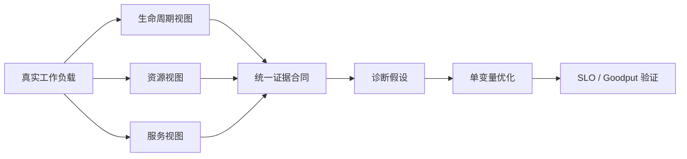
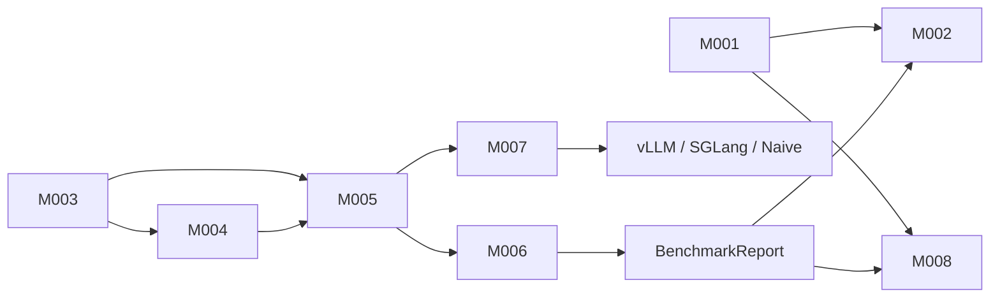
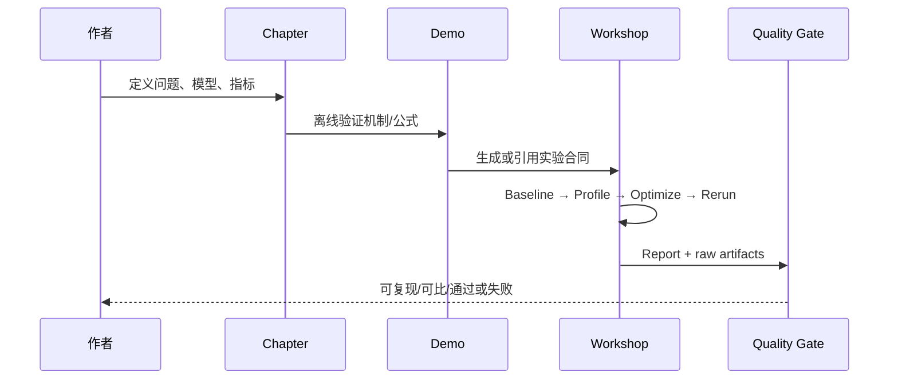
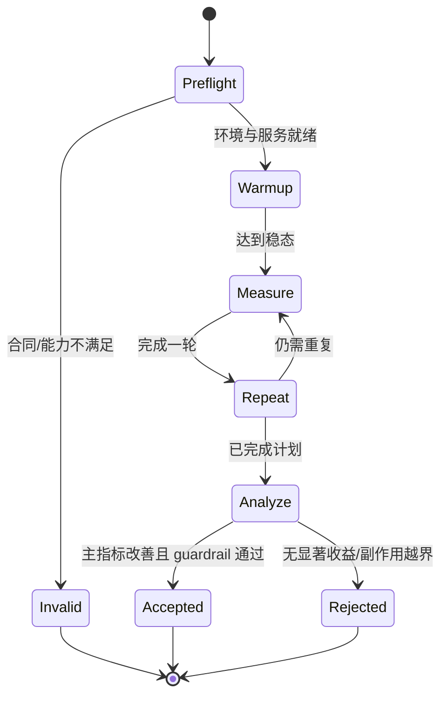

# 《LLM 推理性能工程实战》技术主线与实验架构 v1.0

> 状态：Architecture Proposal
> 基线提交：`a1cefe0fee746f238821051865ebbcb4c484fd57`
> 分析日期：2026-09-08
> 范围：书籍正文、章节 Demo、Workshop、Benchmark 报告与质量门

## 1. 执行摘要

本项目已经具备完整的 30 章正文、前 7 章教学 Demo、7 个可运行 Workshop 目录以及一套共享压测客户端。当前主要问题不是“有没有内容”，而是三条交付轨尚未由统一契约连接起来：正文解释一种概念，章节 Demo 用合成数据演示一种口径，Workshop 又以另一套报告结构测量真实服务。

建议全书采用以下唯一技术主线：

> **沿一次请求的生命周期，用统一证据契约完成“建模 → 测量 → 归因 → 优化 → SLO 验证”。**

落实成一句更具体的话：

> **同一个请求，使用三种视图观察：生命周期视图解释时间花在哪里，资源视图解释为什么慢，服务视图判断优化是否改善有效吞吐。所有结论落入同一份可复核实验报告。**

这一主线保留现有 7 Part / 30 Chapter 结构，不要求大规模搬目录。近期只需要先统一 `ExperimentManifest`、`RequestRecord`、`BenchmarkReport` 三个契约，并让 Ch2、Ch6、Ch7 与 Workshop 共用它们。

## 2. 当前项目事实

### 2.1 已有资产

- 权威课程结构是 7 Part、30 Chapter，学习路径为“启动服务 → 理解推理 → 测量性能 → 定位瓶颈 → 优化单 GPU → 优化 Serving/RAG/Agent → 规模化部署 → 综合项目”。证据见 [`strategy/course-design/02_Course_Outline_v1.0.md`](../course-design/02_Course_Outline_v1.0.md)。
- 30 章正文、review、storyboard 和 figures 均已存在；现有结构校验对 7 个 Part 全部通过。
- `code/chapter01` 到 `code/chapter07` 已有独立 CLI 和单元测试；Ch8–Ch30 尚未形成章节级代码交付。证据见 [`code/README.md`](../../code/README.md)。
- `content/workshops/` 中已有 7 个带代码的实验目录：模型内部、三档 Batching、KV 量化、Prefix Cache、CUDA Graph、投机解码、Chunked Prefill；其余优化点仍主要是实验讲义。证据见 [`content/workshops/README.md`](../../content/workshops/README.md)。
- Workshop 公共链路已经形成：实验脚本 → `common/serve.sh` → OpenAI-compatible 服务 → `common/bench.sh` → `bench_client.py` → JSON → `compare.py`。

### 2.2 已验证的基线

- `code/chapter01`–`chapter07` 共 69 项单元测试通过。
- 内容脚本 12 项测试通过，7 个 Part 的章节结构校验通过。
- Workshop 的 CPU 纯函数测试大部分通过；共享报告与对比工具当前正处于 TDD 修改中，最终应在迁移稳定后重新跑全量测试。
- 顶层执行 `python3 -m unittest discover -s code` 或 `-s content` 会得到 `0 tests`，因为当前目录不是可递归发现的 Python package；因此不能把这一命令当作项目绿灯。

### 2.3 当前断点

1. **指标口径分裂**：Ch6 已实现 TTFT、TPOT、TPS、goodput、成本和 measurement contract；Workshop 又独立实现另一套统计与报告字段。
2. **实验声明与实现不一致**：验收要求写有 warmup、多次重复、P99，但共享 runner 仍以单轮为主。
3. **缺少真实 trace 适配**：Ch2 的生命周期状态机只消费合成 JSONL，尚不能接入 vLLM/SGLang/OTel 事件。
4. **环境不可复现**：没有根级锁文件、容器摘要或框架兼容矩阵，核心 vLLM 版本未固定。
5. **质量门分散**：章节、插图、代码、Workshop 各自有测试，但没有统一入口和分级结果。
6. **迁移未收口**：工作区当前处于旧目录向 `content/` 的大规模迁移状态，根 README 和若干链接仍指向旧路径。

## 3. 全书技术主线

### 3.1 三个观察视图



|视图|核心问题|主要证据|主要章节|
|---|---|---|---|
|生命周期|时间花在哪里？|Queue、Prefill、Decode、Tail、RAG/Tool spans|Ch1–4、Ch20、Ch23–25|
|资源|为什么慢？|FLOPs、HBM、KV 容量、Kernel gap、通信、CPU|Ch5、Ch9、Ch12–19、Ch28–29|
|服务|这个优化对用户有用吗？|TTFT、TPOT、E2E、TPS、错误率、Goodput、成本|Ch6–8、Ch21–22、Ch26–27、Ch30|

### 3.2 五步性能工程闭环

现有课程的五步法应成为每一 Part 的重复结构，而不仅是设计文档中的理念：

1. **建模（Understand）**：明确请求路径、工作负载和资源约束。
2. **测量（Measure）**：用版本化契约获得 baseline，先证明数据可重复。
3. **归因（Diagnose）**：从现象提出假设，再用 trace/profile 证据证伪或确认。
4. **优化（Optimize）**：只改变一个主变量，保留其它可比条件。
5. **验证（Validate）**：同时检查质量、延迟、吞吐、资源、稳定性和成本；以 SLO/Goodput 决定是否接受。

### 3.3 7 Part 的递进关系

|Part|学习成果|必须产出的证据|
|---|---|---|
|1 推理系统基础|能画出请求和资源模型|RequestRecord + 模型/硬件账本|
|2 测量与根因|能建立可信基线并提出可证伪假设|ExperimentManifest + BaselineReport + Trace|
|3 Prefill|能解释长输入的 TTFT 和计算瓶颈|输入长度扫描 + Prefill profile + 优化 A/B|
|4 Decode|能解释 TPOT、KV 与生成效率|输出长度/并发扫描 + KV/带宽证据 + A/B|
|5 Serving/RAG/Agent|能处理排队、混合负载和关键路径|开放/闭环负载 + spans + Goodput|
|6 规模化|能从单实例外推容量并验证扩展效率|容量曲线 + scaling efficiency + cost|
|7 综合项目|能交付一份可复核的性能决策|完整 Performance Report + 原始工件|

### 3.4 每章与实验的最小连接合同

每个实践章节至少明确以下链接，避免正文、Demo、Workshop 变成三套孤岛：

|字段|含义|
|---|---|
|`chapter_id`|权威章节编号，如 `ch18`|
|`question`|本章要回答的唯一性能问题|
|`model`|本章使用的因果/性能模型|
|`offline_demo`|无需 GPU 的机制或数据分析实验|
|`gpu_workshop`|真实服务实验；没有则明确 `planned`|
|`primary_metrics`|最多 3 个主指标|
|`guardrail_metrics`|不能退化的质量/SLO/错误率/成本指标|
|`evidence`|报告、trace、profile、配置快照的路径|
|`acceptance`|通过条件和不适用边界|

## 4. 目标交付架构

### 4.1 模块粒度选项

**方案 A：按现有目录粗分为 6 个模块。** 优点是迁移成本低；缺点是会保留 `bench_client.py` 的多职责、指标重复实现和引擎 CLI 漂移。

**方案 B：按稳定能力拆为 8 个模块（推荐）。** 优点是可以小步抽契约，不必立即重排 30 章文件；每次框架升级只影响适配层。

### 4.2 推荐模块

```text
LLM 推理性能工程实战
├── M001 Editorial Model        # 大纲、Part、Chapter、模板、图
├── M002 Editorial Validation   # 章节、链接、SVG、布局与映射质量门
├── M003 Demo Catalog           # 逐章离线/真实 Demo
├── M004 Experiment Spec        # 工作负载、变量、A/B 与验收声明
├── M005 Benchmark Core         # 请求计划、负载生成、协议解析、运行编排
├── M006 Metrics & Observability# 指标、SLO、采样、统计与报告
├── M007 Engine Adapters        # vLLM/SGLang/OpenAI/Naive 与能力探测
└── M008 Publishing             # 单一源生成网页/书籍/Workshop 包
```

|ID|模块|当前落点|近期演进|
|---|---|---|---|
|M001|Editorial Model|`content/part*.md`、`content/chapterNN/`|补章节→Demo→Workshop manifest|
|M002|Editorial Validation|`content/scripts/`、章节 `test_figures.py`|统一入口，规则数据化|
|M003|Demo Catalog|`code/chapterNN/`|复用 M004/M006 契约|
|M004|Experiment Spec|各 Workshop README/shell/JSONL|新增机器可读 manifest|
|M005|Benchmark Core|`workshops/common/bench_client.py`、`bench.sh`|拆协议、runner、schema；支持 warmup/repeat|
|M006|Metrics & Observability|Ch6 + `bench_client.py` + analyzers|建立唯一指标库与报告 schema|
|M007|Engine Adapters|`serve.sh`、naive baseline server|结构化参数与 capability probe|
|M008|Publishing|根和 `content/index.html`|单一源生成，取消手工双写|

### 4.3 依赖方向



约束：

- M005 不得 import vLLM/SGLang；框架差异由 M007 吸收。
- M006 是 TTFT/TPOT/TPS/Goodput 的唯一事实源；章节 Demo 不再复制公式。
- M004 不使用无法审计的自由字符串描述唯一配置；主变量和控制变量必须结构化。
- M002 只验证合同，不负责生成“漂亮但无真实数据”的结果。

## 5. 三个核心数据合同

### 5.1 ExperimentManifest

描述“准备测什么”：模型与 revision、引擎版本、硬件、工作负载分布、到达模型、warmup、重复次数、主变量、控制变量、SLO 和质量门。示例见 [`experiment-manifest.example.yaml`](experiment-manifest.example.yaml)。

### 5.2 RequestRecord

描述“每个请求发生了什么”：请求标识、发送/首内容/末内容时间、输入/输出 token、成功/终止原因、生命周期 spans、质量结果。客户端时钟和服务端时钟必须分开命名，不允许直接混算。

### 5.3 BenchmarkReport

描述“这次运行能否复核”：manifest 摘要、环境快照、原始记录引用、统计方法、主指标、guardrails、错误样本、可比性结论和工件哈希。报告 schema 必须版本化；破坏性修改升级 major 版本。

## 6. 核心运行流程

### 6.1 教材到证据



### 6.2 真实 Benchmark



## 7. 架构不变量

1. 任何“提升 X%”必须能回溯到 manifest、原始记录、环境快照和统计方法。
2. Baseline 与 optimized 只能有一个声明的主变量不同；其它差异自动标为不可比。
3. 性能通过不能覆盖质量失败、错误率上升或 SLO 退化。
4. 同一报告不得混用客户端时钟和服务端时钟计算单个 duration。
5. 系统吞吐使用共享测量窗口，不能把每请求 tokens/s 相加充当全局 TPS。
6. 投机解码等多 token chunk 场景必须区分 ITL 与 TPOT。
7. 不把 `nvidia-smi` 压测前后两点称为峰值；峰值必须来自运行中时间序列。
8. 真实 GPU 结果必须注明“仅对该模型、硬件、框架、版本和 workload 成立”。
9. 合成 Demo 输出必须显式标记 synthetic，不得作为真实性能数字。
10. 默认实验服务只监听本机；开放远程访问必须显式配置认证和网络边界。

## 8. 风险与优先级

|优先级|风险|影响|近期措施|
|---|---|---|---|
|P0|环境与 CLI 未锁定|实验无法复现|建立 capability matrix、容器/锁文件和版本快照|
|P0|指标口径重复|章节与 Workshop 结论冲突|先完成统一 schema + metrics Spike|
|P0|迁移状态未收口|误删/链接失效|先单独审核纯路径迁移，不混入架构重构|
|P1|SSE 空流/截断可能被记成功|性能报告可信度受损|定义完成状态与 termination reason|
|P1|缺 warmup/repeat/cache hygiene|噪声或缓存污染被误判为收益|runner 原生支持并在报告中强制记录|
|P1|共享脚本扇入高|一次 CLI 变化影响所有实验|引擎 capability probe + 结构化 adapter|
|P1|无统一质量门|局部绿、整体不可交付|提供 CPU/GPU/内容三档 gate|
|P2|GPU 只取前后快照|无法解释峰值和波动|增加采样 sidecar 或 DCGM/NVML 适配|
|P2|静态页面手工双写|发布内容漂移|指定单一源并生成副本|

## 9. 分阶段落地建议

### Phase A：证据合同（先做）

- 收敛指标公式和报告 schema。
- 加入运行窗口吞吐、P99、Goodput、termination reason、可比性检查。
- 让 Ch6 和 Workshop 共用同一指标测试向量。
- 完成本文档配套的首批 Spike，先证明方案再重构。

### Phase B：可重复 runner

- 增加 preflight、readiness、warmup、repeat、seed、cache reset 和 A/B 交错顺序。
- 增加运行中 GPU 时间序列采样。
- 报告原始记录与环境工件的哈希。

### Phase C：适配与质量门

- 将 OpenAI SSE、vLLM server、naive server 拆成显式 adapter。
- 建立 CPU-only、single-GPU、multi-GPU 三档测试入口。
- 建立章节—Demo—Workshop 映射校验和链接校验。

### Phase D：书籍与 Workshop 收口

- 按同一报告模板补齐 Ch8–Ch30 Demo。
- Core Workshop 在指定单卡环境实跑并保存参考报告。
- Advanced Workshop 提供真实硬件版与 trace/case-study 降级版。
- Ch30 消费前面所有合同，产出最终性能决策报告。

## 10. Architecture Gate 结论

**有条件通过。** 现有 7 Part / 30 Chapter 课程结构和“先系统、后分析、再优化”的方向正确，可以继续；但在批量开发 Ch8–Ch30 Demo 之前，应先完成指标合同、可重复 runner 和首批 Spike。否则新增实验会复制当前口径和版本债务，后续统一成本更高。

通过条件：

- `ExperimentManifest`、`RequestRecord`、`BenchmarkReport` v1 达成一致；
- TTFT/TPOT/ITL/TPS/Goodput 有共享测试向量；
- 至少一个真实 GPU Workshop 完成 3 次以上可重复 A/B，且报告自动判定可比性；
- 统一质量门能准确发现失败，且不再以“0 tests”为成功。
